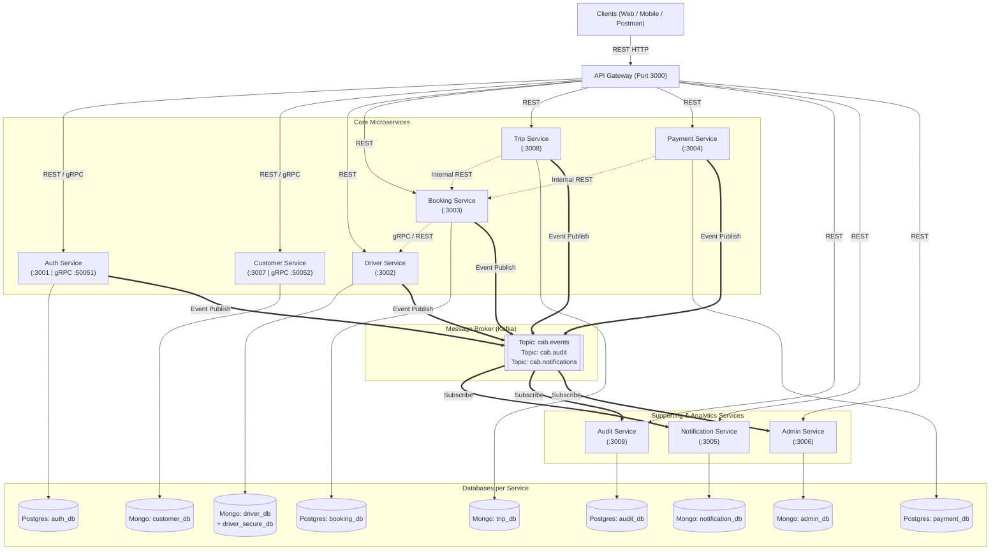
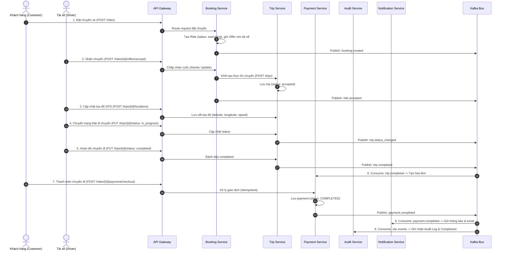

# CAB System – Thiết kế Microservices và DDD

**Phiên bản:** 3.0  
**Phạm vi:** Toàn diện hệ thống CAB System theo SRS v3.0, OpenAPI specs trong `api-docs/`, và kiến trúc 10 Microservices chuẩn doanh nghiệp.  
**Nguyên tắc:** Mỗi microservice tuân thủ nguyên tắc Domain-Driven Design (DDD), Single Responsibility, Database-per-Service. Các endpoint public đồng nhất với `api-docs/`.

---

## 1. Quyết định kiến trúc

Hệ thống CAB triển khai theo kiến trúc **Microservices chuẩn hóa theo Bounded Context**. Toàn bộ dịch vụ được đóng gói bằng Docker và vận hành qua Docker Compose cho môi trường phát triển local và CI/CD tự động.

### Nguyên tắc cốt lõi:
1. **API Ingress duy nhất:** Khách hàng (Customer), Tài xế (Driver) và Quản trị viên (Admin) chỉ tương tác qua `api-gateway` (Port `3000`). Không expose trực tiếp các backend services ra bên ngoài.
2. **Database-per-Service:** Mỗi microservice sở hữu cơ sở dữ liệu riêng, đảm bảo tính đóng gói và độc lập:
   - **PostgreSQL:** Dành cho dữ liệu giao dịch ACID khắt khe và nhật ký kiểm toán bất biến (`auth_db`, `booking_db`, `payment_db`, `audit_db`).
   - **MongoDB:** Dành cho dữ liệu phi cấu trúc, linh hoạt, chuỗi thời gian tọa độ và thông báo (`driver_db`, `customer_db`, `trip_db`, `notification_db`, `admin_db`).
   - **Secure MongoDB:** Phân vùng bảo mật cô lập riêng cho thông tin định danh nhạy cảm PII (`driver_secure_db`).
3. **Giao tiếp đa phương thức (Hybrid IPC):**
   - **RESTful HTTP:** Giao tiếp đồng bộ cho client requests và query dữ liệu.
   - **gRPC (Protobuf):** Giao tiếp đồng bộ nội bộ hiệu năng cao, độ trễ cực thấp (Auth gRPC `:50051`, Customer gRPC `:50052`).
   - **Kafka Event Streaming:** Vận chuyển event bất đồng bộ, phản ứng sự kiện phân tán (Pub/Sub) và tách rời phụ thuộc giữa các service.
4. **Quy chuẩn đặt tên cấu hình hệ thống:** Tách bạch rõ ràng giữa file cấu hình môi trường `src/config/env.js` và file khởi chạy server `src/index.js` để tránh nhầm lẫn cho nhà phát triển.

---

### 1.1 Bounded Context và phân bổ Microservice

Bảng phân rã Bounded Context thành **10 Microservices độc lập**:

| Bounded Context | Kiểu đóng gói | Microservice | Trách nhiệm chính & Phạm vi |
|---|---|---|---|
| **Identity & Access** | Service độc lập | `auth-service` | Đăng ký, đăng nhập, cấp phát JWT, xác thực OTP, gRPC token validation, quản lý phân quyền. |
| **Customer Profile** | Service độc lập | `customer-service` | Hồ sơ khách hàng, phân hạng thành viên, gRPC Customer verification service. |
| **Driver & Fleet** | Service độc lập | `driver-service` | Hồ sơ tài xế, duyệt phương tiện, quản lý trạng thái online/busy, tìm tài xế lân cận. |
| **Booking & Dispatch** | Service độc lập | `booking-service` | Ước tính giá cước, tạo yêu cầu đặt chuyến, thuật toán dispatching gửi offer và ghép tài xế. |
| **Trip Execution & Tracking** | Service độc lập | `trip-service` | Vòng đời thực thi chuyến xe, telemetry tọa độ GPS di chuyển thời gian thực, playback lộ trình. |
| **Fare & Payment** | Service độc lập | `payment-service` | Cấu hình biểu cước, thanh toán thẻ/ví điện tử, xác nhận tiền mặt, webhook callback nhà cung cấp. |
| **Audit & Security Compliance** | Service độc lập | `audit-service` | Nhật ký kiểm toán tập trung (Audit Log), lưu vết bất biến (Immutable Audit Trail) trên PostgreSQL. |
| **Notification Hub** | Service độc lập | `notification-service` | Tiêu thụ event Kafka, lưu trữ hộp thư thông báo (Inbox), gửi thông báo WebSocket / Email. |
| **Administration & Reports** | Service độc lập | `admin-service` | Báo cáo phân tích doanh thu, thống kê điều hành, can thiệp thủ công từ Operator. |
| **API Ingress** | Hạ tầng ứng dụng | `api-gateway` | Cổng vào duy nhất, xác thực token JWT, rate limiting, correlation ID và reverse proxy. |

---

### 1.2 Data Ownership & Data Service Type

| Service | Công nghệ DB | Tên Database | Dữ liệu chính | Lý do chọn công nghệ |
|---|---|---|---|---|
| `auth-service` | PostgreSQL | `auth_db` | `users`, `token_blacklist`, `roles` | Ràng buộc duy nhất (Unique username/email/phone), toàn vẹn dữ liệu xác thực, transaction an toàn. |
| `customer-service` | MongoDB | `customer_db` | `customers`, `customer_preferences` | Cấu trúc hồ sơ linh động, mở rộng trường thông tin sở thích khách hàng dễ dàng. |
| `driver-service` | MongoDB | `driver_db` + `driver_secure_db` | `driver_profiles`, `vehicles`, `ratings` | Hỗ trợ GeoJSON và 2dsphere index tìm tài xế gần nhất; lưu trữ giấy tờ tài xế bảo mật trên server riêng. |
| `booking-service` | PostgreSQL | `booking_db` | `rides`, `ride_offers`, `dispatch_logs` | Khóa giao dịch (ACID) khi tài xế nhận chuyến (atomic accept), bảo đảm không bị nhận trùng chuyến. |
| `trip-service` | MongoDB | `trip_db` | `trips`, `trip_locations` | Tối ưu lưu trữ dữ liệu tọa độ GPS chuỗi thời gian (time-series), truy vấn lộ trình di chuyển nhanh. |
| `payment-service` | PostgreSQL | `payment_db` | `payments`, `pricing_configs`, `idempotency_keys` | Tính nhất quán số dư, đối soát giao dịch tài chính, cơ chế chống trừ tiền trùng lặp (Idempotency). |
| `audit-service` | PostgreSQL | `audit_db` | `audit_logs`, `security_events` | Mô hình lưu trữ bất biến (Immutable Audit Trail) tuân thủ ISO 27001/PCI-DSS, kích hoạt trigger cấm sửa/xóa (UPDATE/DELETE) chống giả mạo, trường chuẩn hóa kết hợp JSONB. |
| `notification-service` | MongoDB | `notification_db` | `notifications`, `inbox_status` | Lưu trữ document danh sách thông báo theo người dùng, dễ truy vấn đánh dấu đã đọc. |
| `admin-service` | MongoDB | `admin_db` | `admin_reports`, `dashboard_snapshots` | Lưu trữ các snapshot báo cáo định kỳ và projection số liệu tổng hợp. |

---

### 1.3 Cấu trúc Source Code và Quy chuẩn Đặt tên File

Hệ thống được tổ chức dạng monorepo rõ ràng:

```text
23732061_MaiQuocHung_CabSystem/
├── apps/
│   ├── api-gateway/            # Cổng API Ingress chính (Port 3000)
│   ├── auth-service/           # Xác thực & phân quyền (Port 3001, gRPC 50051)
│   ├── customer-service/       # Quản lý khách hàng (Port 3007, gRPC 50052)
│   ├── driver-service/         # Quản lý tài xế & phương tiện (Port 3002)
│   ├── booking-service/        # Đặt chuyến & điều phối (Port 3003)
│   ├── trip-service/           # Thực thi hành trình & định vị GPS (Port 3008)
│   ├── payment-service/        # Thanh toán & bảng giá cước (Port 3004)
│   ├── audit-service/          # Kiểm toán & sự kiện bảo mật (Port 3009)
│   ├── notification-service/   # Thông báo đa kênh & WebSocket (Port 3005)
│   └── admin-service/          # Quản trị & thống kê tổng hợp (Port 3006)
├── packages/
│   ├── shared-config/          # Tiện ích chung, JWT helper, chuẩn hóa HTTP response
│   └── proto/                  # Định nghĩa Protobuf cho gRPC communication
├── tests/
│   ├── automated/              # Bộ test tự động 30 tiêu chí theo phieucham.md
├── docs/
│   ├── architecture/
│   │   └── micro_service_design.md # Tài liệu kiến trúc DDD & Microservices này
│   ├── specs/                  # Đặc tả yêu cầu SRS & tiêu chí chấm điểm
│   └── testing/                # Hướng dẫn test thủ công, bảng test case & report
├── api-docs/                   # Đặc tả OpenAPI 3.0.3 các endpoint public
├── docker-compose.yml          # Cấu hình khởi chạy trọn vẹn 13 containers
└── README.md                   # Hướng dẫn triển khai, vận hành và test
```

#### Quy chuẩn cấu trúc nội bộ của mỗi Microservice:
Để giải quyết triệt để tình trạng nhầm lẫn giữa file cấu hình môi trường và file khởi chạy server chính `src/index.js`, toàn bộ microservice áp dụng chuẩn:
- `src/index.js`: Điểm khởi động server Express/gRPC, cấu hình middlewares toàn cục, mount router.
- `src/config/env.js`: Chuyên trách đọc biến môi trường (`process.env`), cổng kết nối, fallback mặc định an toàn.
- `src/config/db.js`: Chuyên trách khởi tạo kết nối cơ sở dữ liệu (PostgreSQL Connection Pool hoặc MongoDB Client).
- `src/config/index.js`: Re-export trong suốt từ `env.js` (`module.exports = require('./env');`) để bảo đảm tính tương thích ngược 100% với các import cũ.

---

## 2. Mô hình Domain-Driven Design (DDD) & Context Map

### 2.1 Context Map toàn hệ thống



---

### 2.2 Vòng đời nghiệp vụ chuẩn (End-to-End Workflow)



---

## 3. Danh mục API Contracts theo từng Microservice

Toàn bộ API được client truy xuất qua Gateway: `http://localhost:3000/api/v1/...`

### 3.1 Auth Service (`apps/auth-service`)
- `POST /api/v1/auth/register/customer`: Đăng ký tài khoản khách hàng.
- `POST /api/v1/auth/driver-otp/request`: Yêu cầu mã OTP qua điện thoại cho tài xế.
- `POST /api/v1/auth/driver-otp/verify`: Xác minh OTP và nhận verification token.
- `POST /api/v1/auth/register/driver`: Hoàn tất đăng ký tài xế kèm thông tin xe.
- `POST /api/v1/auth/login`: Đăng nhập, nhận Access Token & Refresh Token.
- `POST /api/v1/auth/logout`: Thu hồi token (đưa vào blacklist).
- `GET  /api/v1/auth/profile`: Lấy thông tin tài khoản hiện tại.
- `PUT  /api/v1/auth/password`: Đổi mật khẩu tài khoản.

### 3.2 Customer Service (`apps/customer-service`)
- `GET  /api/v1/customers/{customerId}`: Xem thông tin chi tiết khách hàng.
- `PUT  /api/v1/customers/{customerId}`: Cập nhật hồ sơ, số điện thoại, sở thích.
- `GET  /api/v1/customers`: Danh sách khách hàng (dành cho Admin).

### 3.3 Driver Service (`apps/driver-service`)
- `GET  /api/v1/drivers/{driverId}`: Thông tin hồ sơ công khai của tài xế.
- `PUT  /api/v1/drivers/me/status`: Chuyển trạng thái hoạt động (`available`, `offline`).
- `PUT  /api/v1/drivers/me/location`: Bắn vị trí GPS hiện tại lên hệ thống.
- `GET  /api/v1/drivers/nearby`: Tìm kiếm các tài xế khả dụng xung quanh tọa độ.
- `GET/POST /api/v1/drivers/me/vehicles`: Danh sách và đăng ký phương tiện mới.
- `POST /api/v1/rides/{rideId}/rating`: Khách hàng gửi đánh giá và chấm sao cho tài xế.

### 3.4 Booking Service (`apps/booking-service`)
- `POST /api/v1/rides/estimate`: Tính toán trước giá cước ước tính dựa trên khoảng cách.
- `POST /api/v1/rides`: Đặt cuốc xe mới.
- `GET  /api/v1/rides/{rideId}`: Chi tiết yêu cầu đặt xe.
- `GET  /api/v1/rides/{rideId}/offers`: Xem offer dành cho tài xế.
- `POST /api/v1/rides/{rideId}/offers/accept`: Tài xế đồng ý nhận cuốc.
- `POST /api/v1/rides/{rideId}/offers/decline`: Tài xế từ chối cuốc.
- `POST /api/v1/rides/{rideId}/cancel`: Hủy chuyến xe (kèm lý do).

### 3.5 Trip Service (`apps/trip-service`)
- `POST /api/v1/trips`: Khởi tạo chuyến xe mới (lưu vào MongoDB `trip_db`).
- `GET  /api/v1/trips/{tripId}`: Xem trạng thái và thông tin chi tiết chuyến xe.
- `PUT  /api/v1/trips/{tripId}/status`: Cập nhật tiến trình (`driver_arrived`, `in_progress`, `completed`, `cancelled`).
- `POST /api/v1/trips/{tripId}/locations`: Ghi nhận tọa độ di chuyển thời gian thực.
- `GET  /api/v1/trips/{tripId}/locations`: Lấy toàn bộ lịch sử vết đường GPS phục vụ playback.
- `GET  /api/v1/customers/{customerId}/trips`: Danh sách các chuyến xe của khách hàng.
- `GET  /api/v1/drivers/{driverId}/trips`: Danh sách các chuyến xe do tài xế phụ trách.

### 3.6 Payment Service (`apps/payment-service`)
- `GET  /api/v1/rides/{rideId}/payment`: Lấy chi tiết hóa đơn thanh toán của cuốc xe.
- `POST /api/v1/rides/{rideId}/payment/checkout`: Thực hiện thanh toán trực tuyến (hỗ trợ `Idempotency-Key`).
- `POST /api/v1/rides/{rideId}/payment/cash-confirmation`: Tài xế xác nhận nhận tiền mặt.
- `POST /api/v1/payments/{paymentId}/callback`: Webhook callback từ cổng thanh toán đối tác.
- `GET/PUT /api/v1/admin/pricing`: Tra cứu và cập nhật biểu cước theo km và thời gian.

### 3.7 Audit Service (`apps/audit-service`)
- `POST /api/v1/audit/logs`: Ghi nhận một bản ghi nhật ký kiểm toán mới.
- `GET  /api/v1/audit/logs`: Truy vấn danh sách audit logs với phân trang và bộ lọc linh hoạt.
- `GET  /api/v1/audit/logs/{logId}`: Xem chi tiết một bản ghi kiểm toán.
- `POST /api/v1/audit/security-events`: Ghi nhận sự kiện cảnh báo an ninh thông tin.
- `GET  /api/v1/audit/security-events`: Truy xuất danh sách sự kiện bảo mật theo mức độ nghiêm trọng.
- `GET  /api/v1/audit/stats`: Thống kê tổng hợp số lượng logs theo hành động và trạng thái.

### 3.8 Notification Service (`apps/notification-service`)
- `GET  /api/v1/notifications`: Lấy danh sách thông báo cá nhân của người dùng.
- `PUT  /api/v1/notifications/{id}/read`: Đánh dấu một thông báo là đã đọc.
- `POST /api/v1/notifications/read-all`: Đánh dấu đã đọc tất cả thông báo.

### 3.9 Admin Service (`apps/admin-service`)
- `GET  /api/v1/admin/dashboard`: Số liệu dashboard tổng quan hệ thống.
- `GET  /api/v1/admin/reports/revenue`: Báo cáo doanh thu theo chu kỳ.
- `GET  /api/v1/admin/reports/rides`: Thống kê tần suất và tỷ lệ hủy chuyến.

---

## 4. Phương thức giao tiếp liên dịch vụ (IPC)

Hệ thống kết hợp ba cơ chế giao tiếp chuyên biệt:

### 4.1 Đồng bộ qua HTTP/REST
- **API Gateway → Microservices:** Toàn bộ request từ client được Gateway định tuyến đến service đích thông qua mạng nội bộ Docker.
- **Microservice → Microservice:** Dùng khi cần phản hồi tức thì (Ví dụ: `booking-service` gọi `driver-service` để kiểm tra tài xế khả dụng).

### 4.2 Đồng bộ hiệu năng cao qua gRPC
- Định dạng dữ liệu nhị phân siêu nhỏ gọn qua **Protocol Buffers**.
- Giảm thiểu độ trễ kết nối (HTTP/2 multiplexing) trong các luồng xác thực token và kiểm tra quyền hạn diễn ra với tần suất hàng nghìn lần/giây:
  - **Auth gRPC Service (`port 50051`):** Cung cấp RPC `ValidateToken(TokenRequest) returns (TokenResponse)`.
  - **Customer gRPC Service (`port 50052`):** Cung cấp RPC `GetCustomerProfile(CustomerRequest) returns (CustomerResponse)`.

### 4.3 Bất đồng bộ qua Kafka Message Broker
- Đảm bảo tính nới lỏng (loose coupling) và độ ổn định cao (fault tolerance). Nếu một service tạm thời khởi động lại, message không bị mất.
- **Danh sách Event Topics chính:**
  - `identity.user-registered.v1`: Khi tài khoản khách hàng hoặc tài xế được tạo.
  - `booking.created.v1`: Khi cuốc xe được đặt.
  - `ride.accepted.v1`: Khi tài xế nhận cuốc.
  - `trip.status-changed.v1`: Khi trạng thái chuyến xe thay đổi.
  - `trip.completed.v1`: Khi chuyến đi kết thúc an toàn.
  - `payment.completed.v1`: Khi thanh toán thành công.
  - `audit.recorded.v1`: Ghi nhận sự kiện kiểm toán hệ thống.

---

## 5. Bảo mật, Toàn vẹn dữ liệu và Kiểm toán

1. **Bảo mật PII & Dữ liệu nhạy cảm:**
   - Thông tin cá nhân nhạy cảm của tài xế (bằng lái, căn cước công dân) được lưu trữ tại `driver_secure_db` trên một phân vùng MongoDB riêng biệt, không expose port ra ngoài host.
   - Mật khẩu người dùng được băm an toàn bằng thuật toán `bcrypt` trước khi lưu vào `auth_db`.
2. **Kiểm toán bất biến (Audit Trail):**
   - Mọi thao tác quản trị, thay đổi trạng thái cuốc xe, giao dịch thanh toán và sự kiện truy cập đều được đẩy vào `audit-service` để lưu trữ bất biến (Append-Only) trong `audit_db`.
3. **Chống Replay & Trừ tiền trùng lặp (Idempotency):**
   - Các API nhạy cảm liên quan đến thanh toán (`POST /rides/{id}/payment/checkout`) yêu cầu header `Idempotency-Key` để bảo đảm tính duy nhất của giao dịch kể cả khi mạng gặp lỗi retry.

---

## 6. Hướng dẫn Kiểm tra và Đánh giá (Verification)

### 6.1 Khởi động toàn bộ cụm Microservices
```bash
docker compose up -d
docker compose ps
```

### 6.2 Kiểm tra trạng thái sức khỏe (Health Check)
```bash
curl http://localhost:3000/health
curl http://localhost:3000/api/v1/health/services
```

### 6.3 Chạy bộ Automated Test Suite 30 tiêu chí
Toàn bộ hệ sinh thái 10 microservices được kiểm thử tự động với 7 test suites bao phủ trọn vẹn:
```bash
npm test
```
*Kết quả yêu cầu: 100% test suites passed (bao gồm Auth, Booking, Payment, Driver, Security, Audit, Trip Execution).*
