# CAB System – Domain-Driven Design (DDD) Bounded Context Design

> Tài liệu này chuyển mô hình nghiệp vụ hiện tại của **23732061_MaiQuocHung_CabSystem** sang kiến trúc Domain-Driven Design (DDD), tập trung vào **Bounded Context**, **Ubiquitous Language**, Aggregate, Domain Event và Context Map.
>
> Cơ sở phân tích: `srs.md` của repository, đặc biệt Business Context/Scope, Business Process, Functional Requirements, Business Rules, Exception, Data Model, Use Case và Acceptance Criteria.

---

## 1. Mục tiêu thiết kế DDD

CAB System hiện mô tả một chuỗi nghiệp vụ trung tâm:

```text
Khách hàng
   ↓
Tạo Booking
   ↓
Tìm & phân công Driver
   ↓
Driver nhận chuyến
   ↓
Thực hiện Trip
   ↓
Tính Fare
   ↓
Payment
   ↓
Rating
   ↓
Trip History
```

Trong SRS, hệ thống còn có các năng lực hỗ trợ gồm Customer Management, Driver Management, Notification, Operation, Reporting, Authentication/Access Control và Audit.

DDD không nên biến toàn bộ các bảng/entity hiện có thành một Domain Model dùng chung. Thay vào đó:

1. Mỗi **Bounded Context** sở hữu một mô hình nghiệp vụ và một ngôn ngữ riêng.
2. Entity chỉ có ý nghĩa đầy đủ bên trong context sở hữu nó.
3. Giữa các context chỉ trao đổi **ID, DTO, Command hoặc Domain Event/Integration Event**, không chia sẻ entity/domain object trực tiếp.
4. Business rule phải được đặt nơi có đủ thông tin để bảo vệ invariant của nó.
5. Các context có thể dùng cùng một từ nhưng phải định nghĩa nghĩa khác nhau nếu nghiệp vụ khác nhau.

---

# 2. Phân loại Domain theo DDD

## 2.1 Core Domain

Đối với CAB System, phần tạo ra năng lực nghiệp vụ trung tâm của nền tảng đặt xe là **Ride Fulfillment**. Phần này nên được xem là Core Domain tổng thể, triển khai qua các Bounded Context liên kết với nhau:

- **Booking Context** – hình thành yêu cầu đi xe.
- **Dispatch & Matching Context** – tìm, mời và xác nhận tài xế.
- **Trip Execution & Tracking Context** – thực hiện vòng đời chuyến.

Trong đó, **Dispatch & Matching** là nơi có business rule đặc thù và có khả năng thay đổi theo chính sách vận hành; SRS hiện xác định rằng tiêu chí ưu tiên tài xế chưa được chốt và phải có khả năng cấu hình/mở rộng.

## 2.2 Supporting Subdomains

- Driver & Fleet
- Customer Profile
- Pricing & Fare
- Payment
- Feedback & Trip History
- Operations
- Notification
- Reporting

## 2.3 Generic Subdomains

- Identity & Access
- Audit Trail

---

# 3. Danh sách Bounded Context đề xuất

| ID | Bounded Context | Nhóm | Vai trò chính |
|---|---|---|---|
| BC01 | Identity & Access | Generic | Tài khoản, xác thực, role, permission |
| BC02 | Customer Profile | Supporting | Hồ sơ khách hàng |
| BC03 | Driver & Fleet | Supporting/Core-supporting | Hồ sơ tài xế, trạng thái sẵn sàng, phương tiện |
| BC04 | Booking | **Core** | Tạo và quản lý yêu cầu đặt xe |
| BC05 | Dispatch & Matching | **Core** | Tìm, xếp hạng, mời và xác nhận tài xế |
| BC06 | Trip Execution & Tracking | **Core** | Vòng đời chuyến và tracking |
| BC07 | Pricing & Fare | Supporting/Core-supporting | Xác định fare cuối cùng |
| BC08 | Payment | Supporting | Giao dịch tiền mặt/điện tử và provider |
| BC09 | Notification | Supporting | Tạo/gửi/tracking thông báo |
| BC10 | Feedback & Trip History | Supporting | Rating và lịch sử trải nghiệm |
| BC11 | Operations | Supporting | Giám sát và xử lý sự cố |
| BC12 | Reporting & Monitoring | Supporting | KPI, báo cáo kinh doanh |
| BC13 | Audit Trail | Generic | Nhật ký truy vết thao tác |

> **Lưu ý kiến trúc:** `Fare` và `Payment` hiện được nhóm trong cùng Functional Component “Fare & Payment” của SRS. Khi thiết kế DDD, nên tách thành BC07 và BC08 vì ngôn ngữ, invariant và vòng đời của “tính cước” khác “giao dịch thanh toán”. Hai module có thể vẫn nằm trong cùng một deployable service ở giai đoạn đầu nếu hệ thống còn nhỏ.

---

# 4. Nguyên tắc ngôn ngữ giữa các Bounded Context

Một từ không nên được hiểu là một Domain Object toàn cục.

Ví dụ:

| Từ | Booking | Dispatch | Trip | Payment |
|---|---|---|---|---|
| Driver | chỉ là `DriverId` được yêu cầu | `CandidateDriver`, `AssignedDriver` | `TripDriver` | không thuộc model |
| Booking | yêu cầu đi xe có đầy đủ thông tin | `BookingRef` cần được phân công | `BookingRef` nguồn của Trip | không sở hữu |
| Status | vòng đời request | trạng thái assignment/offer | trạng thái thực hiện trip | trạng thái transaction |
| Completed | request đã hoàn tất | assignment đã kết thúc | trip hoàn thành | payment thành công là khái niệm khác |
| Amount/Fare | không sở hữu | không tính tiền | chỉ có thể nhận fare summary | transaction amount |

**Nguyên tắc:** Không dùng một class/entity `Booking`, `Driver`, `Trip`, `Payment` duy nhất rồi import nó vào mọi module. Đây là cách dễ làm mất ranh giới Bounded Context.

---

# 5. BC01 – Identity & Access Context

## 5.1 Mục đích

Quản lý danh tính kỹ thuật và quyền truy cập vào hệ thống.

Phạm vi từ SRS:

- Đăng nhập/xác thực.
- Role và permission.
- Kiểm soát chức năng quản trị.
- Xác định subject được phép thực hiện command.

Liên quan: `FR-AC-01 → FR-AC-03`, `UC02`, `UC21`.

## 5.2 Ubiquitous Language

| Thuật ngữ | Ý nghĩa trong context |
|---|---|
| Account | Danh tính đăng nhập vào hệ thống |
| Credential | Thông tin dùng để xác thực |
| Subject | Actor đang thực hiện request |
| Role | Nhóm quyền nghiệp vụ kỹ thuật |
| Permission | Quyền gọi một capability |
| Session/Token | Bằng chứng xác thực |
| Authorization | Quyết định subject có được phép thực hiện action hay không |
| Active Account | Tài khoản được phép truy cập |

Không dùng `Customer` hay `Driver` làm aggregate ở context này. Identity chỉ biết người đó là một **Account/Subject** và có role tương ứng.

## 5.3 Aggregate

**Account Aggregate**

- `AccountId`
- `Credential`
- `AccountStatus`
- `Roles`

Invariant:

- Account phải duy nhất theo định danh đăng nhập được doanh nghiệp chọn.
- Account bị vô hiệu không được authenticate thành công.
- Authorization phải được kiểm tra trước capability yêu cầu role/permission.

## 5.4 Commands

- `RegisterAccount`
- `AuthenticateAccount`
- `AssignRole`
- `GrantPermission`
- `RevokePermission`
- `DeactivateAccount`

## 5.5 Domain/Integration Events

- `AccountRegistered`
- `AccountAuthenticated`
- `AccountDeactivated`
- `RoleChanged`

---

# 6. BC02 – Customer Profile Context

## 6.1 Mục đích

Quản lý thông tin nghiệp vụ của khách hàng, không quản lý credential/authentication.

Liên quan: `FR-CM-01`, `FR-CM-03`, `FR-CM-04`, `UC01`, `UC03`, `UC12`, `UC18`.

## 6.2 Ubiquitous Language

| Thuật ngữ | Ý nghĩa |
|---|---|
| Customer | Khách hàng của dịch vụ CAB |
| CustomerProfile | Hồ sơ khách hàng |
| ContactInfo | Thông tin liên hệ |
| CustomerStatus | Trạng thái hồ sơ khách hàng |
| CustomerId | Định danh khách hàng trong context |

## 6.3 Aggregate

**Customer Aggregate**

- `CustomerId`
- `Profile`
- `ContactInfo`
- `CustomerStatus`

Invariant:

- Mỗi Customer có một identity nghiệp vụ ổn định.
- Không cho phép cập nhật profile theo policy mà không xác thực subject phù hợp.

## 6.4 Commands

- `CreateCustomerProfile`
- `UpdateCustomerProfile`
- `DeactivateCustomerProfile`

## 6.5 Events

- `CustomerProfileCreated`
- `CustomerProfileUpdated`
- `CustomerDeactivated`

### Quy tắc quan trọng

`CustomerProfile` không chứa `BookingList`, `Payment`, `Rating` hoặc `Trip` dưới dạng entity lồng trực tiếp. Lịch sử là một mô hình đọc thuộc BC10.

---

# 7. BC03 – Driver & Fleet Context

## 7.1 Mục đích

Quản lý hồ sơ tài xế, trạng thái hoạt động/sẵn sàng và phương tiện.

Liên quan: `FR-DM-01 → FR-DM-04`, `UC13`, `UC14` và dữ liệu phục vụ `UC05`/Matching.

## 7.2 Ubiquitous Language

| Thuật ngữ | Ý nghĩa |
|---|---|
| Driver | Tài xế được quản lý trong hệ thống |
| DriverProfile | Hồ sơ tài xế |
| Availability | Khả năng nhận chuyến tại thời điểm hiện tại |
| Available | Sẵn sàng nhận chuyến |
| Unavailable | Không sẵn sàng nhận chuyến |
| Vehicle | Phương tiện do tài xế quản lý/sử dụng |
| VehicleType | Loại xe |
| Fleet | Tập phương tiện/tài xế được quản lý |
| LiveLocation | Vị trí hiện tại dùng cho operational capability |

## 7.3 Aggregate

### Driver Aggregate

Root: `Driver`

- DriverProfile
- AvailabilityStatus
- OperationalStatus
- CurrentLocationSnapshot

### Vehicle Aggregate

Root: `Vehicle`

- VehicleId
- DriverId/DriverRef
- LicensePlate
- VehicleType
- VehicleStatus

Invariant:

- Driver không Available thì Dispatch không được coi tài xế là ứng viên.
- Vehicle có biển số duy nhất trong phạm vi doanh nghiệp.
- Driver không được cập nhật capability trái với policy vận hành.

## 7.4 Commands

- `RegisterDriver`
- `UpdateDriverProfile`
- `SetDriverAvailable`
- `SetDriverUnavailable`
- `RegisterVehicle`
- `UpdateVehicle`
- `DeactivateVehicle`
- `UpdateLiveDriverLocation`

## 7.5 Events

- `DriverRegistered`
- `DriverAvailabilityChanged`
- `VehicleRegistered`
- `VehicleStatusChanged`
- `DriverLocationChanged`

### DDD refactoring cho `DriverLocation`

SRS hiện có một entity `DriverLocation`. Trong DDD nên chia nghĩa:

- `LiveDriverLocation` → thuộc Driver & Fleet, phục vụ khả năng tìm ứng viên.
- `TripLocationSample` → thuộc Trip Execution & Tracking, phục vụ tracking một chuyến cụ thể.

Không nên để một `DriverLocation` entity duy nhất vừa chịu invariant của Fleet vừa chịu invariant của Trip.

---

# 8. BC04 – Booking Context

## 8.1 Mục đích

Đây là một **Core Bounded Context**. Nó chịu trách nhiệm hình thành và quản lý yêu cầu đặt xe, không chịu trách nhiệm chọn tài xế hoặc thực hiện chuyến.

Liên quan: `FR-BK-01 → FR-BK-05`, `UC04`.

## 8.2 Ubiquitous Language

| Thuật ngữ | Ý nghĩa |
|---|---|
| Booking | Yêu cầu đặt xe của khách |
| PickupLocation | Điểm đón |
| Destination | Điểm đến |
| VehicleTypeRequest | Loại xe khách yêu cầu |
| BookingStatus | Trạng thái xử lý của request |
| Submit Booking | Gửi yêu cầu đặt xe |
| Dispatchable Booking | Booking đủ điều kiện chuyển sang Dispatch |
| Cancel Booking | Hủy request theo policy |

## 8.3 Aggregate

**Booking Aggregate** – Root: `Booking`

```text
Booking
├── BookingId
├── CustomerRef
├── PickupLocation
├── Destination
├── RequestedVehicleType
├── BookingStatus
└── CreatedAt
```

Invariant trực tiếp từ Business Rules:

- Booking phải có pickup, destination và vehicle type.
- Booking phải có đúng một trạng thái tại một thời điểm.
- Booking thiếu dữ liệu không được chuyển sang trạng thái dispatching.
- Chỉ một assignment cuối cùng được phép gắn vào một booking.

### Booking state

```text
Created
   ↓
SearchingDriver
   ↓
DriverAssigned ─────→ Cancelled
   ↓
TripInProgress
   ↓
Completed
```

Nhánh lỗi:

```text
SearchingDriver → NoDriverFound
```

## 8.4 Commands

- `CreateBooking`
- `SubmitBooking`
- `StartDriverSearch`
- `MarkDriverAssigned`
- `MarkNoDriverFound`
- `CancelBooking`
- `MarkTripStarted`
- `CompleteBooking`

## 8.5 Events

- `BookingCreated`
- `BookingSubmitted`
- `BookingReadyForDispatch`
- `DriverAssignedToBooking`
- `NoDriverFound`
- `BookingCancelled`
- `BookingCompleted`

### Ranh giới

Booking không được:

- tự chọn Driver;
- giữ `Driver` entity đầy đủ;
- tạo Payment;
- tính Fare cuối cùng;
- gửi Notification trực tiếp.

Nó chỉ phát hành sự kiện cho các context tương ứng.

---

# 9. BC05 – Dispatch & Matching Context

## 9.1 Mục đích

Đây là **Core Bounded Context** và là vùng chứa các quy tắc tìm kiếm/phân công tài xế.

Liên quan: `FR-MA-01 → FR-MA-06`, `UC05`, `UC06`.

SRS xác định rằng hệ thống phải xem xét vị trí và trạng thái sẵn sàng, nhưng tiêu chí ưu tiên cụ thể hiện là một Open Business Rule có thể thay đổi/mở rộng. Vì vậy thuật toán xếp hạng không nên hard-code vào Booking hoặc Driver.

## 9.2 Ubiquitous Language

| Thuật ngữ | Ý nghĩa |
|---|---|
| DispatchRequest | Yêu cầu tìm tài xế cho một Booking |
| CandidateDriver | Tài xế đủ điều kiện trở thành ứng viên |
| MatchingCriteria | Bộ tiêu chí lựa chọn |
| DriverOffer | Lời mời chuyến gửi cho tài xế |
| DispatchAttempt | Một lần thử mời tài xế |
| AcceptOffer | Tài xế chấp nhận lời mời |
| RejectOffer | Tài xế từ chối |
| OfferTimeout | Tài xế không phản hồi trong thời gian policy cho phép |
| Assignment | Kết quả xác nhận tài xế cho booking |
| NoMatch | Không thể xác định tài xế phù hợp |

Trong context này, **Driver không phải là Driver Aggregate**. Dispatch chỉ cần một projection/reference:

```text
DriverCandidate
├── DriverId
├── VehicleType
├── Availability
└── LocationSnapshot
```

## 9.3 Aggregate

**Dispatch Aggregate** – Root: `DispatchRequest`

- BookingRef
- CandidateDrivers
- DispatchAttempt(s)
- CurrentOffer
- Assignment
- DispatchStatus

Invariant:

- Chỉ Driver có `Available` mới được chọn.
- Candidate phải phù hợp với yêu cầu chuyến.
- Một Booking chỉ có một Assignment được xác nhận.
- Reject/Timeout phải cho phép thử Candidate khác.
- Assignment phải được lock/confirm để tránh hai tài xế cùng được xác nhận.

## 9.4 Strategy/Domain Service

```text
MatchingPolicy
├── EligibilityRule
├── DistanceRule
├── AvailabilityRule
├── VehicleCompatibilityRule
└── RankingPolicy
```

`RankingPolicy` phải là abstraction vì BRL20 chưa chốt tiêu chí cuối cùng.

## 9.5 Commands

- `StartDispatch`
- `FindCandidates`
- `SendDriverOffer`
- `AcceptDriverOffer`
- `RejectDriverOffer`
- `ExpireDriverOffer`
- `ReassignDriver`
- `ConfirmAssignment`
- `CloseDispatchAsNoMatch`

## 9.6 Events

- `DispatchStarted`
- `DriverCandidateSelected`
- `DriverOfferSent`
- `DriverOfferAccepted`
- `DriverOfferRejected`
- `DriverOfferExpired`
- `DriverAssigned`
- `NoDriverAvailable`

### Không đặt thuật toán trong Driver Context

Driver Context chỉ trả lời:

> “Tài xế này hiện có đủ điều kiện/đang Available không?”

Dispatch trả lời:

> “Trong các tài xế hợp lệ, ai sẽ được mời trước theo policy hiện hành?”

Đây là một ranh giới DDD quan trọng.

---

# 10. BC06 – Trip Execution & Tracking Context

## 10.1 Mục đích

Quản lý chuyến thực tế sau khi đã có Assignment.

Liên quan: `FR-TR-01 → FR-TR-05`, `UC07`, `UC08`, một phần `UC15`, `UC16`.

## 10.2 Ubiquitous Language

| Thuật ngữ | Ý nghĩa |
|---|---|
| Trip | Chuyến đi thực tế |
| AssignmentRef | Tham chiếu assignment đã được xác nhận |
| TripDriver | Tài xế chịu trách nhiệm cho trip |
| TripState | Trạng thái thực hiện chuyến |
| ArrivedPickup | Tài xế đã đến điểm đón |
| PassengerOnboard | Đã đón khách |
| InTransit | Đang di chuyển |
| Completed | Trip hoàn thành |
| TripLocationSample | Một mẫu vị trí gắn với trip |

## 10.3 Aggregate

**Trip Aggregate** – Root: `Trip`

```text
Trip
├── TripId
├── BookingRef
├── AssignmentRef
├── DriverRef
├── VehicleRef
├── TripState
├── StartedAt
├── CompletedAt
└── TrackingSummary
```

Invariant:

- Trip chỉ được tạo sau khi assignment được xác nhận.
- Chỉ assigned driver được phép cập nhật trip.
- Không được bỏ qua state nếu không có domain rule/exception hợp lệ.
- Fare final chỉ có thể được xác định sau `TripCompleted`.
- Không tạo nhiều Trip chính thức cho cùng một Booking nếu policy yêu cầu 1:0..1.

## 10.4 State Machine

```text
Accepted
   ↓
ArrivedAtPickup
   ↓
PassengerOnboard
   ↓
InTransit
   ↓
Completed
```

## 10.5 Commands

- `CreateTripFromAssignment`
- `MarkDriverArrived`
- `MarkPassengerOnboard`
- `StartTrip`
- `UpdateTripLocation`
- `CompleteTrip`
- `ReportTripIncident`

## 10.6 Events

- `TripCreated`
- `DriverArrivedAtPickup`
- `PassengerPickedUp`
- `TripStarted`
- `TripLocationUpdated`
- `TripCompleted`
- `TripInterrupted`

### Quy tắc ownership

`Trip` sở hữu lifecycle thực hiện chuyến. Booking chỉ biết booking status; Dispatch chỉ biết assignment lifecycle.

---

# 11. BC07 – Pricing & Fare Context

## 11.1 Mục đích

Tính số tiền phải thanh toán dựa trên dữ liệu chuyến và pricing rules.

Liên quan: `FR-PM-01`, `UC09`.

SRS hiện chưa chốt công thức fare cụ thể. Vì vậy context phải thiết kế theo hướng policy/configurable.

## 11.2 Ubiquitous Language

| Thuật ngữ | Ý nghĩa |
|---|---|
| Fare | Số tiền phải trả cho trip |
| FareRule | Quy tắc tính cước |
| PricingPolicy | Chính sách áp dụng các rule |
| FareComponent | Thành phần tạo ra giá |
| FareCalculation | Kết quả phép tính |
| FinalFare | Fare đã được xác nhận |

## 11.3 Aggregate/Domain Service

Có thể dùng:

```text
FareCalculation
├── TripRef
├── PricingPolicyRef
├── FareComponents
├── CalculatedAmount
└── CalculationStatus
```

`FareCalculator` là Domain Service.

Invariant:

- Không tính final fare khi Trip chưa hoàn thành.
- Nếu policy/rule không đầy đủ, không phát hành `FareFinalized`.
- Không tự suy diễn công thức chưa được stakeholder xác nhận.

## 11.4 Commands

- `CalculateFare`
- `RecalculateFare`
- `FinalizeFare`
- `ConfigureFarePolicy`

## 11.5 Events

- `FareCalculated`
- `FareFinalized`
- `FareCalculationFailed`

---

# 12. BC08 – Payment Context

## 12.1 Mục đích

Quản lý transaction thanh toán, hỗ trợ cash và electronic payment thông qua Payment Provider.

Liên quan: `FR-PM-02 → FR-PM-06`, `UC10`, `UC17`.

## 12.2 Ubiquitous Language

| Thuật ngữ | Ý nghĩa |
|---|---|
| Payment | Yêu cầu/giao dịch thanh toán của trip |
| PaymentMethod | Cash hoặc Electronic |
| PaymentTransaction | Một transaction cụ thể |
| PaymentStatus | Pending/Successful/Failed/... |
| Provider | Hệ thống thanh toán bên ngoài |
| ProviderTransactionId | Mã transaction do provider cấp |
| PaymentAttempt | Một lần gửi thanh toán |
| Settlement | Ghi nhận kết quả thanh toán |

## 12.3 Aggregate

**Payment Aggregate** – Root: `Payment`

```text
Payment
├── PaymentId
├── TripRef
├── FareAmount
├── PaymentMethod
├── PaymentStatus
├── ProviderTransactionRef
└── PaidAt
```

Invariant:

- Payment phải tham chiếu Trip hợp lệ.
- Cash và electronic có flow khác nhau.
- Electronic payment không được chuyển thành Success nếu provider chưa trả kết quả hợp lệ.
- Transaction failed phải được lưu lại.

## 12.4 Port/Adapter

```text
Payment Context
      │
      ├── Payment Domain
      │
      └── PaymentProviderPort
              ├── MockProviderAdapter
              ├── ProviderAAdapter
              └── ProviderBAdapter
```

## 12.5 Events

- `PaymentRequested`
- `PaymentSucceeded`
- `PaymentFailed`
- `PaymentProviderUnavailable`

---

# 13. BC09 – Notification Context

## 13.1 Mục đích

Quản lý việc tạo, định tuyến và gửi thông báo; Notification không sở hữu business truth của Booking/Trip/Payment.

Liên quan: `FR-NT-01 → FR-NT-06`, `UC20`.

## 13.2 Ubiquitous Language

| Thuật ngữ | Ý nghĩa |
|---|---|
| Notification | Một thông báo cần được gửi |
| Recipient | Đối tượng nhận thông báo |
| Channel | Kênh gửi |
| Template | Mẫu nội dung |
| DeliveryStatus | Trạng thái gửi |
| NotificationProvider | Nhà cung cấp kênh gửi |

## 13.3 Aggregate

**Notification Aggregate** – Root: `Notification`

Invariant:

- Notification không làm thay đổi trạng thái của Booking/Trip/Payment.
- Provider lỗi không được làm hỏng core transaction.
- Có thể retry theo delivery policy.

## 13.4 Input Events

- `BookingCreated`
- `DriverAssigned`
- `DriverArrivedAtPickup`
- `TripCompleted`
- `PaymentSucceeded`
- `PaymentFailed`
- `DriverOfferSent`

## 13.5 Commands

- `CreateNotification`
- `SendNotification`
- `RetryNotification`
- `MarkNotificationDelivered`
- `MarkNotificationFailed`

---

# 14. BC10 – Feedback & Trip History Context

## 14.1 Mục đích

Quản lý rating của khách hàng và mô hình lịch sử chuyến dùng để tra cứu.

Liên quan: `FR-RH-01 → FR-RH-03`, `UC11`, `UC12`.

## 14.2 Ubiquitous Language

| Thuật ngữ | Ý nghĩa |
|---|---|
| Rating | Đánh giá của khách hàng cho driver sau trip |
| Review | Nội dung nhận xét |
| CompletedTrip | Trip đủ điều kiện xuất hiện trong history |
| TripHistoryEntry | Bản ghi đọc của lịch sử |

## 14.3 Aggregate

**Rating Aggregate** – Root: `Rating`

Invariant:

- Chỉ khách hàng phù hợp mới được rating trip.
- Trip phải Completed.
- Một trip không nhận nhiều rating nếu business policy quy định một lần đánh giá.

## 14.4 History Model

`TripHistory` nên là **Read Model/Projection**, không phải entity được copy nguyên xi từ Trip.

```text
TripCompleted
PaymentSucceeded/Failed
RatingCreated
        │
        ▼
TripHistoryProjection
```

## 14.5 Commands/Events

Commands:

- `SubmitRating`
- `EditRating` (chỉ khi policy cho phép)

Events:

- `RatingSubmitted`
- `TripHistoryUpdated`

---

# 15. BC11 – Operations Context

## 15.1 Mục đích

Cung cấp khả năng can thiệp nghiệp vụ có kiểm soát cho nhân viên vận hành.

Liên quan: `FR-OM-01 → FR-OM-07`, `UC13 → UC18`, đặc biệt `UC15`, `UC16`, `UC17`, `UC18`.

## 15.2 Ubiquitous Language

| Thuật ngữ | Ý nghĩa |
|---|---|
| OperationCase | Một công việc/tình huống cần nhân viên xử lý |
| Incident | Sự cố nghiệp vụ/đang xảy ra |
| Intervention | Hành động can thiệp của operator |
| Escalation | Chuyển vấn đề sang mức xử lý cao hơn |
| Resolution | Kết quả xử lý sự cố |
| OperationalView | Màn hình/đọc dữ liệu tổng hợp cho operator |

## 15.3 Aggregate

**OperationCase Aggregate**

- CaseId
- IncidentType
- RelatedEntityRef
- CurrentState
- AssignedOperator
- Resolution

Operations không sở hữu `Driver`, `Booking`, `Trip`, `Payment` transaction model. Nó chỉ gửi command đến context sở hữu nghiệp vụ.

Ví dụ:

```text
Operator
  │
  ▼
Operations
  │
  ├── Command → Driver & Fleet
  ├── Command → Trip
  ├── Query   → Booking
  └── Query   → Payment
```

## 15.4 Commands

- `OpenOperationCase`
- `InvestigateIncident`
- `InterveneTrip`
- `SuspendDriver`
- `ResolveOperationCase`

## 15.5 Events

- `OperationCaseOpened`
- `OperationalInterventionPerformed`
- `OperationCaseResolved`

---

# 16. BC12 – Reporting & Monitoring Context

## 16.1 Mục đích

Cung cấp báo cáo số lượng chuyến, doanh thu, completion rate, cancellation rate và driver performance.

Liên quan: `FR-RP-01 → FR-RP-05`, `UC19`.

## 16.2 Ubiquitous Language

| Thuật ngữ | Ý nghĩa |
|---|---|
| Metric | Chỉ số được tính theo định nghĩa nghiệp vụ |
| TripVolume | Số lượng trip |
| Revenue | Doanh thu theo định nghĩa reporting |
| CompletionRate | Tỷ lệ trip hoàn thành |
| CancellationRate | Tỷ lệ trip bị hủy |
| DriverPerformance | Chỉ số hiệu quả driver |
| ReportingPeriod | Khoảng thời gian báo cáo |

## 16.3 Kiểu model

Reporting nên là **Query Model / Projection**, không phải transactional domain model.

Nguồn dữ liệu:

```text
BookingCompleted
TripCompleted
PaymentSucceeded
PaymentFailed
DriverAssigned
BookingCancelled
RatingSubmitted
       │
       ▼
Reporting Projections
       │
       ├── TripVolume
       ├── Revenue
       ├── CompletionRate
       ├── CancellationRate
       └── DriverPerformance
```

Không query trực tiếp bảng `Trip`, `Payment`, `Driver` của context khác để tạo dependency chặt.

---

# 17. BC13 – Audit Trail Context

## 17.1 Mục đích

Lưu vết các thao tác quan trọng của người dùng và nhân viên vận hành.

Liên quan: `FR-AC-04`, `UC22`, và các use case quản trị có yêu cầu audit.

## 17.2 Ubiquitous Language

| Thuật ngữ | Ý nghĩa |
|---|---|
| AuditEntry | Một bản ghi audit bất biến |
| Actor | Subject thực hiện hành động |
| Action | Hành động đã xảy ra |
| Target | Đối tượng bị tác động |
| TraceId | Định danh dùng để truy vết request |
| AuditReason | Lý do nghiệp vụ khi cần ghi nhận |

## 17.3 Aggregate/Model

Audit là **append-only model**.

```text
AuditEntry
├── AuditId
├── ActorRef
├── Action
├── TargetRef
├── TraceId
├── Timestamp
└── Metadata
```

Không cho phép sửa/xóa audit entry thông thường.

## 17.4 Input

Audit có thể nhận integration events hoặc domain command metadata từ:

- Identity & Access
- Operations
- Driver & Fleet
- Booking
- Trip
- Payment

---

# 18. Context Map tổng thể

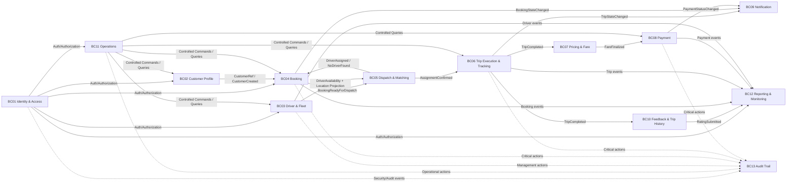

---

# 19. Quan hệ giữa các Context theo DDD Pattern

| Upstream | Downstream | Kiểu quan hệ đề xuất | Ngôn ngữ trao đổi |
|---|---|---|---|
| Identity & Access | Các context | Open Host Service | Authenticated Subject, Roles, Permissions |
| Customer Profile | Booking | Published Language | CustomerRef |
| Driver & Fleet | Dispatch | Published Language | DriverCandidateSnapshot |
| Booking | Dispatch | Published Language | BookingReadyForDispatch |
| Dispatch | Booking | Published Language | DriverAssigned, NoDriverFound |
| Dispatch | Trip | Customer/Supplier + Published Language | AssignmentConfirmed |
| Trip | Pricing | Published Language | TripCompleted |
| Pricing | Payment | Published Language | FareFinalized |
| Booking/Trip/Payment | Notification | Published Language | Business Events |
| Trip/Payment/Rating | History | Published Language | Projection events |
| Các context nghiệp vụ | Reporting | Published Language / Event Stream | Reporting Events |
| Operations | Các context | Anti-Corruption Layer / Application API | Context-specific Commands |
| Tất cả context quan trọng | Audit | Published Language | Auditable Action/Event |

---

# 20. Integration Event Contract đề xuất

Để giảm coupling, các context nên trao đổi Integration Event ở boundary.

## 20.1 Booking → Dispatch

```json
{
  "eventType": "BookingReadyForDispatch",
  "bookingId": "BKG-001",
  "customerId": "CUS-001",
  "pickup": { "latitude": 10.7, "longitude": 106.6 },
  "destination": { "latitude": 10.75, "longitude": 106.68 },
  "vehicleType": "STANDARD"
}
```

Dispatch không cần biết object/class `Booking` nội bộ.

## 20.2 Dispatch → Trip

```json
{
  "eventType": "AssignmentConfirmed",
  "assignmentId": "ASN-001",
  "bookingId": "BKG-001",
  "driverId": "DRV-001",
  "vehicleId": "VEH-001"
}
```

## 20.3 Trip → Pricing

```json
{
  "eventType": "TripCompleted",
  "tripId": "TRP-001",
  "bookingId": "BKG-001",
  "driverId": "DRV-001",
  "completedAt": "...",
  "tripFacts": {}
}
```

`tripFacts` là contract dữ liệu cần cho pricing, không phải toàn bộ Trip Aggregate.

## 20.4 Pricing → Payment

```json
{
  "eventType": "FareFinalized",
  "tripId": "TRP-001",
  "fareId": "FARE-001",
  "amount": 125000,
  "currency": "VND"
}
```

## 20.5 Payment → Notification/Reporting

```json
{
  "eventType": "PaymentSucceeded",
  "paymentId": "PAY-001",
  "tripId": "TRP-001",
  "amount": 125000,
  "method": "ELECTRONIC",
  "providerTransactionId": "PROV-001"
}
```

---

# 21. Mapping Use Case → Bounded Context

| UC | Use Case | Primary Context | Secondary Context |
|---|---|---|---|
| UC01 | Đăng ký tài khoản | Customer Profile | Identity & Access |
| UC02 | Đăng nhập | Identity & Access | — |
| UC03 | Quản lý thông tin cá nhân | Customer Profile | Identity & Access |
| UC04 | Đặt xe | Booking | Customer Profile, Dispatch, Notification |
| UC05 | Tìm và phân công tài xế | Dispatch & Matching | Driver & Fleet, Booking, Notification |
| UC06 | Nhận/xử lý yêu cầu chuyến | Dispatch & Matching | Driver & Fleet, Trip, Notification |
| UC07 | Quản lý trạng thái chuyến | Trip Execution & Tracking | Driver & Fleet, Notification |
| UC08 | Theo dõi chuyến | Trip Execution & Tracking | Notification |
| UC09 | Tính cước chuyến | Pricing & Fare | Trip Execution |
| UC10 | Thanh toán chuyến | Payment | Pricing & Fare, Notification |
| UC11 | Đánh giá tài xế | Feedback & Trip History | Trip Execution, Customer Profile |
| UC12 | Xem lịch sử chuyến | Feedback & Trip History | Customer Profile, Payment read model |
| UC13 | Quản lý tài xế | Driver & Fleet | Operations, Identity, Audit |
| UC14 | Quản lý phương tiện | Driver & Fleet | Operations, Audit |
| UC15 | Giám sát chuyến | Operations | Trip Execution, Driver & Fleet |
| UC16 | Xử lý sự cố chuyến | Operations | Trip Execution, Driver & Fleet, Audit |
| UC17 | Tra cứu giao dịch | Payment | Operations |
| UC18 | Quản lý khách hàng | Customer Profile | Operations, Identity, Audit |
| UC19 | Xem báo cáo kinh doanh | Reporting & Monitoring | — |
| UC20 | Gửi thông báo | Notification | Các context phát hành event |
| UC21 | Quản lý quyền truy cập | Identity & Access | Audit |
| UC22 | Ghi Audit Log | Audit Trail | Các context phát hành auditable event |

---

# 22. Mapping Functional Requirement → Bounded Context

| FR Group | Bounded Context |
|---|---|
| FR-CM-01 → FR-CM-04 | Customer Profile + Identity & Access |
| FR-BK-01 → FR-BK-05 | Booking |
| FR-DM-01 → FR-DM-04 | Driver & Fleet |
| FR-MA-01 → FR-MA-06 | Dispatch & Matching |
| FR-TR-01 → FR-TR-05 | Trip Execution & Tracking |
| FR-PM-01 | Pricing & Fare |
| FR-PM-02 → FR-PM-06 | Payment |
| FR-NT-01 → FR-NT-06 | Notification |
| FR-RH-01 → FR-RH-03 | Feedback & Trip History |
| FR-OM-01 → FR-OM-07 | Operations |
| FR-RP-01 → FR-RP-05 | Reporting & Monitoring |
| FR-AC-01 → FR-AC-03 | Identity & Access |
| FR-AC-04 | Audit Trail |

---

# 23. Business Rule ownership

| Business Rule | Owner Context | Lý do |
|---|---|---|
| BRL01 – Booking đầy đủ thông tin | Booking | Chỉ Booking có đủ dữ liệu để xác nhận invariant |
| BRL02 – Booking có status | Booking | Booking sở hữu request lifecycle |
| BRL03 – Không xử lý booking thiếu dữ liệu | Booking | Validation thuộc request creation |
| BRL04 – Chỉ driver Available mới được matching | Driver & Fleet + Dispatch | Fleet định nghĩa availability, Dispatch áp dụng eligibility |
| BRL05 – Driver phù hợp yêu cầu | Dispatch | Matching semantics |
| BRL06 – Xem xét vị trí và availability | Dispatch | Ranking/eligibility |
| BRL07 – Một booking chỉ được xác nhận bởi một driver | Dispatch | Assignment invariant |
| BRL08 – Reject/Timeout → tìm driver khác | Dispatch | Offer/attempt lifecycle |
| BRL09 – Trip chỉ tạo sau acceptance | Trip | Trip aggregate yêu cầu AssignmentConfirmed |
| BRL10 – Trip state theo trình tự | Trip | Trip state machine |
| BRL11 – Chỉ assigned driver cập nhật trip | Trip | Trip authorization invariant |
| BRL12 – Chỉ trip completed mới final fare | Pricing | Fare invariant dựa trên TripCompleted |
| BRL13 – Trip phải có payment information | Payment | Payment lifecycle |
| BRL14 – Cash/Electronic | Payment | Payment method policy |
| BRL15 – Electronic payment phải có provider result | Payment | External transaction invariant |
| BRL16 – Rating sau completion | Feedback | Rating eligibility |
| BRL17 – Completed trip có history | Feedback & History | Projection rule |
| BRL18 – Role-based access | Identity & Access | Authorization |
| BRL19 – Operation action phải audit | Audit + Operations | Traceability |
| BRL20 – Matching priority configurable | Dispatch | Ranking policy phải có abstraction |

---

# 24. Exception ownership

| Exception | Context xử lý chính |
|---|---|
| EX01 Thiếu Booking data | Booking |
| EX02 Không có Driver | Dispatch |
| EX03 Driver reject | Dispatch |
| EX04 Driver timeout | Dispatch |
| EX05 Driver mất availability | Driver & Fleet + Dispatch |
| EX06 Driver không tiếp tục trip | Trip + Operations |
| EX07 Electronic payment failed | Payment |
| EX08 Payment Provider unavailable | Payment |
| EX09 Unauthorized access | Identity & Access |
| EX10 Trip execution error | Trip + Operations |
| EX11 Driver update trip không thuộc mình | Trip |
| EX12 Rating trip chưa completed | Feedback |

Nguyên tắc xuyên context:

```text
Exception xảy ra
      ↓
Context sở hữu invariant quyết định trạng thái nghiệp vụ
      ↓
Phát hành event
      ↓
Notification / Operations / Reporting xử lý phần của mình
```

Không để Notification hoặc UI tự quyết định domain state khi domain context đã có authority.

---

# 25. Aggregate Boundary tổng hợp

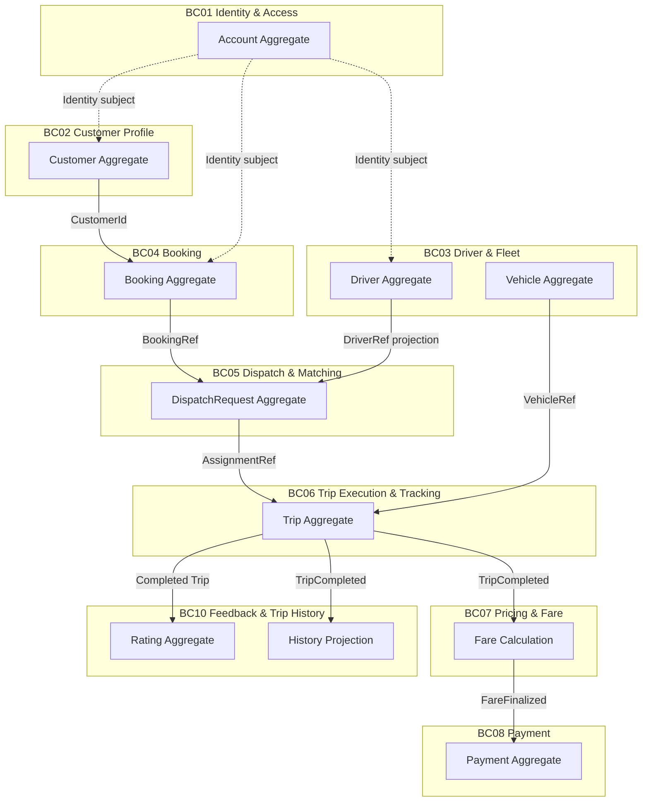

---

# 26. Quy tắc Dependency giữa Context

## 26.1 Được phép

```text
Context A
   │
   └── references Context B bằng:
       - ID
       - Value Object contract
       - DTO
       - Integration Event
       - API Port
```

## 26.2 Không nên

```text
Booking
   └── imports DriverEntity

Trip
   └── imports PaymentEntity

Customer
   └── contains List<TripEntity>

Operations
   └── trực tiếp update database của mọi context
```

## 26.3 Shared Kernel

Ở phiên bản đầu, chỉ nên chia sẻ những thứ thật sự ổn định và có tính kỹ thuật, ví dụ:

- `CorrelationId`
- `TraceId`
- `Currency`
- các primitive type chuẩn hóa

Không nên đưa các domain entity như `Driver`, `Booking`, `Trip`, `Payment` vào Shared Kernel.

---

# 27. Anti-Corruption Layer (ACL)

ACL đặc biệt cần cho **Operations** và các context tích hợp provider.

Ví dụ:

```text
Payment Provider Model
    |
    | ACL / Adapter
    v
Payment Context Model

External Provider:
transaction_status = "00"

Payment Context:
PaymentStatus = SUCCEEDED
```

Tương tự với Driver Provider/Map/Location nếu sau này có hệ thống bên ngoài.

Mục đích của ACL là không cho ngôn ngữ của hệ thống bên ngoài xâm nhập Domain Model của CAB System.

---

# 28. Domain Event vs Integration Event

## Domain Event

Dùng bên trong một bounded context để thông báo business state đã thay đổi.

Ví dụ:

```text
DriverOfferAccepted
TripCompleted
FareFinalized
PaymentSucceeded
```

## Integration Event

Dùng để đưa thông tin qua boundary.

Ví dụ:

```text
AssignmentConfirmed
TripCompleted
FareFinalized
PaymentStatusChanged
```

Trong triển khai thực tế nên tách model event nội bộ và event contract công khai khi context bắt đầu có nhiều consumer.

---

# 29. Core Business Flow sau khi chuyển DDD

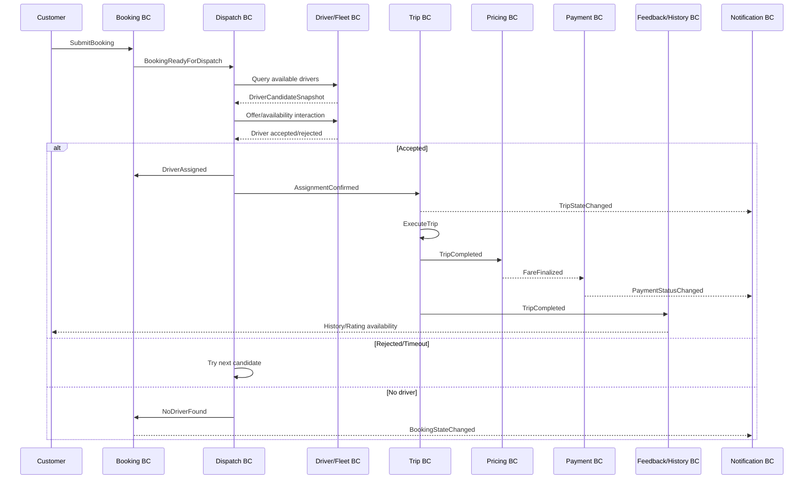

---

# 30. Đề xuất cấu trúc code DDD

Nếu chuyển hệ thống hiện tại sang **Modular Monolith + DDD** trước, có thể tổ chức:

```text
cab-system/
├── src/
│   ├── identity-access/
│   │   ├── domain/
│   │   │   ├── entities/
│   │   │   ├── value-objects/
│   │   │   ├── services/
│   │   │   ├── events/
│   │   │   └── repositories/
│   │   ├── application/
│   │   │   ├── commands/
│   │   │   ├── queries/
│   │   │   └── handlers/
│   │   └── infrastructure/
│   │
│   ├── customer/
│   ├── driver-fleet/
│   ├── booking/
│   ├── dispatch/
│   ├── trip/
│   ├── pricing/
│   ├── payment/
│   ├── notification/
│   ├── feedback-history/
│   ├── operations/
│   ├── reporting/
│   └── audit/
│
├── shared/
│   ├── correlation-id/
│   ├── domain-event/
│   └── common-types/
│
└── interfaces/
    ├── http/
    └── messaging/
```

Mỗi bounded context nên có tối thiểu:

```text
Presentation/API
      ↓
Application Layer
      ↓
Domain Layer
      ↓
Infrastructure
```

Domain layer không nên phụ thuộc Express/HTTP/database cụ thể.

---

# 31. API boundary theo Bounded Context

Không tổ chức API theo một controller khổng lồ như:

```text
/CAB/*
```

Thay vào đó có thể nhóm API theo context:

```text
/api/v1/auth/*
/api/v1/customers/*
/api/v1/drivers/*
/api/v1/vehicles/*
/api/v1/bookings/*
/api/v1/dispatch/*
/api/v1/trips/*
/api/v1/pricing/*
/api/v1/payments/*
/api/v1/notifications/*
/api/v1/feedback/*
/api/v1/operations/*
/api/v1/reports/*
/api/v1/audit/*
```

Điểm quan trọng là **URL grouping không tự động tạo Bounded Context**. Ranh giới thực sự nằm ở domain model, ownership và language.

---

# 32. Database boundary

DDD đề xuất mỗi context sở hữu schema/table của nó.

### Phương án Modular Monolith

Có thể vẫn dùng một database vật lý nhưng tách schema logic:

```text
cab_db
├── identity_*
├── customer_*
├── driver_*
├── vehicle_*
├── booking_*
├── dispatch_*
├── trip_*
├── pricing_*
├── payment_*
├── notification_*
├── feedback_*
├── reporting_*
└── audit_*
```

### Quy tắc

- Context A không foreign-key trực tiếp vào bảng domain của Context B nếu không thực sự cần.
- Quan hệ giữa context dùng reference ID.
- Reporting có thể dùng projection/read database riêng.
- Audit là append-only.

---

# 33. Mapping từ Data Model hiện tại sang DDD

| Entity hiện tại trong SRS | DDD Owner | Dạng model đề xuất |
|---|---|---|
| Customer | Customer Profile | Aggregate Root |
| Driver | Driver & Fleet | Aggregate Root |
| Vehicle | Driver & Fleet | Aggregate Root |
| Booking | Booking | Aggregate Root |
| Trip | Trip Execution & Tracking | Aggregate Root |
| Payment | Payment | Aggregate Root |
| Rating | Feedback | Aggregate Root |
| Notification | Notification | Aggregate Root |
| DriverLocation | Driver/Fleet + Trip Tracking | Tách thành 2 concept |
| AuditLog | Audit Trail | Append-only model |

Một số entity trong SRS hiện mang quá nhiều trách nhiệm xuyên context. DDD chuyển từ mô hình “data-centric” sang “business ownership-centric”.

---

# 34. Một số Value Object nên sử dụng

## Booking

- `Location`
- `VehicleType`
- `BookingStatus`

## Driver/Fleet

- `DriverId`
- `VehicleId`
- `LicensePlate`
- `AvailabilityStatus`
- `GeoCoordinate`

## Trip

- `TripId`
- `TripState`
- `AssignmentRef`

## Pricing

- `Money`
- `FareRuleId`
- `FareComponent`

## Payment

- `PaymentId`
- `PaymentMethod`
- `PaymentStatus`
- `ProviderTransactionId`

## Identity

- `AccountId`
- `Role`
- `Permission`

Không nên biến mọi field thành Value Object chỉ để “đủ DDD”. Chỉ tạo Value Object khi nó có semantics hoặc invariant riêng.

---

# 35. Domain Service đề xuất

Các nghiệp vụ không phù hợp để đặt vào một entity duy nhất:

```text
Booking
└── BookingValidator

Dispatch
├── DriverEligibilityService
├── MatchingService
└── RankingPolicy

Pricing
└── FareCalculator

Payment
└── PaymentAuthorizationService

Notification
└── NotificationRoutingService

Operations
└── IncidentResolutionPolicy
```

**Không nên** tạo `CabSystemService` rồi đưa toàn bộ business logic của 13 context vào cùng một service.

---

# 36. Transaction Boundary

## Transaction đồng bộ nên giữ trong một Context

Ví dụ:

```text
AcceptDriverOffer
    ↓
Dispatch Aggregate
    ↓
Confirm Assignment
```

Đây có thể là một transaction của Dispatch.

## Cross-context nên dùng event/process manager

Ví dụ:

```text
TripCompleted
    ↓
Pricing
    ↓
FareFinalized
    ↓
Payment
```

Không nên thực hiện một database transaction xuyên Booking + Dispatch + Trip + Payment.

---

# 37. Saga/Process Manager cho Core Flow

Vì core business flow đi qua nhiều bounded context, có thể có một **Ride Fulfillment Process Manager** ở application/integration layer.

```text
BookingSubmitted
      ↓
StartDispatch
      ↓
AssignmentConfirmed
      ↓
CreateTrip
      ↓
TripCompleted
      ↓
FinalizeFare
      ↓
RequestPayment
      ↓
PaymentResult
      ↓
EnableRating/History
```

Process Manager không sở hữu domain state của Booking/Trip/Payment. Nó chỉ điều phối các bước liên context.

---

# 38. Những điều không nên làm khi refactor sang DDD

### 1. Không tạo “God Entity”

```text
CabSystem
 ├── Customer
 ├── Driver
 ├── Booking
 ├── Trip
 ├── Payment
 ├── Rating
 └── Notification
```

Một class như trên sẽ làm mọi context dính chặt vào nhau.

### 2. Không dùng shared entity giữa context

Không nên:

```text
import { Driver } from "driver/domain/Driver";
```

bên trong Dispatch domain.

Dispatch nên dùng `DriverCandidateSnapshot` hoặc `DriverRef`.

### 3. Không để controller chứa business rule

Không nên:

```text
POST /bookings
  -> controller kiểm tra toàn bộ rule
  -> controller gọi DB
  -> controller gửi notification
  -> controller tính fare
```

Thay vào đó:

```text
HTTP Controller
   ↓
Application Command Handler
   ↓
Domain Aggregate / Domain Service
   ↓
Repository
   ↓
Domain Event
```

### 4. Không để Payment Provider định nghĩa domain language

`ProviderStatus = 00` không nên trở thành `PaymentStatus = 00` trong toàn bộ Domain.

### 5. Không để Reporting đọc trực tiếp domain database

Reporting nên nhận dữ liệu qua projection/event hoặc read API.

---

# 39. Đề xuất thứ tự triển khai DDD cho CAB System

## Phase 1 – Giữ Modular Monolith

Ưu tiên:

1. Booking
2. Dispatch & Matching
3. Trip Execution
4. Pricing
5. Payment
6. Driver & Fleet

Tách rõ domain/application/infrastructure trong cùng một Node.js application.

## Phase 2 – Event-driven integration

Thêm:

- Domain Event
- Integration Event
- Outbox Pattern
- Process Manager
- Read Projection

## Phase 3 – Tách service khi có lý do thực tế

Những context phù hợp tách độc lập sau khi boundary ổn định:

```text
Dispatch Service
Trip Service
Payment Service
Notification Service
Reporting Service
```

Không nên microservice hóa ngay chỉ vì đã dùng DDD. **DDD xác định boundary trước; deployment topology là quyết định sau.**

---

# 40. DDD Acceptance Checklist cho CAB System

Một bounded context được xem là có boundary tốt khi:

- [ ] Có một business capability rõ ràng.
- [ ] Có Ubiquitous Language riêng.
- [ ] Có entity/aggregate riêng.
- [ ] Có invariant riêng.
- [ ] Có command/use case rõ ràng.
- [ ] Có domain event phù hợp.
- [ ] Không cần truy cập domain object của context khác để thực hiện business rule cốt lõi.
- [ ] Có cách giao tiếp qua contract rõ ràng.
- [ ] Có owner chịu trách nhiệm thay đổi model.
- [ ] Thay đổi rule của context A không bắt buộc sửa model domain của context B.

---

# 41. Kết luận kiến trúc

Mô hình DDD đề xuất cho CAB System có thể được nhìn như sau:

```text
                         CAB SYSTEM
                             │
        ┌────────────────────┼────────────────────┐
        │                    │                    │
     CORE                 SUPPORTING          GENERIC
        │                    │                    │
  ┌─────┴─────┐       ┌──────┴────────┐      ┌───────┴───────┐
  │ Booking   │       │ Driver/Fleet  │      │ Identity      │
  │ Dispatch  │       │ Customer      │      │ Audit         │
  │ Trip      │       │ Pricing       │      └───────────────┘
  └───────────┘       │ Payment       │
                      │ Notification  │
                      │ Feedback      │
                      │ Operations     │
                      │ Reporting      │
                      └───────────────┘
```

## Nguyên tắc cốt lõi

> **Booking tạo nhu cầu. Dispatch tìm người thực hiện. Trip quản lý việc thực hiện. Pricing xác định số tiền. Payment xác nhận giao dịch. Feedback lưu trải nghiệm. Notification truyền đạt kết quả. Operations can thiệp. Reporting quan sát. Identity kiểm soát truy cập. Audit truy vết.**

Đây là ngôn ngữ cấp hệ thống. Bên trong từng Bounded Context, các thuật ngữ phải tiếp tục được định nghĩa riêng để tránh một mô hình domain dùng chung cho toàn hệ thống.

---

# 42. Traceability với SRS hiện tại

Thiết kế trên bám vào các thành phần đã có trong SRS:

- Customer Management
- Booking Management
- Driver Management
- Driver Matching & Assignment
- Trip Management
- Fare & Payment
- Notification Management
- Rating & Trip History
- Operation Management
- Reporting & Monitoring
- Authentication & Access Control
- Audit

Đồng thời giữ nguyên các business constraint quan trọng đã đặc tả:

- Booking phải đủ thông tin trước khi được xử lý.
- Chỉ driver sẵn sàng mới được xét matching.
- Một booking chỉ có một driver assignment được xác nhận.
- Reject/timeout phải cho phép tìm driver khác.
- Trip chỉ được tạo sau khi driver chấp nhận.
- Trip phải đi đúng lifecycle.
- Chỉ assigned driver được cập nhật trip.
- Fare cuối chỉ xác định sau khi trip hoàn thành.
- Electronic payment không được đánh dấu thành công khi provider chưa trả kết quả hợp lệ.
- Rating chỉ sau khi trip hoàn thành.
- Thao tác quan trọng phải có khả năng audit.
- Matching priority phải configurable/extensible.

---

# 43. Nguồn phân tích

**Repository:** `toru12030-netizen/23732061_MaiQuocHung_CabSystem`

**Tài liệu chính:** `srs.md`

Các phần SRS được sử dụng để xây dựng bounded context:

- Business Context và Stakeholder
- Business Goal và Scope
- Business Process
- Component Functional Requirement
- Business Rule và Exception
- Data Modeling
- Non-Functional Requirements
- Use Case UC01–UC22
- Core Business Flow
- Acceptance Criteria
- Requirement Traceability Matrix

---

## Phụ lục A – Bảng từ điển Ubiquitous Language ngắn gọn

| Context | Từ khóa nghiệp vụ chính |
|---|---|
| Identity & Access | Account, Subject, Credential, Role, Permission, Authorization |
| Customer Profile | Customer, Profile, ContactInfo, CustomerStatus |
| Driver & Fleet | Driver, Availability, Vehicle, Fleet, LiveLocation |
| Booking | Booking, Pickup, Destination, VehicleTypeRequest, BookingStatus |
| Dispatch | Candidate, Offer, Attempt, MatchingCriteria, Assignment, NoMatch |
| Trip | Trip, AssignmentRef, TripState, Arrived, PassengerOnboard, InTransit, Completed |
| Pricing | Fare, FareRule, PricingPolicy, FareComponent, FinalFare |
| Payment | Payment, Transaction, PaymentMethod, Provider, PaymentStatus |
| Notification | Notification, Recipient, Channel, Template, DeliveryStatus |
| Feedback & History | Rating, Review, CompletedTrip, HistoryEntry |
| Operations | Incident, OperationCase, Intervention, Escalation, Resolution |
| Reporting | Metric, Revenue, TripVolume, CompletionRate, CancellationRate |
| Audit | AuditEntry, Actor, Action, Target, TraceId |

---

## Phụ lục B – 7 câu hỏi kiểm tra boundary khi code

1. **Rule này thuộc context nào?**
2. **Aggregate nào bảo vệ invariant này?**
3. **Tôi có đang import entity từ context khác không?**
4. **Tôi đang truyền entity hay chỉ truyền ID/contract?**
5. **Sự thay đổi này cần transaction nội bộ hay event liên context?**
6. **Từ “Driver/Booking/Trip/Payment” ở context này đang có nghĩa gì?**
7. **Nếu business rule thay đổi, context nào là owner của thay đổi đó?**

Nếu trả lời được 7 câu hỏi trên trước khi viết code, boundary DDD của CAB System sẽ ổn định hơn đáng kể.

---

# 44. DDD → Microservices Design cho CAB System

> Phần này mở rộng thiết kế DDD ở trên thành kiến trúc **mỗi Bounded Context tương ứng một Microservice và một Database ownership boundary riêng**. Thiết kế được trace từ `srs.md`: Business Process, Functional Requirements, Business Rules, Exception và UC01–UC22.
>
> **Nguyên tắc:** một microservice sở hữu domain model + business rules + database của context đó. Không có microservice nào truy cập trực tiếp database của microservice khác.

## 44.1. Quy ước Business Process Model

Để mapping nhất quán giữa SRS → DDD → Microservice, sử dụng các workflow sau:

| Mã | Business Process | Các bước/Use Case chính |
|---|---|---|
| **BP01** | Customer Registration & Profile | UC01, UC02, UC03, UC18 |
| **BP02** | Booking & Driver Assignment | BP step tạo booking → tiếp nhận → tìm driver → gửi offer → accept/reject/timeout; UC04, UC05, UC06 |
| **BP03** | Trip Execution & Tracking | nhận chuyến → đến điểm đón → đón khách → đang di chuyển → hoàn thành; UC07, UC08 |
| **BP04** | Fare & Payment | hoàn thành trip → tính fare → cash/electronic payment → payment result; UC09, UC10, UC17 |
| **BP05** | Rating & Trip History | rating sau completion → tạo/read history; UC11, UC12 |
| **BP06** | Driver & Fleet Administration | quản lý driver, availability, vehicle; UC13, UC14 |
| **BP07** | Operations Monitoring & Incident Handling | theo dõi trip/driver → xử lý trip lỗi → tra cứu transaction; UC15, UC16, UC17 |
| **BP08** | Reporting & Business Monitoring | trips, revenue, completion, cancellation, driver performance; UC19 |
| **BP09** | Notification Delivery | thông báo booking, assignment, pickup, completion, payment, new trip; UC20 |
| **BP10** | Access Control & Audit | authentication → authorization → audit critical action; UC21, UC22 |

Business Process Model gốc của SRS mô tả chuỗi từ tạo booking, tìm driver, thực hiện trip, tính cước, thanh toán, rating và lưu history. Kiến trúc microservice bên dưới chỉ **phân tách ownership**, không thay đổi business flow này. citeturn956313view1turn472349view0

---

# 45. Microservice Architecture Overview

## 45.1. Mapping 1:1 giữa Bounded Context và Microservice

| BC | Microservice | Loại | Database riêng |
|---|---|---|---|
| BC01 Identity & Access | `identity-service` | Generic | `identity_db` |
| BC02 Customer Profile | `customer-service` | Supporting | `customer_db` |
| BC03 Driver & Fleet | `driver-fleet-service` | Supporting | `driver_fleet_db` |
| BC04 Booking | `booking-service` | **Core** | `booking_db` |
| BC05 Dispatch & Matching | `dispatch-service` | **Core** | `dispatch_db` |
| BC06 Trip Execution & Tracking | `trip-service` | **Core** | `trip_db` |
| BC07 Pricing & Fare | `pricing-service` | Supporting/Core-supporting | `pricing_db` |
| BC08 Payment | `payment-service` | Supporting | `payment_db` |
| BC09 Notification | `notification-service` | Supporting | `notification_db` |
| BC10 Feedback & Trip History | `feedback-history-service` | Supporting | `feedback_history_db` |
| BC11 Operations | `operations-service` | Supporting | `operations_db` |
| BC12 Reporting & Monitoring | `reporting-service` | Supporting | `reporting_db` |
| BC13 Audit Trail | `audit-service` | Generic | `audit_db` |

## 45.2. Tổng thể giao tiếp

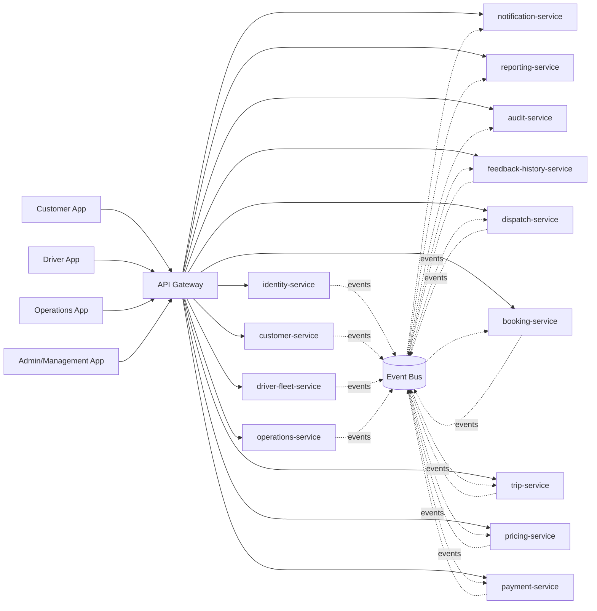

## 45.3. Quy tắc giao tiếp

```text
Frontend / Operations UI
        ↓
    API Gateway
        ↓
Application API của từng Microservice
        ↓
Domain Model / Aggregate
        ↓
Database riêng của service

Cross-service:
Service A ── Integration Event ──> Event Bus ──> Service B
```

Các service **không dùng chung entity JavaScript/Java/TypeScript**, không import domain class của nhau và không dùng cross-database foreign key.

---

# 46. BC01 / identity-service

## 46.1. BC này làm gì?

`identity-service` chịu trách nhiệm về **technical identity và authorization**, gồm đăng nhập, xác thực, role, permission và bảo vệ các API yêu cầu tài khoản. Nó không sở hữu business profile của Customer hoặc Driver.

## 46.2. FR / UC / Business Process

| Nhóm | Mapping |
|---|---|
| FR | FR-AC-01, FR-AC-02, FR-AC-03; hỗ trợ FR-CM-02 |
| UC | UC02, UC21 |
| Business Process | **BP01**, **BP10** |
| Rules | BRL18 |

## 46.3. Ubiquitous Language

`Account`, `Credential`, `Subject`, `Role`, `Permission`, `Authenticated Subject`, `Token`, `Session`, `Authorized Action`, `AccountStatus`.

## 46.4. Microservice boundary

### Public APIs

| Method | Endpoint | Mục đích |
|---|---|---|
| POST | `/api/v1/auth/register` | Tạo account identity |
| POST | `/api/v1/auth/login` | Xác thực và cấp token |
| POST | `/api/v1/auth/refresh` | Refresh token |
| GET | `/api/v1/auth/me` | Lấy subject hiện tại |
| GET | `/api/v1/accounts/{id}` | Tra cứu account |
| PATCH | `/api/v1/accounts/{id}/status` | Kích hoạt/vô hiệu account |
| GET | `/api/v1/roles` | Danh sách role |
| PUT | `/api/v1/accounts/{id}/roles` | Gán/cập nhật role |
| GET | `/api/v1/permissions` | Danh sách permission |

### Internal APIs / Integration

| Interface | Mục đích |
|---|---|
| `POST /internal/authorize` | Service khác kiểm tra authorization khi cần policy tập trung |
| Event `AccountRegistered` | Báo account đã tạo |
| Event `RoleChanged` | Báo thay đổi quyền |
| Event `AccountDeactivated` | Đồng bộ trạng thái security |

## 46.5. Database

**DB:** `identity_db` – PostgreSQL.

| Table | Ownership |
|---|---|
| `accounts` | Account aggregate root |
| `roles` | Role definition |
| `permissions` | Permission definition |
| `account_roles` | User-role membership |
| `role_permissions` | Role-permission mapping |
| `refresh_tokens` | Session/token lifecycle |

### ERD

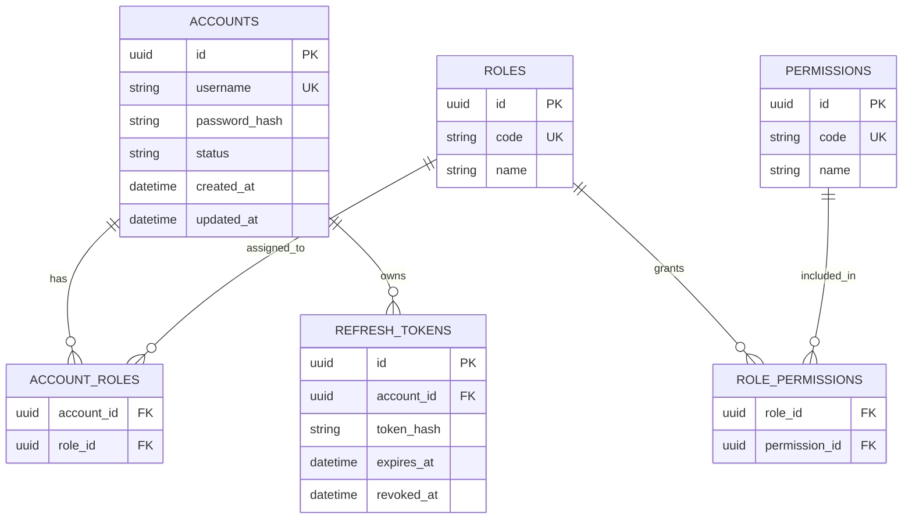

**Không có FK tới `customer_db` hoặc `driver_fleet_db`.** `account_id` được trao đổi như một external reference.

---

# 47. BC02 / customer-service

## 47.1. BC này làm gì?

Quản lý **business profile của khách hàng**: thông tin cá nhân, trạng thái hồ sơ và các dữ liệu cần cho việc đặt xe. Authentication thuộc `identity-service`.

## 47.2. FR / UC / Business Process

| Nhóm | Mapping |
|---|---|
| FR | FR-CM-01, FR-CM-03, FR-CM-04 |
| UC | UC01, UC03, UC18 |
| Business Process | **BP01**, hỗ trợ **BP05** |
| Rules | BRL18; các rule profile/authorization |

## 47.3. Ubiquitous Language

`Customer`, `CustomerProfile`, `ContactInfo`, `CustomerStatus`, `CustomerId`.

## 47.4. API

| Method | Endpoint | Mục đích |
|---|---|---|
| POST | `/api/v1/customers` | Tạo customer profile |
| GET | `/api/v1/customers/{customerId}` | Xem profile |
| PUT | `/api/v1/customers/{customerId}` | Cập nhật profile |
| PATCH | `/api/v1/customers/{customerId}/status` | Cập nhật trạng thái profile |
| GET | `/api/v1/customers/{customerId}/summary` | Customer summary cho UI |

### Events

`CustomerProfileCreated`, `CustomerProfileUpdated`, `CustomerDeactivated`.

## 47.5. Database

**DB:** `customer_db` – PostgreSQL.

| Table | Purpose |
|---|---|
| `customer_profiles` | Aggregate root |
| `customer_contacts` | Thông tin liên hệ |

### ERD

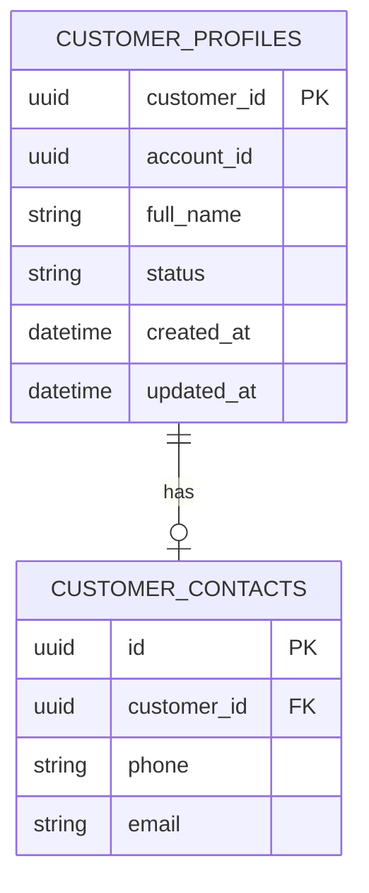

`account_id` là reference sang Identity Context, **không phải cross-service FK**.

---

# 48. BC03 / driver-fleet-service

## 48.1. BC này làm gì?

Quản lý hồ sơ tài xế, phương tiện, availability và current location snapshot dùng để phục vụ matching/operations.

SRS mô tả driver management gồm quản lý hồ sơ, phương tiện và trạng thái sẵn sàng nhận chuyến. Driver matching sử dụng vị trí và trạng thái ready của driver. citeturn472349view0

## 48.2. FR / UC / Business Process

| Nhóm | Mapping |
|---|---|
| FR | FR-DM-01 → FR-DM-04 |
| UC | UC13, UC14 |
| Business Process | **BP06**; cung cấp dữ liệu cho **BP02**, **BP03**, **BP07** |
| Rules | BRL04 |

## 48.3. Ubiquitous Language

`Driver`, `DriverProfile`, `Availability`, `Ready`, `Unavailable`, `Vehicle`, `VehicleType`, `DriverLocationSnapshot`, `Fleet`.

## 48.4. API

| Method | Endpoint | Mục đích |
|---|---|---|
| POST | `/api/v1/drivers` | Tạo hồ sơ driver |
| GET | `/api/v1/drivers/{driverId}` | Xem driver |
| PUT | `/api/v1/drivers/{driverId}` | Cập nhật profile |
| GET | `/api/v1/drivers` | Tra cứu/lọc driver |
| PATCH | `/api/v1/drivers/{driverId}/availability` | Ready/Unavailable |
| GET | `/api/v1/drivers/{driverId}/availability` | Xem availability |
| POST | `/api/v1/drivers/{driverId}/vehicles` | Thêm vehicle |
| GET | `/api/v1/drivers/{driverId}/vehicles` | Danh sách vehicle |
| PUT | `/api/v1/vehicles/{vehicleId}` | Cập nhật vehicle |
| PATCH | `/api/v1/drivers/{driverId}/location` | Cập nhật location snapshot |
| GET | `/api/v1/drivers/{driverId}/location` | Lấy location |

### Events

`DriverCreated`, `DriverAvailabilityChanged`, `VehicleRegistered`, `DriverLocationUpdated`.

## 48.5. Database

**DB:** `driver_fleet_db` – PostgreSQL. Với triển khai tải cao, current location có thể cache thêm trong Redis; PostgreSQL vẫn giữ ownership của business data.

### ERD

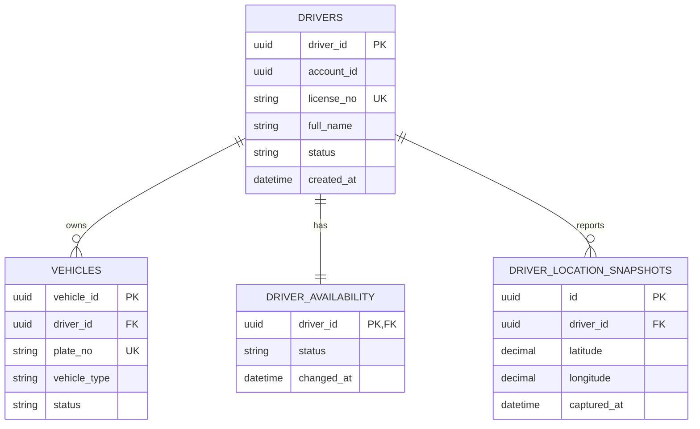

---

# 49. BC04 / booking-service

## 49.1. BC này làm gì?

Đây là **Core Domain** chịu trách nhiệm hình thành và quản lý `Booking` – yêu cầu đặt xe của khách hàng từ lúc tạo đến khi được phân công/không tìm được driver và các trạng thái tiếp theo theo SRS.

## 49.2. FR / UC / Business Process

| Nhóm | Mapping |
|---|---|
| FR | FR-BK-01 → FR-BK-05 |
| UC | UC04 |
| Business Process | **BP02** – từ “Khách hàng tạo yêu cầu đặt xe” đến “Gửi yêu cầu đến driver” và nhận kết quả assignment |
| Rules | BRL01, BRL02, BRL03 |

Business process của SRS quy định booking phải có pickup, destination, vehicle type trước khi gửi và sau đó hệ thống tiếp nhận rồi tìm driver. citeturn472349view0

## 49.3. Ubiquitous Language

`Booking`, `BookingRequest`, `PickupLocation`, `Destination`, `VehicleType`, `BookingStatus`, `SearchingDriver`, `DriverAssigned`, `NoDriverFound`, `Cancelled`, `Completed`.

## 49.4. API

| Method | Endpoint | Mục đích |
|---|---|---|
| POST | `/api/v1/bookings` | Tạo booking |
| GET | `/api/v1/bookings/{bookingId}` | Xem booking |
| GET | `/api/v1/bookings?customerId=...` | Lọc booking theo customer |
| PATCH | `/api/v1/bookings/{bookingId}/status` | Cập nhật state hợp lệ |
| POST | `/api/v1/bookings/{bookingId}/cancel` | Hủy booking theo policy |
| GET | `/api/v1/bookings/{bookingId}/status` | Theo dõi trạng thái |

### Internal/Event APIs

| Event | Consumer |
|---|---|
| `BookingCreated` | Notification, Reporting, Audit |
| `BookingReadyForDispatch` | Dispatch |
| `BookingStatusChanged` | Notification, Reporting |
| `DriverAssigned` | Booking, Notification |
| `NoDriverFound` | Booking, Notification |

## 49.5. Database

**DB:** `booking_db` – PostgreSQL.

### ERD

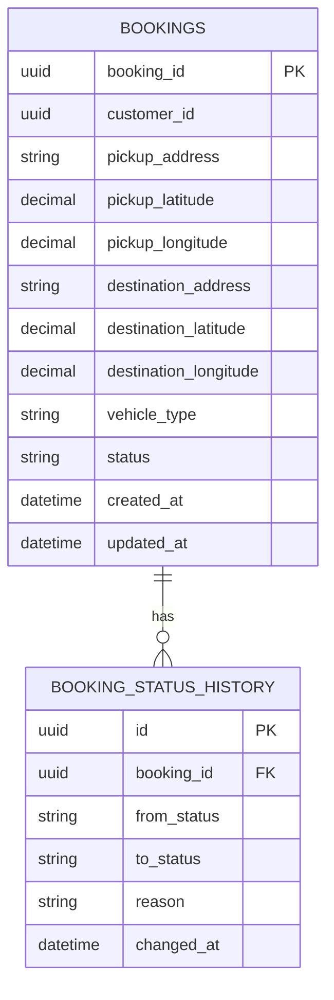

**Invariant quan trọng:** validation pickup + destination + vehicle type nằm trong `Booking Aggregate`; không đọc `customer_profiles` table trực tiếp.

---

# 50. BC05 / dispatch-service

## 50.1. BC này làm gì?

Đây là **Core Domain** cho tìm kiếm, eligibility, ranking, offer, acceptance/rejection/timeout và assignment. Dispatch là owner của business semantics “ai được đề xuất cho booking”.

SRS yêu cầu xem xét driver phù hợp, vị trí, availability, phản hồi, timeout/reject và tiếp tục tìm driver khác. Tiêu chí ưu tiên chi tiết vẫn là open business rule. citeturn472349view0

## 50.2. FR / UC / Business Process

| Nhóm | Mapping |
|---|---|
| FR | FR-MA-01 → FR-MA-06 |
| UC | UC05, UC06 |
| Business Process | **BP02** – từ “Tìm kiếm tài xế phù hợp” đến “Tài xế chấp nhận?” |
| Rules | BRL04, BRL05, BRL06, BRL07, BRL08, BRL20 |

## 50.3. Ubiquitous Language

`CandidateDriver`, `Eligibility`, `Ranking`, `Assignment`, `Offer`, `OfferAttempt`, `Accepted`, `Rejected`, `TimedOut`, `AssignmentConfirmed`, `MatchingPolicy`.

## 50.4. API

| Method | Endpoint | Mục đích |
|---|---|---|
| POST | `/api/v1/dispatch/search` | Tìm candidate driver |
| POST | `/api/v1/dispatch/assignments` | Tạo assignment process |
| GET | `/api/v1/dispatch/assignments/{id}` | Xem assignment |
| GET | `/api/v1/dispatch/bookings/{bookingId}/assignment` | Assignment của booking |
| POST | `/api/v1/dispatch/assignments/{id}/offers` | Gửi offer |
| POST | `/api/v1/dispatch/offers/{offerId}/accept` | Driver accept |
| POST | `/api/v1/dispatch/offers/{offerId}/reject` | Driver reject |
| POST | `/api/v1/dispatch/offers/{offerId}/timeout` | Timeout/internal scheduler |
| GET | `/api/v1/dispatch/policies/current` | Xem matching policy đang áp dụng |

### Events

`AssignmentStarted`, `DriverOfferSent`, `DriverRejected`, `DriverOfferTimedOut`, `AssignmentConfirmed`, `NoDriverFound`.

## 50.5. Database

**DB:** `dispatch_db` – PostgreSQL.

### ERD

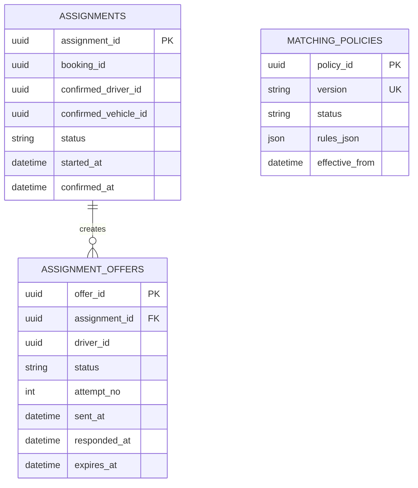

`MATCHING_POLICIES` có thể tách khỏi ERD FK vì policy có thể là configuration store; về mặt logic, `ASSIGNMENT_OFFERS` tham chiếu `driver_id` nhưng **không tạo FK tới driver database**.

### Invariant

```text
Một Booking
    → 0..n OfferAttempt
    → tối đa 1 AssignmentConfirmed
```

Nên dùng unique constraint/transaction hoặc optimistic locking để tránh hai driver cùng được confirm cho một booking.

---

# 51. BC06 / trip-service

## 51.1. BC này làm gì?

Quản lý vòng đời chuyến sau khi assignment đã được xác nhận và tracking vị trí trong quá trình thực hiện trip.

SRS quy định lifecycle: **Đã nhận chuyến → Đã đến điểm đón → Đã đón khách → Đang di chuyển → Hoàn thành chuyến**. citeturn956313view1

## 51.2. FR / UC / Business Process

| Nhóm | Mapping |
|---|---|
| FR | FR-TR-01 → FR-TR-05 |
| UC | UC07, UC08 |
| Business Process | **BP03** – từ xác nhận driver đến completion |
| Rules | BRL09, BRL10, BRL11, BRL12 |

## 51.3. Ubiquitous Language

`Trip`, `TripId`, `AssignedDriver`, `TripState`, `PickupArrived`, `PassengerPickedUp`, `InTransit`, `Completed`, `TripLocation`, `TripTimeline`.

## 51.4. API

| Method | Endpoint | Mục đích |
|---|---|---|
| POST | `/api/v1/trips` | Tạo trip từ assignment |
| GET | `/api/v1/trips/{tripId}` | Xem trip |
| PATCH | `/api/v1/trips/{tripId}/status` | Chuyển state |
| POST | `/api/v1/trips/{tripId}/locations` | Ghi nhận vị trí |
| GET | `/api/v1/trips/{tripId}/locations` | Xem tracking |
| GET | `/api/v1/trips/{tripId}/timeline` | Xem timeline |
| GET | `/api/v1/trips?driverId=...&status=...` | Tra cứu trip của driver |

### Events

`TripCreated`, `TripStateChanged`, `DriverArrivedAtPickup`, `PassengerPickedUp`, `TripInProgress`, `TripCompleted`, `TripLocationUpdated`.

## 51.5. Database

**DB:** `trip_db` – PostgreSQL. Nếu tracking rất dày, `trip_locations` có thể partition theo thời gian; Redis/WebSocket có thể dùng cho live state nhưng không thay thế ownership.

### ERD

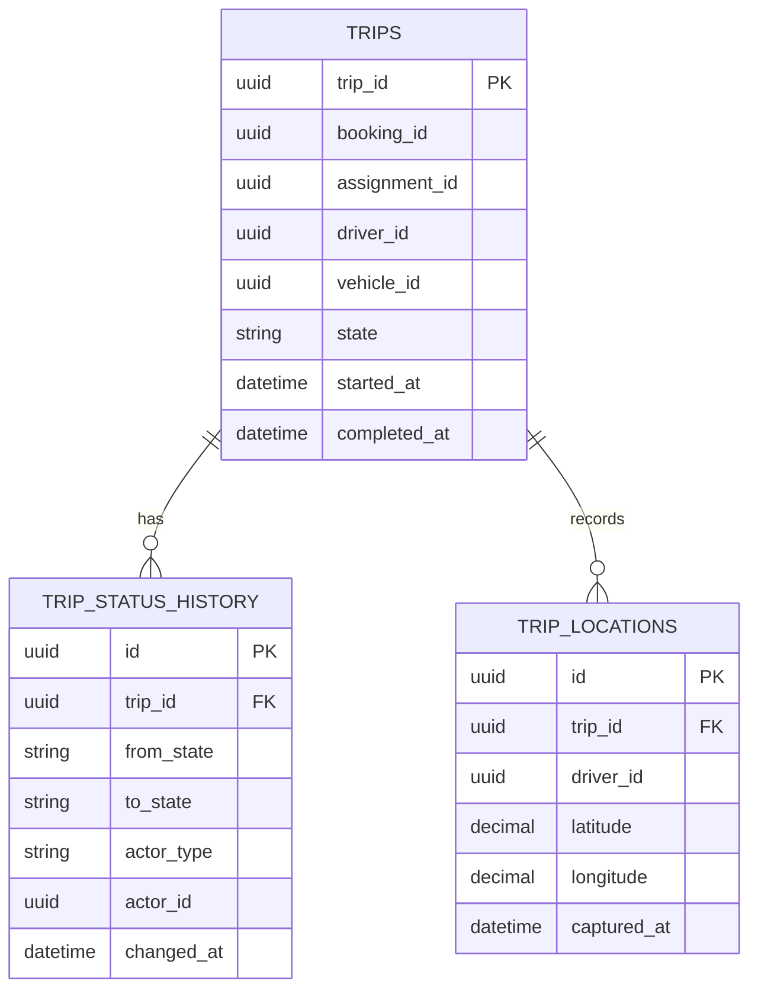

### State Machine

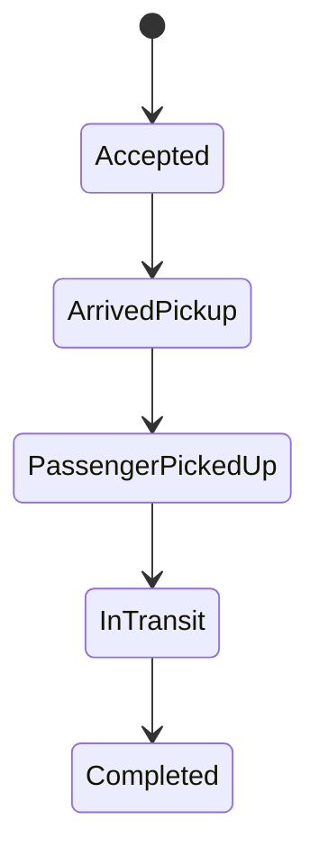

`trip-service` mới là authority cho Trip state; Driver/Fleet chỉ cung cấp driver identity/availability/location capability.

---

# 52. BC07 / pricing-service

## 52.1. BC này làm gì?

Tính và finalise số tiền khách hàng phải trả dựa trên trip facts và pricing policy. Pricing không thực hiện payment.

## 52.2. FR / UC / Business Process

| Nhóm | Mapping |
|---|---|
| FR | FR-PM-01 |
| UC | UC09 |
| Business Process | **BP04**, bước “Tính cước” |
| Rules | BRL12 |

## 52.3. Ubiquitous Language

`Fare`, `FareQuote`, `FareComponent`, `PricingRule`, `BaseFare`, `DistanceCharge`, `TimeCharge`, `FinalFare`, `Currency`.

## 52.4. API

| Method | Endpoint | Mục đích |
|---|---|---|
| POST | `/api/v1/pricing/quotes` | Tính quote nếu nghiệp vụ cần preview |
| POST | `/api/v1/fares/finalize` | Finalise fare từ TripCompleted |
| GET | `/api/v1/fares/{fareId}` | Xem fare |
| GET | `/api/v1/trips/{tripId}/fare` | Tra fare theo trip |
| GET | `/api/v1/pricing/rules/current` | Xem pricing policy/configuration |

### Event

`FareFinalized`.

## 52.5. Database

**DB:** `pricing_db` – PostgreSQL.

### ERD

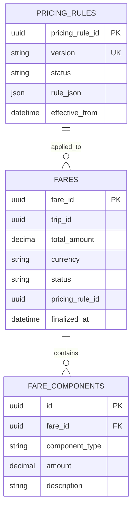

---

# 53. BC08 / payment-service

## 53.1. BC này làm gì?

Quản lý payment lifecycle: cash/electronic, amount, status, provider transaction và payment failure. Provider là adapter bên ngoài; domain language vẫn do Payment Context định nghĩa.

## 53.2. FR / UC / Business Process

| Nhóm | Mapping |
|---|---|
| FR | FR-PM-02 → FR-PM-06 |
| UC | UC10, UC17 |
| Business Process | **BP04** – từ “Phương thức thanh toán?” đến “Hoàn tất thanh toán” |
| Rules | BRL13, BRL14, BRL15 |

## 53.3. Ubiquitous Language

`Payment`, `PaymentMethod`, `CashPayment`, `ElectronicPayment`, `PaymentTransaction`, `Pending`, `Succeeded`, `Failed`, `ProviderReference`, `PaymentAmount`.

## 53.4. API

| Method | Endpoint | Mục đích |
|---|---|---|
| POST | `/api/v1/payments` | Tạo payment intent/record |
| POST | `/api/v1/payments/{paymentId}/cash/confirm` | Xác nhận cash payment |
| POST | `/api/v1/payments/{paymentId}/electronic/initiate` | Khởi tạo electronic payment |
| POST | `/api/v1/payments/{paymentId}/confirm` | Confirm payment result |
| POST | `/api/v1/payments/provider/webhook` | Nhận callback provider |
| GET | `/api/v1/payments/{paymentId}` | Xem payment |
| GET | `/api/v1/payments?tripId=...` | Tra cứu payment |
| GET | `/api/v1/transactions` | Lịch sử transaction cho operations |

### Events

`PaymentCreated`, `PaymentSucceeded`, `PaymentFailed`, `PaymentStatusChanged`.

## 53.5. Database

**DB:** `payment_db` – PostgreSQL.

### ERD

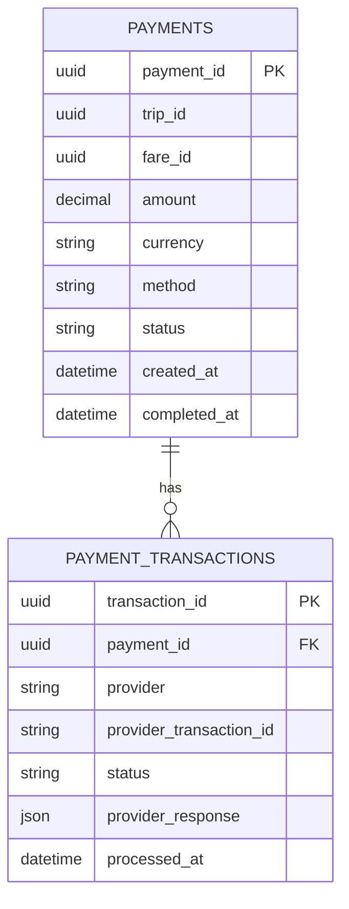

Không lưu thông tin nhạy cảm của payment provider vượt quá mức cần thiết cho domain/audit.

---

# 54. BC09 / notification-service

## 54.1. BC này làm gì?

Nhận business events từ các service và chuyển thành notification message đến khách hàng/tài xế qua channel/provider tương ứng.

SRS yêu cầu các thông báo khi booking được tiếp nhận, driver nhận chuyến, driver đến pickup, trip hoàn thành, payment result và thông báo chuyến mới cho driver. citeturn472349view0

## 54.2. FR / UC / Business Process

| Nhóm | Mapping |
|---|---|
| FR | FR-NT-01 → FR-NT-06 |
| UC | UC20 |
| Business Process | **BP02**, **BP03**, **BP04**, **BP09** |
| Rules | BRL07, BRL08, BRL13, BRL15; notification policies |

## 54.3. Ubiquitous Language

`Notification`, `Recipient`, `Channel`, `Template`, `Delivery`, `DeliveryAttempt`, `Sent`, `Failed`, `Provider`.

## 54.4. API

| Method | Endpoint | Mục đích |
|---|---|---|
| POST | `/api/v1/notifications` | Tạo/gửi notification theo use case nội bộ |
| GET | `/api/v1/notifications/{notificationId}` | Xem trạng thái gửi |
| GET | `/api/v1/notifications?recipientId=...` | Tra cứu notification |
| POST | `/internal/notifications/events` | Nhận normalized integration event |
| POST | `/api/v1/providers/{provider}/webhook` | Provider callback |

### Event consumers

- `BookingCreated` / `BookingReadyForDispatch`
- `DriverOfferSent`
- `DriverAssigned`
- `DriverArrivedAtPickup`
- `TripCompleted`
- `PaymentSucceeded` / `PaymentFailed`
- `NoDriverFound`

## 54.5. Database

**DB:** `notification_db` – PostgreSQL.

### ERD

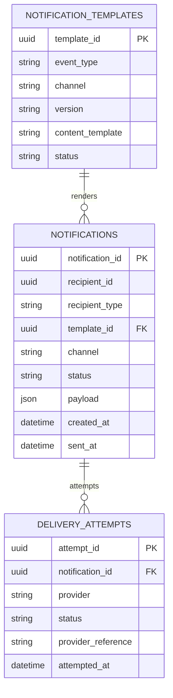

---

# 55. BC10 / feedback-history-service

## 55.1. BC này làm gì?

Quản lý rating và mô hình lịch sử đã được **denormalize/projection** từ trip, fare/payment và rating events để phục vụ tra cứu cho khách hàng/operations.

## 55.2. FR / UC / Business Process

| Nhóm | Mapping |
|---|---|
| FR | FR-RH-01 → FR-RH-03 |
| UC | UC11, UC12 |
| Business Process | **BP05** |
| Rules | BRL16, BRL17 |

## 55.3. Ubiquitous Language

`Rating`, `RatingScore`, `RatingComment`, `CompletedTrip`, `TripHistory`, `PaymentSnapshot`, `RatingEligibility`, `ExperienceRecord`.

## 55.4. API

| Method | Endpoint | Mục đích |
|---|---|---|
| GET | `/api/v1/customers/{customerId}/trip-history` | Lịch sử chuyến |
| GET | `/api/v1/trip-history/{tripId}` | Chi tiết history |
| POST | `/api/v1/trips/{tripId}/ratings` | Tạo rating |
| GET | `/api/v1/trips/{tripId}/rating` | Xem rating |
| GET | `/api/v1/customers/{customerId}/ratings` | Các rating của customer |

### Events

Input: `TripCompleted`, `FareFinalized`, `PaymentSucceeded`, `PaymentFailed`.

Output: `RatingSubmitted`, `TripHistoryCreated`.

## 55.5. Database

**DB:** `feedback_history_db` – PostgreSQL.

### ERD

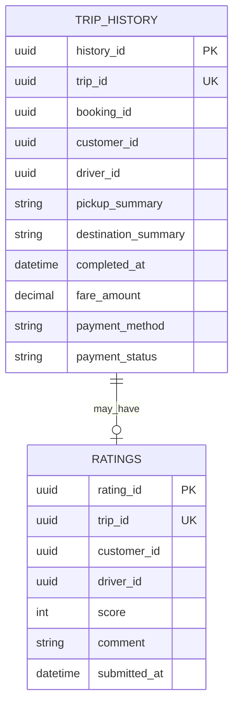

`TRIP_HISTORY` là read-oriented projection, nên các ID/amount/payment fields ở đây là **snapshot**, không phải ownership thay thế Trip hoặc Payment.

---

# 56. BC11 / operations-service

## 56.1. BC này làm gì?

Cung cấp capability cho nhân viên vận hành: xem tình trạng customer/driver/trip/payment thông qua API của các context hoặc read projection, đồng thời quản lý incident và operational intervention.

**Operations không trở thành owner của Customer/Driver/Trip/Payment.** Nó chỉ sở hữu “operational case/action”.

## 56.2. FR / UC / Business Process

| Nhóm | Mapping |
|---|---|
| FR | FR-OM-01 → FR-OM-07 |
| UC | UC15, UC16, UC17, UC18 và hỗ trợ UC13/14 |
| Business Process | **BP07**; hỗ trợ **BP06** |
| Rules | BRL19 và operational policy |

## 56.3. Ubiquitous Language

`OperationalCase`, `Incident`, `Severity`, `Intervention`, `OperationalAction`, `Escalation`, `Resolution`, `CaseStatus`.

## 56.4. API

| Method | Endpoint | Mục đích |
|---|---|---|
| GET | `/api/v1/operations/trips/active` | Theo dõi trip đang diễn ra |
| GET | `/api/v1/operations/drivers/status` | Theo dõi trạng thái driver |
| GET | `/api/v1/operations/customers/{customerId}` | Tra cứu customer qua service API/read model |
| GET | `/api/v1/operations/transactions` | Tra cứu transaction |
| POST | `/api/v1/operations/incidents` | Tạo incident |
| GET | `/api/v1/operations/incidents/{incidentId}` | Xem incident |
| PATCH | `/api/v1/operations/incidents/{incidentId}` | Cập nhật xử lý |
| POST | `/api/v1/operations/incidents/{incidentId}/actions` | Thực hiện intervention |
| GET | `/api/v1/operations/actions` | Lịch sử operational action |

### Events

`IncidentCreated`, `IncidentResolved`, `OperationalActionExecuted`.

### ERD

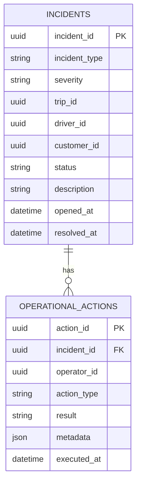

Các `trip_id`, `driver_id`, `customer_id`, `operator_id` là external reference. `operator_id` là identity từ `identity-service`.

---

# 57. BC12 / reporting-service

## 57.1. BC này làm gì?

Xây dựng read model/reporting model từ integration events để phục vụ KPI và báo cáo kinh doanh. Reporting **không được đọc trực tiếp domain database** của Booking/Trip/Payment.

## 57.2. FR / UC / Business Process

| Nhóm | Mapping |
|---|---|
| FR | FR-RP-01 → FR-RP-05 |
| UC | UC19 |
| Business Process | **BP08** |
| Rules | BRL17 và reporting consistency policy |

SRS yêu cầu báo cáo về số lượng chuyến, doanh thu, completion rate, cancellation rate và driver performance. citeturn472349view0

## 57.3. Ubiquitous Language

`TripFact`, `PaymentFact`, `DriverPerformance`, `RevenueMetric`, `CompletionRate`, `CancellationRate`, `ReportingPeriod`, `DailyMetric`.

## 57.4. API

| Method | Endpoint | Mục đích |
|---|---|---|
| GET | `/api/v1/reports/trips` | Báo cáo số lượng chuyến |
| GET | `/api/v1/reports/revenue` | Báo cáo doanh thu |
| GET | `/api/v1/reports/completion-rate` | Tỷ lệ hoàn thành |
| GET | `/api/v1/reports/cancellation-rate` | Tỷ lệ hủy |
| GET | `/api/v1/reports/driver-performance` | Hiệu quả driver |
| GET | `/api/v1/reports/dashboard-summary` | Dashboard summary |

### Event consumers

`BookingCreated`, `BookingStatusChanged`, `DriverCreated`, `TripCompleted`, `TripStateChanged`, `PaymentSucceeded`, `PaymentFailed`, `RatingSubmitted`.

## 57.5. Database

**DB:** `reporting_db` – PostgreSQL read model. Khi volume tăng, có thể chuyển phần analytical storage sang ClickHouse/DWH mà không thay đổi domain services upstream.

### ERD

```mermaid
erDiagram
    REPORT_TRIP_FACT ||--o{ REPORT_DAILY_METRICS : contributes
    REPORT_PAYMENT_FACT ||--o{ REPORT_DAILY_METRICS : contributes
    REPORT_DRIVER_FACT ||--o{ REPORT_DAILY_METRICS : contributes

    REPORT_TRIP_FACT {
        uuid trip_id PK
        uuid driver_id
        uuid customer_id
        string status
        date trip_date
        decimal fare_amount
    }
    REPORT_PAYMENT_FACT {
        uuid payment_id PK
        uuid trip_id
        decimal amount
        string method
        string status
        date payment_date
    }
    REPORT_DRIVER_FACT {
        uuid driver_id PK
        int completed_trips
        int rejected_offers
        int cancelled_trips
        decimal average_rating
        decimal completion_rate
    }
    REPORT_DAILY_METRICS {
        date metric_date PK
        int trip_count
        decimal revenue
        decimal completion_rate
        decimal cancellation_rate
    }
```

---

# 58. BC13 / audit-service

## 58.1. BC này làm gì?

Ghi lại các **critical auditable actions** để truy vết bảo mật, vận hành và quản trị. Audit không quyết định business state.

## 58.2. FR / UC / Business Process

| Nhóm | Mapping |
|---|---|
| FR | FR-AC-04 |
| UC | UC22 |
| Business Process | **BP10** |
| Rules | BRL19 |

## 58.3. Ubiquitous Language

`AuditEvent`, `Actor`, `Action`, `Target`, `CorrelationId`, `Timestamp`, `Outcome`, `SourceService`.

## 58.4. API

| Method | Endpoint | Mục đích |
|---|---|---|
| POST | `/internal/audit-events` | Ghi audit event từ service |
| GET | `/api/v1/audit-logs` | Tra cứu log |
| GET | `/api/v1/audit-logs/{id}` | Chi tiết audit |
| GET | `/api/v1/audit-logs?actorId=...` | Lọc theo actor |
| GET | `/api/v1/audit-logs?targetId=...` | Lọc theo target |

## 58.5. Database

**DB:** `audit_db` – PostgreSQL, ưu tiên append-only và retention policy.

### ERD

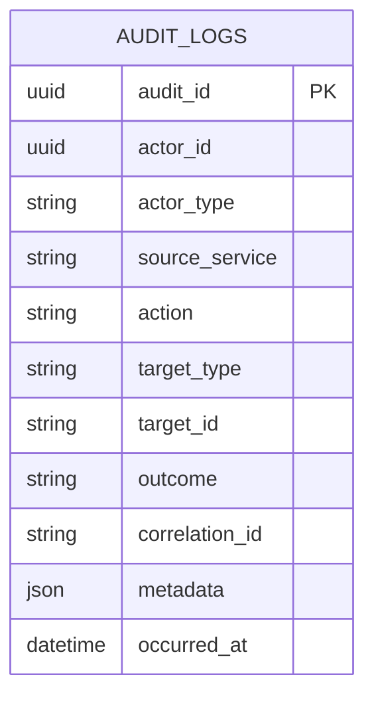

Audit event phải chứa đủ `actor + action + target + outcome + timestamp + correlationId` để phục vụ trace cross-service.

---

# 59. API Contract Map giữa các Microservice

## 59.1. Client-facing API

```text
/api/v1/auth/*
/api/v1/customers/*
/api/v1/drivers/*
/api/v1/vehicles/*
/api/v1/bookings/*
/api/v1/dispatch/*
/api/v1/trips/*
/api/v1/pricing/*
/api/v1/payments/*
/api/v1/notifications/*
/api/v1/trip-history/*
/api/v1/ratings/*
/api/v1/operations/*
/api/v1/reports/*
/api/v1/audit-logs/*
```

API Gateway chịu trách nhiệm routing, authentication token validation, rate limiting, correlation ID và request-level observability. Domain authorization vẫn do context/service policy quyết định.

## 59.2. Cross-service Contract

| Producer | Event | Consumer chính | Business meaning |
|---|---|---|---|
| Identity | `AccountRegistered` | Customer, Audit | Identity mới được tạo |
| Customer | `CustomerProfileCreated` | Booking, Audit | Customer business profile sẵn sàng |
| Driver/Fleet | `DriverAvailabilityChanged` | Dispatch, Operations, Reporting | Availability thay đổi |
| Driver/Fleet | `DriverLocationUpdated` | Dispatch, Trip, Operations | Location snapshot mới |
| Booking | `BookingReadyForDispatch` | Dispatch | Booking đủ điều kiện tìm driver |
| Dispatch | `DriverOfferSent` | Notification | Có offer mới cho driver |
| Dispatch | `AssignmentConfirmed` | Booking, Trip, Notification | Driver được xác nhận |
| Dispatch | `NoDriverFound` | Booking, Notification | Không tìm được driver |
| Trip | `TripStateChanged` | Notification, Reporting, Operations | Trip state thay đổi |
| Trip | `TripCompleted` | Pricing, Feedback/History, Reporting, Notification | Trip hoàn tất |
| Pricing | `FareFinalized` | Payment, Feedback/History, Reporting | Fare cuối đã xác định |
| Payment | `PaymentSucceeded` | Notification, Feedback/History, Reporting | Payment thành công |
| Payment | `PaymentFailed` | Notification, Operations, Reporting | Payment thất bại |
| Feedback/History | `RatingSubmitted` | Reporting, Audit | Rating mới |
| Operations | `OperationalActionExecuted` | Audit | Critical operational action |

---

# 60. Database-per-Microservice Rules

## 60.1. Ownership

```text
identity-service          → identity_db
customer-service          → customer_db
driver-fleet-service      → driver_fleet_db
booking-service           → booking_db
dispatch-service          → dispatch_db
trip-service              → trip_db
pricing-service           → pricing_db
payment-service           → payment_db
notification-service      → notification_db
feedback-history-service  → feedback_history_db
operations-service        → operations_db
reporting-service         → reporting_db
audit-service             → audit_db
```

## 60.2. Không được phép

```text
booking-service ──X──> SELECT * FROM customer_db.customer_profiles
trip-service ──────X──> SELECT * FROM dispatch_db.assignments
payment-service ───X──> JOIN pricing_db.fares
reporting-service ─X──> SELECT trực tiếp trip_db.trips
```

## 60.3. Cách làm đúng

```text
Booking → customerId
Booking → BookingReadyForDispatch event
Dispatch → driverId
Dispatch → AssignmentConfirmed event
Trip → TripCompleted event
Pricing → FareFinalized event
Payment → PaymentSucceeded/Failed event
```

Cross-service reference là **ID/DTO/Event**, không phải cross-database entity.

---

# 61. ERD tổng hợp theo từng Database Ownership Boundary

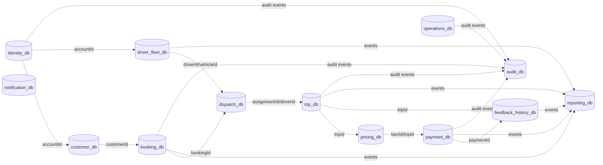

Các mũi tên nét đứt trong sơ đồ là **reference/event dependency**, không phải database foreign key.

---

# 62. Mapping chi tiết BC → FR → UC → Business Process → API → Database

| BC | FR | UC | BP | Microservice | DB | API core |
|---|---|---|---|---|---|---|
| BC01 Identity | AC-01..03 | UC02, UC21 | BP01, BP10 | identity-service | identity_db | `/auth/*`, `/accounts/*`, `/roles/*` |
| BC02 Customer | CM-01,03,04 | UC01,03,18 | BP01, BP05 | customer-service | customer_db | `/customers/*` |
| BC03 Driver/Fleet | DM-01..04 | UC13,14 | BP02, BP03, BP06, BP07 | driver-fleet-service | driver_fleet_db | `/drivers/*`, `/vehicles/*` |
| BC04 Booking | BK-01..05 | UC04 | BP02 | booking-service | booking_db | `/bookings/*` |
| BC05 Dispatch | MA-01..06 | UC05,06 | BP02 | dispatch-service | dispatch_db | `/dispatch/*` |
| BC06 Trip | TR-01..05 | UC07,08 | BP03 | trip-service | trip_db | `/trips/*` |
| BC07 Pricing | PM-01 | UC09 | BP04 | pricing-service | pricing_db | `/pricing/*`, `/fares/*` |
| BC08 Payment | PM-02..06 | UC10,17 | BP04, BP07 | payment-service | payment_db | `/payments/*`, `/transactions/*` |
| BC09 Notification | NT-01..06 | UC20 | BP02..04, BP09 | notification-service | notification_db | `/notifications/*` |
| BC10 Feedback/History | RH-01..03 | UC11,12 | BP05 | feedback-history-service | feedback_history_db | `/trip-history/*`, `/ratings/*` |
| BC11 Operations | OM-01..07 | UC15,16,17,18 | BP06, BP07 | operations-service | operations_db | `/operations/*` |
| BC12 Reporting | RP-01..05 | UC19 | BP08 | reporting-service | reporting_db | `/reports/*` |
| BC13 Audit | AC-04 | UC22 | BP10 | audit-service | audit_db | `/audit-logs/*` |

FR IDs trong bảng được lấy từ Component Functional Requirements của SRS. citeturn472349view0

---

# 63. Một Core Workflow được triển khai qua Microservices

## 63.1. BP02 → BP05 end-to-end

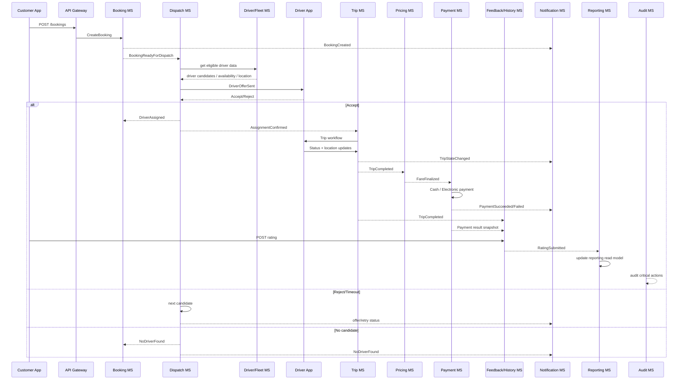

Đây là cách biến **một Business Process thành một chuỗi bounded contexts**, trong đó không có service nào phải biết implementation/database nội bộ của service khác.

---

# 64. API Ownership Matrix

| API Domain | Owner | Không owner |
|---|---|---|
| Authentication / roles | Identity | Customer, Driver |
| Customer profile | Customer | Identity |
| Driver profile / availability | Driver & Fleet | Dispatch |
| Vehicle | Driver & Fleet | Operations |
| Booking state | Booking | Dispatch, Trip |
| Matching / offer | Dispatch | Booking |
| Trip state / location during trip | Trip | Driver & Fleet |
| Fare calculation | Pricing | Payment |
| Transaction/payment state | Payment | Pricing |
| Notification delivery | Notification | Booking/Trip/Payment |
| Rating | Feedback/History | Trip |
| Trip history projection | Feedback/History | Booking/Trip |
| Operational case/action | Operations | Domain contexts |
| Business reports | Reporting | Transactional services |
| Audit log | Audit | All business contexts |

---

# 65. Transaction Boundary trong Microservice Architecture

## 65.1. Local transaction

Mỗi aggregate phải được commit atomically trong database của service:

```text
Booking creation
    = validate + create Booking + write status history
    → 1 local transaction
```

```text
Assignment confirmation
    = confirm assignment + invalidate competing offers
    → 1 local transaction
```

```text
Trip status update
    = validate transition + update trip + write timeline
    → 1 local transaction
```

```text
Payment result
    = update payment + append transaction record
    → 1 local transaction
```

## 65.2. Cross-service transaction

Không dùng distributed SQL transaction để bao trùm toàn bộ ride flow.

Dùng:

```text
Outbox → Event Bus → Consumer → Inbox/Idempotency → Local Transaction
```

Ví dụ:

```text
TripCompleted
      ↓
trip-service Outbox
      ↓
Event Bus
      ↓
pricing-service
      ↓
FareFinalized
      ↓
payment-service
```

---

# 66. Outbox / Idempotency cho các Microservice

Để tránh mất event khi DB commit nhưng message chưa gửi:

```text
Business transaction
       ↓
aggregate update
       +
outbox_event INSERT
       ↓
COMMIT
       ↓
Outbox Publisher
       ↓
Event Bus
```

Mỗi consumer nên có `processed_events` hoặc cơ chế idempotency key:

```text
eventId + consumerName = UNIQUE
```

Điều này đặc biệt quan trọng với:

- Booking → Dispatch
- Dispatch → Trip
- Trip → Pricing
- Pricing → Payment
- Payment → Notification
- Trip/Payment/Rating → Reporting
- All critical actions → Audit

---

# 67. API Gateway và Security Boundary

```mermaid
flowchart LR
    APP[Client] --> GW[API Gateway]
    GW --> AUTH[Identity MS]
    GW --> BK[Booking MS]
    GW --> DS[Dispatch MS]
    GW --> TR[Trip MS]
    GW --> OP[Operations MS]
    GW --> RP[Reporting MS]

    AUTH -. token/JWT .-> GW
    GW -. authenticated subject .-> BK
    GW -. authenticated subject .-> DS
    GW -. authenticated subject .-> TR
    GW -. role checked .-> OP
    GW -. role checked .-> RP
```

### Rule

- Gateway xác thực request.
- Service không tin `customerId`/`driverId` do client tự gửi nếu identity context đã xác định subject.
- Business authorization được kiểm tra theo role/resource ownership.
- Audit các action quan trọng phải có `correlationId`.

---

# 68. ERD Checklist cho từng Microservice

| Service | Có DB riêng | Cross-service FK | Aggregate chính | Read Model |
|---|---:|---:|---|---:|
| identity-service | ✓ | ✗ | Account | Không bắt buộc |
| customer-service | ✓ | ✗ | Customer | Có thể có summary |
| driver-fleet-service | ✓ | ✗ | Driver, Vehicle | Driver availability view |
| booking-service | ✓ | ✗ | Booking | Booking status view |
| dispatch-service | ✓ | ✗ | Assignment | Candidate/offer view |
| trip-service | ✓ | ✗ | Trip | Live tracking view |
| pricing-service | ✓ | ✗ | Fare | Fare summary |
| payment-service | ✓ | ✗ | Payment | Transaction query |
| notification-service | ✓ | ✗ | Notification | Delivery status |
| feedback-history-service | ✓ | ✗ | Rating / History projection | ✓ |
| operations-service | ✓ | ✗ | OperationalCase | ✓ |
| reporting-service | ✓ | ✗ | Reporting facts/metrics | ✓ |
| audit-service | ✓ | ✗ | AuditLog | ✓ |

---

# 69. Folder Structure đề xuất cho 13 Microservices

```text
cab-system/
├── api-gateway/
├── services/
│   ├── identity-service/
│   ├── customer-service/
│   ├── driver-fleet-service/
│   ├── booking-service/
│   ├── dispatch-service/
│   ├── trip-service/
│   ├── pricing-service/
│   ├── payment-service/
│   ├── notification-service/
│   ├── feedback-history-service/
│   ├── operations-service/
│   ├── reporting-service/
│   └── audit-service/
├── contracts/
│   ├── events/
│   └── api/
└── infrastructure/
    ├── docker-compose.yml
    ├── kafka-or-rabbitmq/
    ├── postgres/
    └── observability/
```

Mỗi service:

```text
service-name/
├── src/
│   ├── domain/
│   │   ├── entities/
│   │   ├── value-objects/
│   │   ├── aggregates/
│   │   ├── services/
│   │   ├── events/
│   │   └── repositories/
│   ├── application/
│   │   ├── commands/
│   │   ├── queries/
│   │   └── handlers/
│   ├── infrastructure/
│   │   ├── persistence/
│   │   ├── messaging/
│   │   └── external/
│   └── interfaces/
│       ├── http/
│       └── consumers/
├── migrations/
├── tests/
└── Dockerfile
```

---

# 70. Microservice-to-Bounded-Context Ubiquitous Language Rule

Một số từ có thể xuất hiện ở nhiều service nhưng **không mang cùng một meaning**:

| Term | Booking | Dispatch | Trip | Payment | History |
|---|---|---|---|---|---|
| `Driver` | driver được yêu cầu/phân công | candidate/assigned driver | assigned trip driver | không thuộc model | historical driver snapshot |
| `Status` | BookingStatus | Assignment/OfferStatus | TripState | PaymentStatus | historical status |
| `Amount` | không sở hữu | không sở hữu | không sở hữu fare final | PaymentAmount | fare/payment snapshot |
| `Location` | pickup/destination | candidate driver location | live trip location | không dùng | historical route summary |
| `Completed` | booking lifecycle state | assignment finished | TripCompleted | PaymentSucceeded là khái niệm riêng | completed trip record |

Đây là lý do không tạo một `shared-domain-model` chứa tất cả entity.

---

# 71. Những BC nào là Core trong Microservice Architecture?

```text
                 CAB CORE
                    │
        ┌───────────┼───────────┐
        ↓           ↓           ↓
   Booking      Dispatch       Trip
      MS            MS          MS
        │           │           │
        └────── Ride Fulfillment ──────┘
                    │
       ┌────────────┼────────────┐
       ↓            ↓            ↓
   Pricing       Payment     Feedback/History
```

### Core Domain invariants

**Booking:** request phải đầy đủ trước khi dispatch.

**Dispatch:** một booking tối đa một confirmed assignment; reject/timeout thì tiếp tục flow theo policy.

**Trip:** state transition phải hợp lệ và chỉ assigned driver được cập nhật.

**Pricing:** final fare chỉ sau `TripCompleted`.

**Payment:** transaction phải có trạng thái hợp lệ; electronic payment cần provider result.

**Feedback:** rating chỉ sau trip completion.

Các rule này tương ứng với BRL01–BRL17 trong SRS. citeturn472349view0

---

# 72. Kết luận phần Microservice Design

Kiến trúc đích của CAB System có thể được biểu diễn ngắn gọn như sau:

```text
                    ┌─────────────────┐
                    │   API Gateway   │
                    └────────┬────────┘
                             │
        ┌────────────────────┼─────────────────────┐
        │                    CORE                   │
        ↓                     ↓                     ↓
  Booking MS            Dispatch MS              Trip MS
        │                    │                     │
        └────────────────────┼─────────────────────┘
                             │
             ┌───────────────┼────────────────┐
             ↓               ↓                ↓
        Pricing MS       Payment MS      Notification MS
             │               │                │
             └───────┬───────┘                │
                     ↓                        ↓
              Feedback/History MS       Reporting MS
                     │
        ┌────────────┴──────────────┐
        ↓                           ↓
 Driver/Fleet MS              Operations MS
        │                           │
        └──────────┬────────────────┘
                   ↓
             Audit MS

Mỗi MS = 1 BC = 1 domain model = 1 DB ownership boundary
```

### Thiết kế này giải quyết trực tiếp các mục tiêu trong SRS

- Tách rõ booking, matching và trip để bảo vệ core domain.
- Giảm coupling giữa fare và payment.
- Cho phép thay provider payment/notification thông qua adapter.
- Reporting không ảnh hưởng transaction database.
- Audit độc lập và append-oriented.
- Có thể scale Dispatch/Trip/Notification độc lập khi tải tăng.
- Open Business Rule của matching được giữ ở `MatchingPolicy`, không hard-code tiêu chí chưa được doanh nghiệp xác nhận. citeturn956313view1

---

# 73. Traceability Source

Thiết kế ở các section 44–72 được xây dựng từ repository public:

**Repository:** `https://github.com/toru12030-netizen/23732061_MaiQuocHung_CabSystem`

**SRS:** `https://raw.githubusercontent.com/toru12030-netizen/23732061_MaiQuocHung_CabSystem/main/srs.md`

Các phần SRS đã dùng trực tiếp để trace:

- Business Context / Stakeholder / Scope
- Business Process
- Component Functional Requirements FR-CM, FR-BK, FR-DM, FR-MA, FR-TR, FR-PM, FR-NT, FR-RH, FR-OM, FR-RP, FR-AC
- Business Rules BRL01–BRL20
- Exceptions
- Use Cases UC01–UC22
- Trip lifecycle và core ride flow

Repository hiện public và chứa `srs.md` cùng các tài liệu/project files liên quan. citeturn956313view0turn956313view1
