# CAB System – DDD Bounded Context & Microservices (Bản rút gọn)

> **Mục tiêu:** Tóm gọn thiết kế DDD của CAB System thành tài liệu có thể dùng trực tiếp cho thiết kế Microservices. Mỗi Bounded Context (BC) có ngôn ngữ nghiệp vụ riêng, aggregate riêng, microservice riêng và database riêng.
>
> **Nguồn:** thiết kế hiện tại dựa trên `srs.md` của repository; giữ nguyên mapping FR/UC/BP, API, database và ERD đã xây dựng, nhưng loại bỏ các phần diễn giải lặp.

## 1. Kiến trúc tổng thể

### 1.1. Bounded Context

| BC | Bounded Context | Nhóm | Microservice | Vai trò |
|---|---|---|---|---|
| BC01 | Identity & Access | Generic | `identity-service` | Account, authentication, role, permission |
| BC02 | Customer Profile | Supporting | `customer-service` | Hồ sơ khách hàng |
| BC03 | Driver & Fleet | Supporting | `driver-fleet-service` | Driver, vehicle, availability, location |
| BC04 | Booking | **Core** | `booking-service` | Yêu cầu đặt xe & lifecycle |
| BC05 | Dispatch & Matching | **Core** | `dispatch-service` | Candidate, offer, assignment |
| BC06 | Trip Execution & Tracking | **Core** | `trip-service` | Thực hiện trip & tracking |
| BC07 | Pricing & Fare | Supporting | `pricing-service` | Tính/finalize fare |
| BC08 | Payment | Supporting | `payment-service` | Thanh toán & provider |
| BC09 | Notification | Supporting | `notification-service` | Gửi thông báo |
| BC10 | Feedback & Trip History | Supporting | `feedback-history-service` | Rating & history projection |
| BC11 | Operations | Supporting | `operations-service` | Incident & operator intervention |
| BC12 | Reporting & Monitoring | Supporting | `reporting-service` | KPI, report, dashboard |
| BC13 | Audit Trail | Generic | `audit-service` | Audit append-only |

### 1.2. Business Process / Workflow chính

```text
BP01 Registration/Profile
       ↓
BP02 Booking & Driver Assignment
       ├── Booking
       └── Dispatch & Matching
             ↓
BP03 Trip Execution & Tracking
       ↓
BP04 Fare & Payment
       ├── Pricing & Fare
       └── Payment
       ↓
BP05 Rating & Trip History

Song song:
BP06 Driver & Fleet Administration
BP07 Operations Monitoring & Incident Handling
BP08 Reporting & Business Monitoring
BP09 Notification Delivery
BP10 Access Control & Audit
```

### 1.3. Nguyên tắc DDD → Microservices

- **Một BC = một domain model riêng; một Microservice sở hữu BC đó.**
- **Database-per-Microservice:** service khác chỉ giữ ID/reference hoặc projection, không truy cập DB trực tiếp.
- `Customer`, `Driver`, `Booking`, `Trip`, `Payment` không phải shared entity toàn hệ thống; ý nghĩa được định nghĩa lại theo từng context.
- Giao tiếp giữa service bằng REST/command hoặc Integration Event; Domain Event chỉ là nội bộ BC.
- Với workflow nhiều service: ưu tiên **event-driven + Saga/Process Manager + Outbox + Idempotency** thay cho distributed transaction.
- `Dispatch & Matching` giữ matching policy; SRS chưa chốt tiêu chí ưu tiên driver nên policy phải cấu hình/mở rộng, không hard-code.

### 1.4. Quan hệ context ở mức tối giản

```text
Identity → Customer / Driver / Operator
Customer → Booking
Driver & Fleet → Dispatch
Booking → Dispatch
Dispatch → Trip
Trip → Pricing → Payment
Trip → Feedback & History
Booking / Dispatch / Trip / Payment → Notification
Tất cả critical events → Audit
Trip / Payment / Driver / Booking / Rating events → Reporting
Operations đọc projection và gửi command tới domain owner
```

---

## 2. Template áp dụng cho từng BC

Mỗi BC bên dưới luôn theo đúng thứ tự: **Mục đích của BC → FR liên quan → Workflow → Ubiquitous Language → Aggregate → Microservice → API chính → Database → ERD → Database type → Giải thích về lý do kỹ thuật → Domain Events**.

# BC01 – Identity & Access / `identity-service`

## 1. Mục đích của BC

Quản lý technical identity, authentication, authorization, role và permission. BC này xác định “ai đang gọi” và “được phép làm gì”, nhưng không sở hữu Customer Profile hay Driver Profile.

## 2. FR liên quan

| Thành phần | Mapping |
|---|---|
| **Functional Requirements** | FR-AC-01 → FR-AC-03; hỗ trợ FR-CM-02 |
| **Use Cases** | UC02, UC21 |
| **Business Process / Workflow** | BP01 – Customer Registration & Profile; BP10 – Access Control & Audit |

## 3. Workflow

Đăng ký account → xác thực credentials → cấp token/session → xác định Subject/Role → authorize request → phát hành security event/audit event.

## 4. Ubiquitous Language

`Account`, `Credential`, `Subject`, `Role`, `Permission`, `Token`, `Session`, `Authorization`, `AccountStatus`.

## 5. Aggregate

**Account Aggregate** – Root: `Account`. Thành phần: Credential, AccountStatus, Roles. Invariant: account inactive không được authenticate; role/permission chỉ thay đổi qua command được authorize.

## 6. Microservice

`identity-service` – deployable độc lập, stateless ở API layer; persistence thuộc `identity_db`. API Gateway có thể xác minh JWT tại edge nhưng service vẫn là source of truth cho account/role.

**Service name:** `identity-service`


## 7. API chính

| Method | Endpoint | Mục đích |
|---|---|---|
| POST | `/api/v1/auth/register` | Đăng ký account |
| POST | `/api/v1/auth/login` | Đăng nhập/cấp token |
| POST | `/api/v1/auth/refresh` | Refresh token |
| GET | `/api/v1/auth/me` | Lấy subject hiện tại |
| GET | `/api/v1/accounts/{id}` | Tra cứu account |
| PUT | `/api/v1/accounts/{id}/roles` | Gán role |

## 8. Database

`identity_db` – tài khoản, role, permission, refresh token; không tạo FK sang customer/driver service.

## 9. ERD

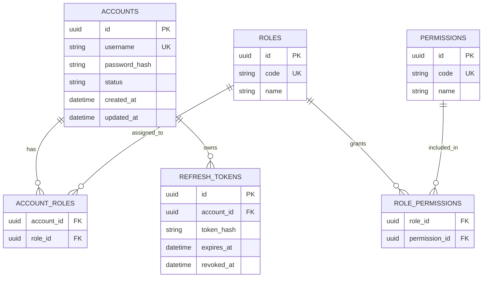

## 10. Database type

Primary: **PostgreSQL (OLTP)**. Có thể dùng Redis cho short-lived session/token deny-list nếu cần, nhưng Redis không sở hữu identity data.

## 11. Giải thích về lý do kỹ thuật

Identity có quan hệ nhiều-nhiều giữa account–role–permission, cần transaction/unique constraint và consistency cao. PostgreSQL phù hợp cho ACID, index và auditability. JWT nên được xác thực stateless; refresh token vẫn cần persistence/revocation.

## 12. Domain Events

`AccountRegistered`, `AccountAuthenticated`, `RoleChanged`, `AccountDeactivated`.

# BC02 – Customer Profile / `customer-service`

## 1. Mục đích của BC

Quản lý business profile của khách hàng: thông tin cá nhân, contact information và trạng thái hồ sơ. Authentication thuộc Identity & Access.

## 2. FR liên quan

| Thành phần | Mapping |
|---|---|
| **Functional Requirements** | FR-CM-01, FR-CM-03, FR-CM-04 |
| **Use Cases** | UC01, UC03, UC18 |
| **Business Process / Workflow** | BP01 – Customer Registration & Profile; hỗ trợ BP05 – Rating & Trip History |

## 3. Workflow

Account đăng ký → tạo Customer Profile → cập nhật contact/profile → customer dùng `CustomerId` khi tạo Booking → Operations tra cứu profile.

## 4. Ubiquitous Language

`Customer`, `CustomerProfile`, `ContactInfo`, `CustomerStatus`, `CustomerId`.

## 5. Aggregate

**Customer Aggregate** – Root: `CustomerProfile`. Invariant: profile có identity ổn định; cập nhật profile phải được authorize; không nhúng Booking/Payment/Trip vào aggregate.

## 6. Microservice

`customer-service` – API/application layer độc lập, sở hữu hoàn toàn customer profile data. Các service khác chỉ giữ `CustomerId` hoặc nhận projection cần thiết.

**Service name:** `customer-service`


## 7. API chính

| Method | Endpoint | Mục đích |
|---|---|---|
| POST | `/api/v1/customers` | Tạo customer profile |
| GET | `/api/v1/customers/{customerId}` | Xem profile |
| PUT | `/api/v1/customers/{customerId}` | Cập nhật profile |
| PATCH | `/api/v1/customers/{customerId}/status` | Cập nhật trạng thái |
| GET | `/api/v1/customers/{customerId}/summary` | Customer summary |

## 8. Database

`customer_db` – `customer_profiles`, `customer_contacts`; `account_id` là external reference tới Identity.

## 9. ERD

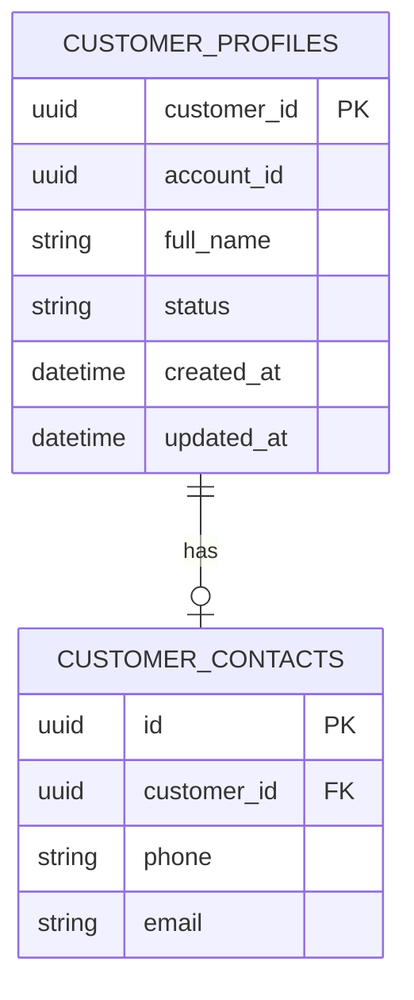

## 10. Database type

Primary: **PostgreSQL (OLTP)**.

## 11. Giải thích về lý do kỹ thuật

Profile có cấu trúc rõ, transaction đơn giản và yêu cầu uniqueness/index theo contact. Relational DB giúp enforce constraint mà không cần distributed transaction.

## 12. Domain Events

`CustomerProfileCreated`, `CustomerProfileUpdated`, `CustomerDeactivated`.

# BC03 – Driver & Fleet / `driver-fleet-service`

## 1. Mục đích của BC

Quản lý hồ sơ tài xế, phương tiện, availability và vị trí hiện tại ở góc nhìn fleet. Đây là nguồn dữ liệu authoritative cho “driver có sẵn sàng nhận chuyến hay không?”.

## 2. FR liên quan

| Thành phần | Mapping |
|---|---|
| **Functional Requirements** | FR-DM-01 → FR-DM-04 |
| **Use Cases** | UC13, UC14 |
| **Business Process / Workflow** | BP06 – Driver & Fleet Administration; cung cấp dữ liệu cho BP02, BP03, BP07 |

## 3. Workflow

Tạo/duyệt driver → đăng ký vehicle → driver chuyển Ready/Unavailable → cập nhật live location → Dispatch lấy candidate snapshot → Operations giám sát.

## 4. Ubiquitous Language

`Driver`, `DriverProfile`, `Availability`, `Ready`, `Unavailable`, `Vehicle`, `VehicleType`, `LiveLocationSnapshot`, `Fleet`.

## 5. Aggregate

**Driver Aggregate** và **Vehicle Aggregate**. Driver bảo vệ availability/profile; Vehicle bảo vệ plate/type/status. Không dùng Driver entity trực tiếp trong Dispatch.

## 6. Microservice

`driver-fleet-service` – authoritative service cho driver/vehicle. Live location có thể tách đường ghi tốc độ cao khỏi transactional profile path.

**Service name:** `driver-fleet-service`


## 7. API chính

| Method | Endpoint | Mục đích |
|---|---|---|
| POST | `/api/v1/drivers` | Tạo driver |
| GET | `/api/v1/drivers/{driverId}` | Xem driver |
| PUT | `/api/v1/drivers/{driverId}` | Cập nhật driver |
| GET | `/api/v1/drivers` | Tra cứu/lọc driver |
| PATCH | `/api/v1/drivers/{driverId}/availability` | Ready/Unavailable |
| POST | `/api/v1/drivers/{driverId}/vehicles` | Thêm vehicle |
| GET | `/api/v1/drivers/{driverId}/vehicles` | Danh sách vehicle |
| PUT | `/api/v1/vehicles/{vehicleId}` | Cập nhật vehicle |
| PATCH | `/api/v1/drivers/{driverId}/location` | Cập nhật location |

## 8. Database

`driver_fleet_db` – PostgreSQL cho driver/vehicle/availability; Redis có thể làm geo/cache layer cho location, nhưng PostgreSQL vẫn giữ business ownership.

## 9. ERD

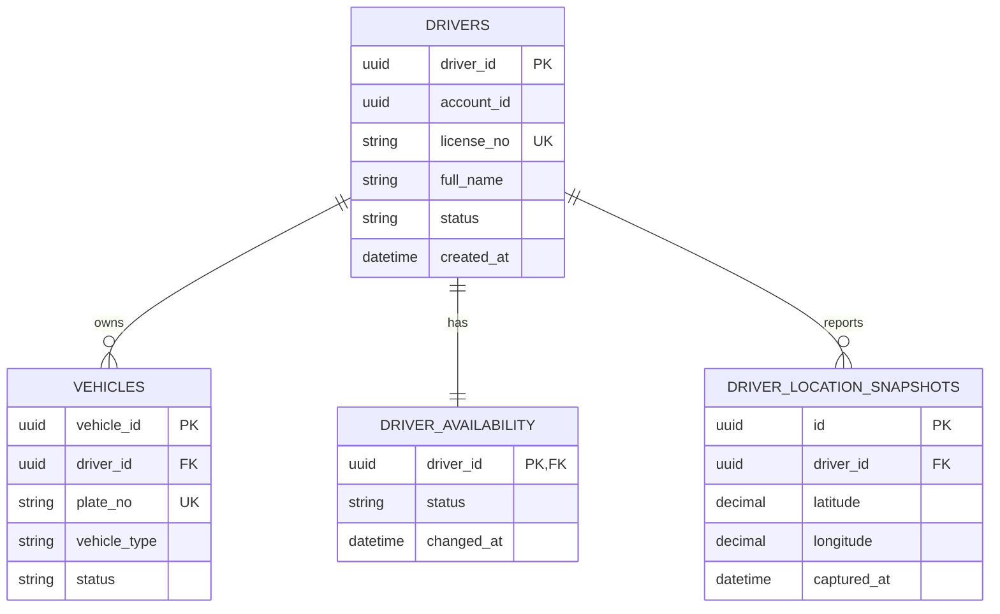

## 10. Database type

Primary: **PostgreSQL**; auxiliary: **Redis GEO/TTL** cho live location/availability cache nếu tải cao.

## 11. Giải thích về lý do kỹ thuật

Driver/Vehicle có quan hệ relational và invariant (license/plate uniqueness) nên cần OLTP. Location thay đổi với tần suất rất cao, nên Redis GEO/TTL giúp giảm write pressure; dữ liệu operational hiện thời vẫn phải có nguồn authoritative rõ ràng.

## 12. Domain Events

`DriverCreated`, `DriverAvailabilityChanged`, `VehicleRegistered`, `VehicleStatusChanged`, `DriverLocationUpdated`.

# BC04 – Booking / `booking-service`

## 1. Mục đích của BC

Core Domain tạo và quản lý yêu cầu đặt xe từ lúc khách gửi pickup/destination/vehicle type đến khi booking được dispatch, assigned, cancelled, completed hoặc no-driver-found.

## 2. FR liên quan

| Thành phần | Mapping |
|---|---|
| **Functional Requirements** | FR-BK-01 → FR-BK-05 |
| **Use Cases** | UC04 |
| **Business Process / Workflow** | BP02 – Booking & Driver Assignment |

## 3. Workflow

Validate request → tạo Booking → `SearchingDriver` → phát `BookingReadyForDispatch` → nhận `DriverAssigned`/`NoDriverFound` → cập nhật booking lifecycle → phản ánh completion/cancellation.

## 4. Ubiquitous Language

`Booking`, `BookingRequest`, `PickupLocation`, `Destination`, `VehicleType`, `BookingStatus`, `SearchingDriver`, `DriverAssigned`, `NoDriverFound`, `Cancelled`, `Completed`.

## 5. Aggregate

**Booking Aggregate** – Root: `Booking`. Invariant: pickup + destination + vehicle type hợp lệ; state transition hợp lệ; không xác nhận assignment kép trong cùng booking.

## 6. Microservice

`booking-service` – Core microservice, source of truth cho booking lifecycle. Không chọn driver, không tính fare, không xử lý payment.

**Service name:** `booking-service`


## 7. API chính

| Method | Endpoint | Mục đích |
|---|---|---|
| POST | `/api/v1/bookings` | Tạo booking |
| GET | `/api/v1/bookings/{bookingId}` | Xem booking |
| GET | `/api/v1/bookings?customerId=...` | Lọc theo customer |
| PATCH | `/api/v1/bookings/{bookingId}/status` | Cập nhật trạng thái hợp lệ |
| POST | `/api/v1/bookings/{bookingId}/cancel` | Hủy booking |
| GET | `/api/v1/bookings/{bookingId}/status` | Theo dõi trạng thái |

## 8. Database

`booking_db` – `bookings`, `booking_status_history`; chỉ lưu `customer_id`/`driver_id`/`trip_id` dưới dạng external references.

## 9. ERD

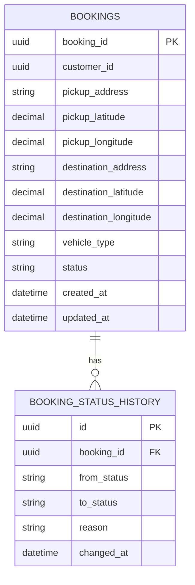

## 10. Database type

Primary: **PostgreSQL (OLTP)**.

## 11. Giải thích về lý do kỹ thuật

Booking là transaction-centric và có state machine cần atomic update + optimistic locking. PostgreSQL hỗ trợ unique/index/transaction tốt và phù hợp với audit trạng thái.

## 12. Domain Events

`BookingCreated`, `BookingReadyForDispatch`, `BookingStatusChanged`, `DriverAssigned`, `NoDriverFound`, `BookingCancelled`, `BookingCompleted`.

# BC05 – Dispatch & Matching / `dispatch-service`

## 1. Mục đích của BC

Core Domain quyết định candidate nào đủ điều kiện, thứ tự ưu tiên, gửi offer, xử lý accept/reject/timeout và xác nhận assignment. Đây là nơi sở hữu matching policy.

## 2. FR liên quan

| Thành phần | Mapping |
|---|---|
| **Functional Requirements** | FR-MA-01 → FR-MA-06 |
| **Use Cases** | UC05, UC06 |
| **Business Process / Workflow** | BP02 – Booking & Driver Assignment |

## 3. Workflow

Nhận dispatch request → lấy candidate snapshot → evaluate eligibility → rank theo MatchingPolicy → gửi DriverOffer → accept/reject/timeout → thử candidate tiếp theo → confirm Assignment hoặc NoMatch.

## 4. Ubiquitous Language

`DispatchRequest`, `CandidateDriver`, `MatchingCriteria`, `Eligibility`, `RankingPolicy`, `DriverOffer`, `DispatchAttempt`, `OfferTimeout`, `Assignment`, `NoMatch`.

## 5. Aggregate

**Dispatch Aggregate** – Root: `DispatchRequest`. Bảo vệ invariant một booking chỉ có một assignment; offer/attempt chuyển state theo policy. `MatchingPolicy` là Domain Service/Strategy.

## 6. Microservice

`dispatch-service` – Core microservice, cần xử lý concurrent offers và idempotent acceptance. Không sở hữu Driver Profile; chỉ giữ candidate snapshot/reference.

**Service name:** `dispatch-service`


## 7. API chính

| Method | Endpoint | Mục đích |
|---|---|---|
| POST | `/api/v1/dispatch` | Bắt đầu dispatch |
| GET | `/api/v1/dispatch/{dispatchId}` | Xem dispatch |
| POST | `/api/v1/dispatch/{dispatchId}/offers` | Tạo driver offer |
| POST | `/api/v1/dispatch/offers/{offerId}/accept` | Accept offer |
| POST | `/api/v1/dispatch/offers/{offerId}/reject` | Reject offer |
| POST | `/api/v1/dispatch/offers/{offerId}/expire` | Expire offer |
| POST | `/api/v1/dispatch/{dispatchId}/reassign` | Thử candidate tiếp theo |

## 8. Database

`dispatch_db` – dispatch_requests, attempts, offers, assignments. Redis có thể giữ candidate set/offer TTL, nhưng assignment authoritative nằm ở PostgreSQL.

## 9. ERD

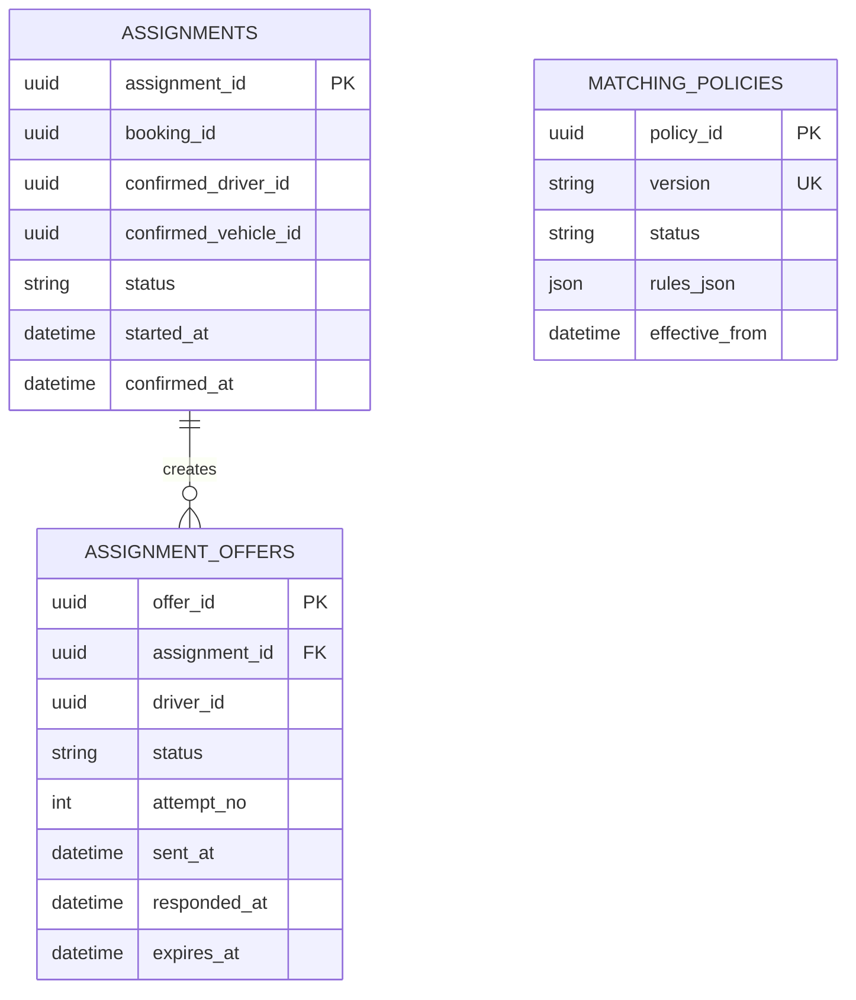

## 10. Database type

Primary: **PostgreSQL**; auxiliary: **Redis** cho ephemeral offer TTL, lock và candidate cache; có thể dùng PostGIS/geo index hoặc location cache tùy quy mô.

## 11. Giải thích về lý do kỹ thuật

Matching có stateful workflow và concurrent race (hai driver accept cùng lúc), nên assignment cần ACID/locking. Redis rất hữu ích cho dữ liệu tạm thời và TTL nhưng không nên là source of truth cho assignment.

## 12. Domain Events

`DispatchStarted`, `DriverCandidateSelected`, `DriverOfferSent`, `DriverOfferAccepted`, `DriverOfferRejected`, `DriverOfferExpired`, `DriverAssigned`, `NoDriverAvailable`.

# BC06 – Trip Execution & Tracking / `trip-service`

## 1. Mục đích của BC

Quản lý chuyến thực tế sau assignment: tạo Trip, state machine Accepted → ArrivedAtPickup → PassengerOnboard → InTransit → Completed và các location samples/incident liên quan.

## 2. FR liên quan

| Thành phần | Mapping |
|---|---|
| **Functional Requirements** | FR-TR-01 → FR-TR-05 |
| **Use Cases** | UC07, UC08 |
| **Business Process / Workflow** | BP03 – Trip Execution & Tracking; hỗ trợ BP07 |

## 3. Workflow

AssignmentConfirmed → tạo Trip → driver tới pickup → xác nhận onboard → bắt đầu trip → gửi location samples → complete → phát `TripCompleted` cho Pricing/History/Reporting.

## 4. Ubiquitous Language

`Trip`, `AssignmentRef`, `TripDriver`, `TripState`, `ArrivedAtPickup`, `PassengerOnboard`, `InTransit`, `Completed`, `TripLocationSample`.

## 5. Aggregate

**Trip Aggregate** – Root: `Trip`. Invariant: chỉ tạo sau AssignmentConfirmed; chỉ assigned driver update state; không bỏ qua state nếu policy không cho phép; completion là tiền đề cho fare.

## 6. Microservice

`trip-service` – Core microservice, authoritative cho trip lifecycle. Location tracking là write-heavy path, có thể tách ingestion nhưng domain ownership vẫn ở Trip BC.

**Service name:** `trip-service`


## 7. API chính

| Method | Endpoint | Mục đích |
|---|---|---|
| POST | `/api/v1/trips/from-assignment` | Tạo trip từ assignment |
| GET | `/api/v1/trips/{tripId}` | Xem trip |
| PATCH | `/api/v1/trips/{tripId}/state` | Chuyển state |
| POST | `/api/v1/trips/{tripId}/locations` | Ghi location sample |
| POST | `/api/v1/trips/{tripId}/complete` | Hoàn thành trip |
| GET | `/api/v1/trips/{tripId}/tracking` | Theo dõi trip |

## 8. Database

`trip_db` – trips, trip_state_history, trip_location_samples/summary. Có thể dùng PostGIS hoặc time-series extension cho location tùy tải.

## 9. ERD

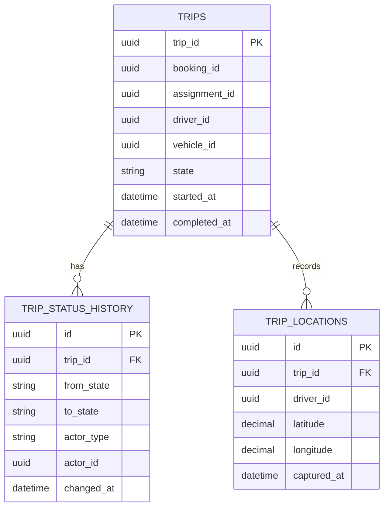

## 10. Database type

Primary: **PostgreSQL + PostGIS** (hoặc PostgreSQL + time-series extension); auxiliary: Redis/stream để buffer location nếu cần.

## 11. Giải thích về lý do kỹ thuật

Trip state transition cần transaction và invariant chặt, nên dùng relational OLTP. Location là time-series/geospatial workload; PostGIS và partitioning giúp truy vấn theo trip/time/location hiệu quả hơn bảng OLTP thuần túy.

## 12. Domain Events

`TripCreated`, `DriverArrivedAtPickup`, `PassengerPickedUp`, `TripStarted`, `TripLocationUpdated`, `TripCompleted`, `TripInterrupted`.

# BC07 – Pricing & Fare / `pricing-service`

## 1. Mục đích của BC

Tính và finalize fare dựa trên trip facts và pricing policy. Công thức chi tiết chưa được coi là hard-coded nếu SRS chưa chốt.

## 2. FR liên quan

| Thành phần | Mapping |
|---|---|
| **Functional Requirements** | FR-PM-01 |
| **Use Cases** | UC09 |
| **Business Process / Workflow** | BP04 – Fare & Payment |

## 3. Workflow

Nhận `TripCompleted` → load PricingPolicy → calculate FareComponents → tạo FareCalculation → validate → `FareFinalized` → Payment consume result.

## 4. Ubiquitous Language

`Fare`, `FareRule`, `PricingPolicy`, `FareComponent`, `FareCalculation`, `CalculatedAmount`, `FinalFare`, `Money`.

## 5. Aggregate

**Fare Calculation Aggregate** – Root: `FareCalculation`. `FareCalculator` là Domain Service; chính sách pricing phải có version để reproducibility của từng fare.

## 6. Microservice

`pricing-service` – microservice độc lập về pricing; không đọc trực tiếp Trip DB. Input là trip facts/snapshot đủ để tính giá.

**Service name:** `pricing-service`


## 7. API chính

| Method | Endpoint | Mục đích |
|---|---|---|
| POST | `/api/v1/fares/calculate` | Tính fare |
| GET | `/api/v1/fares/{fareId}` | Xem fare |
| POST | `/api/v1/fares/{fareId}/finalize` | Finalize fare |
| GET | `/api/v1/pricing-policies` | Tra cứu policy |
| PUT | `/api/v1/pricing-policies/{id}` | Cập nhật policy |

## 8. Database

`pricing_db` – pricing_policies, pricing_rules, fare_calculations, fare_components; fare final là historical business record.

## 9. ERD

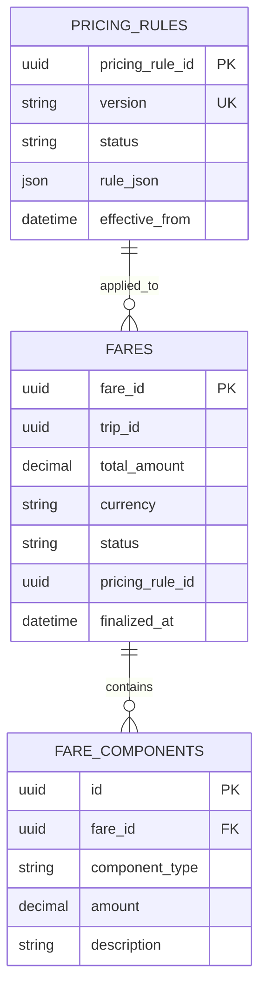

## 10. Database type

Primary: **PostgreSQL (OLTP)**.

## 11. Giải thích về lý do kỹ thuật

Fare cần precision, versioning và auditability. PostgreSQL/decimal giúp tránh floating-point money error, transaction tốt và giữ được policy version dùng để giải thích cách tính.

## 12. Domain Events

`FareCalculated`, `FareFinalized`, `FareCalculationFailed`.

# BC08 – Payment / `payment-service`

## 1. Mục đích của BC

Quản lý payment transaction theo fare đã finalize, hỗ trợ Cash/Electronic, provider integration, callback, retry và trạng thái Success/Failed.

## 2. FR liên quan

| Thành phần | Mapping |
|---|---|
| **Functional Requirements** | FR-PM-02 → FR-PM-06 |
| **Use Cases** | UC10, UC17 |
| **Business Process / Workflow** | BP04 – Fare & Payment; hỗ trợ BP07 – Operations Monitoring |

## 3. Workflow

Nhận FareFinalized → tạo Payment → chọn PaymentMethod → cash settlement hoặc gọi provider → nhận callback/result → cập nhật PaymentStatus → phát PaymentSucceeded/Failed.

## 4. Ubiquitous Language

`Payment`, `PaymentMethod`, `PaymentTransaction`, `PaymentStatus`, `PaymentAttempt`, `Provider`, `ProviderTransactionId`, `Settlement`.

## 5. Aggregate

**Payment Aggregate** – Root: `Payment`. Invariant: amount/currency nhất quán với FareFinalized; electronic chỉ success sau provider confirmation; retry phải idempotent theo payment/attempt key.

## 6. Microservice

`payment-service` – microservice chứa domain payment và adapter/provider ports. Không để provider model lọt vào domain model.

**Service name:** `payment-service`


## 7. API chính

| Method | Endpoint | Mục đích |
|---|---|---|
| POST | `/api/v1/payments` | Tạo payment |
| GET | `/api/v1/payments/{paymentId}` | Xem payment |
| POST | `/api/v1/payments/{paymentId}/retry` | Retry payment |
| POST | `/api/v1/payments/{paymentId}/confirm` | Confirm cash/provider result |
| POST | `/api/v1/providers/{provider}/webhook` | Nhận provider callback |

## 8. Database

`payment_db` – payments, payment_attempts, provider_transactions, payment_status_history. Không lưu raw card secret/token nếu provider không yêu cầu.

## 9. ERD

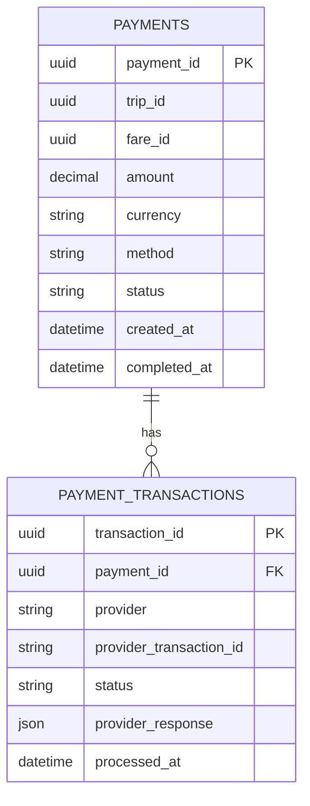

## 10. Database type

Primary: **PostgreSQL (OLTP)**; optional secure secret/token storage bên ngoài DB tùy provider.

## 11. Giải thích về lý do kỹ thuật

Payment cần consistency, idempotency, unique provider transaction reference và traceability. PostgreSQL phù hợp cho transaction ledger; dữ liệu nhạy cảm nên giảm thiểu và/hoặc token hóa, không dùng payment DB như vault.

## 12. Domain Events

`PaymentRequested`, `PaymentSucceeded`, `PaymentFailed`, `PaymentProviderUnavailable`, `PaymentStatusChanged`.

# BC09 – Notification / `notification-service`

## 1. Mục đích của BC

Nhận business events, tạo notification theo template/channel, gửi qua provider và quản lý delivery/retry. Notification không sở hữu business state của Booking/Trip/Payment.

## 2. FR liên quan

| Thành phần | Mapping |
|---|---|
| **Functional Requirements** | FR-NT-01 → FR-NT-06 |
| **Use Cases** | UC20 |
| **Business Process / Workflow** | BP09 – Notification Delivery; hỗ trợ BP02, BP03, BP04 |

## 3. Workflow

Consume event → resolve recipient/channel/template → enqueue delivery → send → receive provider result → retry/fail → lưu delivery status.

## 4. Ubiquitous Language

`Notification`, `Recipient`, `Channel`, `Template`, `Delivery`, `DeliveryAttempt`, `Sent`, `Failed`, `Provider`.

## 5. Aggregate

**Notification Aggregate** – Root: `Notification`. Invariant: delivery failure không làm rollback core business transaction; retry phải idempotent theo message/delivery key.

## 6. Microservice

`notification-service` – asynchronous-first service. Public query API chỉ để tra cứu delivery/history; business event ingestion là luồng chính.

**Service name:** `notification-service`


## 7. API chính

| Method | Endpoint | Mục đích |
|---|---|---|
| POST | `/api/v1/notifications` | Tạo notification |
| GET | `/api/v1/notifications/{notificationId}` | Xem delivery |
| GET | `/api/v1/notifications?recipientId=...` | Lịch sử notification |
| POST | `/api/v1/providers/{provider}/webhook` | Provider callback |

## 8. Database

`notification_db` – notification_templates, notifications, delivery_attempts; queue/broker nằm ngoài transactional DB.

## 9. ERD

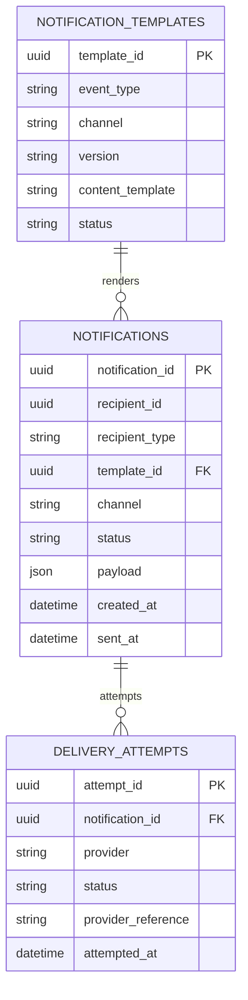

## 10. Database type

Primary: **PostgreSQL**; auxiliary: **Redis/RabbitMQ/Kafka** cho queue/retry tùy infrastructure.

## 11. Giải thích về lý do kỹ thuật

Notification là I/O-bound và có retry/back-pressure. PostgreSQL lưu durable delivery state; message broker/queue tách tốc độ business transaction khỏi nhà cung cấp email/SMS/push.

## 12. Domain Events

Domain: `NotificationCreated`, `NotificationSent`, `NotificationFailed`; integration input: `BookingReadyForDispatch`, `DriverAssigned`, `TripCompleted`, `PaymentSucceeded`, `PaymentFailed`, `NoDriverFound`.

# BC10 – Feedback & Trip History / `feedback-history-service`

## 1. Mục đích của BC

Quản lý rating và read model lịch sử chuyến. History là projection, không thay thế Trip/Payment source of truth.

## 2. FR liên quan

| Thành phần | Mapping |
|---|---|
| **Functional Requirements** | FR-RH-01 → FR-RH-03 |
| **Use Cases** | UC11, UC12 |
| **Business Process / Workflow** | BP05 – Rating & Trip History |

## 3. Workflow

Consume TripCompleted/Fare/Payment events → build TripHistory projection → Customer xem history → customer đủ điều kiện submit Rating → lưu rating → phát event.

## 4. Ubiquitous Language

`Rating`, `RatingScore`, `RatingComment`, `CompletedTrip`, `TripHistory`, `RatingEligibility`, `ExperienceRecord`, `Snapshot`.

## 5. Aggregate

**Rating Aggregate** – Root: `Rating`. `TripHistory` là Read Model/Projection. Invariant: chỉ customer hợp lệ và trip completed mới được rating; uniqueness theo trip nếu policy là một rating/trip.

## 6. Microservice

`feedback-history-service` – kết hợp transactional rating với projection history. Query path tối ưu cho customer history.

**Service name:** `feedback-history-service`


## 7. API chính

| Method | Endpoint | Mục đích |
|---|---|---|
| POST | `/api/v1/trips/{tripId}/ratings` | Submit rating |
| GET | `/api/v1/trips/{tripId}/rating` | Xem rating |
| GET | `/api/v1/customers/{customerId}/trip-history` | Lịch sử chuyến |
| GET | `/api/v1/trip-history/{tripId}` | Chi tiết history |
| GET | `/api/v1/customers/{customerId}/ratings` | Rating của customer |

## 8. Database

`feedback_history_db` – ratings + trip_history projection. Projection có thể rebuild từ event stream khi cần.

## 9. ERD

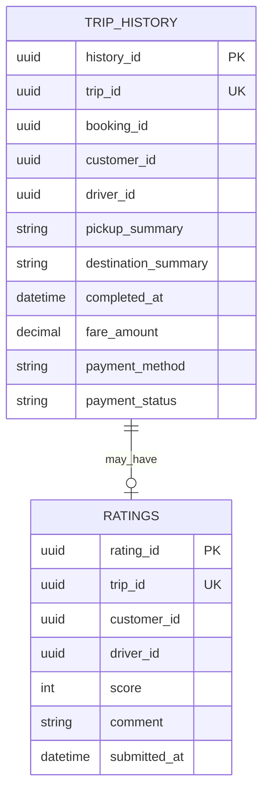

## 10. Database type

Primary: **PostgreSQL (OLTP + read model)**; có thể dùng Elasticsearch/OpenSearch nếu history search phức tạp, nhưng không cần cho MVP.

## 11. Giải thích về lý do kỹ thuật

Rating cần ACID/unique constraint; history cần query theo customer/time. Một PostgreSQL read model vừa đủ cho quy mô đồ án; event-driven projection giúp tránh cross-service joins.

## 12. Domain Events

`RatingSubmitted`, `TripHistoryCreated`, `TripHistoryUpdated`.

# BC11 – Operations / `operations-service`

## 1. Mục đích của BC

Cung cấp operational case, incident và intervention cho nhân viên vận hành. Operations điều phối/ra lệnh nhưng không sở hữu Customer/Driver/Trip/Payment state.

## 2. FR liên quan

| Thành phần | Mapping |
|---|---|
| **Functional Requirements** | FR-OM-01 → FR-OM-07 |
| **Use Cases** | UC15, UC16, UC17, UC18; hỗ trợ UC13/UC14 |
| **Business Process / Workflow** | BP07 – Operations Monitoring & Incident Handling; hỗ trợ BP06 |

## 3. Workflow

Operator xem operational view → mở incident → investigate → gửi command tới context owner → ghi intervention → theo dõi resolution → đóng case và audit.

## 4. Ubiquitous Language

`OperationalCase`, `Incident`, `Severity`, `Intervention`, `OperationalAction`, `Escalation`, `Resolution`, `CaseStatus`.

## 5. Aggregate

**OperationCase Aggregate** – Root: `OperationalCase`. Các target như Trip/Driver/Payment chỉ là external references. Intervention phải gắn actor, reason và outcome.

## 6. Microservice

`operations-service` – microservice dành cho operator workflow, thường có read projections tổng hợp để dashboard không phải gọi tuần tự nhiều service.

**Service name:** `operations-service`


## 7. API chính

| Method | Endpoint | Mục đích |
|---|---|---|
| GET | `/api/v1/operations/trips/active` | Theo dõi trip |
| GET | `/api/v1/operations/drivers/status` | Trạng thái driver |
| GET | `/api/v1/operations/transactions` | Tra cứu transaction |
| POST | `/api/v1/operations/incidents` | Tạo incident |
| GET | `/api/v1/operations/incidents/{incidentId}` | Xem incident |
| PATCH | `/api/v1/operations/incidents/{incidentId}` | Cập nhật incident |
| POST | `/api/v1/operations/incidents/{incidentId}/actions` | Intervention |

## 8. Database

`operations_db` – incidents, operational_actions, assignments/escalations nếu cần. Read projections có thể denormalize.

## 9. ERD

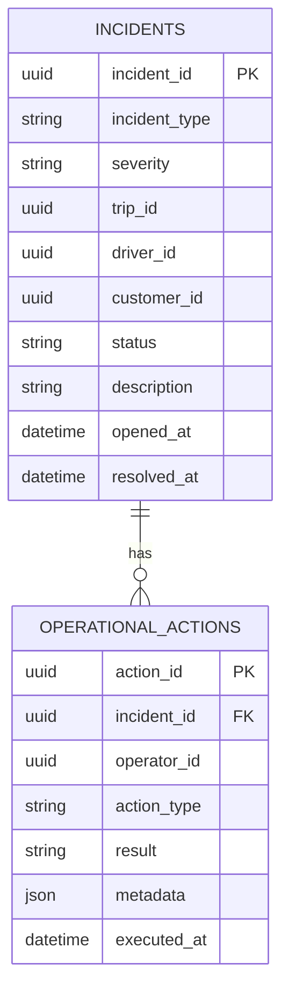

## 10. Database type

Primary: **PostgreSQL**; optional read cache Redis.

## 11. Giải thích về lý do kỹ thuật

Operations cần transaction cho case/action và traceability. Read projections giúp dashboard phản hồi nhanh; command vẫn gửi đến domain owner để giữ invariant.

## 12. Domain Events

`OperationCaseOpened`, `OperationalInterventionPerformed`, `OperationCaseResolved`.

# BC12 – Reporting & Monitoring / `reporting-service`

## 1. Mục đích của BC

Tính KPI và báo cáo từ integration events: trip volume, revenue, completion/cancellation rate, driver performance. Đây là read/analytics context.

## 2. FR liên quan

| Thành phần | Mapping |
|---|---|
| **Functional Requirements** | FR-RP-01 → FR-RP-05 |
| **Use Cases** | UC19 |
| **Business Process / Workflow** | BP08 – Reporting & Business Monitoring |

## 3. Workflow

Consume events → chuẩn hóa facts → aggregate theo thời gian/driver → cập nhật metrics → expose dashboard/report API.

## 4. Ubiquitous Language

`TripFact`, `PaymentFact`, `DriverPerformance`, `RevenueMetric`, `CompletionRate`, `CancellationRate`, `ReportingPeriod`, `DailyMetric`.

## 5. Aggregate

Không dùng transactional aggregate cổ điển cho phần reporting. Domain concept chính là **Projection/Fact Model**; metric calculation là read-side/domain calculation.

## 6. Microservice

`reporting-service` – độc lập, event-driven, tối ưu read-heavy queries. Không query trực tiếp DB của Booking/Trip/Payment.

**Service name:** `reporting-service`


## 7. API chính

| Method | Endpoint | Mục đích |
|---|---|---|
| GET | `/api/v1/reports/trips` | Trip volume |
| GET | `/api/v1/reports/revenue` | Revenue |
| GET | `/api/v1/reports/completion-rate` | Completion rate |
| GET | `/api/v1/reports/cancellation-rate` | Cancellation rate |
| GET | `/api/v1/reports/driver-performance` | Driver performance |
| GET | `/api/v1/reports/dashboard-summary` | Dashboard |

## 8. Database

`reporting_db` – fact/projection tables và daily metrics.

## 9. ERD

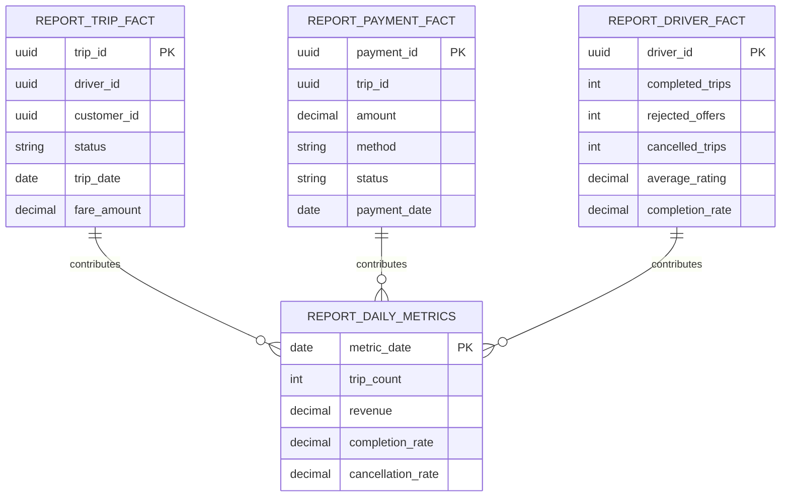

## 10. Database type

MVP: **PostgreSQL read model**. Khi dữ liệu lớn: **ClickHouse/DWH** cho OLAP, vẫn giữ event contract upstream ổn định.

## 11. Giải thích về lý do kỹ thuật

Reporting có workload aggregate/filter theo thời gian khác hẳn OLTP. PostgreSQL phù hợp MVP; OLAP engine như ClickHouse phù hợp volume lớn, scan nhiều rows và dashboard analytics.

## 12. Domain Events

Input: `BookingStatusChanged`, `TripCompleted`, `TripStateChanged`, `PaymentSucceeded`, `PaymentFailed`, `DriverCreated`, `RatingSubmitted`. Domain/report events: `DailyMetricsUpdated`, `ReportSnapshotGenerated`.

# BC13 – Audit Trail / `audit-service`

## 1. Mục đích của BC

Lưu vết bất biến các critical actions/events cho security, operations và troubleshooting. Audit chỉ ghi nhận, không quyết định domain state.

## 2. FR liên quan

| Thành phần | Mapping |
|---|---|
| **Functional Requirements** | FR-AC-04 |
| **Use Cases** | UC22 |
| **Business Process / Workflow** | BP10 – Access Control & Audit |

## 3. Workflow

Service phát auditable event → audit ingestion → validate metadata → append log → query theo actor/target/trace → retention/archive.

## 4. Ubiquitous Language

`AuditEvent`, `Actor`, `Action`, `Target`, `CorrelationId`, `TraceId`, `Outcome`, `SourceService`, `OccurredAt`.

## 5. Aggregate

Audit không cần aggregate phức tạp. **AuditEntry** là append-only record. Invariant: entry sau khi ghi không được update/delete bởi business API thông thường.

## 6. Microservice

`audit-service` – write-heavy append-only microservice; query endpoint tách read concern khỏi ingestion.

**Service name:** `audit-service`


## 7. API chính

| Method | Endpoint | Mục đích |
|---|---|---|
| POST | `/internal/audit-events` | Ghi audit event |
| GET | `/api/v1/audit-logs` | Tra cứu audit |
| GET | `/api/v1/audit-logs/{id}` | Chi tiết audit |
| GET | `/api/v1/audit-logs?actorId=...` | Lọc theo actor |
| GET | `/api/v1/audit-logs?targetId=...` | Lọc theo target |

## 8. Database

`audit_db` – audit_logs append-only; archive/retention có thể chuyển sang object storage theo policy.

## 9. ERD

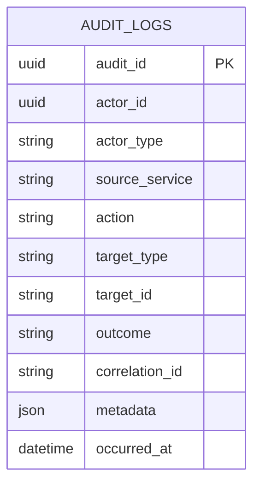

## 10. Database type

Primary: **PostgreSQL append-only**; optional archive: object storage/WORM-compatible storage.

## 11. Giải thích về lý do kỹ thuật

Audit cần query theo actor/target/time và durability. PostgreSQL phù hợp cho MVP với index theo trace/time; khi volume rất lớn có thể partition theo thời gian và archive cold data.

## 12. Domain Events

Input/auditable events: `AccountAuthenticated`, `RoleChanged`, `DriverAvailabilityChanged`, `BookingCreated`, `DriverAssigned`, `TripStateChanged`, `PaymentStatusChanged`, `OperationalInterventionPerformed`.
---

## 3. Quy tắc triển khai chung

### 3.1. API Gateway

```text
Client → API Gateway → Microservice
                  ├─ JWT validation / routing
                  ├─ Rate limiting
                  ├─ Correlation ID
                  └─ Observability
```

### 3.2. Event contract

```text
Domain Event (inside BC)
        ↓
Outbox
        ↓
Integration Event (versioned)
        ↓
Message Broker
        ↓
Consumer services
```

Mỗi Integration Event nên có `eventId`, `eventType`, `version`, `occurredAt`, `aggregateId`, `correlationId` và payload tối thiểu. Consumer phải idempotent.

### 3.3. Database ownership

| Service | Primary DB | Auxiliary / Analytics |
|---|---|---|
| identity-service | PostgreSQL | Redis tùy chọn |
| customer-service | PostgreSQL | – |
| driver-fleet-service | PostgreSQL | Redis GEO/TTL |
| booking-service | PostgreSQL | – |
| dispatch-service | PostgreSQL | Redis / PostGIS tùy tải |
| trip-service | PostgreSQL + PostGIS/time-series | Redis/stream |
| pricing-service | PostgreSQL | – |
| payment-service | PostgreSQL | Secret/token store tùy provider |
| notification-service | PostgreSQL | RabbitMQ/Kafka/Redis |
| feedback-history-service | PostgreSQL | Search engine tùy nhu cầu |
| operations-service | PostgreSQL | Redis read cache |
| reporting-service | PostgreSQL read model | ClickHouse/DWH khi scale |
| audit-service | PostgreSQL append-only | Object/WORM archive |

### 3.4. Core flow end-to-end

```text
1. Customer đăng nhập
2. Booking Service tạo Booking
3. BookingReadyForDispatch
4. Dispatch Service tìm candidate → gửi offers
5. Một driver accept → DriverAssigned
6. Trip Service tạo Trip
7. Driver cập nhật trạng thái/location
8. TripCompleted
9. Pricing Service finalize Fare
10. Payment Service xử lý Cash/Electronic
11. Feedback/History cập nhật projection + Rating
12. Notification / Reporting / Audit consume events
```

## 4. Kết luận kiến trúc

Thiết kế này giữ **Booking → Dispatch → Trip** là Core Domain; các BC khác đóng vai trò supporting/generic. Mỗi BC có ngôn ngữ, aggregate, API và database riêng, nhưng liên kết bằng contract/event thay vì chia sẻ model hoặc database. Đây là boundary phù hợp để triển khai Microservices mà vẫn giữ được tính nhất quán của DDD.
