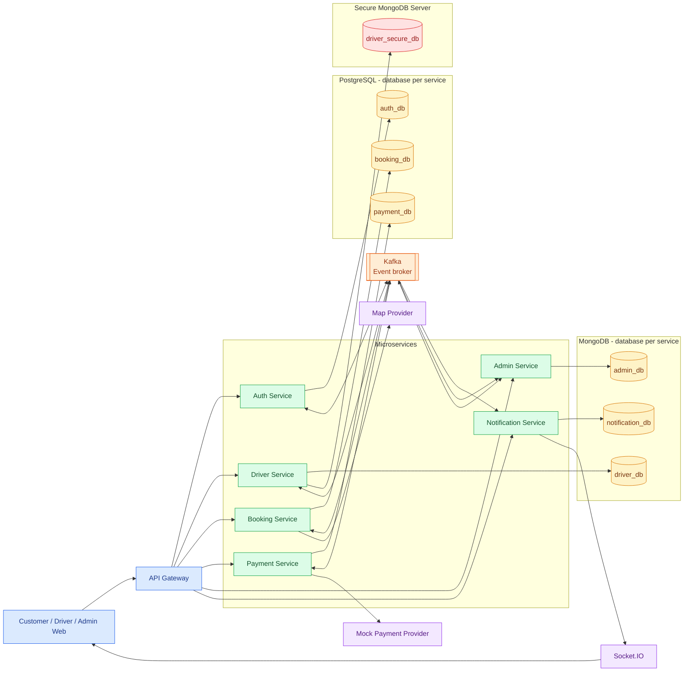

# CAB System – Thiết kế Microservices và DDD

**Phiên bản:** 2.0
**Phạm vi:** MVP theo SRS CAB System v3.0 và OpenAPI trong `api-docs/`
**Nguyên tắc:** tài liệu này mô tả kiến trúc đích cho bài thực hành; tên endpoint public phải khớp `api-docs/openapi.yaml`.

## 1. Quyết định kiến trúc

CAB dùng microservice theo bounded context, triển khai bằng Docker Compose cho môi trường local. Client chỉ truy cập qua API Gateway. Mỗi service sở hữu database/schema/collection của mình, không truy vấn trực tiếp dữ liệu service khác. PostgreSQL phù hợp dữ liệu giao dịch và quan hệ; MongoDB phù hợp hồ sơ linh hoạt, vị trí và projection. Kafka vận chuyển event bất đồng bộ; notification-service tiêu thụ event để gửi thông báo. Kafka không thay thế database lưu hộp thư thông báo. Dữ liệu nhạy cảm được cô lập và chỉ service owner truy cập. Giao tiếp nội bộ đồng bộ dùng HTTP khi cần phản hồi ngay.

### 1.1 Bounded context và đóng gói service

Bảng dưới đây là danh sách bounded context và các gói backend được thiết kế cho MVP. Những context có vòng đời gắn chặt được đóng gói thành module trong cùng service để giảm số ứng dụng cần phát triển và vận hành.

| Bounded context | Đóng gói trong MVP | Service/gói được thiết kế | Ghi chú phạm vi |
|---|---|---|---|
| Identity & Access | Service độc lập | `auth-service` | Đăng ký, OTP, đăng nhập, token/session và quyền truy cập. |
| Driver & Fleet | Service độc lập | `driver-service` | Hồ sơ, xét duyệt, phương tiện, trạng thái tài xế và rating. |
| Tracking & Geolocation | Module trong Driver | `driver-service` | Nhận GPS và vị trí mới nhất; booking dùng vị trí này khi tìm tài xế. |
| Rating & Feedback | Module trong Driver | `driver-service` | Nhận đánh giá hợp lệ và cập nhật rating tài xế. |
| Booking & Pricing | Module trong Booking | `booking-service` | Ước tính giá và tạo ride request. |
| Matching & Dispatch | Module trong Booking | `booking-service` | Tìm candidate, gửi offer, timeout/retry và nhận tài xế atomic. |
| Trip Execution | Module trong Booking | `booking-service` | Vòng đời chuyến, trạng thái, hủy và hoàn tất. |
| Fare & Payment | Service độc lập | `payment-service` | Pricing config, tính cước cuối, thanh toán và callback. |
| Notification Hub | Service độc lập | `notification-service` | Consume event từ Kafka, lưu inbox và gửi email/realtime. |
| Administration & Analytics | Service độc lập | `admin-service` | API quản trị, audit và read projections; không sở hữu domain state. |
| API ingress | Hạ tầng ứng dụng | `api-gateway` | Điểm vào duy nhất từ client, xác thực token và định tuyến request. |

**Danh sách service backend:** `api-gateway`, `auth-service`, `driver-service`, `booking-service`, `payment-service`, `notification-service`, `admin-service`. MongoDB, PostgreSQL và Kafka là hạ tầng dữ liệu/messaging, không tính là backend service của domain.

| Thành phần | Trách nhiệm chính | Data ownership |
|---|---|---|
| `api-gateway` | Entry point HTTP; route, JWT validation, RBAC coarse-grained, rate limit, correlation ID và chuẩn hóa lỗi | Không sở hữu domain data |
| `auth-service` | Customer/Driver account, đăng ký, OTP, đăng nhập, token/session, hồ sơ người dùng cơ bản | PostgreSQL `auth_db`: account, refresh token, OTP/verification; PII nhạy cảm được mã hóa |
| `driver-service` | Hồ sơ tài xế, xét duyệt, phương tiện, trạng thái online/busy, vị trí hiện tại và rating | MongoDB `driver_db`: trạng thái, metadata xe, vị trí hiện tại, đánh giá; Secure MongoDB `driver_secure_db`: PII/giấy tờ |
| `booking-service` | Ride/booking, dispatch, offer, matching retry và lifecycle chuyến | PostgreSQL `booking_db`: rides, offers và trạng thái chuyến |
| `payment-service` | Pricing config, fare, payment, provider callback và idempotency | PostgreSQL `payment_db`: pricing, payments và idempotency records |
| `notification-service` | Hộp thư thông báo, email và Socket.IO delivery | MongoDB `notification_db`: notifications, delivery state; Kafka consumer |
| `admin-service` | Dashboard/report queries, operator intervention workflow và audit log query/append | MongoDB `admin_db`: audit logs, admin read projections; domain state vẫn thuộc service gốc |
| `cab-app-db` (MongoDB server) | Dữ liệu hồ sơ, vị trí, notification và projections | Database/collection tách theo service ownership; không chứa credential hoặc bản gốc giấy tờ định danh |
| `cab-secure-db` (MongoDB server riêng) | PII/giấy tờ tài xế | Chỉ `driver-service` được truy cập; credentials riêng và quyền tối thiểu |
| `cab-postgres` (PostgreSQL server) | Database riêng cho Auth, Booking và Payment | Role/database tách riêng theo service |
| `cab-kafka` | Integration event transport | Topics theo event type; notification-service consume event; retry/DLQ qua retry topic và dead-letter topic |

`admin-service` là phần bổ sung để có nơi triển khai các API quản trị/audit đang có trong `api-docs/09-admin.yaml` và `10-security-audit.yaml`. Nó không được sửa trực tiếp dữ liệu của service nghiệp vụ; mọi thay đổi được gửi bằng API command tới owner service.

### 1.2 Data service type

| Service | Data service type | Dữ liệu chính | Vì sao chọn |
|---|---|---|---|
| `auth-service` | PostgreSQL (`auth_db`) | Account, refresh session, OTP/verification | Unique email/SĐT, cập nhật session và OTP cần transaction, constraint và index. |
| `driver-service` | MongoDB (`driver_db` + Secure MongoDB) | Hồ sơ/xe, trạng thái, vị trí, rating; PII/giấy tờ trong Secure DB | Hồ sơ linh hoạt theo loại xe/tài xế; GeoJSON và geospatial index hỗ trợ tìm tài xế gần đó. |
| `booking-service` | PostgreSQL (`booking_db`) | Ride, offer, matching state, lifecycle, history | Accept/gán tài xế cần transaction và cập nhật có điều kiện để bảo đảm một ride chỉ nhận một tài xế. |
| `payment-service` | PostgreSQL (`payment_db`) | Pricing, payment, callback/idempotency | Giao dịch tiền cần transaction, unique constraint và tính nhất quán để đối soát. |
| `notification-service` | Kafka + MongoDB (`notification_db`) | Kafka nhận domain events; MongoDB lưu inbox, trạng thái đọc và delivery | Kafka tách gửi thông báo khỏi luồng nghiệp vụ, hấp thụ burst; MongoDB lưu document linh hoạt và truy vấn inbox theo user. |
| `admin-service` | MongoDB (`admin_db`) | Audit log, dashboard/report projections | Read model linh hoạt, append-oriented và rebuild được từ event. |

Kafka là message broker, không phải database. Notification-service lưu bản ghi cần hiển thị trong MongoDB sau khi consume event từ Kafka. Mỗi service chỉ truy cập database mình sở hữu.

### 1.3 Cấu trúc source code đề xuất

```text
23732061_MaiQuocHung_CabSystem/
  apps/
    customer-web/
    driver-web/
    admin-web/
  services/
    api-gateway/
    auth-service/
    driver-service/
    booking-service/
    payment-service/
    notification-service/
    admin-service/
  packages/
    api-contracts/
    event-contracts/
    shared-config/
  infra/
    docker-compose.yml
    gateway/
    kafka/
  api-docs/
  postman/
  .env.example
```

Mỗi backend service giữ cấu trúc nhất quán `src/routes`, `src/controllers`, `src/services`, `src/models`, `src/middlewares`, `src/config`, `src/events`. Chỉ chia sẻ DTO/event schema và tiện ích thuần; không chia sẻ domain model hoặc model database giữa service.

## 2. Bounded Context và quy trình nghiệp vụ

### 2.1 Chi tiết phân rã domain và ánh xạ service

Bounded Context xác định ranh giới mô hình nghiệp vụ; trong MVP, một service có thể triển khai nhiều context có vòng đời gắn chặt để giảm chi phí vận hành. Do đó, Booking, Matching/Dispatch và Trip Execution cùng chạy trong `booking-service`, nhưng được tổ chức thành module domain riêng. Chúng có thể tách thành service độc lập khi tải, ownership hoặc nhu cầu triển khai riêng biệt tăng lên.

| Bounded Context | Phân loại | Service MVP | Trách nhiệm và dữ liệu sở hữu |
|---|---|---|---|
| Identity & Access | Generic | `auth-service` | Tài khoản, thông tin xác thực, OTP, session/refresh token và RBAC. |
| Driver & Fleet | Supporting | `driver-service` | Hồ sơ tài xế, xét duyệt, phương tiện, trạng thái hoạt động và vị trí hiện tại. |
| Booking & Pricing | Core | `booking-service` | Ước tính, snapshot giá và yêu cầu đặt xe/ride. |
| Matching & Dispatch | Core | `booking-service` (module riêng) | Candidate, offer, timeout/retry, atomic accept và kết quả ghép tài xế. |
| Trip Execution | Core | `booking-service` (module riêng) | Vòng đời ride/trip, mốc thời gian, hủy và xử lý sự cố. |
| Tracking & Geolocation | Supporting | `driver-service` ở MVP | Thu GPS và vị trí mới nhất; phát vị trí chuyến qua Socket.IO. Tách riêng nếu cần scale/retention GPS độc lập. |
| Fare & Payment | Supporting | `payment-service` | Cấu hình giá, tính cước cuối, payment, callback và đối soát. |
| Rating & Feedback | Supporting | `driver-service` (module riêng) | Nhận đánh giá sau chuyến, tính rating tài xế; booking history vẫn do booking service sở hữu. |
| Notification Hub | Generic | `notification-service` | Hộp thư, email và gửi thông báo realtime từ events. |
| Administration & Analytics | Generic | `admin-service` | API quản trị, audit log và read projections; không sở hữu trạng thái nghiệp vụ gốc. |

### 2.2 Ngôn ngữ nghiệp vụ (Ubiquitous Language)

| Thuật ngữ | Định nghĩa trong CAB | Context sở hữu |
|---|---|---|
| **Booking/Ride request** | Yêu cầu đặt xe của khách trước khi được gán tài xế; API MVP biểu diễn resource này là `ride`. | Booking & Pricing |
| **Dispatch offer** | Lời mời nhận một booking gửi cho một tài xế tại một thời điểm, có thời hạn phản hồi. | Matching & Dispatch |
| **Trip** | Chuyến vận chuyển sau khi tài xế nhận offer. Trong MVP, `Ride` aggregate quản lý xuyên suốt vòng đời này. | Trip Execution |
| **Driver availability** | Trạng thái `offline`, `available`, `busy` hoặc `suspended`; `driver-service` là nguồn dữ liệu authoritative. | Driver & Fleet |
| **Fare estimate** | Giá dự kiến trước khi khách xác nhận; được snapshot để thay đổi bảng giá không làm đổi estimate cũ. | Booking & Pricing |
| **Actual fare** | Giá cuối tính từ dữ liệu quãng đường/thời gian thực tế và bảng giá áp dụng. | Fare & Payment |
| **Integration event** | Thông điệp bất biến mô tả sự việc đã xảy ra; consumer tự xử lý, khác với command yêu cầu thực hiện hành động. | Producer context |

### 2.3 Context map


```mermaid
flowchart LR
    Client["Customer / Driver / Admin Web"]
    Gateway["API Gateway"]

    Client --> Gateway

    subgraph SERVICES["Microservices"]
        Auth["Auth Service"]
        Driver["Driver Service"]
        Booking["Booking Service"]
        Payment["Payment Service"]
        Admin["Admin Service"]
        Notify["Notification Service"]
    end

    Gateway --> Auth
    Gateway --> Driver
    Gateway --> Booking
    Gateway --> Payment
    Gateway --> Admin
    Gateway --> Notify

    subgraph POSTGRES["PostgreSQL - database per service"]
        AuthDB[("auth_db")]
        BookingDB[("booking_db")]
        PaymentDB[("payment_db")]
    end

    subgraph MONGO["MongoDB - database per service"]
        DriverDB[("driver_db")]
        AdminDB[("admin_db")]
        NotifyDB[("notification_db")]
    end

    Auth --> AuthDB
    Driver --> DriverDB
    Booking --> BookingDB
    Payment --> PaymentDB
    Admin --> AdminDB
    Notify --> NotifyDB

    subgraph SECURE["Secure MongoDB Server"]
        DriverSecure[("driver_secure_db")]
    end

    Driver --> DriverSecure

    MQ[["Kafka<br/>Event broker"]]

    Auth <--> MQ
    Driver <--> MQ
    Booking <--> MQ
    Payment <--> MQ
    Admin <--> MQ
    MQ --> Notify
    MQ --> Admin

    Notify --> Socket["Socket.IO"]
    Socket --> Client

    Payment --> PGW["Mock Payment Provider"]
    Booking --> Map["Map Provider"]

    classDef client fill:#dbeafe,stroke:#2563eb,color:#1e3a8a
    classDef service fill:#dcfce7,stroke:#16a34a,color:#14532d
    classDef database fill:#fef3c7,stroke:#d97706,color:#78350f
    classDef secure fill:#fee2e2,stroke:#dc2626,color:#991b1b
    classDef broker fill:#ffedd5,stroke:#ea580c,color:#9a3412
    classDef external fill:#f3e8ff,stroke:#9333ea,color:#581c87

    class Client,Gateway client
    class Auth,Driver,Booking,Payment,Admin,Notify service
    class AuthDB,DriverDB,BookingDB,PaymentDB,AdminDB,NotifyDB database
    class DriverSecure secure
    class MQ broker
    class Socket,PGW,Map external
```

### 2.4 Luồng đặt xe đến đánh giá

1. Customer đăng ký/đăng nhập qua `auth-service`; driver gửi OTP, xác minh rồi nộp hồ sơ và phương tiện.
2. Operator/Admin duyệt hồ sơ qua `driver-service`; driver được duyệt mới chuyển sang `available`.
3. Customer xem ước tính và tạo ride qua `booking-service`. Ride chuyển sang `searching`.
4. Booking service yêu cầu driver-service tìm candidate phù hợp, ưu tiên khoảng cách; gửi offer theo thứ tự qua Socket.IO. Mỗi offer timeout mặc định 30 giây, tối đa 5 candidate.
5. Driver nhận offer. Accept phải atomic: một ride chỉ gán một driver. Ride chuyển sang `accepted`; driver chuyển `busy`.
6. Driver cập nhật tuần tự `driver_arrived` → `in_progress` → `completed`, đồng thời gửi GPS. Customer theo dõi qua API/Socket.IO.
7. Khi ride hoàn tất, booking service phát `RideCompleted`. Payment service lấy pricing hiện hành, tạo fare/payment. Thanh toán điện tử hoàn tất qua callback có chữ ký; tiền mặt do driver xác nhận.
8. Sau payment `COMPLETED`, customer gửi rating. Rating module trong driver-service tạo một review cho mỗi ride và cập nhật rating tổng hợp của tài xế. Booking history tiếp tục lấy từ booking service.
9. Notification, admin/reporting projections và audit xử lý event độc lập. Lỗi gửi email không rollback ride hoặc payment.

### 2.5 Aggregate và invariant nghiệp vụ

| Context | Aggregate root | Invariant quan trọng |
|---|---|---|
| Identity & Account | `UserAccount` | Email/phone duy nhất; password luôn hash; tài khoản inactive không đăng nhập |
| Driver & Fleet | `DriverProfile`, `Vehicle` | Chỉ tài xế approved/active mới online; plate/license duy nhất; Busy không nhận offer mới |
| Booking, Dispatch & Trip | `Ride` | Chuyển trạng thái tuần tự; một tài xế được gán; mỗi thời điểm chỉ có một offer đang chờ; retry tối đa 5; kiểm tra customer/driver ownership; snapshot estimate. |
| Fare & Payment | `Payment`, `PricingConfig` | Payment gắn duy nhất một ride; amount không âm; fare giữ snapshot/version bảng giá; không lưu dữ liệu thẻ; callback/idempotency không xử lý giao dịch hai lần. |
| Rating & Feedback | `RatingReview`, driver rating | Ride đã completed và payment completed; một review mỗi ride; rating tổng hợp cập nhật từ các review. Driver-service xác minh điều kiện đánh giá qua API nội bộ hoặc event, không truy cập database booking/payment. |
| Notification | `Notification` | Người dùng chỉ đọc/cập nhật thông báo của mình; delivery retry không tạo bản ghi trùng |
| Administration & Audit | `AuditLog`, report projection | Audit append-only; intervention đi qua domain owner và ghi actor/reason |

`CustomerId`, `DriverId`, `RideId`, `PaymentId` là ID tham chiếu giữa context, không phải shared entity hay quan hệ database cross-service.

Invariant xuyên context không được thực thi bằng transaction database chung. Ví dụ, thao tác accept dùng transaction/conditional update ở PostgreSQL của booking-service; đổi trạng thái tài xế thực hiện qua API/command/event có kiểm soát. Nếu bước phụ lỗi, consumer retry hoặc quy trình bù xử lý trạng thái, không ghi trực tiếp vào database service khác.

## 3. Service contracts

Tất cả public API đi qua Gateway với base URL `http://localhost:3000/api/v1`. Các bảng liệt kê route public hiện có; không tạo endpoint public trùng tên nhưng khác nghĩa. Chi tiết request/response nằm trong `api-docs/`.

### 3.1 Auth service

| API | FR | Ghi chú |
|---|---|---|
| `POST /auth/register/customer` | FR-AUTH-01 | Tạo customer account |
| `POST /auth/driver-otp/request` | FR-AUTH-02 | Gửi OTP có rate limit; không trả OTP trong môi trường production |
| `POST /auth/driver-otp/verify` | FR-AUTH-02 | Trả verification token ngắn hạn |
| `POST /auth/register/driver` | FR-AUTH-02 | Yêu cầu verification token, hồ sơ và vehicle |
| `POST /auth/login`, `POST /auth/logout` | FR-AUTH-03, FR-AUTH-06 | JWT và thu hồi refresh session |
| `PATCH /auth/profile`, `PUT /auth/password` | FR-AUTH-04, FR-AUTH-05 | Profile/password của user hiện tại |
| `GET /customers/{customerId}` | FR-AUTH-04 | Owner hoặc role quản trị được phép xem |

### 3.2 Driver service

| API | FR | Ghi chú |
|---|---|---|
| `GET /drivers/{driverId}` | FR-DRV-05 | Trả thông tin hiển thị và xe, không trả giấy tờ riêng tư |
| `GET/POST /drivers/me/vehicles` | FR-DRV-01 | Danh sách/thêm xe của tài xế hiện tại |
| `PUT /drivers/me/status` | FR-DRV-02, FR-DRV-03 | Chỉ `offline`/`available` do driver yêu cầu; Busy do hệ thống quản lý |
| `PUT /drivers/me/location` | FR-TRACK-01 | Nhận GPS; tần suất mục tiêu 5–10 giây |
| `GET /drivers/nearby` | FR-MATCH-01 | Lat/lng, radiusKm, status, page, limit; yêu cầu đăng nhập và kiểm tra role |
| `PUT /admin/drivers/{driverId}/approval` | FR-DRV-04 | Operator/Admin duyệt/từ chối; ghi audit |
| `PUT /admin/drivers/{driverId}/suspension` | FR-DRV-06 | Admin khóa/mở tài xế |

### 3.3 Booking service (Booking + Matching + Trip lifecycle)

| API | FR | Ghi chú |
|---|---|---|
| `POST /rides/estimate` | FR-RIDE-01, FR-RIDE-02 | Route, duration và fare estimates |
| `POST /rides` | FR-RIDE-03 | Tạo ride và khởi động matching |
| `GET /rides`, `GET /rides/{rideId}` | FR-RIDE-09 | Lịch sử cá nhân và chi tiết có kiểm tra quyền |
| `GET /customers/me/bookings` | FR-RIDE-09 | Booking list có pagination |
| `GET /rides/{rideId}/offers` | FR-MATCH-03 | Driver xem offer đang chờ của mình |
| `POST /rides/{rideId}/offers/accept`, `/decline` | FR-MATCH-04, FR-MATCH-05 | Accept atomic; decline khởi chạy candidate kế tiếp |
| `GET /rides/{rideId}/matching` | FR-MATCH-06 | Trạng thái matching, retryCount, deadline |
| `PUT /rides/{rideId}/status` | FR-RIDE-04 → FR-RIDE-06 | Chỉ cho phép transition tuần tự |
| `POST /rides/{rideId}/cancel` | FR-RIDE-07, FR-RIDE-08 | Policy hủy, lưu actor/reason và thông báo |
| `GET /rides/{rideId}/location` | FR-TRACK-02, FR-TRACK-03 | Customer của ride xem vị trí/ETA |

### 3.4 Payment service

| API | FR | Ghi chú |
|---|---|---|
| `GET/PUT /admin/pricing` | FR-PAY-02 | Admin-only; ghi audit khi cập nhật |
| `GET /rides/{rideId}/payment` | FR-PAY-01, FR-PAY-07 | Breakdown và trạng thái |
| `POST /rides/{rideId}/payment/checkout` | FR-PAY-05, FR-PAY-06 | Bắt buộc `Idempotency-Key`; chỉ nhận opaque payment token |
| `POST /rides/{rideId}/payment/cash-confirmation` | FR-PAY-03, FR-PAY-04 | Chỉ driver được gán xác nhận tiền mặt |
| `POST /payments/{paymentId}/callback` | FR-PAY-05, FR-PAY-06 | Xác minh provider signature/timestamp và chống replay |

### 3.5 Rating, Notification, Administration APIs

| Service | API chính | FR chính |
|---|---|---|
| `driver-service` (rating module) | `POST /rides/{rideId}/rating`, `GET /drivers/{driverId}/ratings` | FR-RATE-01 → FR-RATE-03 |
| `notification-service` | `GET /notifications`, `POST /notifications/read-all`, `PUT /notifications/{notificationId}/read`; Socket.IO delivery | FR-NOTIF-01 → FR-NOTIF-05 |
| `admin-service` | `/admin/dashboard`, `/admin/customers`, `/admin/drivers`, `/admin/rides`, `/admin/payments`, `/admin/reports/*`, `/admin/audit-logs`, `/health*` | FR-ADM-01 → FR-ADM-08, FR-SEC-03 → FR-SEC-05 |

`/health`, `/health/db`, `/ready`, `/health/services` được expose qua Gateway. Health endpoints không yêu cầu JWT ở local nhưng không trả secret, connection string hay stack trace.

## 4. Data ownership và persistence

Mỗi service có database riêng theo data service type ở mục 1.1. PostgreSQL databases có thể nằm trên cùng server `cab-postgres`, nhưng mỗi service dùng database/user riêng. MongoDB databases/collections cũng tách theo owner; Secure MongoDB chỉ chứa dữ liệu tài xế nhạy cảm. Một service không truy vấn trực tiếp database của service khác.

| Service | Data service type | Dữ liệu sở hữu | Ràng buộc/index chính |
|---|---|---|---|
| Auth | PostgreSQL `auth_db` | `accounts`, `refresh_tokens`, `otp_verifications` | Unique email/SĐT; OTP hết hạn/giới hạn thử; password hash, refresh token/OTP hash. |
| Driver | MongoDB `driver_db` + Secure MongoDB `driver_secure_db` | `driver_profiles`, `vehicles`, `driver_locations`, `rating_reviews`, `driver_private_profiles` | Unique plate/license/rideId; GeoJSON `currentLocation` có 2dsphere index; PII/giấy tờ chỉ qua driver-service. |
| Booking | PostgreSQL `booking_db` | `rides`, `ride_offers`, `processed_events` | Transaction/conditional update cho accept atomic; unique active assignment; pagination indexes theo customer/driver và createdAt. |
| Payment | PostgreSQL `payment_db` | `pricing_configs`, `payments`, `idempotency_records`, `processed_events` | Unique payment theo ride; idempotency theo actor/operation/key; amount và trạng thái cập nhật transactionally. |
| Notification | MongoDB `notification_db`; Kafka consumer | `notifications`, `notification_deliveries`, consumer offsets do Kafka quản lý | Index `(userId, isRead, createdAt)`; consume idempotent theo `eventId`. |
| Admin | MongoDB `admin_db` | `audit_logs`, `admin_projections`, `processed_events` | Audit append-only; projection có thể rebuild từ Kafka events. |

Kafka lưu/luân chuyển event theo retention policy, không phải nguồn lưu trữ hồ sơ hay inbox. PostgreSQL dùng constraint/transaction cho dữ liệu cần tính nhất quán; MongoDB dùng document và geospatial index cho hồ sơ/vị trí/projection.

## 5. Giao tiếp đồng bộ và bất đồng bộ

### 5.1 HTTP/REST

Dùng cho thao tác cần kết quả tức thời: Gateway → service; booking → driver search; payment → pricing/fare; admin → domain command. Internal service endpoints chỉ bind private Docker network. Timeout phải hữu hạn và lỗi upstream được map thành lỗi API ổn định.

### 5.2 Kafka integration events

Dùng topic `cab.events` với event type theo `context.event-name.vN`, ví dụ `booking.created.v1`. Event là sự kiện đã xảy ra; không dùng event để gửi command. Consumer group tách theo service; notification-service có consumer group riêng để gửi và lưu thông báo. Envelope tối thiểu:

```json
{
  "eventId": "uuid",
  "eventType": "RideCreated",
  "version": 1,
  "occurredAt": "2026-09-30T10:00:00Z",
  "producer": "booking-service",
  "aggregateId": "ride-id",
  "correlationId": "request-or-workflow-id",
  "payload": {}
}
```

| Event | Producer | Consumer ví dụ |
|---|---|---|
| `identity.user-registered.v1` | Auth | Notification, Admin projection; tạo hồ sơ profile nếu có consumer tương ứng |
| `driver.application-submitted.v1`, `driver.approved.v1` | Driver | Admin projection, Notification, Auth entitlement/Notification |
| `driver.availability-changed.v1` | Driver | Booking matching index, Admin projection |
| `booking.created.v1` | Booking | Matching module, Notification, Admin projection |
| `dispatch.offer-sent.v1`, `dispatch.offer-declined.v1`, `dispatch.exhausted.v1` | Booking | Notification, Booking workflow, Admin projection |
| `ride.accepted.v1`, `ride.status-changed.v1`, `ride.cancelled.v1`, `ride.completed.v1` | Booking | Driver state projection, Tracking, Payment, Rating eligibility, Notification, Admin projection |
| `payment.completed.v1`, `payment.failed.v1` | Payment | Rating eligibility, Notification, Admin projection |
| `rating.submitted.v1` | Driver (rating module) | Notification, Admin projection; driver-service tự cập nhật rating trong database của mình |
| `audit.recorded.v1` | Domain services/Admin | Admin audit store/monitoring; bản ghi audit append-only |

Các event vị trí GPS tần suất cao không nên phát tràn qua Kafka trong MVP. GPS đi qua Socket.IO đến tracking path; chỉ trạng thái/điểm cần cho matching và reporting mới phát event có kiểm soát.

Publisher dùng Outbox pattern hoặc cơ chế tương đương để không commit dữ liệu mà mất event. Consumer phải idempotent theo `eventId`, retry hữu hạn, chuyển event poison sang dead-letter topic và ghi correlation ID. Event chỉ chứa dữ liệu tối thiểu; tuyệt đối không gửi password, OTP plaintext, PAN/CVV hoặc JWT.

### 5.3 Saga cho booking-to-payment

Booking/Dispatch/Trip nằm cùng booking service ở MVP nên lifecycle chuyến không cần distributed saga giữa ba service. Luồng payment là saga bất đồng bộ: `RideCompleted` → Payment tạo pending → provider callback → `PaymentCompleted/Failed`. Payment failure không đưa ride về trạng thái chưa hoàn tất; cho phép retry hoặc cash fallback theo SRS. Timeout/retry cần idempotency key.

## 6. API Gateway, bảo mật và quan sát

Gateway là ingress duy nhất từ client. Nó xác thực JWT signature/issuer/audience/expiry, giới hạn kích thước payload, rate limit, gắn `X-Correlation-ID`, route theo `/api/v1` và không phát lộ service host. Domain service vẫn kiểm tra role và resource ownership để chống IDOR; không tin role/user ID do client tự gửi.

- Password hash bằng bcrypt hoặc Argon2id; không log password/token/OTP.
- `cab-secure-db` chạy trên MongoDB server/cluster riêng trong private subnet/security group tách biệt với App DB. Không publish port ra Internet/host; firewall chỉ cho phép `driver-service` kết nối đúng port DB.
- Tạo database user riêng cho từng service (PostgreSQL roles và MongoDB users) và giới hạn quyền theo database/schema/collection; ứng dụng không dùng root/admin credential. Secrets được mount từ secret manager hoặc Docker secrets, không nhúng vào image, compose plaintext hay Git.
- Bật TLS cho kết nối service→Secure DB; mã hóa disk và backup; mã hóa trường PII cần đọc lại bằng authenticated encryption, với key lưu/rotate độc lập DB. Bật audit log truy cập dữ liệu nhạy cảm và đặt retention theo chính sách dữ liệu.
- API chỉ trả dữ liệu cần thiết, mask PII theo vai trò/mục đích. Service khác nhận opaque ID hoặc projection tối thiểu qua API/event; không đọc Secure DB trực tiếp. Event/audit không chứa password, token, OTP, ảnh giấy tờ hay PII không cần thiết.
- Dữ liệu nhạy cảm cần đọc lại được mã hóa at rest bằng authenticated encryption; key không nằm cùng DB/repository và phải hỗ trợ xoay key. Hash password không phải encryption.
- MongoDB query phải dùng ODM/allowlist an toàn, reject operator injection; PostgreSQL query phải parameterize; mọi text output được escape để ngăn XSS.
- Checkout bắt buộc `Idempotency-Key`; provider callback kiểm tra HMAC/signature, timestamp và transaction ID. Key lặp payload khác trả 409; cùng payload trả response lưu trước đó.
- Rate limit theo user/IP; vượt ngưỡng trả 429 và `Retry-After`.
- Log JSON có `service`, `requestId`, `correlationId`, `userId` (nếu phù hợp), latency và error code; loại bỏ PII không cần thiết.
- `/health` là liveness; `/ready` xác nhận dependency bắt buộc; `/health/services` tổng hợp trạng thái service. Unhealthy dependency trả 503 nhưng response không chứa secret.

## 7. Docker Compose và triển khai local

Compose tối thiểu gồm `api-gateway`, sáu service backend, `cab-app-db`, `cab-secure-db`, `cab-postgres`, `cab-kafka`; ba web app có thể chạy bằng profile riêng. Chỉ Gateway publish API port ra host. Databases, Kafka và backend nằm trong private network; Secure DB ở network segment riêng, chỉ Driver có route và credentials. Không publish port Secure DB. MongoDB/PostgreSQL dùng named volume; service có healthcheck/restart policy và chỉ start traffic khi dependency cần thiết healthy. Production đặt database servers và Kafka trong private subnets/security groups; backup Secure DB được mã hóa bằng key độc lập.

Biến môi trường thật nằm ngoài Git. `.gitignore` loại `.env`, `.env.*` trừ `.env.example`, log, build và dependency output. `.env.example` chỉ chứa placeholder. JWT signing key, MongoDB/PostgreSQL credentials, Kafka credentials và provider secrets không được ghi vào compose hoặc source code dạng plaintext.

Kiểm tra local theo thứ tự:

1. `docker compose up --build` – build/start stack.
2. `docker compose ps` – xem container và health status.
3. Gọi qua Gateway: `GET /health`, `/ready`, `/health/services`.
4. Xác nhận database/Kafka ports không được expose trực tiếp ra host; chỉ Driver kết nối được Secure DB và mỗi service chỉ kết nối database mình sở hữu.
5. Chạy Postman smoke flow: customer register/login → driver OTP/application/approval/online → booking/offer/ride → payment callback → review.

## 8. Quy ước trạng thái và lưu ý triển khai

- Public ride status dùng các giá trị trong SRS/API: `requested`, `searching`, `accepted`, `driver_arrived`, `in_progress`, `completed`, `cancelled`/cancellation actor, `no_driver`. API cancellation phải ánh xạ thành `CANCELED` nếu cần theo phiếu chấm; lưu riêng `cancelledBy` và `cancelReason`.
- Driver public availability: `offline`, `available`, `busy`, `suspended`. Client chỉ yêu cầu offline/available; system sở hữu chuyển busy/available khi assign/end/cancel.
- Vehicle type: `sedan`, `suv`, `van`; payment status: `PENDING`, `COMPLETED`, `FAILED`, `REFUNDED`.
- PostgreSQL lưu account, booking và payment; MongoDB lưu driver data, notifications và admin projections; Kafka vận chuyển integration events. Redis Geo, ClickHouse và search engine không phải dependency bắt buộc.
- Socket.IO cung cấp realtime; Kafka vận chuyển integration events. Hai cơ chế này có mục đích khác nhau, không thay thế nhau.
- Bounded context là ranh giới domain logic; không bắt buộc mỗi subdomain nhỏ thành một process/service riêng. Tách service mới chỉ khi có lý do về ownership, scale, reliability hoặc team boundary.

## 9. Đối chiếu với yêu cầu

| Yêu cầu | Thiết kế đáp ứng |
|---|---|
| API Gateway là điểm vào duy nhất | Mục 1, 6, 7 |
| Microservice và data ownership | Mục 1, 2, 4 |
| IPC và message broker | HTTP + Kafka ở mục 5 |
| Health/readiness | Mục 3.5, 6, 7 |
| Payment callback/idempotency | Mục 3.4, 5.3, 6 |
| Nearby drivers, booking history/pagination | Mục 3.2 và API spec |
| OTP onboarding, RBAC, injection/XSS | Mục 3.1, 6 |
| Docker Compose, `.env`, container visibility | Mục 7 |

## 10. Kết luận

MVP giữ sáu service domain/application phía sau Gateway. PostgreSQL lưu dữ liệu giao dịch Auth/Booking/Payment; MongoDB lưu driver, notification và admin data; Kafka chuyển integration events, đặc biệt để notification-service gửi thông báo độc lập. Booking service hợp nhất booking, matching và trip lifecycle; Driver service quản lý hồ sơ, vị trí và rating tài xế; Admin service cung cấp quản trị/audit mà không chiếm quyền sở hữu domain data. Cách phân loại giữ database phù hợp với dạng dữ liệu và tránh tạo service rating riêng.
