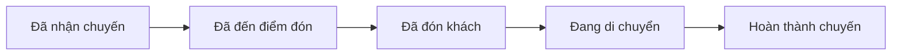
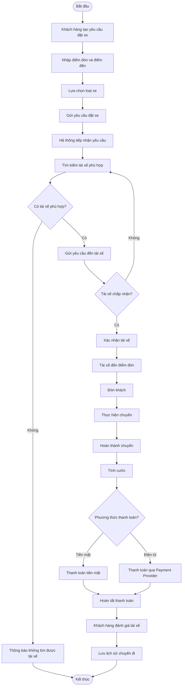
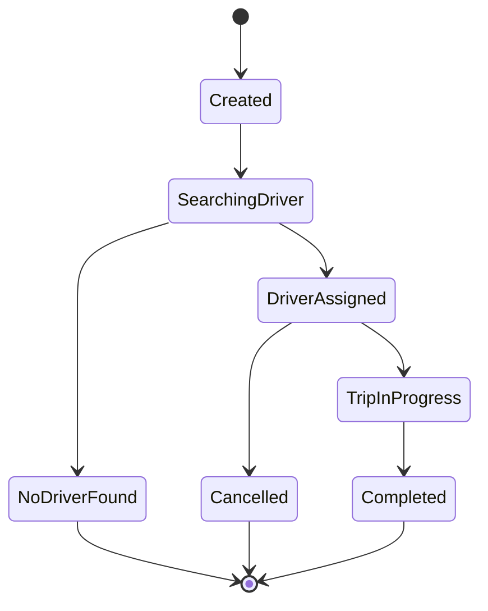
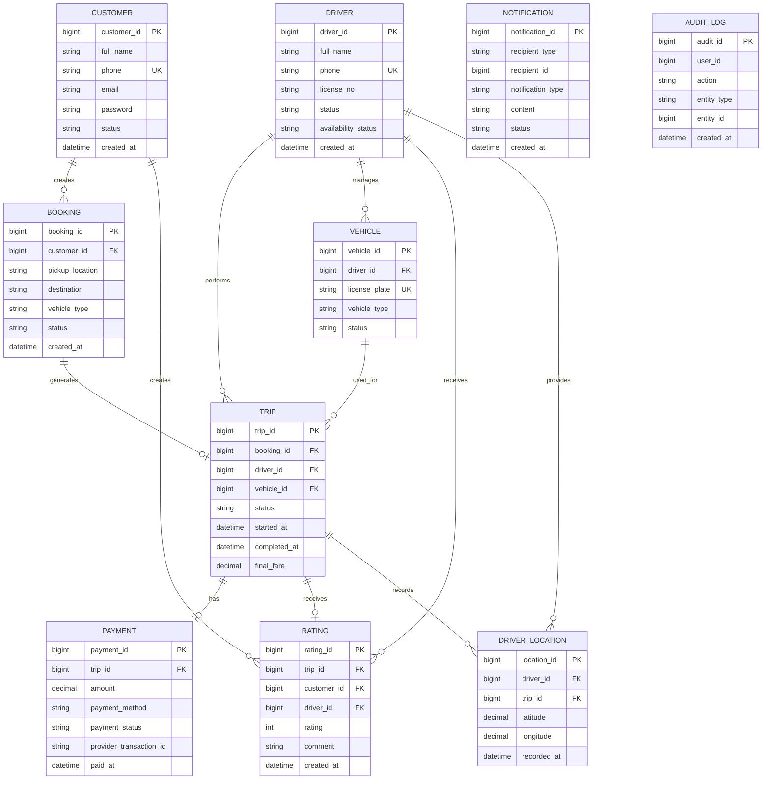
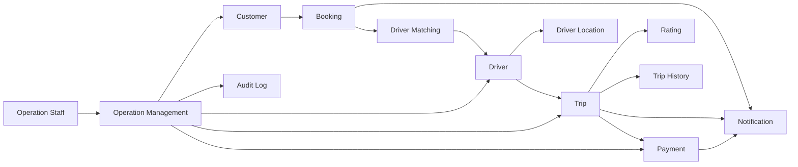
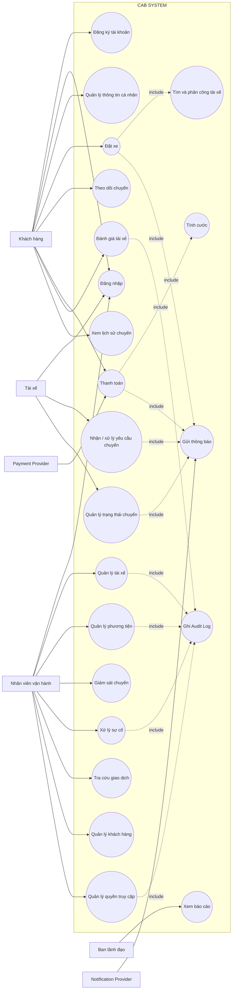
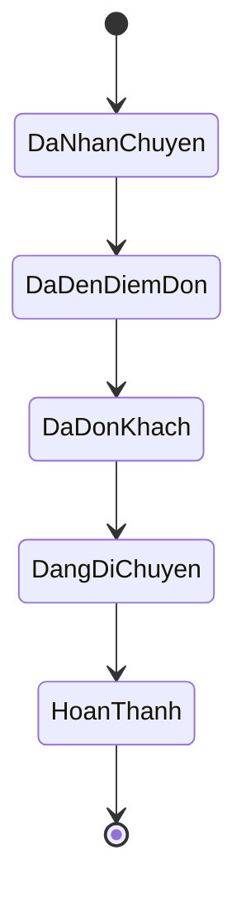
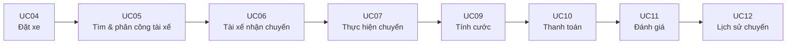
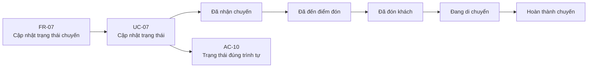

Xác định Bussiness context và Businness Problem: 
1. Business context:

   Công ty ABC là doanh nghiệp cung cấp dịch vụ đặt xe trực tuyến. Hiện tại, khách hàng có hai cách để yêu cầu xe:
  + Liên hệ thông qua tổng đài.
  + Sử dụng một ứng dụng đơn giản.
  Doanh nghiệp ABC mong muốn xây dựng một nền tảng CAB mới có khả năng phục vụ số lượng lớn khách hàng và tài xế, đồng thời có thể phát triển thêm các tính năng trong tương lai.

2. Stakeholder
    
  | Stakeholder                        | Vai trò trong business                                                      |
| ---------------------------------- | --------------------------------------------------------------------------- |
| **Khách hàng**                     | Tạo yêu cầu đặt xe, theo dõi chuyến, thanh toán, đánh giá tài xế            |
| **Tài xế**                         | Nhận chuyến, thực hiện chuyến, cập nhật trạng thái và vị trí                |
| **Nhân viên vận hành**             | Quản lý khách hàng, tài xế, phương tiện, chuyến đi và xử lý sự cố           |
| **Ban lãnh đạo**                   | Theo dõi doanh thu, số lượng chuyến, hiệu quả vận hành và đưa ra quyết định |
| **Nhà cung cấp thanh toán**        | Xử lý giao dịch thanh toán điện tử                                          |
| **Nhà cung cấp dịch vụ thông báo** | Hỗ trợ gửi thông báo đến khách hàng/tài xế                                  |

Bảng: Xác định stakeholder và vai trò.

STAKEHOLDER MATRIC:


| Power \ Interest | Thấp | Cao |
|---|---|---|
| **Cao** | **KEEP SATISFIED**<br>• Nhà cung cấp thanh toán | **MANAGE CLOSELY**<br>• Ban lãnh đạo<br>• Nhân viên vận hành |
| **Thấp** | **MONITOR**<br>• Nhà cung cấp thông báo | **KEEP INFORMED**<br>• Khách hàng<br>• Tài xế |
              

| Nhóm                  | Stakeholder             | Chiến lược                                                                                     |
| --------------------- | ----------------------- | ---------------------------------------------------------------------------------------------- |
| **Manage Closely** | Ban lãnh đạo            | Thường xuyên trao đổi, xác nhận mục tiêu, phạm vi, business rules và các quyết định quan trọng |
| **Manage Closely** | Nhân viên vận hành      | Workshop/interview để khai thác quy trình nghiệp vụ, exception và operational requirements     |
| **Keep Informed**  | Khách hàng              | Thu thập nhu cầu, pain points, feedback về quy trình đặt xe và trải nghiệm                     |
| **Keep Informed**  | Tài xế                  | Khai thác quy trình nhận chuyến, cập nhật trạng thái, vị trí và các trường hợp ngoại lệ        |
| **Keep Satisfied** | Nhà cung cấp thanh toán | Xác định interface, payment flow, lỗi giao dịch và yêu cầu tích hợp                            |
| **Monitor**        | Nhà cung cấp thông báo  | Xác định yêu cầu tích hợp và khả năng thay thế/mở rộng provider                                |

3. Xác định business goal

| ID       | Business Goal                                             | Business Value                                          |
| -------- | --------------------------------------------------------- | ------------------------------------------------------- |
| **BG01** | Nâng cao hiệu quả vận hành dịch vụ đặt xe                 | Giảm thao tác thủ công, nâng cao hiệu suất              |
| **BG02** | Cải thiện trải nghiệm khách hàng                          | Tăng tính minh bạch và khả năng theo dõi chuyến         |
| **BG03** | Tự động hóa và tối ưu phân công tài xế                    | Giảm thời gian tìm tài xế, tăng hiệu quả sử dụng tài xế |
| **BG04** | Tăng khả năng mở rộng hoạt động kinh doanh                | Phục vụ nhiều khách hàng và tài xế hơn                  |
| **BG05** | Tăng khả năng khả năng thanh toán | Hỗ trợ tích hợp thanh toán bằng cả tiền mặt và thanh toán bằng vi điện tử         |
| **BG06** | Xây dựng nền tảng có khả năng phát triển lâu dài          | Dễ mở rộng dịch vụ và thay đổi trong tương lai          |

4. Scope

Mô hình hoá phạm vi:

                    ┌──────────────────────────┐
                    │       CAB SYSTEM         │
                    │                          │
                    │  Booking Management      │
                    │  Driver Management       │
                    │  Trip Management         │
                    │  Driver Matching         │
                    │  Fare & Payment          │
                    │  Notification            │
                    │  Rating & History        │
                    │  Operation Management    │
                    │  Reporting               │
                    │  Authentication & Access │
                    │  Audit & Security        │
                    └───────────┬──────────────┘
                                │
          ┌─────────────────────┼──────────────────────┐
          │                     │                      │
     Khách hàng               Tài xế              Nhân viên
                                                    vận hành
                                │
                    ┌───────────┴─────────────┐
                    │                         │
             Payment Provider          Notification Provider


4.1. Mục tiêu phạm vi

CAB System là nền tảng hỗ trợ toàn bộ quy trình đặt xe, từ khi khách hàng tạo yêu cầu đến khi chuyến đi hoàn thành, thanh toán và đánh giá. Hệ thống đồng thời hỗ trợ quản trị vận hành, báo cáo và tích hợp với các dịch vụ bên ngoài.

---
 
4.2. In Scope

**IS01** – Customer Management

- Đăng ký tài khoản khách hàng
- Đăng nhập và xác thực
- Cập nhật thông tin cá nhân
- Quản lý thông tin tài khoản
- Xem lịch sử chuyến đi

**Liên quan:** BG02 – Cải thiện trải nghiệm khách hàng.


**IS02** – Booking Management

- Nhập điểm đón
- Nhập điểm đến
- Lựa chọn loại xe
- Gửi yêu cầu đặt xe
- Tiếp nhận yêu cầu đặt xe
- Theo dõi trạng thái yêu cầu

Đây là một trong những quy trình nghiệp vụ cốt lõi của CAB System.


**IS03** – Driver Management

- Đăng ký tài xế
- Nhân viên vận hành tạo tài khoản tài xế
- Quản lý hồ sơ tài xế
- Quản lý thông tin phương tiện
- Cập nhật trạng thái hoạt động
- Chuyển sang trạng thái sẵn sàng nhận chuyến


**IS04** – Driver Matching & Assignment

Hệ thống hỗ trợ:

- Xác định tài xế phù hợp
- Xem xét vị trí tài xế
- Xem xét trạng thái sẵn sàng
- Ưu tiên tài xế phù hợp và gần khách hàng
- Gửi yêu cầu chuyến đến tài xế
- Xử lý trường hợp tài xế không phản hồi
- Xử lý trường hợp tài xế từ chối
- Tiếp tục tìm tài xế khác
- Thông báo cho khách hàng nếu không tìm được tài xế

**Liên quan:** BG03 – Tự động hóa và tối ưu phân công tài xế.

> **Open Business Rule:** Tiêu chí cụ thể để ưu tiên tài xế chưa được khách hàng xác định.

**IS05** – Trip Management

Trạng thái chuyến cần phản ánh được các giai đoạn:

5. Business Requirement

| BR ID    | Tên Business Requirement                     | Mô tả                                                                                                                                                                         |
| -------- | -------------------------------------------- | ----------------------------------------------------------------------------------------------------------------------------------------------------------------------------- |
| **BR01** | **Số hóa quy trình đặt xe**                  | Hệ thống phải hỗ trợ doanh nghiệp số hóa và quản lý tập trung quy trình đặt xe, từ khi khách hàng tạo yêu cầu đến khi chuyến đi hoàn thành, thanh toán và đánh giá.           |
| **BR02** | **Tự động hóa tìm và phân công tài xế**      | Hệ thống phải hỗ trợ tự động tìm kiếm và phân công tài xế phù hợp dựa trên vị trí, trạng thái sẵn sàng và các tiêu chí vận hành của doanh nghiệp.                             |
| **BR03** | **Cải thiện trải nghiệm khách hàng**         | Hệ thống phải giúp khách hàng dễ dàng theo dõi yêu cầu đặt xe, tài xế, thời gian dự kiến đến, trạng thái chuyến đi, thanh toán và lịch sử chuyến.                             |
| **BR04** | **Quản lý tập trung hoạt động vận hành**     | Hệ thống phải cung cấp nền tảng tập trung để doanh nghiệp quản lý khách hàng, tài xế, phương tiện, chuyến đi và hỗ trợ xử lý các trường hợp chuyến bị lỗi.                    |
| **BR05** | **Quản lý vòng đời chuyến đi**               | Hệ thống phải hỗ trợ quản lý và theo dõi toàn bộ quá trình thực hiện chuyến, từ khi tài xế nhận chuyến, đến điểm đón, đón khách, di chuyển và hoàn thành chuyến.              |
| **BR06** | **Quản lý cước và thanh toán**               | Hệ thống phải hỗ trợ tính cước, thanh toán bằng tiền mặt hoặc phương thức điện tử, theo dõi kết quả giao dịch và xử lý trường hợp thanh toán thất bại.                        |
| **BR07** | **Quản lý thông báo**                        | Hệ thống phải cung cấp thông báo kịp thời cho khách hàng và tài xế về các sự kiện quan trọng trong quá trình đặt và thực hiện chuyến đi.                                      |
| **BR08** | **Giám sát và báo cáo hoạt động kinh doanh** | Hệ thống phải cung cấp dữ liệu và báo cáo về số lượng chuyến, doanh thu, tỷ lệ hoàn thành, tỷ lệ hủy và hiệu quả hoạt động của tài xế để hỗ trợ quản lý và ra quyết định.     |
| **BR09** | **Khả năng mở rộng hệ thống**                | Hệ thống phải có khả năng đáp ứng sự gia tăng về số lượng khách hàng, tài xế và yêu cầu đặt xe, đồng thời hạn chế việc một thành phần gặp lỗi ảnh hưởng đến toàn bộ hệ thống. |
| **BR10** | **Khả năng phát triển và mở rộng dịch vụ**   | Hệ thống phải cho phép doanh nghiệp bổ sung loại dịch vụ, phương thức thanh toán, nhà cung cấp thông báo và các chức năng mới mà không phải xây dựng lại toàn bộ hệ thống.    |
| **BR11** | **Bảo mật và kiểm soát dữ liệu**             | Hệ thống phải đảm bảo xác thực người dùng, kiểm soát quyền truy cập, bảo vệ thông tin cá nhân, phương tiện, vị trí và giao dịch, đồng thời lưu vết các thao tác quan trọng.   |

6. Business Process

7. Component Functional Requirement

CAB SYSTEM
│
├── 1. Customer Management
├── 2. Booking Management
├── 3. Driver Management
├── 4. Driver Matching & Assignment
├── 5. Trip Management
├── 6. Fare & Payment Management
├── 7. Notification Management
├── 8. Rating & Trip History
├── 9. Operation Management
├── 10. Reporting & Business Monitoring
└── 11. Authentication & Access Control

| Component                           | FR ID    | Functional Requirement                                                                               | BR liên quan |
| ----------------------------------- | -------- | ---------------------------------------------------------------------------------------------------- | ------------ |
| **Customer Management**             | FR-CM-01 | Hệ thống cho phép khách hàng đăng ký tài khoản.                                                      | BR01, BR03   |
|                                     | FR-CM-02 | Hệ thống cho phép khách hàng đăng nhập và xác thực tài khoản.                                        | BR03, BR11   |
|                                     | FR-CM-03 | Hệ thống cho phép khách hàng cập nhật thông tin cá nhân.                                             | BR03         |
|                                     | FR-CM-04 | Hệ thống cho phép khách hàng xem lịch sử chuyến đi.                                                  | BR03         |
| **Booking Management**              | FR-BK-01 | Hệ thống cho phép khách hàng nhập điểm đón và điểm đến.                                              | BR01         |
|                                     | FR-BK-02 | Hệ thống cho phép khách hàng lựa chọn loại xe khi đặt chuyến.                                        | BR01         |
|                                     | FR-BK-03 | Hệ thống cho phép khách hàng gửi yêu cầu đặt xe.                                                     | BR01         |
|                                     | FR-BK-04 | Hệ thống tiếp nhận và ghi nhận yêu cầu đặt xe.                                                       | BR01         |
|                                     | FR-BK-05 | Hệ thống cập nhật trạng thái của yêu cầu đặt xe.                                                     | BR01, BR03   |
| **Driver Management**               | FR-DM-01 | Hệ thống cho phép quản lý thông tin hồ sơ tài xế.                                                    | BR04         |
|                                     | FR-DM-02 | Hệ thống cho phép quản lý thông tin phương tiện của tài xế.                                          | BR04         |
|                                     | FR-DM-03 | Hệ thống cho phép tài xế cập nhật trạng thái sẵn sàng nhận chuyến.                                   | BR02, BR04   |
|                                     | FR-DM-04 | Hệ thống cho phép nhân viên vận hành xem và quản lý thông tin tài xế.                                | BR04         |
| **Driver Matching & Assignment**    | FR-MA-01 | Hệ thống xác định các tài xế phù hợp với yêu cầu đặt xe.                                             | BR02         |
|                                     | FR-MA-02 | Hệ thống xem xét vị trí và trạng thái sẵn sàng của tài xế khi tìm kiếm.                              | BR02         |
|                                     | FR-MA-03 | Hệ thống gửi yêu cầu chuyến đến tài xế được lựa chọn.                                                | BR02         |
|                                     | FR-MA-04 | Hệ thống ghi nhận phản hồi của tài xế đối với yêu cầu chuyến.                                        | BR02         |
|                                     | FR-MA-05 | Hệ thống tiếp tục tìm tài xế khác khi tài xế từ chối hoặc không phản hồi.                            | BR02         |
|                                     | FR-MA-06 | Hệ thống thông báo cho khách hàng khi không tìm được tài xế phù hợp.                                 | BR02, BR03   |
| **Trip Management**                 | FR-TR-01 | Hệ thống tạo và quản lý chuyến sau khi tài xế chấp nhận yêu cầu.                                     | BR05         |
|                                     | FR-TR-02 | Hệ thống cho phép tài xế cập nhật trạng thái chuyến.                                                 | BR05         |
|                                     | FR-TR-03 | Hệ thống quản lý các trạng thái: nhận chuyến, đến điểm đón, đón khách, đang di chuyển và hoàn thành. | BR05         |
|                                     | FR-TR-04 | Hệ thống ghi nhận vị trí của tài xế trong quá trình thực hiện chuyến.                                | BR05         |
|                                     | FR-TR-05 | Hệ thống cung cấp trạng thái chuyến cho khách hàng.                                                  | BR03, BR05   |
| **Fare & Payment**                  | FR-PM-01 | Hệ thống xác định số tiền khách hàng phải thanh toán cho chuyến đi.                                  | BR06         |
|                                     | FR-PM-02 | Hệ thống hỗ trợ ghi nhận thanh toán bằng tiền mặt.                                                   | BR06         |
|                                     | FR-PM-03 | Hệ thống hỗ trợ thanh toán điện tử thông qua Payment Provider.                                       | BR06         |
|                                     | FR-PM-04 | Hệ thống ghi nhận trạng thái giao dịch thanh toán.                                                   | BR06         |
|                                     | FR-PM-05 | Hệ thống xử lý trạng thái thanh toán thất bại.                                                       | BR06         |
|                                     | FR-PM-06 | Hệ thống lưu thông tin lịch sử giao dịch.                                                            | BR06         |
| **Notification Management**         | FR-NT-01 | Hệ thống gửi thông báo khi yêu cầu đặt xe được tiếp nhận.                                            | BR07         |
|                                     | FR-NT-02 | Hệ thống thông báo cho khách hàng khi tài xế nhận chuyến.                                            | BR07         |
|                                     | FR-NT-03 | Hệ thống thông báo khi tài xế đến điểm đón.                                                          | BR07         |
|                                     | FR-NT-04 | Hệ thống thông báo khi chuyến đi hoàn thành.                                                         | BR07         |
|                                     | FR-NT-05 | Hệ thống thông báo kết quả thanh toán cho khách hàng.                                                | BR07         |
|                                     | FR-NT-06 | Hệ thống gửi thông báo chuyến mới cho tài xế.                                                        | BR07         |
| **Rating & Trip History**           | FR-RH-01 | Hệ thống cho phép khách hàng xem lịch sử chuyến đi.                                                  | BR03         |
|                                     | FR-RH-02 | Hệ thống cho phép khách hàng xem thông tin thanh toán của chuyến.                                    | BR03, BR06   |
|                                     | FR-RH-03 | Hệ thống cho phép khách hàng đánh giá tài xế sau khi chuyến hoàn thành.                              | BR03         |
| **Operation Management**            | FR-OM-01 | Hệ thống cho phép nhân viên vận hành quản lý khách hàng.                                             | BR04         |
|                                     | FR-OM-02 | Hệ thống cho phép nhân viên vận hành quản lý tài xế.                                                 | BR04         |
|                                     | FR-OM-03 | Hệ thống cho phép nhân viên vận hành quản lý phương tiện.                                            | BR04         |
|                                     | FR-OM-04 | Hệ thống cho phép nhân viên vận hành theo dõi các chuyến đang diễn ra.                               | BR04, BR05   |
|                                     | FR-OM-05 | Hệ thống cho phép nhân viên vận hành kiểm tra trạng thái tài xế.                                     | BR04         |
|                                     | FR-OM-06 | Hệ thống hỗ trợ nhân viên vận hành xử lý các trường hợp chuyến bị lỗi.                               | BR04         |
|                                     | FR-OM-07 | Hệ thống cho phép nhân viên vận hành tra cứu lịch sử giao dịch.                                      | BR04, BR06   |
| **Reporting & Monitoring**          | FR-RP-01 | Hệ thống cung cấp báo cáo về số lượng chuyến.                                                        | BR08         |
|                                     | FR-RP-02 | Hệ thống cung cấp báo cáo về doanh thu.                                                              | BR08         |
|                                     | FR-RP-03 | Hệ thống cung cấp tỷ lệ chuyến hoàn thành.                                                           | BR08         |
|                                     | FR-RP-04 | Hệ thống cung cấp tỷ lệ chuyến bị hủy.                                                               | BR08         |
|                                     | FR-RP-05 | Hệ thống cung cấp thông tin về hiệu quả hoạt động của tài xế.                                        | BR08         |
| **Authentication & Access Control** | FR-AC-01 | Hệ thống xác thực người dùng trước khi cho phép truy cập các chức năng yêu cầu tài khoản.            | BR11         |
|                                     | FR-AC-02 | Hệ thống phân quyền truy cập theo vai trò người dùng.                                                | BR11         |
|                                     | FR-AC-03 | Hệ thống kiểm soát quyền truy cập vào các chức năng quản trị.                                        | BR11         |
|                                     | FR-AC-04 | Hệ thống lưu vết các thao tác quan trọng của người dùng.                                             | BR11         |

8. Business Rule and exception

Business Rule được xây dựng nhằm xác định các quy tắc nghiệp vụ mà hệ thống CAB phải tuân thủ trong quá trình đặt xe, phân công tài xế, thực hiện chuyến, thanh toán và vận hành hệ thống.

8.1. Business Rule

| BRL ID    | Nhóm            | Business Rule                                                        | Mô tả                                                                                                                         |
| --------- | --------------- | -------------------------------------------------------------------- | ----------------------------------------------------------------------------------------------------------------------------- |
| **BRL01** | Booking         | **Yêu cầu đặt xe phải có đầy đủ thông tin**                          | Một yêu cầu đặt xe phải có điểm đón, điểm đến và loại xe trước khi được gửi đến hệ thống.                                     |
| **BRL02** | Booking         | **Mỗi yêu cầu đặt xe có một trạng thái**                             | Yêu cầu đặt xe phải được quản lý theo trạng thái để hệ thống và các bên liên quan biết được tình trạng xử lý.                 |
| **BRL03** | Booking         | **Không được xử lý yêu cầu thiếu thông tin**                         | Hệ thống không cho phép tiếp nhận yêu cầu nếu thiếu các thông tin bắt buộc.                                                   |
| **BRL04** | Driver          | **Chỉ tài xế sẵn sàng mới được xem xét phân công**                   | Tài xế không ở trạng thái sẵn sàng nhận chuyến không được đưa vào danh sách tìm kiếm tài xế.                                  |
| **BRL05** | Driver Matching | **Tài xế phải phù hợp với yêu cầu chuyến**                           | Hệ thống chỉ gửi yêu cầu chuyến đến tài xế đáp ứng các điều kiện vận hành được xác định.                                      |
| **BRL06** | Driver Matching | **Ưu tiên tài xế phù hợp và gần khách hàng**                         | Khi tìm kiếm tài xế, hệ thống phải xem xét vị trí và trạng thái sẵn sàng của tài xế.                                          |
| **BRL07** | Driver Matching | **Một yêu cầu chỉ được xác nhận bởi một tài xế**                     | Khi một tài xế đã chấp nhận và được hệ thống xác nhận, yêu cầu không tiếp tục được phân cho tài xế khác.                      |
| **BRL08** | Driver Matching | **Tài xế từ chối hoặc không phản hồi thì tiếp tục tìm kiếm**         | Hệ thống phải tiếp tục quá trình tìm tài xế khác khi tài xế được gửi yêu cầu không chấp nhận chuyến.                          |
| **BRL09** | Trip            | **Chuyến chỉ được tạo sau khi tài xế chấp nhận**                     | Hệ thống chỉ tạo chuyến chính thức sau khi tài xế chấp nhận yêu cầu đặt xe.                                                   |
| **BRL10** | Trip            | **Trạng thái chuyến phải tuân theo trình tự nghiệp vụ**              | Chuyến đi được thực hiện theo trình tự: Đã nhận chuyến → Đã đến điểm đón → Đã đón khách → Đang di chuyển → Hoàn thành chuyến. |
| **BRL11** | Trip            | **Chỉ tài xế được phân công mới được cập nhật chuyến**               | Tài xế khác không được phép cập nhật trạng thái của chuyến không thuộc mình.                                                  |
| **BRL12** | Trip            | **Chỉ chuyến hoàn thành mới được tính cước cuối cùng**               | Việc hoàn tất chuyến phải xảy ra trước khi hệ thống xác định số tiền cần thanh toán.                                          |
| **BRL13** | Payment         | **Chuyến phải có thông tin thanh toán**                              | Sau khi hoàn thành chuyến, hệ thống phải ghi nhận số tiền và phương thức thanh toán của chuyến.                               |
| **BRL14** | Payment         | **Hỗ trợ tiền mặt và thanh toán điện tử**                            | Khách hàng có thể thanh toán bằng tiền mặt hoặc thông qua Payment Provider.                                                   |
| **BRL15** | Payment         | **Thanh toán điện tử phải có kết quả giao dịch**                     | Giao dịch điện tử phải được ghi nhận với trạng thái phù hợp, bao gồm thành công hoặc thất bại.                                |
| **BRL16** | Rating          | **Chỉ được đánh giá sau khi chuyến hoàn thành**                      | Khách hàng chỉ được đánh giá tài xế sau khi chuyến đã hoàn thành.                                                             |
| **BRL17** | History         | **Chuyến hoàn thành phải được lưu lịch sử**                          | Thông tin chuyến, thanh toán và đánh giá phải được lưu để khách hàng và nhân viên vận hành có thể tra cứu.                    |
| **BRL18** | Access Control  | **Người dùng chỉ được truy cập chức năng theo vai trò**              | Khách hàng, tài xế và nhân viên vận hành chỉ được sử dụng các chức năng thuộc quyền của mình.                                 |
| **BRL19** | Operation       | **Thao tác quản trị quan trọng phải được lưu vết**                   | Các thao tác quan trọng của nhân viên vận hành phải được ghi nhận để phục vụ kiểm tra và truy vết.                            |
| **BRL20** | Matching        | **Tiêu chí ưu tiên tài xế là Business Rule có thể cấu hình/mở rộng** | Tiêu chí cụ thể để xếp hạng tài xế chưa được xác định trong phạm vi hiện tại và cần được doanh nghiệp xác nhận.               |

> **Lưu ý:** BRL20 kế thừa từ Open Business Rule đã xác định ở IS04. Vì vậy, không nên tự quy định cứng như "tài xế gần nhất luôn được ưu tiên" nếu doanh nghiệp chưa xác nhận.

8.2. Business Rule cho trạng thái

Booking Status

Một yêu cầu đặt xe có thể được quản lý theo các trạng thái nghiệp vụ:



Trong đó:

* **Created:** Yêu cầu đặt xe đã được khách hàng tạo.
* **SearchingDriver:** Hệ thống đang tìm tài xế.
* **DriverAssigned:** Đã xác định và phân công tài xế.
* **NoDriverFound:** Không tìm được tài xế phù hợp.
* **TripInProgress:** Chuyến đã được thực hiện.
* **Completed:** Chuyến đã hoàn thành.
* **Cancelled:** Yêu cầu/chuyến bị hủy.

#### Trip Status

Trạng thái chuyến phải phản ánh đúng quá trình thực hiện:


Không cho phép bỏ qua các trạng thái trong quy trình nghiệp vụ nếu không có Business Rule/Exception được doanh nghiệp xác nhận.

8.3. Exception

| EX ID    | Tình huống                                               | Cách xử lý                                                                                          |
| -------- | -------------------------------------------------------- | --------------------------------------------------------------------------------------------------- |
| **EX01** | Khách hàng nhập thiếu điểm đón hoặc điểm đến             | Hệ thống từ chối yêu cầu và yêu cầu khách hàng bổ sung thông tin.                                   |
| **EX02** | Không có tài xế phù hợp                                  | Hệ thống kết thúc quá trình tìm kiếm và thông báo cho khách hàng không tìm được tài xế.             |
| **EX03** | Tài xế từ chối chuyến                                    | Hệ thống ghi nhận việc từ chối và tiếp tục tìm tài xế khác.                                         |
| **EX04** | Tài xế không phản hồi                                    | Hệ thống ghi nhận không phản hồi và tiếp tục tìm tài xế khác theo quy tắc phân công.                |
| **EX05** | Tài xế mất trạng thái sẵn sàng trong quá trình phân công | Hệ thống không tiếp tục phân công chuyến cho tài xế đó và thực hiện tìm kiếm tài xế khác.           |
| **EX06** | Tài xế không thể tiếp tục thực hiện chuyến               | Nhân viên vận hành có thể kiểm tra và xử lý sự cố theo quy trình vận hành.                          |
| **EX07** | Thanh toán điện tử thất bại                              | Hệ thống ghi nhận giao dịch thất bại và thông báo kết quả thanh toán cho khách hàng.                |
| **EX08** | Không thể kết nối Payment Provider                       | Hệ thống không xác nhận giao dịch thành công khi chưa nhận được kết quả hợp lệ từ Payment Provider. |
| **EX09** | Người dùng truy cập chức năng không có quyền             | Hệ thống từ chối truy cập và ghi nhận sự kiện theo cơ chế kiểm soát quyền.                          |
| **EX10** | Xảy ra lỗi trong quá trình thực hiện chuyến              | Hệ thống ghi nhận trạng thái/sự cố để nhân viên vận hành kiểm tra và xử lý.                         |
| **EX11** | Tài xế cố cập nhật chuyến không thuộc mình               | Hệ thống từ chối thao tác.                                                                          |
| **EX12** | Khách hàng cố đánh giá chuyến chưa hoàn thành            | Hệ thống từ chối thao tác đánh giá.                                                                 |

8.4. Nguyên tắc xử lý Exception

Các Exception trong CAB System cần tuân thủ các nguyên tắc:

1. **Không làm mất dữ liệu nghiệp vụ**: thông tin yêu cầu, chuyến và giao dịch đã phát sinh phải được lưu lại.
2. **Phải cập nhật trạng thái phù hợp** khi xảy ra lỗi.
3. **Thông báo cho đúng stakeholder** khi Exception ảnh hưởng đến quá trình đặt hoặc thực hiện chuyến.
4. **Các lỗi liên quan vận hành phải có khả năng truy vết** thông qua lịch sử thao tác.
5. **Không xác nhận thành công khi hệ thống chưa nhận được kết quả hợp lệ**, đặc biệt đối với thanh toán điện tử.
6. **Exception không được làm sai lệch vòng đời chuyến** hoặc tạo ra nhiều chuyến cho cùng một yêu cầu đặt xe.

9. Data modeling.

Data Modeling của CAB System được xây dựng dựa trên các nghiệp vụ đã xác định ở các phần Business Requirement, Business Process và Component Functional Requirement.

Mục tiêu của mô hình dữ liệu là quản lý tập trung thông tin về:

* Khách hàng
* Tài xế
* Phương tiện
* Yêu cầu đặt xe
* Chuyến đi
* Thanh toán
* Đánh giá
* Thông báo
* Lịch sử thao tác vận hành

9.1. Các Entity chính

| Entity             | Mục đích                                                                    |
| ------------------ | --------------------------------------------------------------------------- |
| **Customer**       | Lưu thông tin tài khoản và thông tin cá nhân của khách hàng.                |
| **Driver**         | Lưu thông tin hồ sơ và trạng thái hoạt động của tài xế.                     |
| **Vehicle**        | Lưu thông tin phương tiện của tài xế.                                       |
| **Booking**        | Lưu yêu cầu đặt xe do khách hàng tạo.                                       |
| **Trip**           | Lưu thông tin chuyến được tạo sau khi tài xế chấp nhận booking.             |
| **Payment**        | Lưu thông tin thanh toán của chuyến.                                        |
| **Rating**         | Lưu đánh giá của khách hàng đối với tài xế sau chuyến đi.                   |
| **Notification**   | Lưu thông tin các thông báo được gửi đến khách hàng hoặc tài xế.            |
| **DriverLocation** | Lưu thông tin vị trí của tài xế trong quá trình hoạt động/thực hiện chuyến. |
| **AuditLog**       | Lưu vết các thao tác quan trọng của người dùng và nhân viên vận hành.       |

9.2. Entity và Attribute

#### Customer

| Attribute   | Mô tả                   | Key    |
| ----------- | ----------------------- | ------ |
| customer_id | Mã khách hàng           | PK     |
| full_name   | Họ tên khách hàng       |        |
| phone       | Số điện thoại           | Unique |
| email       | Email                   |        |
| password    | Thông tin xác thực      |        |
| status      | Trạng thái tài khoản    |        |
| created_at  | Thời điểm tạo tài khoản |        |

#### Driver

| Attribute           | Mô tả                           | Key    |
| ------------------- | ------------------------------- | ------ |
| driver_id           | Mã tài xế                       | PK     |
| full_name           | Họ tên tài xế                   |        |
| phone               | Số điện thoại                   | Unique |
| license_no          | Số giấy phép lái xe             |        |
| status              | Trạng thái tài xế               |        |
| availability_status | Trạng thái sẵn sàng nhận chuyến |        |
| created_at          | Thời điểm tạo hồ sơ             |        |

#### Vehicle

| Attribute     | Mô tả                    | Key    |
| ------------- | ------------------------ | ------ |
| vehicle_id    | Mã phương tiện           | PK     |
| driver_id     | Mã tài xế sở hữu/quản lý | FK     |
| license_plate | Biển số xe               | Unique |
| vehicle_type  | Loại xe                  |        |
| status        | Trạng thái phương tiện   |        |

#### Booking

| Attribute       | Mô tả                  | Key |
| --------------- | ---------------------- | --- |
| booking_id      | Mã yêu cầu đặt xe      | PK  |
| customer_id     | Khách hàng tạo yêu cầu | FK  |
| pickup_location | Điểm đón               |     |
| destination     | Điểm đến               |     |
| vehicle_type    | Loại xe được yêu cầu   |     |
| status          | Trạng thái booking     |     |
| created_at      | Thời điểm tạo yêu cầu  |     |

#### Trip

| Attribute    | Mô tả                 | Key |
| ------------ | --------------------- | --- |
| trip_id      | Mã chuyến             | PK  |
| booking_id   | Booking tương ứng     | FK  |
| driver_id    | Tài xế thực hiện      | FK  |
| vehicle_id   | Phương tiện thực hiện | FK  |
| status       | Trạng thái chuyến     |     |
| started_at   | Thời điểm bắt đầu     |     |
| completed_at | Thời điểm hoàn thành  |     |
| final_fare   | Cước cuối cùng        |     |

#### Payment

| Attribute               | Mô tả                            | Key |
| ----------------------- | -------------------------------- | --- |
| payment_id              | Mã thanh toán                    | PK  |
| trip_id                 | Chuyến được thanh toán           | FK  |
| amount                  | Số tiền thanh toán               |     |
| payment_method          | Phương thức thanh toán           |     |
| payment_status          | Trạng thái giao dịch             |     |
| provider_transaction_id | Mã giao dịch từ Payment Provider |     |
| paid_at                 | Thời điểm thanh toán             |     |

#### Rating

| Attribute   | Mô tả                | Key |
| ----------- | -------------------- | --- |
| rating_id   | Mã đánh giá          | PK  |
| trip_id     | Chuyến được đánh giá | FK  |
| customer_id | Người đánh giá       | FK  |
| driver_id   | Tài xế được đánh giá | FK  |
| rating      | Điểm đánh giá        |     |
| comment     | Nội dung đánh giá    |     |
| created_at  | Thời điểm đánh giá   |     |

#### Notification

| Attribute         | Mô tả           | Key |
| ----------------- | --------------- | --- |
| notification_id   | Mã thông báo    | PK  |
| recipient_type    | Loại người nhận |     |
| recipient_id      | Người nhận      |     |
| notification_type | Loại thông báo  |     |
| content           | Nội dung        |     |
| status            | Trạng thái gửi  |     |
| created_at        | Thời điểm tạo   |     |

#### DriverLocation

| Attribute   | Mô tả              | Key          |
| ----------- | ------------------ | ------------ |
| location_id | Mã bản ghi vị trí  | PK           |
| driver_id   | Tài xế             | FK           |
| trip_id     | Chuyến liên quan   | FK, Nullable |
| latitude    | Vĩ độ              |              |
| longitude   | Kinh độ            |              |
| recorded_at | Thời điểm ghi nhận |              |

#### AuditLog

| Attribute   | Mô tả                    | Key |
| ----------- | ------------------------ | --- |
| audit_id    | Mã log                   | PK  |
| user_id     | Người thực hiện thao tác |     |
| action      | Thao tác thực hiện       |     |
| entity_type | Đối tượng bị tác động    |     |
| entity_id   | Mã đối tượng             |     |
| created_at  | Thời điểm thao tác       |     |

9.3. Entity Relationship Diagram



9.4. Quan hệ giữa các Entity

**Customer – Booking**

* Một khách hàng có thể tạo nhiều yêu cầu đặt xe.
* Mỗi Booking thuộc về một khách hàng.
* Quan hệ: **1:N**.

**Booking – Trip**

* Một Booking có thể tạo tối đa một Trip chính thức.
* Trip chỉ được tạo sau khi tài xế chấp nhận yêu cầu.
* Quan hệ: **1:0..1**.

**Driver – Trip**

* Một tài xế có thể thực hiện nhiều chuyến theo thời gian.
* Mỗi Trip chỉ có một tài xế được phân công.
* Quan hệ: **1:N**.

**Driver – Vehicle**

* Một tài xế có thể quản lý/sử dụng một hoặc nhiều phương tiện theo phạm vi nghiệp vụ.
* Mỗi Vehicle được gắn với tài xế trong hệ thống.
* Quan hệ: **1:N**.

**Trip – Payment**

* Một chuyến có thông tin thanh toán tương ứng.
* Thanh toán có thể được thực hiện bằng tiền mặt hoặc thông qua Payment Provider.
* Quan hệ: **1:0..1**.

**Trip – Rating**

* Một chuyến hoàn thành có thể có đánh giá của khách hàng.
* Đánh giá chỉ được tạo sau khi chuyến hoàn thành.
* Quan hệ: **1:0..1**.

**Driver – DriverLocation**

* Một tài xế có thể phát sinh nhiều bản ghi vị trí.
* Các bản ghi vị trí được sử dụng để hỗ trợ việc tìm kiếm tài xế và theo dõi chuyến.
* Quan hệ: **1:N**.

9.5. Data Integrity Rules

Mô hình dữ liệu cần đảm bảo các nguyên tắc toàn vẹn sau:

1. `customer_id`, `driver_id`, `vehicle_id`, `booking_id`, `trip_id` và các mã định danh khác phải là duy nhất.
2. Booking phải tham chiếu đến một Customer hợp lệ.
3. Trip chỉ được tham chiếu đến Booking tồn tại.
4. Trip phải có Driver được phân công trước khi chuyển sang quá trình thực hiện.
5. Payment phải tham chiếu đến Trip tồn tại.
6. Rating chỉ được tạo cho Trip đã hoàn thành.
7. Một Trip không được có nhiều Rating nếu nghiệp vụ chỉ cho phép khách hàng đánh giá một lần.
8. DriverLocation phải tham chiếu đến Driver tồn tại.
9. Các giao dịch thanh toán phải lưu trạng thái để phân biệt thành công và thất bại.
10. Các thao tác quan trọng của hệ thống phải có khả năng truy vết thông qua AuditLog.

9.6. Mapping giữa Data Model và Functional Requirement

| Entity             | Functional Requirement liên quan         |
| ------------------ | ---------------------------------------- |
| **Customer**       | FR-CM-01 → FR-CM-04, FR-OM-01            |
| **Driver**         | FR-DM-01 → FR-DM-04, FR-MA-01 → FR-MA-06 |
| **Vehicle**        | FR-DM-02, FR-DM-04, FR-OM-03             |
| **Booking**        | FR-BK-01 → FR-BK-05                      |
| **Trip**           | FR-TR-01 → FR-TR-05, FR-OM-04            |
| **Payment**        | FR-PM-01 → FR-PM-06                      |
| **Rating**         | FR-RH-03                                 |
| **Notification**   | FR-NT-01 → FR-NT-06                      |
| **DriverLocation** | FR-TR-04, FR-MA-02                       |
| **AuditLog**       | FR-AC-04                                 |

9.7. Traceability tổng thể

Luồng dữ liệu chính của hệ thống được mô hình hóa như sau:



Mô hình trên đảm bảo dữ liệu hỗ trợ xuyên suốt quy trình nghiệp vụ chính:

**Customer → Booking → Driver Matching → Driver → Trip → Payment → Rating → Trip History**

đồng thời hỗ trợ các nghiệp vụ vận hành, thông báo, theo dõi vị trí và audit của hệ thống CAB.

10. Non-Functional Requirements

Yêu cầu phi chức năng xác định các tiêu chí về chất lượng, hiệu năng, bảo mật, khả năng mở rộng, độ ổn định và khả năng bảo trì của CAB System. Các yêu cầu này được xây dựng dựa trên kỳ vọng của Công ty ABC đối với một nền tảng đặt xe có khả năng phục vụ số lượng lớn khách hàng và tài xế, hoạt động ổn định trong thời gian nhu cầu cao và có khả năng phát triển lâu dài.

10.1. Performance – Hiệu năng

| NFR ID        | Yêu cầu phi chức năng | Tiêu chí                                                                                                                                                       |
| ------------- | --------------------- | -------------------------------------------------------------------------------------------------------------------------------------------------------------- |
| **NFR-PF-01** | Thời gian phản hồi    | Hệ thống phải phản hồi các thao tác thông thường của người dùng trong thời gian phù hợp, không gây gián đoạn trải nghiệm.                                      |
| **NFR-PF-02** | Tạo yêu cầu đặt xe    | Khi khách hàng gửi yêu cầu đặt xe, hệ thống phải nhanh chóng ghi nhận và chuyển yêu cầu sang quá trình tìm tài xế.                                             |
| **NFR-PF-03** | Tìm tài xế            | Hệ thống phải có khả năng xử lý việc tìm kiếm và phân công tài xế mà không yêu cầu khách hàng gửi lại yêu cầu khi tài xế đầu tiên từ chối hoặc không phản hồi. |
| **NFR-PF-04** | Cập nhật trạng thái   | Trạng thái chuyến và các thông tin quan trọng phải được cập nhật kịp thời cho khách hàng, tài xế và nhân viên vận hành.                                        |
| **NFR-PF-05** | Báo cáo               | Các báo cáo vận hành như số lượng chuyến, doanh thu, tỷ lệ hoàn thành và tỷ lệ hủy phải có khả năng được truy xuất trong thời gian chấp nhận được.             |

> **Lưu ý:** Customer Requirement chưa đưa ra con số cụ thể như thời gian phản hồi tối đa 2 giây hay số request/giây. Vì vậy, không nên tự đưa các con số này thành yêu cầu chính thức. Các ngưỡng định lượng cần được BA xác nhận thêm với stakeholder.

---

10.2. Availability – Tính sẵn sàng

| NFR ID        | Yêu cầu phi chức năng                        | Tiêu chí                                                                                                                                  |
| ------------- | -------------------------------------------- | ----------------------------------------------------------------------------------------------------------------------------------------- |
| **NFR-AV-01** | Hoạt động ổn định                            | Hệ thống phải hoạt động ổn định trong thời gian nhu cầu đặt xe tăng cao.                                                                  |
| **NFR-AV-02** | Không phụ thuộc hoàn toàn vào một thành phần | Lỗi tại một thành phần như Payment hoặc Notification không được làm toàn bộ chức năng đặt xe ngừng hoạt động.                             |
| **NFR-AV-03** | Khả năng tiếp tục hoạt động                  | Khi một dịch vụ bên ngoài tạm thời không khả dụng, các chức năng không phụ thuộc trực tiếp vào dịch vụ đó vẫn phải có khả năng hoạt động. |
| **NFR-AV-04** | Xử lý lỗi dịch vụ                            | Hệ thống phải có cơ chế ghi nhận và xử lý lỗi của các thành phần tích hợp bên ngoài.                                                      |

Customer Requirement xác định rõ doanh nghiệp không muốn lỗi tại **thanh toán hoặc thông báo** làm toàn bộ hệ thống đặt xe ngừng hoạt động.

---

10.3. Scalability – Khả năng mở rộng

| NFR ID        | Yêu cầu phi chức năng | Tiêu chí                                                                                                                                          |
| ------------- | --------------------- | ------------------------------------------------------------------------------------------------------------------------------------------------- |
| **NFR-SC-01** | Mở rộng theo tải      | Hệ thống phải có khả năng đáp ứng sự gia tăng số lượng khách hàng, tài xế và yêu cầu đặt xe.                                                      |
| **NFR-SC-02** | Mở rộng độc lập       | Các thành phần của hệ thống phải có khả năng mở rộng độc lập khi tải của từng thành phần tăng.                                                    |
| **NFR-SC-03** | Mở rộng chức năng     | Hệ thống phải cho phép bổ sung các chức năng mới mà hạn chế ảnh hưởng đến các chức năng đang hoạt động.                                           |
| **NFR-SC-04** | Mở rộng tích hợp      | Có khả năng bổ sung phương thức thanh toán, nhà cung cấp thông báo hoặc thay đổi thành phần kỹ thuật mà không phải xây dựng lại toàn bộ ứng dụng. |
| **NFR-SC-05** | Mở rộng dịch vụ       | Kiến trúc hệ thống phải đủ linh hoạt để hỗ trợ bổ sung các loại dịch vụ mới trong tương lai.                                                      |

Đây là một trong những nhóm NFR quan trọng nhất vì Customer Requirement nhiều lần nhấn mạnh mục tiêu xây dựng CAB như một **nền tảng có thể phát triển lâu dài**, thay vì chỉ là một ứng dụng đặt xe đơn giản.

---

10.4. Reliability – Độ tin cậy

| NFR ID        | Yêu cầu phi chức năng  | Tiêu chí                                                                                                                                           |
| ------------- | ---------------------- | -------------------------------------------------------------------------------------------------------------------------------------------------- |
| **NFR-RL-01** | Không mất dữ liệu      | Hệ thống phải hạn chế mất dữ liệu khi xảy ra lỗi trong quá trình đặt xe, thực hiện chuyến hoặc thanh toán.                                         |
| **NFR-RL-02** | Tính nhất quán         | Trạng thái Booking, Trip và Payment phải được duy trì nhất quán trong quá trình xử lý.                                                             |
| **NFR-RL-03** | Không tạo trùng chuyến | Một yêu cầu đặt xe không được tạo nhiều chuyến do lỗi xử lý hoặc việc tài xế phản hồi.                                                             |
| **NFR-RL-04** | Xử lý lỗi thanh toán   | Khi thanh toán điện tử thất bại, hệ thống phải ghi nhận trạng thái giao dịch và không xác nhận giao dịch là thành công nếu chưa có kết quả hợp lệ. |
| **NFR-RL-05** | Khôi phục              | Hệ thống cần có khả năng khôi phục hoạt động sau khi xảy ra lỗi của một thành phần.                                                                |

---

10.5. Security – Bảo mật

| NFR ID        | Yêu cầu phi chức năng                 | Tiêu chí                                                                                                                                |
| ------------- | ------------------------------------- | --------------------------------------------------------------------------------------------------------------------------------------- |
| **NFR-SE-01** | Authentication                        | Khách hàng và tài xế phải được xác thực trước khi sử dụng các chức năng yêu cầu tài khoản.                                              |
| **NFR-SE-02** | Authorization                         | Hệ thống phải kiểm soát quyền truy cập dựa trên vai trò người dùng.                                                                     |
| **NFR-SE-03** | Admin Access Control                  | Các chức năng quản trị nhạy cảm chỉ được phép thực hiện bởi người dùng có quyền phù hợp.                                                |
| **NFR-SE-04** | Bảo vệ thông tin cá nhân              | Thông tin cá nhân của khách hàng và tài xế phải được bảo vệ khỏi truy cập trái phép.                                                    |
| **NFR-SE-05** | Bảo vệ dữ liệu phương tiện            | Thông tin phương tiện phải được bảo vệ và chỉ được truy cập bởi các vai trò có quyền.                                                   |
| **NFR-SE-06** | Bảo vệ dữ liệu vị trí                 | Dữ liệu vị trí của tài xế phải được bảo vệ và kiểm soát quyền truy cập.                                                                 |
| **NFR-SE-07** | Bảo vệ dữ liệu giao dịch              | Thông tin giao dịch thanh toán phải được bảo vệ khỏi truy cập trái phép.                                                                |
| **NFR-SE-08** | Không lưu dữ liệu thanh toán nhạy cảm | Hệ thống CAB không được lưu trực tiếp thông tin nhạy cảm của thẻ hoặc tài khoản thanh toán; việc xử lý phải thông qua Payment Provider. |
| **NFR-SE-09** | Audit                                 | Các thao tác quản trị và thao tác quan trọng phải được lưu vết để phục vụ kiểm tra và điều tra sự cố.                                   |

Yêu cầu **không lưu trực tiếp thông tin nhạy cảm của thẻ/tài khoản thanh toán** được nêu rõ trong Customer Requirement.

---

10.6. Maintainability – Khả năng bảo trì

| NFR ID        | Yêu cầu phi chức năng | Tiêu chí                                                                                              |
| ------------- | --------------------- | ----------------------------------------------------------------------------------------------------- |
| **NFR-MT-01** | Tách biệt thành phần  | Các thành phần của hệ thống nên được thiết kế với mức phụ thuộc phù hợp để có thể bảo trì độc lập.    |
| **NFR-MT-02** | Thay đổi thành phần   | Có khả năng thay đổi một thành phần kỹ thuật mà hạn chế ảnh hưởng đến các thành phần khác.            |
| **NFR-MT-03** | Triển khai từng phần  | Các chức năng mới có thể được triển khai từng phần mà hạn chế ảnh hưởng đến chức năng đang hoạt động. |
| **NFR-MT-04** | Khả năng kiểm tra     | Các thành phần cần có khả năng được kiểm tra độc lập để hỗ trợ bảo trì và phát hiện lỗi.              |
| **NFR-MT-05** | Logging               | Các lỗi và thao tác quan trọng cần được ghi log để hỗ trợ phân tích và xử lý sự cố.                   |

---

10.7. Extensibility – Khả năng mở rộng trong tương lai

| NFR ID        | Yêu cầu phi chức năng        | Tiêu chí                                                                                         |
| ------------- | ---------------------------- | ------------------------------------------------------------------------------------------------ |
| **NFR-EX-01** | Thêm loại dịch vụ            | Có thể bổ sung loại dịch vụ đặt xe mới mà không phải xây dựng lại toàn bộ hệ thống.              |
| **NFR-EX-02** | Thêm Payment Provider        | Có thể tích hợp thêm hoặc thay đổi nhà cung cấp thanh toán.                                      |
| **NFR-EX-03** | Thêm Notification Provider   | Có thể bổ sung các kênh hoặc nhà cung cấp thông báo mới.                                         |
| **NFR-EX-04** | Thay đổi thành phần kỹ thuật | Có thể thay đổi một số thành phần kỹ thuật mà hạn chế ảnh hưởng đến toàn bộ hệ thống.            |
| **NFR-EX-05** | Bổ sung chức năng            | Có thể phát triển thêm các tính năng trong tương lai mà không cần xây dựng lại toàn bộ ứng dụng. |

---

10.8. Auditability – Khả năng truy vết

| NFR ID        | Yêu cầu phi chức năng | Tiêu chí                                                                          |
| ------------- | --------------------- | --------------------------------------------------------------------------------- |
| **NFR-AU-01** | Ghi nhận thao tác     | Hệ thống phải lưu vết các thao tác quan trọng của người dùng.                     |
| **NFR-AU-02** | Truy vết quản trị     | Các thao tác quản trị phải xác định được người thực hiện và thời điểm thực hiện.  |
| **NFR-AU-03** | Truy vết giao dịch    | Các giao dịch thanh toán phải có thông tin để phục vụ tra cứu và kiểm tra.        |
| **NFR-AU-04** | Truy vết sự cố        | Dữ liệu log phải hỗ trợ nhân viên vận hành kiểm tra nguyên nhân khi xảy ra sự cố. |

---

10.9. Compatibility & Integration – Tương thích và tích hợp

| NFR ID        | Yêu cầu phi chức năng    | Tiêu chí                                                                                                           |
| ------------- | ------------------------ | ------------------------------------------------------------------------------------------------------------------ |
| **NFR-IN-01** | Payment Integration      | Hệ thống phải có khả năng tích hợp với Payment Provider bên ngoài.                                                 |
| **NFR-IN-02** | Notification Integration | Hệ thống phải có khả năng tích hợp với Notification Provider.                                                      |
| **NFR-IN-03** | Thay thế Provider        | Việc thay đổi Payment Provider hoặc Notification Provider phải hạn chế ảnh hưởng đến các chức năng nghiệp vụ khác. |
| **NFR-IN-04** | Xử lý lỗi tích hợp       | Hệ thống phải có khả năng nhận biết và xử lý trường hợp dịch vụ bên ngoài không phản hồi hoặc trả về lỗi.          |

---

10.10. Open Issues liên quan đến NFR

Customer Requirement hiện vẫn **chưa xác định một số tiêu chí định lượng**. BA cần xác nhận với stakeholder trước khi nhóm phát triển triển khai chính thức:

| OI ID     | Vấn đề cần xác nhận                                                           |
| --------- | ----------------------------------------------------------------------------- |
| **OI-01** | Thời gian phản hồi tối đa của các chức năng quan trọng là bao nhiêu?          |
| **OI-02** | Hệ thống cần hỗ trợ tối đa bao nhiêu khách hàng/tài xế đồng thời?             |
| **OI-03** | Số lượng yêu cầu đặt xe tối đa trong một giây/phút là bao nhiêu?              |
| **OI-04** | Mức Availability/SLA doanh nghiệp mong muốn là bao nhiêu?                     |
| **OI-05** | Khi mất kết nối mạng, hệ thống phải xử lý như thế nào?                        |
| **OI-06** | Thời gian tài xế phải phản hồi yêu cầu chuyến là bao lâu?                     |
| **OI-07** | Thời gian lưu trữ dữ liệu chuyến, giao dịch, vị trí và Audit Log là bao lâu?  |
| **OI-08** | Chính sách backup và thời gian khôi phục dữ liệu khi có sự cố là như thế nào? |

Các vấn đề trên **không nên tự đặt giá trị** trong tài liệu yêu cầu nếu chưa được khách hàng xác nhận, vì chính Customer Requirement cũng xác định đây là những nội dung còn chưa chốt.

10.11. Tổng hợp NFR

Có thể nhóm các yêu cầu phi chức năng của CAB System thành:

```text
CAB SYSTEM – NON-FUNCTIONAL REQUIREMENTS
│
├── Performance
│   ├── Response Time
│   ├── Booking Processing
│   ├── Driver Matching
│   └── Status Update
│
├── Availability
│   ├── High-load Stability
│   ├── Fault Isolation
│   └── External Service Failure Handling
│
├── Scalability
│   ├── User/Request Scaling
│   ├── Independent Component Scaling
│   └── Functional Scaling
│
├── Reliability
│   ├── Data Consistency
│   ├── No Duplicate Trip
│   ├── Transaction Reliability
│   └── Recovery
│
├── Security
│   ├── Authentication
│   ├── Authorization
│   ├── Data Protection
│   ├── Payment Data Protection
│   └── Audit
│
├── Maintainability
│   ├── Component Independence
│   ├── Partial Deployment
│   └── Logging
│
├── Extensibility
│   ├── New Services
│   ├── New Payment Provider
│   └── New Notification Provider
│
└── Integration
    ├── Payment Provider
    └── Notification Provider
```

### Kết luận

Trong CAB System, các NFR quan trọng nhất cần được ưu tiên trong thiết kế kiến trúc là:

**Security → Availability → Scalability → Reliability → Performance → Extensibility → Maintainability.**

Đặc biệt, hệ thống phải đảm bảo **một lỗi ở Payment hoặc Notification không làm toàn bộ hệ thống đặt xe ngừng hoạt động**, các thành phần có thể **mở rộng độc lập**, và kiến trúc cho phép **bổ sung dịch vụ, Payment Provider, Notification Provider và chức năng mới trong tương lai**. Đây là những yêu cầu được nhấn mạnh trực tiếp trong mô tả khách hàng.

11. Thiết kế Use Case

11.1. Xác định Actor

Dựa trên Business Context, Business Process và Functional Requirement, CAB System có các actor chính sau:

| Actor ID | Actor                     | Vai trò                                                                            |
| -------- | ------------------------- | ---------------------------------------------------------------------------------- |
| **A01**  | **Khách hàng**            | Đăng ký, đặt xe, theo dõi chuyến, thanh toán, xem lịch sử và đánh giá tài xế.      |
| **A02**  | **Tài xế**                | Quản lý hồ sơ, phương tiện, trạng thái hoạt động, nhận chuyến và thực hiện chuyến. |
| **A03**  | **Nhân viên vận hành**    | Quản lý khách hàng, tài xế, phương tiện, chuyến đi và xử lý các trường hợp lỗi.    |
| **A04**  | **Ban lãnh đạo**          | Theo dõi báo cáo và các chỉ số hoạt động kinh doanh.                               |
| **A05**  | **Payment Provider**      | Hệ thống bên ngoài xử lý thanh toán điện tử.                                       |
| **A06**  | **Notification Provider** | Hệ thống bên ngoài hỗ trợ gửi thông báo.                                           |

---

11.2. Danh sách Use Case

| UC ID    | Use Case                     | Actor chính                            | Functional Requirement       |
| -------- | ---------------------------- | -------------------------------------- | ---------------------------- |
| **UC01** | Đăng ký tài khoản khách hàng | Khách hàng                             | FR-CM-01                     |
| **UC02** | Đăng nhập hệ thống           | Khách hàng, Tài xế, Nhân viên vận hành | FR-CM-02, FR-AC-01           |
| **UC03** | Quản lý thông tin cá nhân    | Khách hàng                             | FR-CM-03                     |
| **UC04** | Đặt xe                       | Khách hàng                             | FR-BK-01 → FR-BK-05          |
| **UC05** | Tìm và phân công tài xế      | CAB System                             | FR-MA-01 → FR-MA-06          |
| **UC06** | Nhận/xử lý yêu cầu chuyến    | Tài xế                                 | FR-MA-03 → FR-MA-05          |
| **UC07** | Quản lý trạng thái chuyến    | Tài xế                                 | FR-TR-02, FR-TR-03           |
| **UC08** | Theo dõi chuyến đi           | Khách hàng                             | FR-TR-04, FR-TR-05           |
| **UC09** | Tính cước chuyến đi          | CAB System                             | FR-PM-01                     |
| **UC10** | Thanh toán chuyến đi         | Khách hàng, Payment Provider           | FR-PM-02 → FR-PM-05          |
| **UC11** | Đánh giá tài xế              | Khách hàng                             | FR-RH-03                     |
| **UC12** | Xem lịch sử chuyến đi        | Khách hàng                             | FR-CM-04, FR-RH-01           |
| **UC13** | Quản lý tài xế               | Nhân viên vận hành                     | FR-DM-01, FR-DM-04, FR-OM-02 |
| **UC14** | Quản lý phương tiện          | Nhân viên vận hành                     | FR-DM-02, FR-OM-03           |
| **UC15** | Giám sát chuyến đi           | Nhân viên vận hành                     | FR-OM-04                     |
| **UC16** | Xử lý sự cố chuyến           | Nhân viên vận hành                     | FR-OM-06                     |
| **UC17** | Tra cứu giao dịch            | Nhân viên vận hành                     | FR-OM-07                     |
| **UC18** | Quản lý khách hàng           | Nhân viên vận hành                     | FR-OM-01                     |
| **UC19** | Xem báo cáo kinh doanh       | Ban lãnh đạo                           | FR-RP-01 → FR-RP-05          |
| **UC20** | Gửi thông báo                | Notification Provider                  | FR-NT-01 → FR-NT-06          |
| **UC21** | Quản lý quyền truy cập       | Nhân viên vận hành                     | FR-AC-02, FR-AC-03           |
| **UC22** | Ghi nhận Audit Log           | CAB System                             | FR-AC-04                     |

---

11.3. Use Case Diagram

Có thể sử dụng sơ đồ Use Case tổng quát sau:



---

11.4. Phân nhóm Use Case theo Actor

### Khách hàng

```text
Khách hàng
│
├── UC01 Đăng ký tài khoản
├── UC02 Đăng nhập
├── UC03 Quản lý thông tin cá nhân
├── UC04 Đặt xe
├── UC08 Theo dõi chuyến
├── UC10 Thanh toán
├── UC11 Đánh giá tài xế
└── UC12 Xem lịch sử chuyến
```

### Tài xế

```text
Tài xế
│
├── UC02 Đăng nhập
├── UC06 Nhận / xử lý yêu cầu chuyến
└── UC07 Quản lý trạng thái chuyến
```

### Nhân viên vận hành

```text
Nhân viên vận hành
│
├── UC02 Đăng nhập
├── UC13 Quản lý tài xế
├── UC14 Quản lý phương tiện
├── UC15 Giám sát chuyến
├── UC16 Xử lý sự cố
├── UC17 Tra cứu giao dịch
├── UC18 Quản lý khách hàng
└── UC21 Quản lý quyền truy cập
```

### Ban lãnh đạo

```text
Ban lãnh đạo
│
└── UC19 Xem báo cáo kinh doanh
```

---

11.5. Quan hệ giữa các Use Case

### UC04 – Đặt xe

Đặt xe là Use Case trung tâm của hệ thống và bao gồm quá trình:

```text
Đặt xe
   │
   ├── Nhập điểm đón
   ├── Nhập điểm đến
   ├── Chọn loại xe
   ├── Gửi yêu cầu
   │
   └── <<include>> Tìm và phân công tài xế
```

### UC05 – Tìm và phân công tài xế

```text
Tìm tài xế
      ↓
Có tài xế phù hợp?
   ├── Không → Thông báo không tìm được tài xế
   │
   └── Có
        ↓
   Gửi yêu cầu
        ↓
   Tài xế phản hồi?
     ├── Từ chối/không phản hồi
     │       ↓
     │   Tìm tài xế khác
     │
     └── Chấp nhận
             ↓
       Xác nhận tài xế
```

### UC10 – Thanh toán

```text
Thanh toán
    │
    ├── Tính cước
    │
    ├── Tiền mặt
    │      └── Ghi nhận thanh toán
    │
    └── Điện tử
           └── Payment Provider
                  │
             ┌────┴────┐
          Thành công  Thất bại
```

### UC07 – Quản lý trạng thái chuyến

```text
Đã nhận chuyến
      ↓
Đã đến điểm đón
      ↓
Đã đón khách
      ↓
Đang di chuyển
      ↓
Hoàn thành chuyến
```

---

11.6. Traceability giữa Use Case và Business Requirement

| Business Requirement                            | Use Case                           |
| ----------------------------------------------- | ---------------------------------- |
| **BR01 – Số hóa quy trình đặt xe**              | UC01, UC04, UC05, UC06, UC07       |
| **BR02 – Tự động hóa tìm và phân công tài xế**  | UC05, UC06                         |
| **BR03 – Cải thiện trải nghiệm khách hàng**     | UC03, UC04, UC08, UC10, UC11, UC12 |
| **BR04 – Quản lý tập trung hoạt động vận hành** | UC13, UC14, UC15, UC16, UC17, UC18 |
| **BR05 – Quản lý vòng đời chuyến đi**           | UC05, UC06, UC07, UC08             |
| **BR06 – Quản lý cước và thanh toán**           | UC09, UC10, UC17                   |
| **BR07 – Quản lý thông báo**                    | UC20                               |
| **BR08 – Giám sát và báo cáo**                  | UC15, UC17, UC19                   |
| **BR09 – Khả năng mở rộng hệ thống**            | Được phản ánh ở kiến trúc/NFR      |
| **BR10 – Khả năng phát triển dịch vụ**          | Được phản ánh ở kiến trúc/NFR      |
| **BR11 – Bảo mật và kiểm soát dữ liệu**         | UC02, UC21, UC22                   |


12. Đặc tả Use Case

# 12.1. UC01 – Đăng ký tài khoản

| Thuộc tính         | Nội dung                                                            |
| ------------------ | ------------------------------------------------------------------- |
| **Use Case ID**    | UC01                                                                |
| **Tên**            | Đăng ký tài khoản                                                   |
| **Actor chính**    | Khách hàng                                                          |
| **Mục tiêu**       | Tạo tài khoản để khách hàng sử dụng các chức năng yêu cầu xác thực. |
| **Trigger**        | Khách hàng chọn chức năng đăng ký.                                  |
| **Pre-condition**  | Khách hàng chưa có tài khoản hợp lệ.                                |
| **Post-condition** | Tài khoản khách hàng được tạo thành công.                           |

### Main Flow

1. Khách hàng chọn **Đăng ký**.
2. Hệ thống hiển thị biểu mẫu đăng ký.
3. Khách hàng nhập thông tin cá nhân và thông tin xác thực.
4. Khách hàng gửi thông tin.
5. Hệ thống kiểm tra dữ liệu.
6. Hệ thống tạo tài khoản.
7. Hệ thống thông báo đăng ký thành công.

### Alternative / Exception Flow

* **E1:** Thông tin bắt buộc không đầy đủ → hệ thống yêu cầu nhập bổ sung.
* **E2:** Thông tin tài khoản đã tồn tại → hệ thống thông báo và yêu cầu sử dụng thông tin khác.
* **E3:** Dữ liệu không hợp lệ → hệ thống từ chối và yêu cầu nhập lại.

---

# 12.2. UC04 – Đặt xe

| Thuộc tính         | Nội dung                                                        |
| ------------------ | --------------------------------------------------------------- |
| **Use Case ID**    | UC04                                                            |
| **Tên**            | Đặt xe                                                          |
| **Actor chính**    | Khách hàng                                                      |
| **Mục tiêu**       | Tạo yêu cầu đặt xe và chuyển yêu cầu sang quá trình tìm tài xế. |
| **Trigger**        | Khách hàng muốn đặt một chuyến xe.                              |
| **Pre-condition**  | Khách hàng đã đăng nhập.                                        |
| **Post-condition** | Booking được tạo và chuyển sang trạng thái tìm tài xế.          |

### Main Flow

1. Khách hàng chọn chức năng **Đặt xe**.
2. Hệ thống yêu cầu nhập điểm đón.
3. Khách hàng nhập điểm đón.
4. Khách hàng nhập điểm đến.
5. Khách hàng lựa chọn loại xe.
6. Khách hàng gửi yêu cầu.
7. Hệ thống kiểm tra thông tin.
8. Hệ thống tạo Booking.
9. Hệ thống chuyển Booking sang trạng thái tìm tài xế.
10. Hệ thống bắt đầu UC05 – Tìm và phân công tài xế.
11. Hệ thống thông báo trạng thái xử lý cho khách hàng.

### Alternative / Exception Flow

* **E1:** Thiếu điểm đón hoặc điểm đến → yêu cầu không được tạo.
* **E2:** Loại xe không hợp lệ → yêu cầu khách hàng lựa chọn lại.
* **E3:** Không tìm được tài xế → thông báo cho khách hàng.
* **E4:** Lỗi hệ thống khi tạo Booking → không tạo yêu cầu và thông báo lỗi.

---

# 12.3. UC05 – Tìm và phân công tài xế

| Thuộc tính         | Nội dung                                                                            |
| ------------------ | ----------------------------------------------------------------------------------- |
| **Use Case ID**    | UC05                                                                                |
| **Tên**            | Tìm và phân công tài xế                                                             |
| **Actor chính**    | CAB System                                                                          |
| **Actor phụ**      | Tài xế, Notification Provider                                                       |
| **Mục tiêu**       | Tìm tài xế phù hợp và phân công cho Booking.                                        |
| **Trigger**        | Booking được tạo thành công.                                                        |
| **Pre-condition**  | Booking hợp lệ và đang cần tìm tài xế.                                              |
| **Post-condition** | Một tài xế được xác nhận hoặc Booking chuyển sang trạng thái không tìm được tài xế. |

### Main Flow

1. Hệ thống nhận Booking cần tìm tài xế.
2. Hệ thống xác định các tài xế phù hợp.
3. Hệ thống xem xét trạng thái sẵn sàng và vị trí tài xế.
4. Hệ thống lựa chọn tài xế theo tiêu chí phân công.
5. Hệ thống gửi yêu cầu chuyến cho tài xế.
6. Tài xế phản hồi.
7. Nếu tài xế chấp nhận, hệ thống xác nhận tài xế.
8. Hệ thống tạo Trip.
9. Hệ thống thông báo cho khách hàng.
10. Booking chuyển sang trạng thái đã được phân công.

### Alternative / Exception Flow

* **E1:** Không có tài xế phù hợp → thông báo không tìm được tài xế.
* **E2:** Tài xế từ chối → hệ thống tiếp tục tìm tài xế khác.
* **E3:** Tài xế không phản hồi → hệ thống tiếp tục tìm tài xế khác.
* **E4:** Tài xế mất trạng thái sẵn sàng → hệ thống loại tài xế khỏi quá trình phân công.

> Tiêu chí ưu tiên tài xế cụ thể hiện chưa được doanh nghiệp chốt, vì vậy Use Case chỉ xác định hệ thống phải **xem xét vị trí, trạng thái sẵn sàng và tiêu chí vận hành**, không tự quy định thuật toán ưu tiên.

---

# 12.4. UC06 – Nhận / xử lý yêu cầu chuyến

| Thuộc tính         | Nội dung                                                             |
| ------------------ | -------------------------------------------------------------------- |
| **Use Case ID**    | UC06                                                                 |
| **Tên**            | Nhận / xử lý yêu cầu chuyến                                          |
| **Actor chính**    | Tài xế                                                               |
| **Actor phụ**      | Notification Provider                                                |
| **Mục tiêu**       | Cho phép tài xế nhận hoặc từ chối yêu cầu chuyến.                    |
| **Trigger**        | Tài xế nhận được thông báo về chuyến mới.                            |
| **Pre-condition**  | Tài xế đang ở trạng thái sẵn sàng nhận chuyến.                       |
| **Post-condition** | Chuyến được tài xế chấp nhận hoặc hệ thống tiếp tục tìm tài xế khác. |

### Main Flow

1. Hệ thống xác định tài xế phù hợp.
2. Hệ thống gửi thông báo chuyến mới.
3. Tài xế xem thông tin chuyến.
4. Tài xế chọn **Chấp nhận**.
5. Hệ thống ghi nhận phản hồi.
6. Hệ thống xác nhận tài xế.
7. Hệ thống cập nhật trạng thái tài xế.
8. Hệ thống tạo/xác nhận Trip.
9. Hệ thống thông báo cho khách hàng.

### Alternative / Exception Flow

* **E1:** Tài xế từ chối → hệ thống tìm tài xế khác.
* **E2:** Tài xế không phản hồi → hệ thống tìm tài xế khác.
* **E3:** Tài xế không còn sẵn sàng → không cho phép nhận chuyến.

---

# 12.5. UC07 – Quản lý trạng thái chuyến

| Thuộc tính         | Nội dung                                 |
| ------------------ | ---------------------------------------- |
| **Use Case ID**    | UC07                                     |
| **Tên**            | Quản lý trạng thái chuyến                |
| **Actor chính**    | Tài xế                                   |
| **Mục tiêu**       | Cập nhật tiến trình thực hiện chuyến.    |
| **Trigger**        | Tài xế bắt đầu thực hiện chuyến.         |
| **Pre-condition**  | Tài xế đã được phân công cho Trip.       |
| **Post-condition** | Trạng thái Trip được cập nhật tương ứng. |

### Main Flow

1. Tài xế nhận chuyến.
2. Tài xế di chuyển đến điểm đón.
3. Tài xế cập nhật **Đã đến điểm đón**.
4. Tài xế đón khách.
5. Tài xế cập nhật **Đã đón khách**.
6. Tài xế bắt đầu di chuyển.
7. Tài xế cập nhật **Đang di chuyển**.
8. Tài xế hoàn thành chuyến.
9. Tài xế cập nhật **Hoàn thành chuyến**.
10. Hệ thống ghi nhận trạng thái hoàn thành.

### State Transition



### Exception Flow

* **E1:** Tài xế cố cập nhật trạng thái không hợp lệ → hệ thống từ chối.
* **E2:** Tài xế không phải người được phân công → hệ thống từ chối cập nhật.
* **E3:** Xảy ra sự cố trong chuyến → chuyển sang quy trình xử lý sự cố.

---

# 12.6. UC08 – Theo dõi chuyến

| Thuộc tính         | Nội dung                                                     |
| ------------------ | ------------------------------------------------------------ |
| **Use Case ID**    | UC08                                                         |
| **Tên**            | Theo dõi chuyến                                              |
| **Actor chính**    | Khách hàng                                                   |
| **Mục tiêu**       | Cho phép khách hàng theo dõi trạng thái và thông tin chuyến. |
| **Trigger**        | Booking đã được tạo/phân công.                               |
| **Pre-condition**  | Khách hàng đã đăng nhập và có Booking/Trip hợp lệ.           |
| **Post-condition** | Khách hàng xem được trạng thái hiện tại của chuyến.          |

### Main Flow

1. Khách hàng mở thông tin chuyến.
2. Hệ thống lấy trạng thái Trip.
3. Hệ thống hiển thị tài xế được phân công.
4. Hệ thống hiển thị trạng thái chuyến.
5. Hệ thống hiển thị thông tin vị trí tài xế nếu có dữ liệu.
6. Khi tài xế cập nhật trạng thái, hệ thống cập nhật thông tin cho khách hàng.

### Exception Flow

* **E1:** Không có dữ liệu vị trí → hệ thống vẫn hiển thị trạng thái chuyến.
* **E2:** Không thể cập nhật vị trí → không được làm mất thông tin chuyến hiện tại.

---

# 12.7. UC09 – Tính cước chuyến đi

| Thuộc tính         | Nội dung                                                               |
| ------------------ | ---------------------------------------------------------------------- |
| **Use Case ID**    | UC09                                                                   |
| **Tên**            | Tính cước chuyến đi                                                    |
| **Actor chính**    | CAB System                                                             |
| **Mục tiêu**       | Xác định số tiền khách hàng phải thanh toán sau khi chuyến hoàn thành. |
| **Trigger**        | Trip chuyển sang trạng thái hoàn thành.                                |
| **Pre-condition**  | Trip đã hoàn thành và có đầy đủ thông tin cần thiết để tính cước.      |
| **Post-condition** | Số tiền phải thanh toán được xác định và lưu vào Trip/Payment.         |

### Main Flow

1. Hệ thống nhận sự kiện Trip hoàn thành.
2. Hệ thống lấy thông tin loại dịch vụ.
3. Hệ thống lấy thông tin chuyến.
4. Hệ thống áp dụng quy tắc tính cước.
5. Hệ thống xác định số tiền phải thanh toán.
6. Hệ thống lưu số tiền.
7. Hệ thống chuyển sang UC10 – Thanh toán.

### Exception Flow

* **E1:** Thiếu thông tin cần thiết để tính cước → hệ thống không xác nhận số tiền cuối cùng và ghi nhận lỗi.
* **E2:** Quy tắc tính cước chưa được cấu hình → chuyển sang xử lý vận hành.

> **Open Issue:** Công ty ABC chưa chốt chi tiết công thức tính cước, do đó không nên đặc tả công thức cụ thể ở giai đoạn này.

---

# 12.8. UC10 – Thanh toán chuyến đi

| Thuộc tính         | Nội dung                                                   |
| ------------------ | ---------------------------------------------------------- |
| **Use Case ID**    | UC10                                                       |
| **Tên**            | Thanh toán chuyến đi                                       |
| **Actor chính**    | Khách hàng                                                 |
| **Actor phụ**      | Payment Provider                                           |
| **Mục tiêu**       | Hoàn tất thanh toán cho chuyến đi.                         |
| **Trigger**        | Trip hoàn thành và có số tiền phải thanh toán.             |
| **Pre-condition**  | Trip đã hoàn thành và số tiền thanh toán đã được xác định. |
| **Post-condition** | Payment được ghi nhận thành công hoặc thất bại.            |

### Main Flow

1. Hệ thống hiển thị số tiền cần thanh toán.
2. Khách hàng lựa chọn phương thức thanh toán.
3. Nếu chọn tiền mặt, hệ thống ghi nhận thanh toán tiền mặt.
4. Nếu chọn điện tử, hệ thống gửi yêu cầu đến Payment Provider.
5. Payment Provider xử lý giao dịch.
6. Payment Provider trả kết quả.
7. Hệ thống ghi nhận trạng thái giao dịch.
8. Hệ thống thông báo kết quả cho khách hàng.

### Alternative / Exception Flow

**E1 – Thanh toán điện tử thất bại**

1. Payment Provider trả kết quả thất bại.
2. Hệ thống ghi nhận giao dịch thất bại.
3. Hệ thống thông báo cho khách hàng.
4. Hệ thống cho phép xử lý lại theo chính sách của doanh nghiệp.

**E2 – Payment Provider không phản hồi**

1. Hệ thống không nhận được kết quả hợp lệ.
2. Hệ thống không xác nhận giao dịch thành công.
3. Hệ thống ghi nhận trạng thái phù hợp.
4. Hệ thống thông báo cho khách hàng hoặc nhân viên vận hành xử lý.

---

# 12.9. UC11 – Đánh giá tài xế

| Thuộc tính         | Nội dung                                              |
| ------------------ | ----------------------------------------------------- |
| **Use Case ID**    | UC11                                                  |
| **Tên**            | Đánh giá tài xế                                       |
| **Actor chính**    | Khách hàng                                            |
| **Mục tiêu**       | Cho phép khách hàng đánh giá tài xế sau chuyến đi.    |
| **Trigger**        | Chuyến đã hoàn thành.                                 |
| **Pre-condition**  | Khách hàng là người đặt chuyến và Trip đã hoàn thành. |
| **Post-condition** | Đánh giá được lưu vào hệ thống.                       |

### Main Flow

1. Khách hàng mở lịch sử chuyến.
2. Khách hàng chọn chuyến đã hoàn thành.
3. Hệ thống hiển thị chức năng đánh giá.
4. Khách hàng nhập điểm đánh giá và nhận xét nếu có.
5. Khách hàng gửi đánh giá.
6. Hệ thống kiểm tra điều kiện.
7. Hệ thống lưu Rating.

### Exception Flow

* **E1:** Chuyến chưa hoàn thành → không cho phép đánh giá.
* **E2:** Chuyến đã được đánh giá → không cho phép tạo đánh giá trùng.

---

# 12.10. UC13 – Quản lý tài xế

| Thuộc tính         | Nội dung                                              |
| ------------------ | ----------------------------------------------------- |
| **Use Case ID**    | UC13                                                  |
| **Tên**            | Quản lý tài xế                                        |
| **Actor chính**    | Nhân viên vận hành                                    |
| **Mục tiêu**       | Quản lý hồ sơ và trạng thái tài xế.                   |
| **Trigger**        | Nhân viên vận hành truy cập chức năng quản lý tài xế. |
| **Pre-condition**  | Nhân viên đã đăng nhập và có quyền phù hợp.           |
| **Post-condition** | Thông tin tài xế được xem hoặc cập nhật.              |

### Main Flow

1. Nhân viên mở danh sách tài xế.
2. Hệ thống hiển thị thông tin tài xế.
3. Nhân viên chọn tài xế.
4. Nhân viên xem hoặc cập nhật thông tin.
5. Hệ thống kiểm tra quyền.
6. Hệ thống lưu thay đổi.
7. Hệ thống ghi Audit Log.

### Exception Flow

* **E1:** Không có quyền → từ chối thao tác.
* **E2:** Dữ liệu không hợp lệ → không lưu thay đổi.

---

# 12.11. UC15 – Giám sát chuyến đi

| Thuộc tính         | Nội dung                                                      |
| ------------------ | ------------------------------------------------------------- |
| **Use Case ID**    | UC15                                                          |
| **Tên**            | Giám sát chuyến đi                                            |
| **Actor chính**    | Nhân viên vận hành                                            |
| **Mục tiêu**       | Theo dõi các chuyến đang diễn ra và hỗ trợ xử lý vấn đề.      |
| **Trigger**        | Nhân viên vận hành mở màn hình giám sát.                      |
| **Pre-condition**  | Nhân viên đã đăng nhập và có quyền vận hành.                  |
| **Post-condition** | Nhân viên có thể theo dõi trạng thái các chuyến đang diễn ra. |

### Main Flow

1. Nhân viên mở màn hình giám sát.
2. Hệ thống hiển thị các chuyến đang diễn ra.
3. Nhân viên chọn chuyến cần kiểm tra.
4. Hệ thống hiển thị tài xế.
5. Hệ thống hiển thị trạng thái chuyến.
6. Hệ thống hiển thị dữ liệu vị trí nếu có.
7. Nhân viên xử lý khi phát hiện bất thường.

### Exception Flow

* **E1:** Không có dữ liệu vị trí → vẫn hiển thị trạng thái chuyến.
* **E2:** Chuyến phát sinh lỗi → nhân viên chuyển sang UC16.

---

# 12.12. UC16 – Xử lý sự cố chuyến

| Thuộc tính         | Nội dung                                                               |
| ------------------ | ---------------------------------------------------------------------- |
| **Use Case ID**    | UC16                                                                   |
| **Tên**            | Xử lý sự cố chuyến                                                     |
| **Actor chính**    | Nhân viên vận hành                                                     |
| **Mục tiêu**       | Hỗ trợ xử lý các trường hợp chuyến bị lỗi hoặc bất thường.             |
| **Trigger**        | Hệ thống hoặc nhân viên phát hiện sự cố.                               |
| **Pre-condition**  | Chuyến tồn tại và nhân viên có quyền xử lý.                            |
| **Post-condition** | Sự cố được ghi nhận và trạng thái được xử lý theo chính sách vận hành. |

### Main Flow

1. Nhân viên nhận biết sự cố.
2. Nhân viên mở thông tin chuyến.
3. Hệ thống hiển thị thông tin liên quan.
4. Nhân viên xác định tình trạng.
5. Nhân viên thực hiện thao tác được cấp quyền.
6. Hệ thống cập nhật dữ liệu.
7. Hệ thống ghi Audit Log.

### Exception Flow

* **E1:** Nhân viên không có quyền xử lý → hệ thống từ chối.
* **E2:** Dữ liệu chuyến không đầy đủ → hệ thống ghi nhận lỗi để tiếp tục xử lý.

---

# 12.13. UC19 – Xem báo cáo kinh doanh

| Thuộc tính         | Nội dung                                             |
| ------------------ | ---------------------------------------------------- |
| **Use Case ID**    | UC19                                                 |
| **Tên**            | Xem báo cáo kinh doanh                               |
| **Actor chính**    | Ban lãnh đạo                                         |
| **Mục tiêu**       | Theo dõi tình hình hoạt động của dịch vụ đặt xe.     |
| **Trigger**        | Ban lãnh đạo truy cập chức năng báo cáo.             |
| **Pre-condition**  | Người dùng đã được xác thực và có quyền xem báo cáo. |
| **Post-condition** | Hệ thống hiển thị các chỉ số và báo cáo.             |

### Main Flow

1. Ban lãnh đạo đăng nhập.
2. Chọn chức năng báo cáo.
3. Hệ thống tổng hợp dữ liệu.
4. Hệ thống hiển thị:

   * Số lượng chuyến.
   * Doanh thu.
   * Tỷ lệ hoàn thành.
   * Tỷ lệ hủy.
   * Hiệu quả hoạt động của tài xế.
5. Người dùng xem báo cáo.

### Exception Flow

* **E1:** Không đủ dữ liệu → hệ thống thông báo dữ liệu chưa đầy đủ.
* **E2:** Lỗi truy xuất dữ liệu → hệ thống thông báo lỗi và ghi nhận sự cố.

---

## 12.14. Bảng tổng hợp đặc tả Use Case

| UC       | Tên                       | Actor                 | Mức độ ưu tiên |
| -------- | ------------------------- | --------------------- | -------------- |
| **UC01** | Đăng ký tài khoản         | Khách hàng            | Cao            |
| **UC02** | Đăng nhập                 | Người dùng            | Cao            |
| **UC03** | Quản lý thông tin cá nhân | Khách hàng            | Trung bình     |
| **UC04** | Đặt xe                    | Khách hàng            | **Rất cao**    |
| **UC05** | Tìm và phân công tài xế   | CAB System            | **Rất cao**    |
| **UC06** | Nhận/xử lý yêu cầu chuyến | Tài xế                | **Rất cao**    |
| **UC07** | Quản lý trạng thái chuyến | Tài xế                | **Rất cao**    |
| **UC08** | Theo dõi chuyến           | Khách hàng            | **Cao**        |
| **UC09** | Tính cước                 | CAB System            | **Cao**        |
| **UC10** | Thanh toán                | Khách hàng            | **Cao**        |
| **UC11** | Đánh giá tài xế           | Khách hàng            | Trung bình     |
| **UC12** | Xem lịch sử chuyến        | Khách hàng            | Trung bình     |
| **UC13** | Quản lý tài xế            | Vận hành              | Cao            |
| **UC14** | Quản lý phương tiện       | Vận hành              | Cao            |
| **UC15** | Giám sát chuyến           | Vận hành              | Cao            |
| **UC16** | Xử lý sự cố               | Vận hành              | Cao            |
| **UC17** | Tra cứu giao dịch         | Vận hành              | Trung bình     |
| **UC18** | Quản lý khách hàng        | Vận hành              | Trung bình     |
| **UC19** | Xem báo cáo               | Ban lãnh đạo          | Cao            |
| **UC20** | Gửi thông báo             | Notification Provider | Cao            |
| **UC21** | Quản lý quyền truy cập    | Vận hành              | Cao            |
| **UC22** | Ghi Audit Log             | CAB System            | Cao            |

### 12.15. Luồng Use Case cốt lõi

Toàn bộ nghiệp vụ chính của CAB System có thể được tóm tắt thành chuỗi Use Case:



Đây là **core business flow** của CAB System và nên được ưu tiên khi chuyển sang các bước thiết kế tiếp theo như **Activity Diagram, Sequence Diagram, Class Diagram và thiết kế Database**.

13. Acceptance Criteria

Acceptance Criteria được xây dựng nhằm xác định các điều kiện mà CAB System phải đáp ứng để một chức năng được xem là **hoàn thành và được chấp nhận** bởi stakeholder. Các tiêu chí được xây dựng dựa trên Business Requirement, Functional Requirement, Business Rule, Exception và Use Case đã xác định ở các phần trước.

Acceptance Criteria được trình bày theo cấu trúc:

* **Given** – Điều kiện ban đầu.
* **When** – Hành động hoặc sự kiện xảy ra.
* **Then** – Kết quả hệ thống phải đáp ứng.

---

# 13.1. Nguyên tắc Acceptance Criteria

Một Use Case được xem là đạt yêu cầu khi:

1. Luồng nghiệp vụ chính được thực hiện đúng theo mô tả.
2. Các Business Rule liên quan được hệ thống tuân thủ.
3. Các trường hợp Exception quan trọng được xử lý đúng.
4. Dữ liệu nghiệp vụ được lưu trữ đầy đủ và nhất quán.
5. Người dùng chỉ được thực hiện chức năng phù hợp với quyền của mình.
6. Hệ thống không xác nhận thành công khi điều kiện nghiệp vụ chưa được đáp ứng.
7. Các thao tác quan trọng phải có khả năng truy vết khi được yêu cầu.
8. Các chức năng tích hợp với Payment Provider và Notification Provider phải xử lý được trường hợp thành công và thất bại.

---

# 13.2. Acceptance Criteria – Authentication & Customer Management

## AC-01 – Đăng ký tài khoản

**Liên quan:** UC01, FR-CM-01, BR01, BR11

| AC ID   | Given                               | When                                        | Then                                                    |
| ------- | ----------------------------------- | ------------------------------------------- | ------------------------------------------------------- |
| AC-01.1 | Khách hàng chưa có tài khoản        | Nhập đầy đủ thông tin hợp lệ và gửi đăng ký | Hệ thống tạo tài khoản thành công                       |
| AC-01.2 | Khách hàng thiếu thông tin bắt buộc | Gửi biểu mẫu đăng ký                        | Hệ thống từ chối đăng ký và yêu cầu bổ sung thông tin   |
| AC-01.3 | Số điện thoại/email đã tồn tại      | Khách hàng gửi đăng ký                      | Hệ thống không tạo tài khoản trùng và thông báo phù hợp |
| AC-01.4 | Thông tin đăng ký không hợp lệ      | Khách hàng gửi đăng ký                      | Hệ thống từ chối dữ liệu không hợp lệ                   |
| AC-01.5 | Tài khoản được tạo thành công       | Hoàn tất đăng ký                            | Thông tin tài khoản được lưu vào hệ thống               |

## AC-02 – Đăng nhập

**Liên quan:** UC02, FR-CM-02, FR-AC-01, BRL18

| AC ID   | Given                               | When                          | Then                                                         |
| ------- | ----------------------------------- | ----------------------------- | ------------------------------------------------------------ |
| AC-02.1 | Người dùng có tài khoản hợp lệ      | Nhập đúng thông tin đăng nhập | Hệ thống xác thực và cho phép truy cập                       |
| AC-02.2 | Thông tin đăng nhập không chính xác | Người dùng đăng nhập          | Hệ thống từ chối đăng nhập                                   |
| AC-02.3 | Tài khoản không được phép hoạt động | Người dùng đăng nhập          | Hệ thống không cho phép truy cập chức năng yêu cầu tài khoản |
| AC-02.4 | Người dùng đăng nhập thành công     | Truy cập chức năng            | Hệ thống xác định đúng vai trò của người dùng                |

## AC-03 – Quản lý thông tin cá nhân

**Liên quan:** UC03, FR-CM-03, BR03

| AC ID   | Given                          | When                                 | Then                                   |
| ------- | ------------------------------ | ------------------------------------ | -------------------------------------- |
| AC-03.1 | Khách hàng đã đăng nhập        | Mở thông tin cá nhân                 | Hệ thống hiển thị thông tin tài khoản  |
| AC-03.2 | Khách hàng nhập dữ liệu hợp lệ | Lưu thay đổi                         | Hệ thống cập nhật thông tin thành công |
| AC-03.3 | Dữ liệu cập nhật không hợp lệ  | Lưu thay đổi                         | Hệ thống từ chối và thông báo lỗi      |
| AC-03.4 | Khách hàng chưa đăng nhập      | Truy cập chức năng quản lý tài khoản | Hệ thống yêu cầu xác thực              |

---

# 13.3. Acceptance Criteria – Booking Management

## AC-04 – Đặt xe

**Liên quan:** UC04, FR-BK-01 → FR-BK-05, BR01, BRL01, BRL02, BRL03

| AC ID   | Given                            | When                                      | Then                                                                      |
| ------- | -------------------------------- | ----------------------------------------- | ------------------------------------------------------------------------- |
| AC-04.1 | Khách hàng đã đăng nhập          | Nhập điểm đón, điểm đến và loại xe hợp lệ | Hệ thống cho phép gửi yêu cầu                                             |
| AC-04.2 | Khách hàng nhập đầy đủ thông tin | Gửi yêu cầu đặt xe                        | Hệ thống tạo Booking                                                      |
| AC-04.3 | Booking được tạo thành công      | Hệ thống tiếp nhận Booking                | Booking được chuyển sang trạng thái `Created` và sau đó `SearchingDriver` |
| AC-04.4 | Thiếu điểm đón hoặc điểm đến     | Gửi yêu cầu                               | Hệ thống không tạo Booking                                                |
| AC-04.5 | Loại xe không hợp lệ             | Gửi yêu cầu                               | Hệ thống từ chối yêu cầu                                                  |
| AC-04.6 | Lỗi xảy ra khi tạo Booking       | Khách hàng gửi yêu cầu                    | Hệ thống không tạo Booking không hợp lệ và thông báo lỗi                  |
| AC-04.7 | Booking đang được xử lý          | Khách hàng xem trạng thái                 | Hệ thống hiển thị đúng trạng thái hiện tại                                |

---

# 13.4. Acceptance Criteria – Driver Matching & Assignment

## AC-05 – Tìm và phân công tài xế

**Liên quan:** UC05, FR-MA-01 → FR-MA-06, BR02, BRL04 → BRL08

| AC ID   | Given                                | When                                                | Then                                                             |
| ------- | ------------------------------------ | --------------------------------------------------- | ---------------------------------------------------------------- |
| AC-05.1 | Booking đang ở trạng thái tìm tài xế | Hệ thống bắt đầu tìm kiếm                           | Chỉ các tài xế đáp ứng điều kiện vận hành được xem xét           |
| AC-05.2 | Có tài xế phù hợp                    | Hệ thống thực hiện matching                         | Hệ thống gửi yêu cầu chuyến đến tài xế được lựa chọn             |
| AC-05.3 | Tài xế chấp nhận                     | Hệ thống nhận phản hồi                              | Hệ thống xác nhận tài xế cho Booking                             |
| AC-05.4 | Tài xế từ chối                       | Hệ thống nhận phản hồi từ chối                      | Hệ thống tiếp tục tìm tài xế khác                                |
| AC-05.5 | Tài xế không phản hồi                | Hết thời gian phản hồi theo chính sách doanh nghiệp | Hệ thống ghi nhận không phản hồi và tiếp tục tìm tài xế khác     |
| AC-05.6 | Tài xế mất trạng thái sẵn sàng       | Hệ thống đang phân công                             | Tài xế đó không tiếp tục được phân công                          |
| AC-05.7 | Không còn tài xế phù hợp             | Quá trình tìm kiếm kết thúc                         | Booking chuyển sang `NoDriverFound` và khách hàng được thông báo |
| AC-05.8 | Một tài xế đã được xác nhận          | Có phản hồi từ tài xế khác                          | Hệ thống không tạo thêm Trip cho cùng Booking                    |

> **Lưu ý:** Acceptance Criteria không quy định tài xế gần nhất chắc chắn được chọn vì tiêu chí ưu tiên cụ thể vẫn là **Open Business Rule – BRL20**.

---

# 13.5. Acceptance Criteria – Trip Management

## AC-06 – Nhận và xử lý yêu cầu chuyến

**Liên quan:** UC06, FR-MA-03 → FR-MA-05, BRL07, BRL08

| AC ID   | Given                            | When                  | Then                                            |
| ------- | -------------------------------- | --------------------- | ----------------------------------------------- |
| AC-06.1 | Tài xế được hệ thống lựa chọn    | Có yêu cầu chuyến mới | Tài xế nhận được thông báo                      |
| AC-06.2 | Tài xế đang sẵn sàng             | Tài xế chọn chấp nhận | Hệ thống ghi nhận tài xế đã nhận chuyến         |
| AC-06.3 | Tài xế từ chối                   | Tài xế chọn từ chối   | Hệ thống ghi nhận phản hồi và tiếp tục matching |
| AC-06.4 | Tài xế không còn sẵn sàng        | Tài xế cố nhận chuyến | Hệ thống không cho phép nhận chuyến             |
| AC-06.5 | Tài xế khác không được phân công | Cố nhận/cập nhật Trip | Hệ thống từ chối thao tác                       |

## AC-07 – Quản lý trạng thái chuyến

**Liên quan:** UC07, FR-TR-01 → FR-TR-03, BR05, BRL09 → BRL11

| AC ID   | Given                               | When                                | Then                                            |
| ------- | ----------------------------------- | ----------------------------------- | ----------------------------------------------- |
| AC-07.1 | Tài xế đã được phân công            | Tài xế bắt đầu thực hiện chuyến     | Trip được tạo/xác nhận                          |
| AC-07.2 | Trip ở trạng thái `Đã nhận chuyến`  | Tài xế đến điểm đón                 | Có thể chuyển sang `Đã đến điểm đón`            |
| AC-07.3 | Trip ở trạng thái `Đã đến điểm đón` | Tài xế đón khách                    | Có thể chuyển sang `Đã đón khách`               |
| AC-07.4 | Trip ở trạng thái `Đã đón khách`    | Tài xế bắt đầu di chuyển            | Có thể chuyển sang `Đang di chuyển`             |
| AC-07.5 | Trip ở trạng thái `Đang di chuyển`  | Chuyến hoàn thành                   | Có thể chuyển sang `Hoàn thành chuyến`          |
| AC-07.6 | Tài xế cố bỏ qua một trạng thái     | Gửi yêu cầu cập nhật không hợp lệ   | Hệ thống từ chối cập nhật                       |
| AC-07.7 | Tài xế không được phân công         | Cố cập nhật Trip                    | Hệ thống từ chối thao tác                       |
| AC-07.8 | Trip đã hoàn thành                  | Tài xế tiếp tục cập nhật trạng thái | Hệ thống không cho phép cập nhật trái quy trình |

### State Transition được chấp nhận


---

# 13.6. Acceptance Criteria – Theo dõi chuyến

## AC-08 – Theo dõi chuyến

**Liên quan:** UC08, FR-TR-04, FR-TR-05, BR03, BR05

| AC ID   | Given                      | When                       | Then                                                       |
| ------- | -------------------------- | -------------------------- | ---------------------------------------------------------- |
| AC-08.1 | Khách hàng có Trip hợp lệ  | Mở màn hình theo dõi       | Hệ thống hiển thị trạng thái chuyến                        |
| AC-08.2 | Trip đã có tài xế          | Khách hàng xem chuyến      | Hệ thống hiển thị thông tin tài xế được phân công          |
| AC-08.3 | Có dữ liệu vị trí tài xế   | Hệ thống cập nhật vị trí   | Khách hàng có thể xem thông tin vị trí theo quyền được cấp |
| AC-08.4 | Không có dữ liệu vị trí    | Khách hàng theo dõi chuyến | Hệ thống vẫn hiển thị trạng thái chuyến                    |
| AC-08.5 | Tài xế cập nhật trạng thái | Hệ thống nhận cập nhật     | Trạng thái mới được phản ánh cho khách hàng                |

---

# 13.7. Acceptance Criteria – Fare & Payment

## AC-09 – Tính cước

**Liên quan:** UC09, FR-PM-01, BR06, BRL12

| AC ID   | Given                   | When                                 | Then                                                                           |
| ------- | ----------------------- | ------------------------------------ | ------------------------------------------------------------------------------ |
| AC-09.1 | Trip đã hoàn thành      | Hệ thống xử lý cước                  | Hệ thống xác định số tiền phải thanh toán theo quy tắc tính cước được cấu hình |
| AC-09.2 | Trip chưa hoàn thành    | Hệ thống yêu cầu tính cước cuối cùng | Hệ thống không xác nhận cước cuối cùng                                         |
| AC-09.3 | Thiếu dữ liệu cần thiết | Hệ thống tính cước                   | Hệ thống không xác nhận số tiền cuối cùng và ghi nhận lỗi                      |
| AC-09.4 | Tính cước thành công    | Hệ thống hoàn tất xử lý              | Số tiền được lưu để phục vụ thanh toán                                         |

## AC-10 – Thanh toán

**Liên quan:** UC10, FR-PM-02 → FR-PM-06, BR06, BRL13 → BRL15

| AC ID   | Given                                         | When                                   | Then                                                   |
| ------- | --------------------------------------------- | -------------------------------------- | ------------------------------------------------------ |
| AC-10.1 | Trip hoàn thành và có số tiền phải thanh toán | Khách hàng chọn tiền mặt               | Hệ thống ghi nhận phương thức tiền mặt                 |
| AC-10.2 | Khách hàng chọn thanh toán điện tử            | Gửi yêu cầu thanh toán                 | Hệ thống chuyển yêu cầu đến Payment Provider           |
| AC-10.3 | Payment Provider trả kết quả thành công       | Hệ thống nhận kết quả                  | Payment được ghi nhận thành công                       |
| AC-10.4 | Payment Provider trả kết quả thất bại         | Hệ thống nhận kết quả                  | Payment được ghi nhận thất bại                         |
| AC-10.5 | Payment Provider không phản hồi               | Hệ thống chưa nhận được kết quả hợp lệ | Hệ thống không xác nhận thanh toán thành công          |
| AC-10.6 | Payment thất bại                              | Hệ thống xử lý kết quả                 | Khách hàng được thông báo kết quả                      |
| AC-10.7 | Giao dịch được xử lý                          | Hoàn tất việc ghi nhận                 | Thông tin giao dịch được lưu để tra cứu                |
| AC-10.8 | CAB không cần lưu dữ liệu thanh toán nhạy cảm | Thanh toán điện tử                     | Dữ liệu nhạy cảm được xử lý thông qua Payment Provider |

---

# 13.8. Acceptance Criteria – Rating & History

## AC-11 – Đánh giá tài xế

**Liên quan:** UC11, FR-RH-03, BR03, BRL16, BRL17

| AC ID   | Given                           | When                            | Then                              |
| ------- | ------------------------------- | ------------------------------- | --------------------------------- |
| AC-11.1 | Trip đã hoàn thành              | Khách hàng mở Trip              | Hệ thống cho phép đánh giá        |
| AC-11.2 | Trip chưa hoàn thành            | Khách hàng cố đánh giá          | Hệ thống từ chối thao tác         |
| AC-11.3 | Khách hàng nhập đánh giá hợp lệ | Gửi đánh giá                    | Hệ thống lưu Rating               |
| AC-11.4 | Trip đã có Rating               | Khách hàng gửi đánh giá lần nữa | Hệ thống từ chối tạo Rating trùng |

## AC-12 – Xem lịch sử chuyến

**Liên quan:** UC12, FR-CM-04, FR-RH-01, FR-RH-02

| AC ID   | Given                      | When                | Then                                           |
| ------- | -------------------------- | ------------------- | ---------------------------------------------- |
| AC-12.1 | Khách hàng đã đăng nhập    | Mở lịch sử chuyến   | Hệ thống hiển thị các chuyến thuộc khách hàng  |
| AC-12.2 | Có Trip đã hoàn thành      | Xem chi tiết        | Hệ thống hiển thị thông tin chuyến             |
| AC-12.3 | Trip có Payment            | Xem chi tiết chuyến | Hệ thống hiển thị thông tin thanh toán phù hợp |
| AC-12.4 | Trip chưa thuộc khách hàng | Cố truy cập         | Hệ thống từ chối truy cập dữ liệu              |

---

# 13.9. Acceptance Criteria – Operation Management

## AC-13 – Quản lý tài xế

**Liên quan:** UC13, FR-DM-01 → FR-DM-04, BR04

| AC ID   | Given                        | When                        | Then                               |
| ------- | ---------------------------- | --------------------------- | ---------------------------------- |
| AC-13.1 | Nhân viên vận hành có quyền  | Mở danh sách tài xế         | Hệ thống hiển thị danh sách tài xế |
| AC-13.2 | Nhân viên chọn một tài xế    | Xem thông tin               | Hệ thống hiển thị hồ sơ tài xế     |
| AC-13.3 | Dữ liệu cập nhật hợp lệ      | Nhân viên lưu thay đổi      | Hệ thống cập nhật thành công       |
| AC-13.4 | Nhân viên không có quyền     | Thực hiện thao tác quản trị | Hệ thống từ chối thao tác          |
| AC-13.5 | Thao tác quản trị thành công | Hoàn tất thay đổi           | Hệ thống ghi Audit Log             |

## AC-14 – Quản lý phương tiện

**Liên quan:** UC14, FR-DM-02, FR-DM-04, BR04

| AC ID   | Given                         | When                   | Then                                    |
| ------- | ----------------------------- | ---------------------- | --------------------------------------- |
| AC-14.1 | Nhân viên có quyền            | Mở quản lý phương tiện | Hệ thống hiển thị thông tin phương tiện |
| AC-14.2 | Nhân viên nhập dữ liệu hợp lệ | Lưu phương tiện        | Hệ thống tạo/cập nhật phương tiện       |
| AC-14.3 | Biển số xe đã tồn tại         | Tạo phương tiện        | Hệ thống từ chối dữ liệu trùng          |
| AC-14.4 | Nhân viên không có quyền      | Cập nhật phương tiện   | Hệ thống từ chối thao tác               |

## AC-15 – Giám sát chuyến

**Liên quan:** UC15, FR-OM-04, FR-OM-05, BR04, BR05

| AC ID   | Given                       | When                  | Then                                              |
| ------- | --------------------------- | --------------------- | ------------------------------------------------- |
| AC-15.1 | Nhân viên vận hành có quyền | Mở màn hình giám sát  | Hệ thống hiển thị các chuyến đang diễn ra         |
| AC-15.2 | Chuyến đang thực hiện       | Nhân viên chọn chuyến | Hệ thống hiển thị trạng thái và tài xế            |
| AC-15.3 | Có dữ liệu vị trí           | Nhân viên xem chuyến  | Hệ thống hiển thị dữ liệu vị trí theo quyền       |
| AC-15.4 | Không có dữ liệu vị trí     | Nhân viên xem chuyến  | Hệ thống vẫn hiển thị thông tin trạng thái chuyến |

## AC-16 – Xử lý sự cố chuyến

**Liên quan:** UC16, FR-OM-06, BR04, BRL19

| AC ID   | Given                         | When                         | Then                                           |
| ------- | ----------------------------- | ---------------------------- | ---------------------------------------------- |
| AC-16.1 | Có Trip phát sinh sự cố       | Nhân viên vận hành mở Trip   | Hệ thống hiển thị thông tin cần thiết để xử lý |
| AC-16.2 | Nhân viên có quyền xử lý      | Thực hiện thao tác được phép | Hệ thống cập nhật dữ liệu theo quy trình       |
| AC-16.3 | Nhân viên không có quyền      | Thực hiện thao tác quản trị  | Hệ thống từ chối                               |
| AC-16.4 | Thao tác xử lý sự cố hoàn tất | Hệ thống lưu thay đổi        | Thao tác được ghi vào Audit Log                |

## AC-17 – Tra cứu giao dịch

**Liên quan:** UC17, FR-OM-07, BR06

| AC ID   | Given                   | When                   | Then                                                |
| ------- | ----------------------- | ---------------------- | --------------------------------------------------- |
| AC-17.1 | Nhân viên có quyền      | Mở chức năng giao dịch | Hệ thống hiển thị các giao dịch được phép truy cập  |
| AC-17.2 | Giao dịch tồn tại       | Nhân viên tra cứu      | Hệ thống hiển thị trạng thái và thông tin giao dịch |
| AC-17.3 | Giao dịch không tồn tại | Nhân viên tìm kiếm     | Hệ thống thông báo không tìm thấy dữ liệu           |

## AC-18 – Quản lý khách hàng

**Liên quan:** UC18, FR-OM-01, BR04

| AC ID   | Given                               | When                    | Then                                        |
| ------- | ----------------------------------- | ----------------------- | ------------------------------------------- |
| AC-18.1 | Nhân viên có quyền                  | Mở danh sách khách hàng | Hệ thống hiển thị khách hàng                |
| AC-18.2 | Nhân viên chọn khách hàng           | Xem thông tin           | Hệ thống hiển thị dữ liệu phù hợp với quyền |
| AC-18.3 | Nhân viên thực hiện thay đổi hợp lệ | Lưu dữ liệu             | Hệ thống cập nhật thành công                |
| AC-18.4 | Thao tác thuộc nhóm cần truy vết    | Hoàn tất thao tác       | Hệ thống ghi Audit Log                      |

---

# 13.10. Acceptance Criteria – Reporting

## AC-19 – Xem báo cáo kinh doanh

**Liên quan:** UC19, FR-RP-01 → FR-RP-05, BR08

| AC ID   | Given                        | When                       | Then                                                                     |
| ------- | ---------------------------- | -------------------------- | ------------------------------------------------------------------------ |
| AC-19.1 | Ban lãnh đạo đã xác thực     | Truy cập báo cáo           | Hệ thống cho phép xem báo cáo theo quyền                                 |
| AC-19.2 | Có dữ liệu hoạt động         | Hệ thống tổng hợp báo cáo  | Hệ thống cung cấp số lượng chuyến                                        |
| AC-19.3 | Có dữ liệu thanh toán        | Hệ thống tổng hợp báo cáo  | Hệ thống cung cấp thông tin doanh thu                                    |
| AC-19.4 | Có dữ liệu trạng thái Trip   | Hệ thống tổng hợp báo cáo  | Hệ thống cung cấp tỷ lệ hoàn thành                                       |
| AC-19.5 | Có dữ liệu hủy chuyến        | Hệ thống tổng hợp báo cáo  | Hệ thống cung cấp tỷ lệ hủy                                              |
| AC-19.6 | Có dữ liệu hoạt động tài xế  | Hệ thống tổng hợp báo cáo  | Hệ thống cung cấp thông tin hiệu quả hoạt động tài xế                    |
| AC-19.7 | Dữ liệu báo cáo không đầy đủ | Người dùng yêu cầu báo cáo | Hệ thống thông báo dữ liệu chưa đầy đủ thay vì hiển thị kết quả sai lệch |

---

# 13.11. Acceptance Criteria – Notification

## AC-20 – Gửi thông báo

**Liên quan:** UC20, FR-NT-01 → FR-NT-06, BR07

| AC ID   | Given                                | When                              | Then                                                             |
| ------- | ------------------------------------ | --------------------------------- | ---------------------------------------------------------------- |
| AC-20.1 | Booking được tiếp nhận               | Sự kiện được tạo                  | Hệ thống tạo yêu cầu thông báo                                   |
| AC-20.2 | Tài xế được phân công                | Assignment hoàn tất               | Khách hàng được gửi thông báo phù hợp                            |
| AC-20.3 | Có chuyến mới dành cho tài xế        | Hệ thống phân công                | Tài xế nhận được thông báo                                       |
| AC-20.4 | Tài xế đến điểm đón                  | Trạng thái được cập nhật          | Khách hàng nhận thông báo                                        |
| AC-20.5 | Trip hoàn thành                      | Trạng thái chuyển sang hoàn thành | Hệ thống gửi thông báo phù hợp                                   |
| AC-20.6 | Payment có kết quả                   | Giao dịch hoàn tất                | Khách hàng nhận được kết quả thanh toán                          |
| AC-20.7 | Notification Provider không khả dụng | Hệ thống gửi thông báo            | Lỗi được ghi nhận và không làm toàn bộ quy trình đặt xe thất bại |

---

# 13.12. Acceptance Criteria – Access Control & Audit

## AC-21 – Quản lý quyền truy cập

**Liên quan:** UC21, FR-AC-02, FR-AC-03, BR11, BRL18

| AC ID   | Given                                         | When                           | Then                                          |
| ------- | --------------------------------------------- | ------------------------------ | --------------------------------------------- |
| AC-21.1 | Người dùng đã đăng nhập                       | Truy cập chức năng thuộc quyền | Hệ thống cho phép truy cập                    |
| AC-21.2 | Người dùng không có quyền                     | Truy cập chức năng             | Hệ thống từ chối truy cập                     |
| AC-21.3 | Khách hàng truy cập chức năng quản trị        | Thực hiện truy cập             | Hệ thống từ chối                              |
| AC-21.4 | Tài xế truy cập dữ liệu Trip không thuộc mình | Thực hiện truy cập/cập nhật    | Hệ thống từ chối                              |
| AC-21.5 | Nhân viên thực hiện thao tác quản trị         | Thao tác hoàn tất              | Hệ thống kiểm tra quyền và xử lý theo vai trò |

## AC-22 – Ghi Audit Log

**Liên quan:** UC22, FR-AC-04, BRL19

| AC ID   | Given                                    | When                       | Then                                                  |
| ------- | ---------------------------------------- | -------------------------- | ----------------------------------------------------- |
| AC-22.1 | Người dùng thực hiện thao tác quan trọng | Thao tác hoàn tất          | Hệ thống ghi nhận Audit Log                           |
| AC-22.2 | Thao tác quản trị được thực hiện         | Hệ thống xử lý             | Audit Log phải xác định được người thực hiện          |
| AC-22.3 | Có thao tác cần truy vết                 | Hệ thống ghi log           | Log chứa đối tượng bị tác động và thời điểm thực hiện |
| AC-22.4 | Xảy ra sự cố cần điều tra                | Nhân viên vận hành tra cứu | Dữ liệu Audit Log hỗ trợ truy vết thao tác liên quan  |

---

# 13.13. Acceptance Criteria – Business Rule quan trọng

Ngoài Acceptance Criteria theo từng Use Case, các Business Rule cốt lõi của CAB System phải được kiểm tra độc lập.

| AC ID        | Business Rule                    | Acceptance Criteria                                             |
| ------------ | -------------------------------- | --------------------------------------------------------------- |
| **AC-BR-01** | BRL01 – Booking đầy đủ thông tin | Booking chỉ được tạo khi có điểm đón, điểm đến và loại xe       |
| **AC-BR-02** | BRL04 – Tài xế sẵn sàng          | Tài xế không sẵn sàng không được đưa vào quá trình phân công    |
| **AC-BR-03** | BRL07 – Một tài xế xác nhận      | Một Booking chỉ có tối đa một tài xế được xác nhận              |
| **AC-BR-04** | BRL08 – Từ chối/không phản hồi   | Hệ thống phải tiếp tục tìm tài xế khác                          |
| **AC-BR-05** | BRL09 – Tạo Trip                 | Trip chỉ được tạo/xác nhận sau khi tài xế chấp nhận             |
| **AC-BR-06** | BRL10 – Trình tự Trip            | Trip không được chuyển trạng thái trái với vòng đời đã xác định |
| **AC-BR-07** | BRL11 – Quyền cập nhật Trip      | Chỉ tài xế được phân công mới được cập nhật Trip                |
| **AC-BR-08** | BRL12 – Tính cước                | Không được xác nhận cước cuối cùng trước khi Trip hoàn thành    |
| **AC-BR-09** | BRL15 – Payment                  | Thanh toán điện tử phải có kết quả giao dịch hợp lệ             |
| **AC-BR-10** | BRL16 – Rating                   | Chỉ Trip hoàn thành mới được đánh giá                           |
| **AC-BR-11** | BRL18 – Access Control           | Người dùng chỉ được sử dụng chức năng thuộc vai trò             |
| **AC-BR-12** | BRL19 – Audit                    | Các thao tác quản trị quan trọng phải có Audit Log              |

---

# 13.14. Acceptance Criteria – Exception Handling

Các Exception quan trọng cũng phải được kiểm tra trong quá trình nghiệm thu.

| EX ID    | Exception                             | Acceptance Criteria                                                |
| -------- | ------------------------------------- | ------------------------------------------------------------------ |
| **EX01** | Thiếu thông tin Booking               | Hệ thống từ chối tạo Booking và yêu cầu bổ sung dữ liệu            |
| **EX02** | Không có tài xế                       | Booking chuyển sang `NoDriverFound` và khách hàng được thông báo   |
| **EX03** | Tài xế từ chối                        | Hệ thống tiếp tục quá trình matching                               |
| **EX04** | Tài xế không phản hồi                 | Hệ thống ghi nhận và tiếp tục matching                             |
| **EX05** | Tài xế mất trạng thái sẵn sàng        | Hệ thống loại tài xế khỏi quá trình phân công                      |
| **EX06** | Tài xế không thể tiếp tục chuyến      | Nhân viên vận hành có thể tiếp nhận và xử lý sự cố                 |
| **EX07** | Payment thất bại                      | Giao dịch được ghi nhận thất bại và không được xác nhận thành công |
| **EX08** | Payment Provider không phản hồi       | Hệ thống không xác nhận thanh toán thành công                      |
| **EX09** | Truy cập trái quyền                   | Hệ thống từ chối truy cập                                          |
| **EX10** | Lỗi trong quá trình thực hiện Trip    | Hệ thống ghi nhận sự cố để vận hành xử lý                          |
| **EX11** | Tài xế cập nhật Trip không thuộc mình | Hệ thống từ chối thao tác                                          |
| **EX12** | Đánh giá Trip chưa hoàn thành         | Hệ thống từ chối đánh giá                                          |

---

# 13.15. Acceptance Criteria – Non-Functional Requirements

Các yêu cầu phi chức năng cũng cần có tiêu chí nghiệm thu.

| NFR                  | Acceptance Criteria                                                                                                     |
| -------------------- | ----------------------------------------------------------------------------------------------------------------------- |
| **Performance**      | Các chức năng chính phải phản hồi trong ngưỡng thời gian được doanh nghiệp xác nhận trước khi triển khai chính thức     |
| **Availability**     | Lỗi của Payment Provider hoặc Notification Provider không được làm toàn bộ quy trình đặt xe ngừng hoạt động             |
| **Scalability**      | Hệ thống phải có khả năng đáp ứng quy mô khách hàng, tài xế và Booking do doanh nghiệp xác định                         |
| **Reliability**      | Không tạo nhiều Trip cho cùng một Booking do lỗi xử lý hoặc phản hồi đồng thời                                          |
| **Data Consistency** | Booking, Trip và Payment phải duy trì trạng thái nhất quán                                                              |
| **Security**         | Người dùng chỉ được truy cập dữ liệu và chức năng theo vai trò                                                          |
| **Payment Security** | CAB System không lưu trực tiếp dữ liệu thanh toán nhạy cảm                                                              |
| **Auditability**     | Các thao tác quan trọng phải có khả năng xác định người thực hiện và thời điểm                                          |
| **Maintainability**  | Thành phần hệ thống phải có khả năng được kiểm tra và bảo trì độc lập ở mức phù hợp                                     |
| **Extensibility**    | Có thể bổ sung Payment Provider, Notification Provider hoặc dịch vụ mới mà hạn chế ảnh hưởng đến các chức năng hiện tại |
| **Integration**      | Hệ thống phải xử lý được cả trường hợp thành công và lỗi của các dịch vụ bên ngoài                                      |

> Các tiêu chí định lượng như **response time, số lượng người dùng đồng thời, requests/second, Availability/SLA, RTO/RPO** chưa được xác định trong Customer Requirement. Vì vậy, các giá trị này cần được bổ sung sau khi có xác nhận từ stakeholder.

---

# 13.16. Traceability giữa Acceptance Criteria và Business Requirement

| Business Requirement                                | Acceptance Criteria chính                    |
| --------------------------------------------------- | -------------------------------------------- |
| **BR01 – Số hóa quy trình đặt xe**                  | AC-01 → AC-08                                |
| **BR02 – Tự động hóa tìm và phân công tài xế**      | AC-05, AC-06                                 |
| **BR03 – Cải thiện trải nghiệm khách hàng**         | AC-03, AC-04, AC-08, AC-10, AC-11, AC-12     |
| **BR04 – Quản lý tập trung hoạt động vận hành**     | AC-13 → AC-18                                |
| **BR05 – Quản lý vòng đời chuyến đi**               | AC-06, AC-07, AC-08                          |
| **BR06 – Quản lý cước và thanh toán**               | AC-09, AC-10, AC-17                          |
| **BR07 – Quản lý thông báo**                        | AC-20                                        |
| **BR08 – Giám sát và báo cáo hoạt động kinh doanh** | AC-15, AC-17, AC-19                          |
| **BR09 – Khả năng mở rộng hệ thống**                | Acceptance Criteria nhóm NFR – Scalability   |
| **BR10 – Khả năng phát triển và mở rộng dịch vụ**   | Acceptance Criteria nhóm NFR – Extensibility |
| **BR11 – Bảo mật và kiểm soát dữ liệu**             | AC-02, AC-21, AC-22 và nhóm NFR – Security   |

---

# 13.17. Acceptance Criteria cho Core Business Flow

Luồng nghiệp vụ cốt lõi của CAB System được xem là đạt nghiệm thu khi toàn bộ chuỗi sau được thực hiện thành công:

```mermaid
flowchart LR
    A[Khách hàng đặt xe]
    B[Booking được tạo]
    C[Tìm tài xế]
    D[Tài xế chấp nhận]
    E[Trip được tạo]
    F[Thực hiện chuyến]
    G[Trip hoàn thành]
    H[Tính cước]
    I[Thanh toán]
    J[Đánh giá]
    K[Lưu lịch sử]

    A --> B
    B --> C
    C --> D
    D --> E
    E --> F
    F --> G
    G --> H
    H --> I
    I --> J
    J --> K
```



### Điều kiện nghiệm thu End-to-End

| AC ID         | Điều kiện nghiệm thu                                                          |
| ------------- | ----------------------------------------------------------------------------- |
| **AC-E2E-01** | Khách hàng có thể tạo Booking hợp lệ                                          |
| **AC-E2E-02** | Booking được chuyển sang quá trình tìm tài xế                                 |
| **AC-E2E-03** | Hệ thống tìm và gửi yêu cầu đến tài xế phù hợp                                |
| **AC-E2E-04** | Khi tài xế chấp nhận, hệ thống chỉ xác nhận một tài xế cho Booking            |
| **AC-E2E-05** | Trip được tạo sau khi tài xế chấp nhận                                        |
| **AC-E2E-06** | Tài xế có thể cập nhật Trip đúng trình tự                                     |
| **AC-E2E-07** | Khách hàng có thể theo dõi trạng thái Trip                                    |
| **AC-E2E-08** | Trip chỉ được hoàn thành sau khi đi qua các trạng thái nghiệp vụ hợp lệ       |
| **AC-E2E-09** | Hệ thống xác định cước sau khi Trip hoàn thành                                |
| **AC-E2E-10** | Khách hàng có thể thanh toán bằng tiền mặt hoặc phương thức điện tử           |
| **AC-E2E-11** | Hệ thống ghi nhận chính xác kết quả thanh toán                                |
| **AC-E2E-12** | Khách hàng chỉ có thể đánh giá sau khi Trip hoàn thành                        |
| **AC-E2E-13** | Trip, Payment và Rating được lưu để tra cứu lịch sử                           |
| **AC-E2E-14** | Các thao tác quan trọng được ghi Audit Log                                    |
| **AC-E2E-15** | Lỗi của Payment hoặc Notification Provider không làm mất dữ liệu Booking/Trip |

---

# 13.18. Điều kiện nghiệm thu tổng thể hệ thống

CAB System được xem là **đạt Acceptance** khi đáp ứng đồng thời các nhóm điều kiện sau:

### 1. Business Acceptance

* [ ] Quy trình đặt xe được số hóa từ lúc tạo Booking đến khi hoàn thành Trip.
* [ ] Hệ thống hỗ trợ tìm và phân công tài xế.
* [ ] Hệ thống quản lý được vòng đời Trip.
* [ ] Hệ thống hỗ trợ thanh toán tiền mặt và điện tử.
* [ ] Hệ thống hỗ trợ đánh giá và lịch sử chuyến.
* [ ] Nhân viên vận hành có thể giám sát và xử lý sự cố.
* [ ] Ban lãnh đạo có thể xem các báo cáo kinh doanh.

### 2. Functional Acceptance

* [ ] Các Use Case chính hoạt động đúng Main Flow.
* [ ] Các Alternative Flow được xử lý đúng.
* [ ] Các Exception quan trọng được xử lý.
* [ ] Các Business Rule được tuân thủ.
* [ ] Trạng thái Booking và Trip được cập nhật chính xác.
* [ ] Dữ liệu được lưu trữ và liên kết đúng.

### 3. Security Acceptance

* [ ] Người dùng được xác thực trước khi truy cập chức năng yêu cầu tài khoản.
* [ ] Quyền truy cập được kiểm soát theo vai trò.
* [ ] Người dùng không thể truy cập dữ liệu không thuộc quyền.
* [ ] Dữ liệu cá nhân, vị trí và giao dịch được bảo vệ.
* [ ] Các thao tác quan trọng có Audit Log.
* [ ] CAB System không lưu trực tiếp dữ liệu thanh toán nhạy cảm.

### 4. Integration Acceptance

* [ ] Payment Provider có thể xử lý giao dịch thành công.
* [ ] Payment Provider có thể trả về trạng thái thất bại.
* [ ] Hệ thống xử lý được trường hợp Payment Provider không phản hồi.
* [ ] Notification Provider có thể nhận yêu cầu gửi thông báo.
* [ ] Lỗi Notification Provider không làm dừng toàn bộ quy trình đặt xe.

### 5. Quality Acceptance

* [ ] Hệ thống đáp ứng các yêu cầu Performance đã được stakeholder xác nhận.
* [ ] Hệ thống có khả năng mở rộng theo quy mô được xác định.
* [ ] Hệ thống duy trì tính nhất quán của Booking, Trip và Payment.
* [ ] Hệ thống không tạo Trip trùng cho cùng một Booking.
* [ ] Các thành phần có thể được bảo trì và mở rộng phù hợp.
* [ ] Các tiêu chí SLA, Performance và Capacity được xác nhận trước khi triển khai chính thức.

---

## 13.19. Tổng kết Acceptance Criteria

Acceptance Criteria của CAB System tập trung vào **5 nhóm chính**:

```text
CAB SYSTEM – ACCEPTANCE CRITERIA
│
├── 1. Business Flow
│   ├── Booking
│   ├── Driver Matching
│   ├── Trip
│   ├── Payment
│   └── Rating & History
│
├── 2. Business Rules
│   ├── Booking Validation
│   ├── Driver Assignment
│   ├── Trip State
│   ├── Payment
│   └── Access Control
│
├── 3. Exception Handling
│   ├── No Driver
│   ├── Driver Reject/Timeout
│   ├── Payment Failure
│   ├── Provider Failure
│   └── Operational Error
│
├── 4. Security & Audit
│   ├── Authentication
│   ├── Authorization
│   ├── Data Protection
│   └── Audit Log
│
└── 5. Non-Functional Quality
    ├── Performance
    ├── Availability
    ├── Reliability
    ├── Scalability
    ├── Maintainability
    └── Extensibility
```

Như vậy, Acceptance Criteria không chỉ xác nhận rằng **chức năng có hoạt động hay không**, mà còn xác nhận hệ thống CAB có thực hiện đúng **Business Process, Business Rule, Exception, quyền truy cập, tính toàn vẹn dữ liệu và các yêu cầu chất lượng** đã được xác định ở các phần trước hay không.

Các tiêu chí định lượng chưa được Customer Requirement xác định như **Response Time, Concurrent Users, Throughput, Availability/SLA, thời gian phản hồi của tài xế và thời gian lưu trữ dữ liệu** cần được xem là **Open Issues** và phải được xác nhận với stakeholder trước khi sử dụng làm tiêu chí nghiệm thu chính thức.


15. Requirement Traceability Matrix

| Requirement ID | Yêu cầu hệ thống                            | Functional Requirement                | Use Case                     | Acceptance Criteria                                                                                                   | Priority |
| -------------- | ------------------------------------------- | ------------------------------------- | ---------------------------- | --------------------------------------------------------------------------------------------------------------------- | -------- |
| **FR-01**      | Người dùng có thể đăng ký tài khoản         | FR-01: Đăng ký tài khoản              | UC-01: Đăng ký tài khoản     | **AC-01:** Đăng ký thành công khi thông tin hợp lệ. **AC-02:** Hệ thống thông báo lỗi khi email/tài khoản đã tồn tại. | High     |
| **FR-02**      | Người dùng có thể đăng nhập                 | FR-02: Đăng nhập                      | UC-02: Đăng nhập             | **AC-03:** Đăng nhập thành công với thông tin chính xác. **AC-04:** Hiển thị thông báo khi sai tài khoản/mật khẩu.    | High     |
| **FR-03**      | Người dùng có thể quản lý thông tin cá nhân | FR-03: Quản lý hồ sơ                  | UC-03: Quản lý hồ sơ         | **AC-05:** Người dùng có thể xem và cập nhật thông tin cá nhân.                                                       | Medium   |
| **FR-04**      | Khách hàng có thể tạo chuyến                | FR-04: Đặt chuyến                     | UC-04: Đặt chuyến            | **AC-06:** Hệ thống tạo chuyến khi thông tin điểm đón, điểm đến hợp lệ.                                               | High     |
| **FR-05**      | Hệ thống xác nhận chuyến                    | FR-05: Xác nhận chuyến                | UC-05: Xác nhận chuyến       | **AC-07:** Chuyến được chuyển sang trạng thái **Đã nhận chuyến** sau khi được xác nhận.                               | High     |
| **FR-06**      | Tài xế có thể nhận chuyến                   | FR-06: Nhận chuyến                    | UC-06: Nhận chuyến           | **AC-08:** Tài xế có thể nhận chuyến đang chờ. **AC-09:** Chuyến không thể được nhận bởi nhiều tài xế cùng lúc.       | High     |
| **FR-07**      | Tài xế cập nhật trạng thái chuyến           | FR-07: Cập nhật trạng thái chuyến     | UC-07: Cập nhật trạng thái   | **AC-10:** Trạng thái được cập nhật theo đúng trình tự nghiệp vụ.                                                     | High     |
| **FR-08**      | Hệ thống theo dõi quá trình chuyến          | FR-08: Theo dõi chuyến                | UC-08: Theo dõi chuyến       | **AC-11:** Khách hàng có thể xem trạng thái hiện tại của chuyến.                                                      | High     |
| **FR-09**      | Tài xế hoàn thành chuyến                    | FR-09: Hoàn thành chuyến              | UC-09: Hoàn thành chuyến     | **AC-12:** Chuyến được chuyển sang trạng thái **Hoàn thành** khi tài xế kết thúc chuyến.                              | High     |
| **FR-10**      | Người dùng có thể xem lịch sử chuyến        | FR-10: Quản lý lịch sử chuyến         | UC-10: Xem lịch sử chuyến    | **AC-13:** Hiển thị danh sách các chuyến đã thực hiện.                                                                | Medium   |
| **FR-11**      | Người dùng có thể đánh giá chuyến           | FR-11: Đánh giá chuyến                | UC-11: Đánh giá chuyến       | **AC-14:** Người dùng có thể đánh giá sau khi chuyến hoàn thành.                                                      | Medium   |
| **FR-12**      | Quản trị viên quản lý người dùng            | FR-12: Quản lý người dùng             | UC-12: Quản lý người dùng    | **AC-15:** Admin có thể xem, khóa/mở khóa tài khoản theo quyền hạn.                                                   | High     |
| **FR-13**      | Quản trị viên quản lý chuyến                | FR-13: Quản lý chuyến                 | UC-13: Quản lý chuyến        | **AC-16:** Admin có thể xem và quản lý thông tin chuyến.                                                              | High     |
| **FR-14**      | Hệ thống xác thực và phân quyền             | FR-14: Authentication & Authorization | UC-14: Phân quyền người dùng | **AC-17:** Người dùng chỉ được truy cập chức năng phù hợp với vai trò.                                                | High     |

