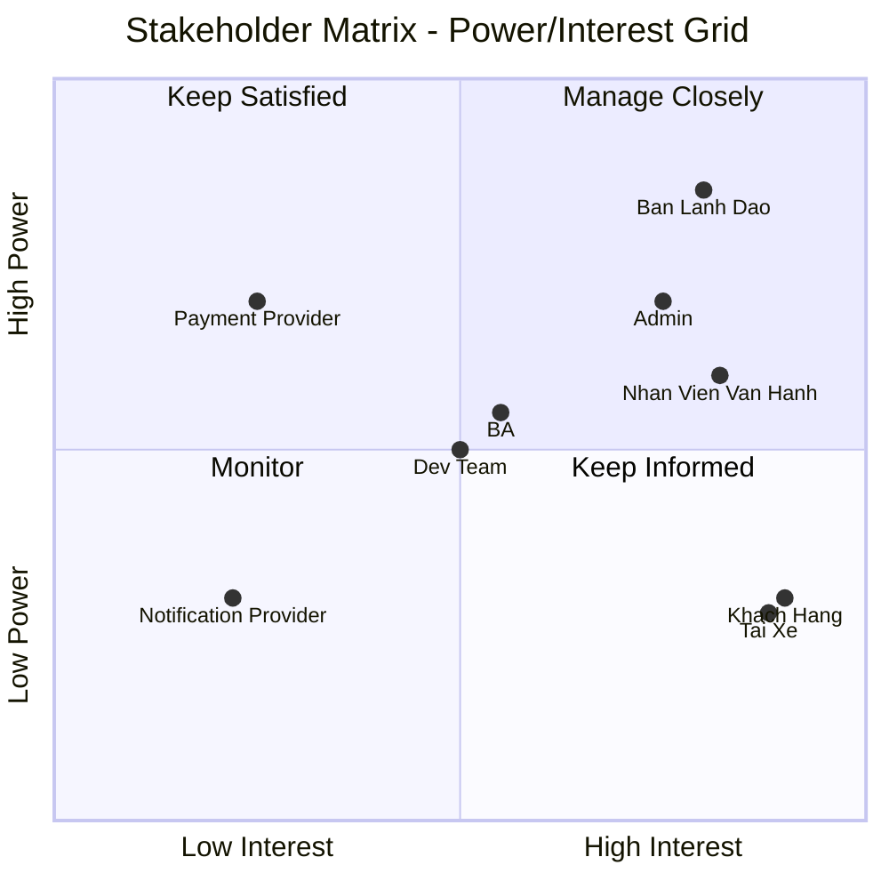
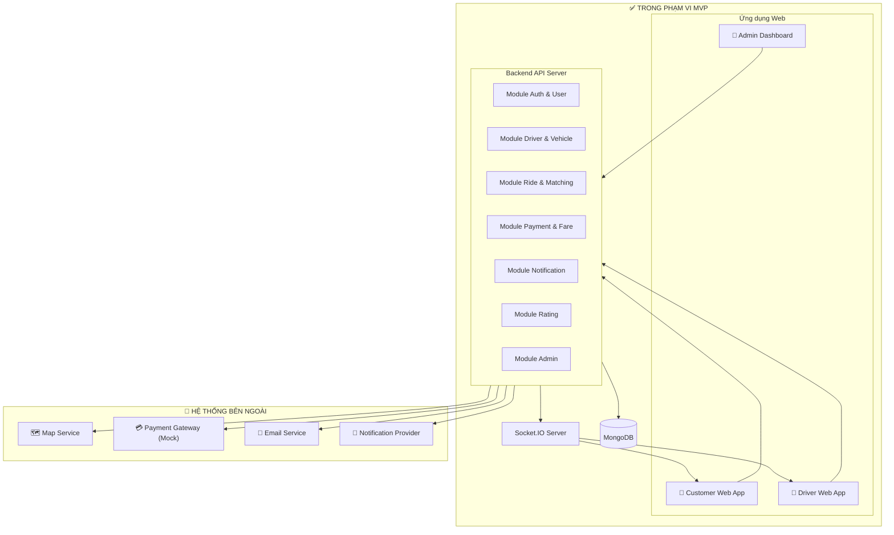
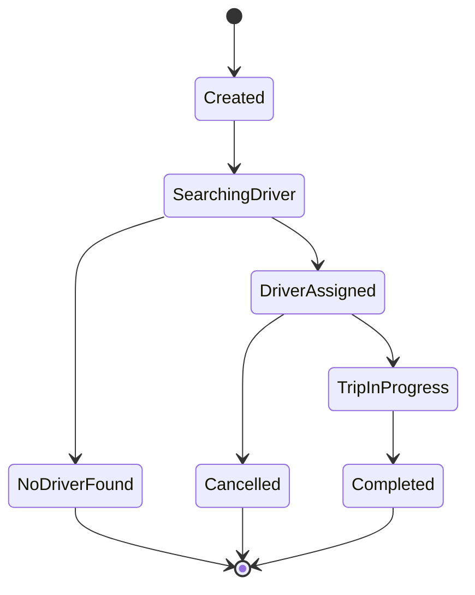
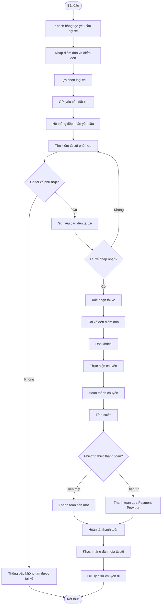
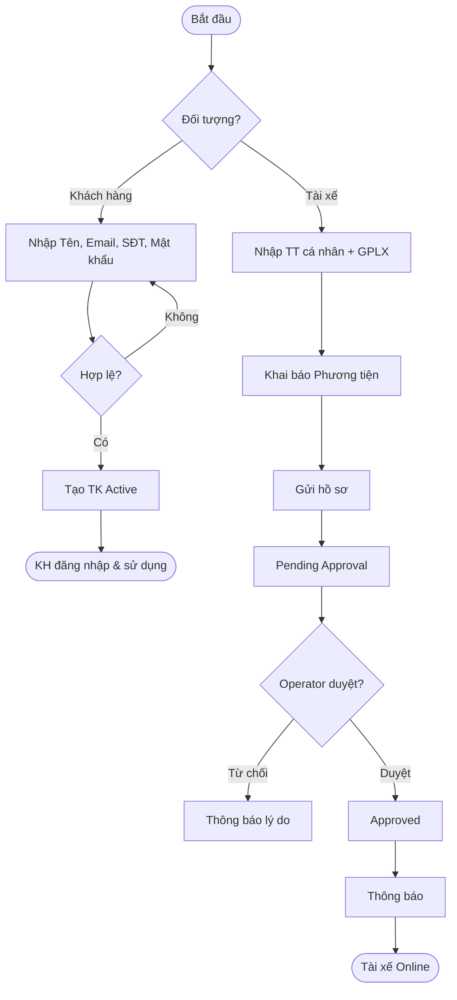
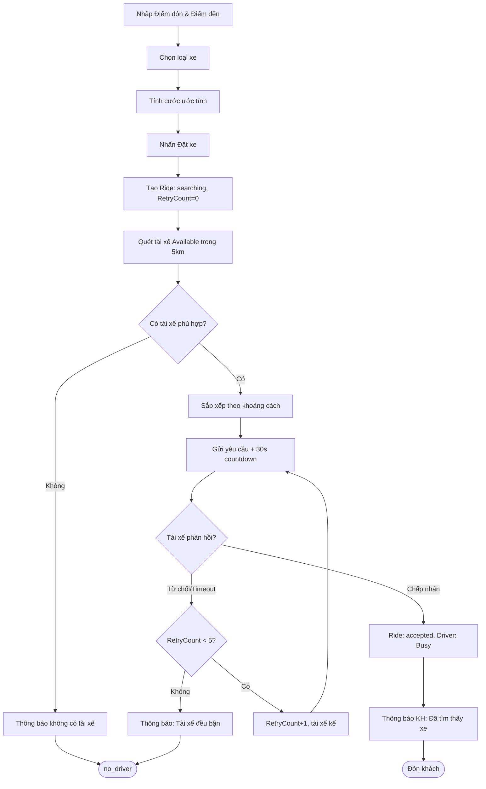
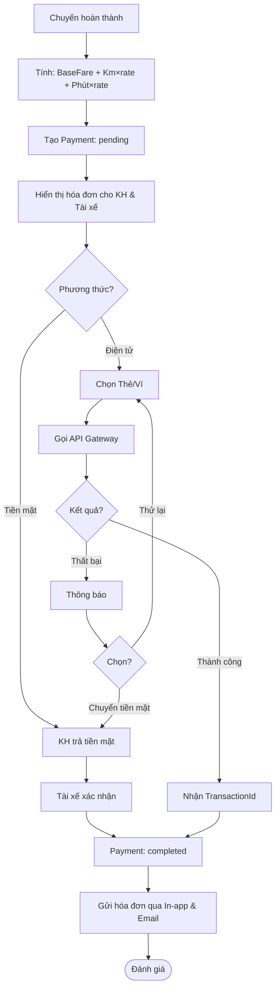
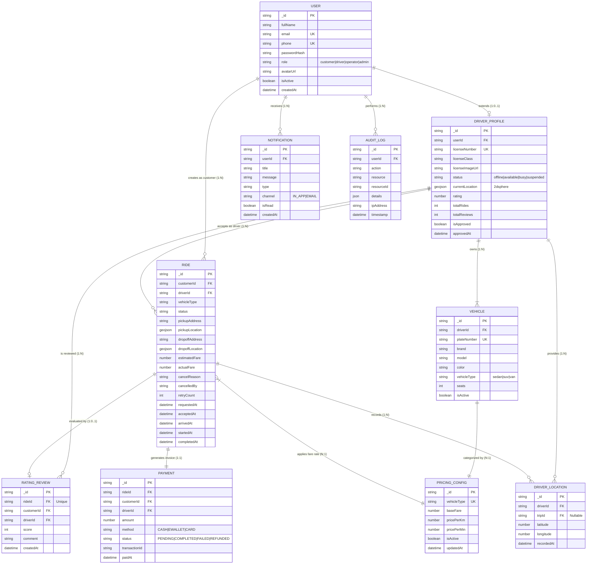

# Software Requirements Specification (SRS)
## CAB System – Nền tảng đặt xe trực tuyến

| | |
|---|---|
| **Document Version** | 5.0 (Final – Hợp nhất tối ưu) |
| **Date** | 2026-09-30 |
| **Author** | Mai Quốc Hưng – 23732061 |
| **Client** | Công ty ABC |
| **Status** | Approved – Ready for Development |
| **Nguồn hợp nhất** | SRS v3.0 (8 Giai đoạn) + SRS v4.0 (15 sections) |

---

## Mục lục

1. [Giới thiệu](#1-giới-thiệu)
2. [Business Context & Problem](#2-business-context--problem)
3. [Stakeholders](#3-stakeholders)
4. [Business Goals](#4-business-goals)
5. [Phạm vi hệ thống (Scope)](#5-phạm-vi-hệ-thống-scope)
6. [Business Requirements](#6-business-requirements)
7. [Business Processes](#7-business-processes)
8. [Functional Requirements](#8-functional-requirements)
9. [Business Rules & Exceptions](#9-business-rules--exceptions)
10. [Data Model](#10-data-model)
11. [Non-Functional Requirements](#11-non-functional-requirements-nfrs)
12. [Use Case Model](#12-use-case-model)
13. [Acceptance Criteria](#13-acceptance-criteria)
14. [Requirements Traceability Matrix](#14-requirements-traceability-matrix-rtm)
15. [Phụ lục](#15-phụ-lục)

---

## 1. Giới thiệu

### 1.1 Mục đích tài liệu

Tài liệu đặc tả đầy đủ các yêu cầu nghiệp vụ, chức năng và phi chức năng cho **CAB System** – nền tảng đặt xe trực tuyến do Công ty ABC làm chủ đầu tư. Là căn cứ chính thức cho:
- **Dev Team:** thiết kế và lập trình.
- **QA/QC:** viết test case và nghiệm thu.
- **BA và stakeholders:** đối chiếu, xác nhận phạm vi.

### 1.2 Phạm vi tài liệu

Bao gồm toàn bộ vòng đời phát triển phần mềm từ phân tích yêu cầu → RTM. **Không** bao gồm: thiết kế UI/UX chi tiết, kế hoạch triển khai hạ tầng, tài liệu vận hành.

### 1.3 Định nghĩa & Từ viết tắt

| Thuật ngữ | Định nghĩa |
|---|---|
| **CAB System** | Nền tảng đặt xe trực tuyến của Công ty ABC |
| **BR** | Business Requirement |
| **FR** | Functional Requirement |
| **NFR** | Non-Functional Requirement |
| **UC** | Use Case |
| **AC** | Acceptance Criteria |
| **BRL / BRULE** | Business Rule |
| **EX** | Exception |
| **RTM** | Requirements Traceability Matrix |
| **Matching** | Quá trình tìm và gán tài xế cho chuyến |
| **ETA** | Estimated Time of Arrival |
| **RBAC** | Role-Based Access Control |
| **JWT** | JSON Web Token |
| **MoSCoW** | Must / Should / Could / Won't Have |

### 1.4 Tài liệu tham khảo

1. IEEE 830 – Software Requirements Specifications
2. ISO/IEC 25010 – Quality Requirements and Evaluation
3. IIBA BABOK v3
4. OpenAPI Specification 3.0.3

---

## 2. Business Context & Problem

### 2.1 Business Context

**Công ty ABC** cung cấp dịch vụ đặt xe trực tuyến. Hiện tại khách hàng có hai cách yêu cầu xe:
- Gọi **tổng đài** – điều phối thủ công.
- Dùng **ứng dụng đơn giản**, năng lực hạn chế.

**Đặc điểm hệ thống AS-IS:**

| Khía cạnh | Hiện trạng |
|---|---|
| Tiếp nhận yêu cầu | 2 kênh (tổng đài + app) |
| Phân công tài xế | Thủ công – nhân viên tự gọi điện |
| Lưu trữ chuyến đi | Không tập trung |
| Thanh toán | Chủ yếu tiền mặt |
| Theo dõi chuyến | Không có cho khách hàng |
| Báo cáo | Thủ công, dữ liệu rời rạc |

**Mục tiêu:** Xây dựng **nền tảng CAB mới** phục vụ số lượng lớn KH/tài xế đồng thời, có khả năng mở rộng lâu dài.

### 2.2 Business Problem

| # | Vấn đề | Hậu quả |
|---|---|---|
| **P1** | Phân công tài xế thủ công qua tổng đài | Chậm, phụ thuộc con người, khó mở rộng |
| **P2** | KH không theo dõi được chuyến đi | Trải nghiệm kém, tổng đài quá tải |
| **P3** | Thanh toán chưa quản lý tập trung | Thất thoát doanh thu, khó đối soát |
| **P4** | Kiến trúc khó mở rộng | Không cạnh tranh được với nền tảng lớn |
| **P5** | Thiếu công cụ quản trị & báo cáo | Ban lãnh đạo thiếu dữ liệu ra quyết định |
| **P6** | Bảo mật & kiểm soát truy cập yếu | Rủi ro dữ liệu cá nhân, không truy vết |

---

## 3. Stakeholders

### 3.1 Danh sách Stakeholders

| # | Stakeholder | Vai trò & Trách nhiệm | Mức độ |
|---|---|---|---|
| 1 | **Khách hàng (Customer)** | Đăng ký/đăng nhập, đặt xe, theo dõi trạng thái real-time, thanh toán, xem lịch sử, đánh giá tài xế | 🔴 Rất cao |
| 2 | **Tài xế (Driver)** | Đăng ký/quản lý hồ sơ & phương tiện, bật/tắt online, nhận/chấp nhận/từ chối yêu cầu, cập nhật trạng thái + GPS | 🔴 Rất cao |
| 3 | **Nhân viên vận hành (Operator)** | Quản lý KH/tài xế/phương tiện, giám sát chuyến, xử lý sự cố, tra cứu giao dịch | 🟠 Cao |
| 4 | **Quản trị viên (Admin)** | Toàn quyền: cấu hình hệ thống, phân quyền, sửa biểu giá, xem báo cáo, tra Audit Log | 🟠 Cao |
| 5 | **Ban lãnh đạo (Leadership)** | Xem báo cáo doanh thu, số chuyến, tỷ lệ hoàn thành/hủy, hiệu quả tài xế | 🔴 Rất cao |
| 6 | **Payment Provider** | Xử lý giao dịch điện tử, trả kết quả qua callback/API | 🟢 Thấp (bên ngoài) |
| 7 | **Notification Provider** | Gửi thông báo (SMS/Push/Email) theo sự kiện | 🟢 Thấp (bên ngoài) |
| 8 | **Map Provider** | Bản đồ, geocoding, tính khoảng cách | 🟢 Thấp (bên ngoài) |
| 9 | **Email Service** | Gửi email xác nhận, hóa đơn | 🟢 Thấp (bên ngoài) |
| 10 | **Business Analyst** | Phân tích, làm rõ yêu cầu, viết SRS | 🟡 Trung bình |
| 11 | **Dev Team** | Thiết kế, phát triển, kiểm thử, triển khai | 🟡 Trung bình |

### 3.2 Stakeholder Matrix (Power / Interest)

```mermaid
quadrantChart
    title Stakeholder Matrix - Power/Interest Grid
    x-axis Low Interest --> High Interest
    y-axis Low Power --> High Power
    quadrant-1 Manage Closely
    quadrant-2 Keep Satisfied
    quadrant-3 Monitor
    quadrant-4 Keep Informed
    Ban Lanh Dao: [0.80, 0.85]
    Admin: [0.75, 0.70]
    Nhan Vien Van Hanh: [0.82, 0.60]
    Khach Hang: [0.90, 0.30]
    Tai Xe: [0.88, 0.28]
    BA: [0.55, 0.55]
    Dev Team: [0.50, 0.50]
    Payment Provider: [0.25, 0.70]
    Notification Provider: [0.22, 0.30]
```

### 3.3 Chiến lược giao tiếp

| Nhóm | Stakeholder | Chiến lược |
|---|---|---|
| **Manage Closely** | Ban lãnh đạo, Admin, Operator | Họp báo cáo hàng tuần, review yêu cầu, phê duyệt thay đổi lớn |
| **Keep Satisfied** | BA, Dev Team | Cập nhật khi có thay đổi quan trọng |
| **Keep Informed** | Khách hàng, Tài xế | Thu thập feedback, thông báo tính năng mới |
| **Monitor** | Payment/Notification/Map Provider | Liên hệ khi cần tích hợp, theo dõi SLA |

---

## 4. Business Goals

### 4.1 Mục tiêu chiến lược (Strategic Goals)

| ID | Mục tiêu | KPI | Vấn đề |
|---|---|---|---|
| **BG-01** | Chuyển đổi số toàn bộ quy trình đặt xe | ≥ 90% chuyến xử lý hoàn toàn qua hệ thống; giảm ≥ 70% cuộc gọi tổng đài | P1, P2 |
| **BG-02** | Mở rộng quy mô phục vụ | 10.000 KH + 2.000 tài xế online đồng thời; 500 booking req/s | P4 |
| **BG-03** | Tăng doanh thu & kiểm soát tài chính | 100% GD ghi nhận; ≥ 30% KH dùng điện tử trong 3 tháng đầu | P3 |

### 4.2 Mục tiêu vận hành (Operational Goals)

| ID | Mục tiêu | KPI | Vấn đề |
|---|---|---|---|
| **BG-04** | Tự động hóa tìm & phân công tài xế | Đặt xe → có tài xế ≤ 60s; tỷ lệ tìm ≥ 85%; 0% phân công thủ công | P1 |
| **BG-05** | Minh bạch trạng thái chuyến đi | 100% chuyến có real-time; cập nhật GPS 5-10s | P2 |
| **BG-06** | Tính cước chính xác & tự động | 100% tự động; sai số ≤ 15%; đổi giá ≤ 5 phút | P3 |
| **BG-07** | Quản lý tài xế & phương tiện hiệu quả | 100% tài xế có hồ sơ; duyệt ≤ 24h | P1, P5 |
| **BG-08** | Thông báo kịp thời cho tất cả các bên | ≥ 8 loại event; gửi ≤ 3s sau sự kiện | P2, P4 |

### 4.3 Mục tiêu hỗ trợ quản lý (Management Goals)

| ID | Mục tiêu | KPI | Vấn đề |
|---|---|---|---|
| **BG-09** | Cung cấp công cụ quản trị tập trung | 100% thao tác qua hệ thống; xử lý sự cố ≤ 10 phút | P5 |
| **BG-10** | Báo cáo dữ liệu vận hành cho Ban lãnh đạo | ≥ 5 loại báo cáo; dữ liệu trễ ≤ 1 giờ | P5 |

### 4.4 Mục tiêu kỹ thuật & bảo mật

| ID | Mục tiêu | KPI | Vấn đề |
|---|---|---|---|
| **BG-11** | Kiến trúc linh hoạt, dễ mở rộng | Lỗi module Payment/Notification không ảnh hưởng Ride; thêm provider ≤ 2 ngày; uptime ≥ 99.5% | P4 |
| **BG-12** | Bảo mật dữ liệu & kiểm soát truy cập | 100% API xác thực; 0 thẻ/tài khoản lưu DB; audit log 100% thao tác nhạy cảm | P6 |
| **BG-13** | Nâng cao trải nghiệm người dùng | Đặt xe ≤ 3 bước (≤ 60s); tài xế nhận/từ chối 1 chạm | P2 |

### 4.5 Ưu tiên triển khai (MoSCoW)

| Mức | Business Goals |
|---|---|
| **Must Have** | BG-01, BG-04, BG-05, BG-06, BG-07, BG-12 |
| **Should Have** | BG-03, BG-08, BG-09, BG-13 |
| **Could Have** | BG-02, BG-10, BG-11 |
| **Won't Have** | Surge pricing, Ví nội bộ, Ride sharing, Chat in-app |

---

## 5. Phạm vi hệ thống (Scope)

### 5.1 Trong phạm vi (In Scope)

**Hệ thống CAB MVP gồm 3 ứng dụng web + 1 backend API**, phục vụ quy trình: **Đặt xe → Tìm tài xế → Thực hiện chuyến → Tính cước → Thanh toán → Đánh giá**.

**Actors:**

| # | Actor | Loại |
|---|---|---|
| 1 | Khách hàng | Primary – External |
| 2 | Tài xế | Primary – External |
| 3 | Nhân viên vận hành | Primary – Internal |
| 4 | Quản trị viên | Primary – Internal |
| 5 | Payment Gateway | Secondary – External |
| 6 | Map Service | Secondary – External |
| 7 | Email Service | Secondary – External |
| 8 | Notification Provider | Secondary – External |

**Modules & chức năng:**

| Module | Số CN | Ưu tiên chính |
|---|---|---|
| 1. Quản lý tài khoản & Xác thực | 7 | Must Have |
| 2. Quản lý tài xế & Phương tiện | 7 | Must Have |
| 3. Đặt xe & Quản lý chuyến đi ⭐ | 10 | Must Have |
| 4. Tìm & Phân công tài xế ⭐ | 7 | Must Have |
| 5. Tính cước & Thanh toán | 6 | Must Have |
| 6. Thông báo | 3 | Should Have |
| 7. Đánh giá & Phản hồi | 3 | Should Have |
| 8. Quản trị hệ thống | 9 | Must Have |
| 9. Bảo mật & Hạ tầng | 5 | Must Have |
| **TỔNG** | **57** | 35 Must / 18 Should / 4 Could |

### 5.2 Ngoài phạm vi (Out of Scope)

| # | Tính năng | Phiên bản |
|---|---|---|
| OS-01 | Mobile native (iOS/Android) | v2.0 |
| OS-02 | Tích hợp tổng đài IVR | v3.0 |
| OS-03 | Ride Sharing | v2.0 |
| OS-04 | Ví điện tử nội bộ | v2.0 |
| OS-05 | Surge pricing tự động | v2.0 |
| OS-06 | Đa ngôn ngữ (i18n) | v2.0 |
| OS-07 | Chat in-app | v2.0 |
| OS-08 | Đặt xe hẹn giờ | v2.0 |
| OS-09 | Voucher / Khuyến mãi | v2.0 |
| OS-10 | Loyalty program | v3.0 |
| OS-11 | Cổng thanh toán thật (VNPay, MoMo) | v1.1 |
| OS-12 | Push Notification (FCM/APNs) | v2.0 |
| OS-13 | SMS Notification | v1.1 |
| OS-14 | BI Dashboard nâng cao | v2.0 |
| OS-15 | Quản lý khiếu nại / Dispute | v2.0 |
| OS-16 | Định tuyến / Navigation | v2.0 |
| OS-17 | Đánh giá KH bởi tài xế | v1.1 |

### 5.3 Ranh giới hệ thống (System Boundary)

```mermaid
flowchart TB
    subgraph InScope["✅ TRONG PHẠM VI MVP"]
        subgraph Apps["Ứng dụng Web"]
            CApp["🧑 Customer Web App"]
            DApp["🚗 Driver Web App"]
            AApp["🔧 Admin Dashboard"]
        end
        subgraph Backend["Backend API Server"]
            Auth["Module Auth & User"]
            Driver["Module Driver & Vehicle"]
            Ride["Module Ride & Matching"]
            Pay["Module Payment & Fare"]
            Notif["Module Notification"]
            Rating["Module Rating"]
            Admin["Module Admin"]
        end
        DB[(MongoDB)]
        Socket["Socket.IO Server"]
    end

    subgraph External["🔗 HỆ THỐNG BÊN NGOÀI"]
        MapAPI["🗺️ Map Service"]
        PayGW["💳 Payment Gateway (Mock)"]
        EmailSvc["📧 Email Service"]
        NotifProv["📨 Notification Provider"]
    end

    CApp --> Backend
    DApp --> Backend
    AApp --> Backend
    Backend --> DB
    Backend --> Socket
    Backend --> MapAPI
    Backend --> PayGW
    Backend --> EmailSvc
    Backend --> NotifProv
    Socket --> CApp
    Socket --> DApp
```

### 5.4 Trạng thái Booking & Trip

**Booking State:**

```mermaid
stateDiagram-v2
    [*] --> Created
    Created --> SearchingDriver
    SearchingDriver --> DriverAssigned
    SearchingDriver --> NoDriverFound
    DriverAssigned --> TripInProgress
    DriverAssigned --> Cancelled
    TripInProgress --> Completed
    NoDriverFound --> [*]
    Cancelled --> [*]
    Completed --> [*]
```

**Trip State:** Nhận chuyến → Đến điểm đón → Đón khách → Di chuyển → Hoàn thành.

---

## 6. Business Requirements

| BR ID | Tên | Mô tả | Nhóm |
|---|---|---|---|
| **BR-001** | Đăng ký TK khách hàng | Cho phép KH tự đăng ký bằng thông tin cá nhân; tài khoản phải xác thực trước khi sử dụng | Account |
| **BR-002** | Đăng ký TK tài xế | Cho phép tài xế tự đăng ký hoặc được Operator tạo; hồ sơ phải bao gồm GPLX + phương tiện và được duyệt trước hoạt động | Account |
| **BR-003** | Đăng nhập hệ thống | Xác thực người dùng; phân quyền theo vai trò | Account |
| **BR-004** | Cập nhật TT cá nhân | KH và tài xế cập nhật thông tin cá nhân sau khi đăng nhập | Account |
| **BR-005** | Tạo yêu cầu đặt xe | KH đặt xe với điểm đón, điểm đến, loại xe; hiển thị cước ước tính trước khi xác nhận | Booking |
| **BR-006** | Lựa chọn loại xe | Hỗ trợ ≥ 3 loại xe (Sedan 4 chỗ, SUV 7 chỗ, Van 16 chỗ) với mức giá khác nhau | Booking |
| **BR-007** | Theo dõi trạng thái chuyến | KH biết trạng thái xử lý: tìm tài xế → nhận chuyến → ETA → trạng thái hiện tại | Booking |
| **BR-008** | Theo dõi vị trí real-time | KH xem vị trí tài xế trên bản đồ theo thời gian thực | Tracking |
| **BR-009** | Xem thông tin tài xế | Xem tên, SĐT, ảnh, biển số, loại xe, rating của tài xế được phân công | Booking |
| **BR-010** | Hủy chuyến đi | KH có thể hủy; chính sách hủy phải rõ ràng (MVP: miễn phí trước khi tài xế đến) | Booking |
| **BR-011** | Xem lịch sử chuyến | KH xem lịch sử tất cả chuyến đi kèm chi tiết | History |
| **BR-012** | Quy trình chuyến hoàn chỉnh | Hỗ trợ đầy đủ: đặt xe → tìm → nhận → đến → đón → di chuyển → hoàn thành → tính cước → thanh toán → đánh giá | Booking |
| **BR-013** | Cập nhật hồ sơ tài xế | Tài xế cập nhật hồ sơ cá nhân và thông tin phương tiện | Driver |
| **BR-014** | Quản lý trạng thái hoạt động | Tài xế bật/tắt sẵn sàng; hệ thống chỉ gửi yêu cầu đến tài xế AVAILABLE | Driver |
| **BR-015** | Cập nhật vị trí tài xế | Hệ thống lưu GPS tài xế khi AVAILABLE hoặc đang chạy chuyến | Tracking |
| **BR-016** | Duyệt hồ sơ tài xế | Operator/Admin duyệt hồ sơ tài xế mới trước khi hoạt động | Driver |
| **BR-017** | Quản lý phương tiện | Mỗi tài xế đăng ký ≥ 1 phương tiện; thông tin phải xác minh | Driver |
| **BR-018** | Tự động tìm tài xế | Hệ thống tự động xác định tài xế phù hợp (vị trí, trạng thái, loại xe) | Matching |
| **BR-019** | Ưu tiên tài xế gần nhất | Ưu tiên khoảng cách, sau đó rating khi có nhiều ứng viên | Matching |
| **BR-020** | Cơ chế retry khi từ chối | Tự động tìm tài xế khác khi tài xế từ chối/không phản hồi, tối đa 5 lần | Matching |
| **BR-021** | Giới hạn thời gian phản hồi | Tài xế phản hồi trong 30s; hết giờ coi như từ chối | Matching |
| **BR-022** | Thông báo không tìm được tài xế | Thông báo rõ ràng cho KH | Matching |
| **BR-023** | Cập nhật trạng thái bởi tài xế | Tài xế cập nhật từng bước; ghi nhận timestamp mỗi trạng thái | Trip |
| **BR-024** | Tính cước tự động | Tính cước sau khi hoàn thành dựa trên loại dịch vụ, khoảng cách, thời gian | Payment |
| **BR-025** | Cước phí ước tính | Hiển thị cước ước tính trước khi xác nhận | Payment |
| **BR-026** | Cấu hình bảng giá | Cấu hình theo loại xe mà không cần sửa code | Payment |
| **BR-027** | Hỗ trợ nhiều PT thanh toán | Tiền mặt + điện tử; có khả năng tích hợp thêm PT mới | Payment |
| **BR-028** | Tích hợp Payment Provider | Không lưu thông tin nhạy cảm của thẻ/tài khoản trong CAB | Security |
| **BR-029** | Xử lý TT thất bại | Thông báo KH, cho phép xử lý lại | Payment |
| **BR-030** | Xem chi tiết TT | KH xem chi tiết cước phí sau chuyến | Payment |
| **BR-031** | Thông báo cho KH | Thông báo tại các mốc: tiếp nhận YC, có tài xế, tài xế đến, hoàn thành, KQ thanh toán, không tìm được tài xế | Notification |
| **BR-032** | Thông báo cho tài xế | Thông báo có chuyến mới, chuyến bị hủy | Notification |
| **BR-033** | Mở rộng kênh thông báo | Thiết kế linh hoạt để bổ sung SMS/Push trong tương lai | Notification |
| **BR-034** | Đánh giá tài xế | KH đánh giá 1-5 sao + nhận xét; tổng hợp thành rating TB | Rating |
| **BR-035** | Xem lịch sử đánh giá | Tài xế xem các đánh giá KH đã để lại | Rating |
| **BR-036** | Giao diện quản trị tập trung | Quản lý KH/tài xế/phương tiện/chuyến từ một nơi | Admin |
| **BR-037** | Giám sát chuyến đi | Operator xem chuyến đang chạy, kiểm tra trạng thái tài xế, xử lý sự cố | Admin |
| **BR-038** | Tra cứu lịch sử giao dịch | Tra cứu theo KH, tài xế, thời gian, trạng thái | Admin |
| **BR-039** | Phân quyền quản trị | Operator: vận hành; Admin: toàn quyền | Security |
| **BR-040** | Báo cáo vận hành | Báo cáo số chuyến, doanh thu, tỷ lệ hoàn thành/hủy, hiệu quả tài xế | Admin |
| **BR-041** | Xác thực bắt buộc | KH và tài xế phải xác thực; thao tác QT kiểm soát theo vai trò | Security |
| **BR-042** | Bảo vệ dữ liệu | Mã hóa mật khẩu; không lưu thông tin TT nhạy cảm | Security |
| **BR-043** | Ghi log thao tác quan trọng | Audit log phục vụ kiểm tra khi có sự cố | Security |
| **BR-044** | Cách ly lỗi thành phần | Lỗi Payment/Notification không làm dừng toàn hệ thống | Architecture |
| **BR-045** | Kiến trúc linh hoạt | Bổ sung dịch vụ/PT thanh toán/NCC thông báo mới không xây lại toàn bộ | Architecture |

**Ma trận BR → BG:**

| BR Range | BG liên quan |
|---|---|
| BR-001 → BR-004 | BG-01, BG-12 |
| BR-005 → BR-012 | BG-01, BG-05, BG-13 |
| BR-013 → BR-017 | BG-07 |
| BR-018 → BR-023 | BG-04, BG-01 |
| BR-024 → BR-030 | BG-06, BG-03 |
| BR-031 → BR-033 | BG-08, BG-11 |
| BR-034 → BR-035 | BG-05, BG-13 |
| BR-036 → BR-040 | BG-09, BG-10 |
| BR-041 → BR-045 | BG-11, BG-12, BG-02 |

---

## 7. Business Processes

### 7.1 Quy trình Tổng thể (End-to-End)

```mermaid
flowchart TD
    A([Bắt đầu]) --> B[Khách hàng tạo yêu cầu đặt xe]
    B --> C[Nhập điểm đón và điểm đến]
    C --> D[Lựa chọn loại xe]
    D --> E[Gửi yêu cầu đặt xe]
    E --> F[Hệ thống tiếp nhận yêu cầu]
    F --> G[Tìm kiếm tài xế phù hợp]
    G --> H{Có tài xế phù hợp?}
    H -- Không --> I[Thông báo không tìm được tài xế]
    I --> Z([Kết thúc])
    H -- Có --> J[Gửi yêu cầu đến tài xế]
    J --> K{Tài xế chấp nhận?}
    K -- Không --> G
    K -- Có --> L[Xác nhận tài xế]
    L --> M[Tài xế đến điểm đón]
    M --> N[Đón khách]
    N --> O[Thực hiện chuyến]
    O --> P[Hoàn thành chuyến]
    P --> Q[Tính cước]
    Q --> R{Phương thức thanh toán?}
    R -- Tiền mặt --> S[Thanh toán tiền mặt]
    R -- Điện tử --> T[Thanh toán qua Payment Provider]
    S --> U[Hoàn tất thanh toán]
    T --> U
    U --> V[Khách hàng đánh giá tài xế]
    V --> W[Lưu lịch sử chuyến đi]
    W --> Z
```

### 7.2 BP-01: Đăng ký & Onboarding

```mermaid
flowchart TD
    Start([Bắt đầu]) --> Choice{Đối tượng?}
    Choice -- Khách hàng --> RegCust[Nhập Tên, Email, SĐT, Mật khẩu]
    RegCust --> ValidCust{Hợp lệ?}
    ValidCust -- Không --> RegCust
    ValidCust -- Có --> CreateCust[Tạo TK Active]
    CreateCust --> EndCust([KH đăng nhập & sử dụng])
    Choice -- Tài xế --> RegDrv[Nhập TT cá nhân + GPLX]
    RegDrv --> RegVeh[Khai báo Phương tiện]
    RegVeh --> SubmitDrv[Gửi hồ sơ]
    SubmitDrv --> Pending[Pending Approval]
    Pending --> OpReview{Operator duyệt?}
    OpReview -- Từ chối --> RejectDrv[Thông báo lý do]
    OpReview -- Duyệt --> ApproveDrv[Approved]
    ApproveDrv --> NotifyDrv[Thông báo]
    NotifyDrv --> EndDrv([Tài xế Online])
```

### 7.3 BP-02: Matching

```mermaid
flowchart TD
    A[Nhập Điểm đón & Điểm đến] --> B[Chọn loại xe]
    B --> C[Tính cước ước tính]
    C --> D[Nhấn Đặt xe]
    D --> E[Tạo Ride: searching, RetryCount=0]
    E --> F[Quét tài xế Available trong 5km]
    F --> G{Có tài xế phù hợp?}
    G -- Không --> NoDrv[Thông báo không có tài xế]
    NoDrv --> EndFail([no_driver])
    G -- Có --> SortDrv[Sắp xếp theo khoảng cách]
    SortDrv --> SendReq[Gửi yêu cầu + 30s countdown]
    SendReq --> WaitResp{Tài xế phản hồi?}
    WaitResp -- Chấp nhận --> Accept[Ride: accepted, Driver: Busy]
    Accept --> Notify[Thông báo KH: Đã tìm thấy xe]
    Notify --> EndSuccess([Đón khách])
    WaitResp -- Từ chối/Timeout --> CheckRetry{RetryCount < 5?}
    CheckRetry -- Có --> NextDrv[RetryCount+1, tài xế kế]
    NextDrv --> SendReq
    CheckRetry -- Không --> MaxFail[Thông báo: Tài xế đều bận]
    MaxFail --> EndFail
```

### 7.4 BP-03: Thực hiện chuyến & Tracking

1. **Di chuyển đến điểm đón:** Tài xế bấm "Bắt đầu di chuyển"; GPS phát liên tục.
2. **Đến điểm đón:** Bấm **"Đã đến điểm đón"** → `driver_arrived`, KH nhận thông báo.
3. **Đón khách:** Bấm **"Bắt đầu chuyến đi"** → `in_progress`, ghi `startedAt`.
4. **Hành trình:** GPS phát 5-10s/lần, KH theo dõi real-time.
5. **Hoàn thành:** Bấm **"Hoàn thành"** → `completed`, ghi `completedAt`.

### 7.5 BP-04: Tính cước & Thanh toán

```mermaid
flowchart TD
    A[Chuyến hoàn thành] --> B[Tính: BaseFare + Km×rate + Phút×rate]
    B --> C[Tạo Payment: pending]
    C --> D[Hiển thị hóa đơn cho KH & Tài xế]
    D --> E{Phương thức?}
    E -- Tiền mặt --> Cash[KH trả tiền mặt]
    Cash --> CashConfirm[Tài xế xác nhận]
    CashConfirm --> PaySuccess[Payment: completed]
    E -- Điện tử --> OnlinePay[Chọn Thẻ/Ví]
    OnlinePay --> GatewayReq[Gọi API Gateway]
    GatewayReq --> GatewayProcess{Kết quả?}
    GatewayProcess -- Thành công --> TokenRes[Nhận TransactionId]
    TokenRes --> PaySuccess
    GatewayProcess -- Thất bại --> PayFail[Thông báo]
    PayFail --> RetryChoice{Chọn?}
    RetryChoice -- Thử lại --> OnlinePay
    RetryChoice -- Chuyển tiền mặt --> Cash
    PaySuccess --> SendReceipt[Gửi hóa đơn qua In-app & Email]
    SendReceipt --> NextStep([Đánh giá])
```

### 7.6 BP-05: Đánh giá sau chuyến

Sau thanh toán → hiển thị form 1-5 sao + nhận xét → lưu Rating → tính lại `avgRating` → chuyển tài xế về `Available`.

### 7.7 BP-06: Hủy chuyến

| Bên hủy | Giai đoạn | Xử lý |
|---|---|---|
| Khách | `searching` | Hủy tức thì, không phạt |
| Khách | `accepted`/`driver_arrived` | `cancelled_by_customer`, giải phóng tài xế |
| Khách | `in_progress` | Từ chối hủy (400) |
| Tài xế | `accepted`/`driver_arrived` + lý do | `cancelled_by_driver`, có thể tìm lại tài xế mới |

### 7.8 BP-07: Giám sát & Xử lý sự cố

- **Giám sát:** Map real-time với icon màu (Xanh=Available, Vàng=Busy, Đỏ=Cảnh báo).
- **Can thiệp:** Hủy cưỡng chế / Điều phối lại tài xế; ghi Audit Log.
- **Báo cáo:** Admin xuất số liệu định kỳ.

---

## 8. Functional Requirements

### 8.1 Phân hệ 1.0: Quản lý Xác thực & Tài khoản

| Mã FR | Tên chức năng | Input | Xử lý & Quy tắc | Output | BR | Ưu tiên |
|---|---|---|---|---|---|---|
| **FR-AUTH-01** | Đăng ký TK Khách hàng | Họ tên, Email, SĐT, Mật khẩu | Validate định dạng, trùng lặp, hash bcrypt | TK `Active`, gửi email chào mừng | BR-001 | Must |
| **FR-AUTH-02** | Đăng ký TK Tài xế | + Số GPLX, Hạng bằng, Ảnh bằng lái | Kiểm tra hợp lệ, lưu `Pending_Approval` | Hồ sơ chờ duyệt | BR-002 | Must |
| **FR-AUTH-03** | Đăng nhập hệ thống | Email/SĐT, Mật khẩu | So khớp DB, kiểm tra `isActive`, phát Access (15p) + Refresh (7 ngày) | Token + Role + Profile | BR-003, BR-041 | Must |
| **FR-AUTH-04** | Cập nhật hồ sơ cá nhân | Tên, SĐT, Avatar | Xác thực token, cập nhật DB | Hồ sơ cập nhật | BR-004 | Must |
| **FR-AUTH-05** | Đổi mật khẩu | MK cũ, MK mới | So khớp cũ, MK ≥ 6 ký tự, hash | MK cập nhật, hủy token cũ | BR-042 | Must |
| **FR-AUTH-06** | Đăng xuất & Thu hồi phiên | Refresh Token | Xóa refresh token khỏi DB | Phiên kết thúc an toàn | BR-041 | Must |

### 8.2 Phân hệ 2.0: Quản lý Tài xế & Phương tiện

| Mã FR | Tên chức năng | Input | Xử lý & Quy tắc | Output | BR | Ưu tiên |
|---|---|---|---|---|---|---|
| **FR-DRV-01** | Đăng ký TT phương tiện | Biển số, Hãng, Model, Màu, Loại xe, Số ghế | Biển số duy nhất, liên kết Driver ID | Xe `Active` | BR-017 | Must |
| **FR-DRV-02** | Bật/Tắt Online/Offline | Trạng thái mong muốn | Chỉ cho phép `Available` nếu đã duyệt | Cập nhật DB, phát socket | BR-014 | Must |
| **FR-DRV-03** | Tự động chuyển Busy | Sự kiện `accepted` | Chuyển `Busy`, ngưng nhận YC mới | Không xuất hiện trong tìm kiếm | BR-014, BR-023 | Must |
| **FR-DRV-04** | Duyệt hồ sơ tài xế | Driver ID, Quyết định, Lý do | Cập nhật `isApproved`, gửi email | Hồ sơ duyệt/từ chối | BR-016, BR-036 | Must |
| **FR-DRV-05** | Xem hồ sơ & hiệu suất | Driver ID | Tổng hợp số cuốc, rating, tổng tiền | Dashboard tài xế | BR-013, BR-035 | Should |
| **FR-DRV-06** | Khóa tài xế vi phạm | Driver ID, Lý do | `isActive=false`, ngắt socket | Tài xế bị đăng xuất | BR-036, BR-039 | Should |

### 8.3 Phân hệ 3.0: Đặt xe & Vòng đời Chuyến đi ⭐ Core

| Mã FR | Tên chức năng | Input | Xử lý & Quy tắc | Output | BR | Ưu tiên |
|---|---|---|---|---|---|---|
| **FR-RIDE-01** | Tìm kiếm & Nhập địa chỉ | Địa chỉ text hoặc tọa độ | Geocoding / Reverse Geocoding | Tọa độ + địa chỉ | BR-005 | Must |
| **FR-RIDE-02** | Hiển thị cước ước tính | Tọa độ đón, Tọa độ trả | Tính Km, Phút, áp dụng bảng giá | Bảng giá 3 hạng xe | BR-005, BR-006, BR-025 | Must |
| **FR-RIDE-03** | Khởi tạo yêu cầu đặt xe | Điểm đón/trả, Loại xe, PT TT | Tạo Ride `searching`, kích hoạt matching | Ride ID, màn hình chờ | BR-005, BR-012 | Must |
| **FR-RIDE-04** | Cập nhật "Đã đến điểm đón" | Ride ID, Driver ID | Kiểm tra `accepted`, đổi `driver_arrived`, ghi `arrivedAt` | Socket thông báo khách | BR-007, BR-023 | Must |
| **FR-RIDE-05** | Cập nhật "Bắt đầu chuyến đi" | Ride ID, Driver ID | Đổi `in_progress`, ghi `startedAt` | Màn hình theo dõi lộ trình | BR-007, BR-023 | Must |
| **FR-RIDE-06** | Cập nhật "Hoàn thành chuyến" | Ride ID, Driver ID, Tọa độ kết thúc | Đổi `completed`, ghi `completedAt`, chuyển sang tính cước | Màn hình hóa đơn | BR-007, BR-023, BR-024 | Must |
| **FR-RIDE-07** | Khách hàng hủy chuyến | Ride ID, Lý do | Kiểm tra trạng thái, `cancelled_by_customer` | Chuyến kết thúc, thông báo tài xế | BR-010 | Must |
| **FR-RIDE-08** | Tài xế hủy chuyến | Ride ID, Lý do | `cancelled_by_driver`, tự động tìm xe mới | Thông báo cho khách | BR-010, BR-020 | Must |
| **FR-RIDE-09** | Tra cứu lịch sử & chi tiết | User ID, Bộ lọc | Truy vấn DB, sắp xếp mới nhất, phân trang | Danh sách chuyến đầy đủ | BR-011 | Must |

### 8.4 Phân hệ 4.0: Phân công & Ghép nối Tài xế ⭐ Core

| Mã FR | Tên chức năng | Input | Xử lý & Quy tắc | Output | BR | Ưu tiên |
|---|---|---|---|---|---|---|
| **FR-MATCH-01** | Quét tài xế quanh vùng | Tọa độ đón, Loại xe, Bán kính 5km | Haversine/GeoNear, lọc `Available` + loại xe khớp | DS tài xế theo khoảng cách | BR-018, BR-019 | Must |
| **FR-MATCH-02** | Xếp hạng ưu tiên | DS tài xế | Ưu tiên 1: khoảng cách; Ưu tiên 2: rating | Tài xế #1 | BR-019 | Must |
| **FR-MATCH-03** | Gửi thông báo & 30s | Ride ID, thông tin cuốc, Socket ID | Phát socket `ride:newRequest`, Timer 30s | Popup + đếm ngược | BR-020, BR-021 | Must |
| **FR-MATCH-04** | Xử lý chấp nhận | Ride ID, Driver ID | Atomic update, gán `driverId`, `accepted`, driver `Busy` | Khóa cuốc, hủy timer | BR-007, BR-023 | Must |
| **FR-MATCH-05** | Xử lý từ chối/timeout | Sự kiện Từ chối/Timeout | Blacklist per Ride, `retryCount+1`, chọn kế tiếp nếu < 5 | Gửi tài xế tiếp theo | BR-020, BR-021 | Must |
| **FR-MATCH-06** | Không tìm thấy tài xế | `retryCount >= 5` hoặc DS trống | Ride → `no_driver` | Thông báo KH | BR-022 | Must |

### 8.5 Phân hệ 5.0: Tính cước & Thanh toán

| Mã FR | Tên chức năng | Input | Xử lý & Quy tắc | Output | BR | Ưu tiên |
|---|---|---|---|---|---|---|
| **FR-PAY-01** | Tính cước thực tế | Loại xe, Km, Phút | `Base + Km×rate + Phút×rate` | `actualFare` vào Ride | BR-024, BR-026 | Must |
| **FR-PAY-02** | Cấu hình bảng giá | Loại xe, BaseFare, PricePerKm, PricePerMin | Lưu DB/Config, áp dụng ngay | Bảng giá mới | BR-026 | Must |
| **FR-PAY-03** | Thanh toán Tiền mặt | Ride ID, `Cash` | Tạo Payment `PENDING` | Tài xế nhận YC thu tiền | BR-027, BR-034 | Must |
| **FR-PAY-04** | Tài xế xác nhận thu | Payment ID, Driver ID | Đổi `COMPLETED`, ghi `paidAt` | Hóa đơn hoàn tất, gửi biên lai | BR-027 | Must |
| **FR-PAY-05** | Thanh toán Điện tử | Payment ID, PT, Token giả lập | Gọi Mock Gateway; KHÔNG lưu số thẻ/CVV | Payment `COMPLETED`, lưu `transactionId` | BR-028 | Should |
| **FR-PAY-06** | Xử lý TT thất bại | Mã lỗi | Payment `FAILED`, thông báo | Cho phép retry/chuyển tiền mặt | BR-029 | Should |
| **FR-PAY-07** | Xuất hóa đơn | Ride ID | Tổng hợp: giá CB, phí Km, phí thời gian, PT, mã GD | Hóa đơn + email | BR-030 | Should |

### 8.6 Phân hệ 6.0: Định vị & Giám sát Real-time

| Mã FR | Tên chức năng | Input | Xử lý & Quy tắc | Output | BR | Ưu tiên |
|---|---|---|---|---|---|---|
| **FR-TRACK-01** | Thu nhận GPS tài xế | Driver ID, lat, lng, bearing | Socket/HTTP 5-10s, cập nhật `currentLocation` | Tọa độ mới nhất | BR-015 | Must |
| **FR-TRACK-02** | Phát sóng vị trí | Ride ID, Socket Channel | Broadcast qua Room Socket | Bản đồ real-time | BR-008 | Must |
| **FR-TRACK-03** | Tính lại ETA | Tọa độ tài xế, Tọa độ đón | Khoảng cách / tốc độ TB | "Đến trong X phút" | BR-007, BR-008 | Must |
| **FR-TRACK-04** | Hiển thị map Operator | Tọa độ trung tâm, Bán kính | Truy vấn `Available`+`Busy`, gắn icon màu | Bản đồ số xe | BR-037 | Should |

### 8.7 Phân hệ 7.0: Trung tâm Thông báo Đa kênh

| Mã FR | Tên chức năng | Input | Xử lý & Quy tắc | Output | BR | Ưu tiên |
|---|---|---|---|---|---|---|
| **FR-NOTIF-01** | In-App Socket | User ID, Title, Message, Event | Định tuyến Socket, hiển thị toast | Nhận tin tức thời | BR-031, BR-032 | Must |
| **FR-NOTIF-02** | Gửi email tự động | Email, Template, Data | Nodemailer/SMTP async | Email ≤ 3s | BR-031, BR-033 | Should |
| **FR-NOTIF-03** | Hộp thư in-app | User ID, Phân trang | Truy vấn DB, sắp xếp mới nhất | DS thông báo | BR-031 | Should |
| **FR-NOTIF-04** | Đánh dấu đã đọc | Notification ID / "Đọc tất cả" | Cập nhật `isRead = true` | Số chưa đọc = 0 | BR-031 | Should |
| **FR-NOTIF-05** | Provider Pattern | Interface `INotificationProvider` | Tách logic phát sinh & gửi kênh | Dễ cắm thêm module | BR-033, BR-045 | Must |

### 8.8 Phân hệ 8.0: Đánh giá & Phản hồi

| Mã FR | Tên chức năng | Input | Xử lý & Quy tắc | Output | BR | Ưu tiên |
|---|---|---|---|---|---|---|
| **FR-RATE-01** | Gửi đánh giá | Ride ID, Số sao, Nhận xét | Kiểm tra `completed`, mỗi chuyến 1 lần | Đánh giá lưu | BR-034 | Must |
| **FR-RATE-02** | Cập nhật Rating TB | Driver ID, Điểm mới | Tính lại AvgRating, cập nhật `rating` | Rating mới | BR-034 | Must |
| **FR-RATE-03** | Xem DS đánh giá | Driver ID | Truy vấn DS (ẩn TT nhạy cảm) | Bảng nhận xét & sao | BR-035 | Should |

### 8.9 Phân hệ 9.0: Quản trị Vận hành & Báo cáo

| Mã FR | Tên chức năng | Input | Xử lý & Quy tắc | Output | BR | Ưu tiên |
|---|---|---|---|---|---|---|
| **FR-ADM-01** | Dashboard tổng quan | Ngày (mặc định hôm nay) | Đếm cuốc, doanh thu, tài xế online | Metric Cards + biểu đồ | BR-036, BR-040 | Must |
| **FR-ADM-02** | Quản lý Khách hàng | Từ khóa, Bộ lọc | Tìm `role=customer`, phân trang | Bảng DS + xem/khóa | BR-036 | Must |
| **FR-ADM-03** | Quản lý Tài xế & Xe | Bộ lọc trạng thái | Truy vấn DS kèm TT xe | Bảng QT + duyệt/khóa | BR-016, BR-036 | Must |
| **FR-ADM-04** | Giám sát & Can thiệp | Bộ lọc trạng thái | Hiển thị real-time, nút hủy/gán lại | Can thiệp + log | BR-037, BR-043 | Must |
| **FR-ADM-05** | Tra cứu giao dịch | Mã GD, Khoảng thời gian, PT | Truy vấn Payment + Ride | Bảng dòng tiền | BR-038 | Should |
| **FR-ADM-06** | Báo cáo Doanh thu | Khoảng thời gian, Tiêu chí | Aggregate Payment `COMPLETED` | Biểu đồ + Excel/PDF | BR-040 | Should |
| **FR-ADM-07** | Báo cáo Tỷ lệ hoàn thành/hủy | Khoảng thời gian | Thống kê `completed`/`cancelled`/`no_driver` | Biểu đồ tròn + DS lý do | BR-040 | Should |
| **FR-ADM-08** | Báo cáo hiệu quả tài xế | Tháng, Tiêu chí | Group Driver ID, tính tổng + rating + tỷ lệ từ chối | Bảng xếp hạng | BR-040 | Could |

### 8.10 Phân hệ 10.0: Bảo mật, RBAC & Audit

| Mã FR | Tên chức năng | Input | Xử lý & Quy tắc | Output | BR | Ưu tiên |
|---|---|---|---|---|---|---|
| **FR-SEC-01** | Kiểm tra quyền RBAC | Token, Route/API | Middleware `authorize([...])`, không khớp → 403 | Ngăn truy cập trái phép | BR-039, BR-041 | Must |
| **FR-SEC-02** | Phân tách Operator vs Admin | Vai trò | Cấm Operator API cấu hình giá, xóa user | Bảo vệ dữ liệu nhạy cảm | BR-039 | Must |
| **FR-SEC-03** | Audit Logging | User ID, Action, Resource, IP | Middleware chèn `AuditLogs` | DB nhật ký bất biến | BR-043 | Should |
| **FR-SEC-04** | Mã hóa mật khẩu | MK thô | bcrypt Salt Rounds ≥ 10 | Hash 1 chiều | BR-042 | Must |
| **FR-SEC-05** | Cách ly lỗi thành phần | Exception từ API ngoài | Try-catch, fallback, Async Worker | Module Ride vẫn hoạt động | BR-044, BR-045 | Must |

### 8.11 Ma trận Function – Actor

- **C** Create | **R** Read | **U** Update | **D** Delete/Deactivate | **E** Execute

| Phân hệ | Khách hàng | Tài xế | Operator | Admin | External |
|---|:---:|:---:|:---:|:---:|:---:|
| 1.0 Xác thực & Tài khoản | C, R, U | C, R, U | R, U | C, R, U, D | - |
| 2.0 Tài xế & Phương tiện | R | C, R, U | R, U (Duyệt) | C, R, U, D (Khóa) | - |
| 3.0 Đặt xe & Chuyến đi | C, R, U (Hủy) | R, U (Cập nhật mốc) | R, U (Can thiệp) | R, U, D | - |
| 4.0 Phân công & Ghép nối | E (Kích hoạt) | R, U (Nhận/Từ chối) | R (Giám sát) | R, U (Cấu hình) | - |
| 5.0 Tính cước & Thanh toán | R, E (Thanh toán) | R, U (Xác nhận tiền mặt) | R (Tra cứu) | R, U (Sửa biểu giá) | E (Xử lý GD) |
| 6.0 Định vị & Giám sát | R (Xem xe) | U, E (Bắn GPS) | R (Xem map) | R | E (Geocoding) |
| 7.0 Trung tâm Thông báo | R | R | C, R | C, R | E (SMTP) |
| 8.0 Đánh giá & Phản hồi | C, R | R | R | R, D | - |
| 9.0 Quản trị & Báo cáo | - | - | R, U | C, R, U, D | - |
| 10.0 Bảo mật, RBAC & Audit | - | - | R | C, R, U, D | - |

### 8.12 Thống kê phân rã

| Phân hệ | Số FR | Must | Should | Could |
|---|:---:|:---:|:---:|:---:|
| 1.0 Xác thực & Tài khoản | 6 | 5 | 1 | 0 |
| 2.0 Tài xế & Phương tiện | 6 | 4 | 2 | 0 |
| 3.0 Đặt xe & Chuyến đi | 9 | 9 | 0 | 0 |
| 4.0 Phân công & Ghép nối | 6 | 6 | 0 | 0 |
| 5.0 Tính cước & Thanh toán | 7 | 4 | 3 | 0 |
| 6.0 Định vị & Giám sát | 4 | 3 | 1 | 0 |
| 7.0 Trung tâm Thông báo | 5 | 2 | 3 | 0 |
| 8.0 Đánh giá & Phản hồi | 3 | 2 | 1 | 0 |
| 9.0 Quản trị & Báo cáo | 8 | 4 | 3 | 1 |
| 10.0 Bảo mật, RBAC & Audit | 5 | 4 | 1 | 0 |
| **TỔNG** | **59** | **43** | **15** | **1** |

---

## 9. Business Rules & Exceptions

### 9.1 Danh mục Business Rules (BRULE-01 → BRULE-10)

| Mã | Tên | Phân hệ | Nội dung tóm tắt |
|---|---|---|---|
| **BRULE-01** | Cấu hình Định giá Cước | 5.0 | `Fare = max(BaseFare, BaseFare + d×PricePerKm + t×PricePerMin)`. Bảng giá: Sedan (15k/12k/1k), SUV (20k/15k/1.5k), Van (35k/22k/2.5k) |
| **BRULE-02** | Quét & Ghép nối Tài xế | 4.0 | Candidate: `isActive`, `isApproved`, `available`, đúng loại xe, GPS ≤ 5km. Ưu tiên: khoảng cách → rating |
| **BRULE-03** | Timeout & Retry | 4.0 | 30s/yêu cầu; từ chối/timeout → `RetryCount+1`; MaxRetries=5 → `no_driver` |
| **BRULE-04** | Trạng thái Tài xế | 2.0 | FSM: `Offline → Available → Busy → Available`; `Suspended` khi Admin khóa |
| **BRULE-05** | Vòng đời Chuyến đi | 3.0 | FSM: `requested → searching → accepted → driver_arrived → in_progress → completed` |
| **BRULE-06** | Chính sách Hủy Chuyến | 3.0 | Khách hủy `searching`/`accepted` miễn phí; `in_progress` không cho phép |
| **BRULE-07** | Thanh toán & Bảo mật | 5.0 | Tiền mặt `PENDING→COMPLETED` khi tài xế xác nhận; điện tử qua Gateway; KHÔNG lưu số thẻ/CVV |
| **BRULE-08** | Tính Rating TB | 8.0 | Chỉ đánh giá khi `completed` + `payment=COMPLETED`; mỗi chuyến 1 lần; `R̄ = ΣStars/N` |
| **BRULE-09** | Phân quyền Quản trị | 10.0 | Operator: vận hành; Admin: toàn quyền (sửa giá, xóa user, phân quyền) |
| **BRULE-10** | Ghi vết Kiểm toán | 10.0 | Mọi thao tác thay đổi dữ liệu trọng yếu → `AuditLog` (Append-Only) |

### 9.2 Danh mục Exceptions (EX-01 → EX-12)

| Mã | Tình huống | Cơ chế xử lý |
|---|---|---|
| **EX-01** | Không tìm được tài xế | Chuyển `no_driver`, thông báo KH, không trừ phí |
| **EX-02** | Tài xế Timeout 30s | Hủy popup, tăng RetryCount, chuyển tài xế kế |
| **EX-03** | Mất GPS / Mạng | Giữ trạng thái 5 phút, Client lưu đệm, sync back |
| **EX-04** | Khách hủy khi xe đang đến | `cancelled_by_customer`, giải phóng tài xế |
| **EX-05** | Khách No-Show | Sau 5 phút, tài xế hủy `No-Show`, không phạt |
| **EX-06** | Xe hỏng / Tai nạn | `interrupted_by_incident`, tính cước đến lúc hỏng, tìm xe mới |
| **EX-07** | TT điện tử thất bại | `FAILED`, thông báo, cho phép retry/chuyển tiền mặt |
| **EX-08** | Tranh chấp nhận cuốc | Optimistic Locking, chỉ tài xế đầu tiên nhận |
| **EX-09** | Khóa tài khoản giữa cuốc | Chuyến tiếp tục, lệnh khóa áp dụng sau |
| **EX-10** | Cổng ngoại vi Outage | Circuit Breaker, Graceful Degradation |
| **EX-11** | Tài xế cập nhật Trip không thuộc mình | Hệ thống từ chối (403) |
| **EX-12** | Đánh giá chuyến chưa hoàn thành | Hệ thống từ chối (409) |

### 9.3 Ma trận BRULE ↔ EX

| BRULE | EX liên quan |
|---|---|
| BRULE-01 | EX-06, EX-10 |
| BRULE-02 | EX-01, EX-08 |
| BRULE-03 | EX-02, EX-01 |
| BRULE-04 | EX-04, EX-05, EX-09 |
| BRULE-05 | EX-03, EX-06 |
| BRULE-06 | EX-04, EX-05 |
| BRULE-07 | EX-07, EX-10 |
| BRULE-08 | EX-06 |
| BRULE-09 | EX-09 |
| BRULE-10 | EX-06, EX-09 |

---

## 10. Data Model

### 10.1 Entity Relationship Diagram (MongoDB-style)

```mermaid
erDiagram
    USER ||--o| DRIVER_PROFILE : "extends (1:0..1)"
    USER ||--o{ RIDE : "creates as customer (1:N)"
    USER ||--o{ NOTIFICATION : "receives (1:N)"
    USER ||--o{ AUDIT_LOG : "performs (1:N)"
    DRIVER_PROFILE ||--|{ VEHICLE : "owns (1:N)"
    DRIVER_PROFILE ||--o{ RIDE : "accepts as driver (1:N)"
    DRIVER_PROFILE ||--o{ RATING_REVIEW : "is reviewed (1:N)"
    DRIVER_PROFILE ||--o{ DRIVER_LOCATION : "provides (1:N)"
    VEHICLE ||--|| PRICING_CONFIG : "categorized by (N:1)"
    RIDE ||--|| PAYMENT : "generates invoice (1:1)"
    RIDE ||--o| RATING_REVIEW : "evaluated by (1:0..1)"
    RIDE ||--o{ DRIVER_LOCATION : "records (1:N)"
    RIDE }|--|| PRICING_CONFIG : "applies fare rate (N:1)"

    USER {
        string _id PK
        string fullName
        string email UK
        string phone UK
        string passwordHash
        string role "customer|driver|operator|admin"
        string avatarUrl
        boolean isActive
        datetime createdAt
    }
    DRIVER_PROFILE {
        string _id PK
        string userId FK
        string licenseNumber UK
        string licenseClass
        string licenseImageUrl
        string status "offline|available|busy|suspended"
        geojson currentLocation "2dsphere"
        number rating
        int totalRides
        int totalReviews
        boolean isApproved
        datetime approvedAt
    }
    VEHICLE {
        string _id PK
        string driverId FK
        string plateNumber UK
        string brand
        string model
        string color
        string vehicleType "sedan|suv|van"
        int seats
        boolean isActive
    }
    PRICING_CONFIG {
        string _id PK
        string vehicleType UK
        number baseFare
        number pricePerKm
        number pricePerMin
        boolean isActive
        datetime updatedAt
    }
    RIDE {
        string _id PK
        string customerId FK
        string driverId FK
        string vehicleType
        string status
        string pickupAddress
        geojson pickupLocation
        string dropoffAddress
        geojson dropoffLocation
        number estimatedFare
        number actualFare
        string cancelReason
        string cancelledBy
        int retryCount
        datetime requestedAt
        datetime acceptedAt
        datetime arrivedAt
        datetime startedAt
        datetime completedAt
    }
    PAYMENT {
        string _id PK
        string rideId FK
        string customerId FK
        string driverId FK
        number amount
        string method "CASH|EWALLET|CARD"
        string status "PENDING|COMPLETED|FAILED|REFUNDED"
        string transactionId
        datetime paidAt
    }
    RATING_REVIEW {
        string _id PK
        string rideId FK "Unique"
        string customerId FK
        string driverId FK
        int score
        string comment
        datetime createdAt
    }
    NOTIFICATION {
        string _id PK
        string userId FK
        string title
        string message
        string type
        string channel "IN_APP|EMAIL"
        boolean isRead
        datetime createdAt
    }
    DRIVER_LOCATION {
        string _id PK
        string driverId FK
        string tripId FK "Nullable"
        number latitude
        number longitude
        datetime recordedAt
    }
    AUDIT_LOG {
        string _id PK
        string userId FK
        string action
        string resource
        string resourceId
        json details
        string ipAddress
        datetime timestamp
    }
```

### 10.2 Từ điển Dữ liệu Chi tiết

#### Users

| Field | Type | Constraints | Default | Mô tả |
|---|---|---|---|---|
| `_id` | ObjectId | PK | Auto | Mã định danh |
| `fullName` | String | Required, 2-100 | - | Họ tên |
| `email` | String | Required, Unique, Email | - | Email đăng nhập |
| `phone` | String | Required, Unique, Regex VN | - | SĐT VN |
| `passwordHash` | String | Required | - | Bcrypt |
| `role` | String(Enum) | `customer\|driver\|operator\|admin` | `customer` | Vai trò RBAC |
| `avatarUrl` | String | Optional | `null` | Ảnh đại diện |
| `isActive` | Boolean | Required | `true` | Trạng thái TK |
| `createdAt` | Date | Required | `now()` | Ngày tạo |

#### DriverProfiles

| Field | Type | Constraints | Default | Mô tả |
|---|---|---|---|---|
| `_id` | ObjectId | PK | Auto | Mã hồ sơ |
| `userId` | ObjectId | FK→Users, Unique | - | Liên kết 1-1 User |
| `licenseNumber` | String | Required, Unique, 12 | - | Số GPLX |
| `licenseClass` | String | Enum `B1\|B2\|C\|D\|E` | `B2` | Hạng GPLX |
| `status` | String(Enum) | `offline\|available\|busy\|suspended` | `offline` | Trạng thái |
| `currentLocation` | GeoJSON | `[lng, lat]`, 2dsphere Index | - | GPS hiện tại |
| `rating` | Number | 1.0-5.0 | `5.0` | Rating TB |
| `totalRides` | Number | ≥ 0 | `0` | Tổng chuyến |
| `totalReviews` | Number | ≥ 0 | `0` | Tổng đánh giá |
| `isApproved` | Boolean | Required | `false` | Đã duyệt |
| `approvedAt` | Date | Optional | `null` | Ngày duyệt |

#### Vehicles

| Field | Type | Constraints | Default | Mô tả |
|---|---|---|---|---|
| `_id` | ObjectId | PK | Auto | Mã phương tiện |
| `driverId` | ObjectId | FK→DriverProfiles | - | Tài xế sở hữu |
| `plateNumber` | String | Required, Unique | - | Biển số |
| `brand` | String | Required | - | Hãng xe |
| `model` | String | Required | - | Dòng xe |
| `color` | String | Required | - | Màu |
| `vehicleType` | String(Enum) | `sedan\|suv\|van` | `sedan` | Loại xe |
| `seats` | Number | 4-16 | `4` | Số chỗ |
| `isActive` | Boolean | Required | `true` | Đang lưu hành |

#### PricingConfigs

| Field | Type | Constraints | Default | Mô tả |
|---|---|---|---|---|
| `_id` | ObjectId | PK | Auto | Mã cấu hình |
| `vehicleType` | String(Enum) | Required, Unique | - | Loại xe |
| `baseFare` | Number | Required, ≥ 0 | `15000` | Giá mở cửa |
| `pricePerKm` | Number | Required, ≥ 0 | `12000` | Đơn giá/Km |
| `pricePerMin` | Number | Required, ≥ 0 | `1000` | Đơn giá/Phút |
| `isActive` | Boolean | Required | `true` | Hiệu lực |
| `updatedAt` | Date | Required | `now()` | Cập nhật cuối |

#### Rides

| Field | Type | Constraints | Default | Mô tả |
|---|---|---|---|---|
| `_id` | ObjectId | PK | Auto | Mã cuốc |
| `customerId` | ObjectId | FK→Users, Required | - | Khách hàng |
| `driverId` | ObjectId | FK→DriverProfiles, Optional | `null` | Tài xế |
| `vehicleType` | String(Enum) | `sedan\|suv\|van` | `sedan` | Hạng xe |
| `status` | String(Enum) | `requested\|searching\|accepted\|driver_arrived\|in_progress\|completed\|cancelled\|no_driver` | `requested` | Trạng thái |
| `pickupAddress` | String | Required | - | Địa chỉ đón |
| `pickupLocation` | GeoJSON | `[lng, lat]` | - | Tọa độ đón |
| `dropoffAddress` | String | Required | - | Địa chỉ trả |
| `dropoffLocation` | GeoJSON | `[lng, lat]` | - | Tọa độ trả |
| `estimatedFare` | Number | ≥ 0 | `0` | Cước ước tính |
| `actualFare` | Number | Optional | `null` | Cước thực tế |
| `cancelReason` | String | Optional | `null` | Lý do hủy |
| `cancelledBy` | String(Enum) | `customer\|driver\|operator` | `null` | Người hủy |
| `retryCount` | Number | 0-5 | `0` | Số lần thử |
| `requestedAt` | Date | Required | `now()` | Tạo YC |
| `acceptedAt` | Date | Optional | `null` | Tài xế nhận |
| `arrivedAt` | Date | Optional | `null` | Tới điểm đón |
| `startedAt` | Date | Optional | `null` | Bắt đầu |
| `completedAt` | Date | Optional | `null` | Hoàn thành |

#### Payments

| Field | Type | Constraints | Default | Mô tả |
|---|---|---|---|---|
| `_id` | ObjectId | PK | Auto | Mã TT |
| `rideId` | ObjectId | FK→Rides, Unique | - | Cuốc xe (1-1) |
| `customerId` | ObjectId | FK→Users | - | Người TT |
| `driverId` | ObjectId | FK→DriverProfiles, Optional | `null` | Tài xế |
| `amount` | Number | Required, ≥ 0 | `0` | Số tiền |
| `method` | String(Enum) | `CASH\|EWALLET\|CARD` | `CASH` | PT |
| `status` | String(Enum) | `PENDING\|COMPLETED\|FAILED\|REFUNDED` | `PENDING` | Trạng thái |
| `transactionId` | String | Optional | `null` | Mã GD Gateway |
| `paidAt` | Date | Optional | `null` | Thời điểm TT |

#### RatingReviews

| Field | Type | Constraints | Default | Mô tả |
|---|---|---|---|---|
| `_id` | ObjectId | PK | Auto | Mã đánh giá |
| `rideId` | ObjectId | FK→Rides, Unique | - | 1 chuyến 1 đánh giá |
| `customerId` | ObjectId | FK→Users | - | Người đánh giá |
| `driverId` | ObjectId | FK→DriverProfiles | - | Tài xế |
| `score` | Number | 1-5 | `5` | Điểm sao |
| `comment` | String | Optional, 0-500 | `""` | Nhận xét |
| `createdAt` | Date | Required | `now()` | Thời điểm |

#### Notifications

| Field | Type | Constraints | Default | Mô tả |
|---|---|---|---|---|
| `_id` | ObjectId | PK | Auto | Mã TB |
| `userId` | ObjectId | FK→Users | - | Người nhận |
| `title` | String | Required | - | Tiêu đề |
| `message` | String | Required | - | Nội dung |
| `type` | String(Enum) | `RIDE\|PAYMENT\|ACCOUNT\|SYSTEM` | `RIDE` | Loại |
| `channel` | String(Enum) | `IN_APP\|EMAIL` | `IN_APP` | Kênh |
| `isRead` | Boolean | Required | `false` | Đã đọc |
| `createdAt` | Date | Required | `now()` | Thời điểm |

#### DriverLocations

| Field | Type | Constraints | Default | Mô tả |
|---|---|---|---|---|
| `_id` | ObjectId | PK | Auto | Mã |
| `driverId` | ObjectId | FK→DriverProfiles | - | Tài xế |
| `tripId` | ObjectId | FK→Rides, Nullable | `null` | Chuyến |
| `latitude` | Number | Required | - | Vĩ độ |
| `longitude` | Number | Required | - | Kinh độ |
| `recordedAt` | Date | Required | `now()` | Thời điểm |

#### AuditLogs

| Field | Type | Constraints | Default | Mô tả |
|---|---|---|---|---|
| `_id` | ObjectId | PK | Auto | Mã log |
| `userId` | ObjectId | FK→Users | - | Người thực hiện |
| `action` | String | Required | - | Hành động |
| `resource` | String | Required | - | Tài nguyên |
| `resourceId` | String | Optional | `null` | ID đối tượng |
| `details` | Object(JSON) | Optional | `{}` | Trước/sau |
| `ipAddress` | String | Optional | `null` | IP |
| `timestamp` | Date | Required | `now()` | Thời điểm |

### 10.3 Chiến lược Index & Geospatial

| Collection | Index Fields | Type | Mục đích |
|---|---|---|---|
| `Users` | `email`, `phone` | Unique | Chống trùng |
| `DriverProfiles` | `currentLocation` | **2dsphere** | Tìm tài xế bán kính 5km |
| `DriverProfiles` | `{ status, isApproved }` | Compound | Lọc `Available` + `Approved` |
| `DriverProfiles` | `licenseNumber` | Unique | Chống trùng GPLX |
| `Vehicles` | `plateNumber` | Unique | Chống trùng biển số |
| `Rides` | `{ customerId, createdAt: -1 }` | Compound | Lịch sử KH |
| `Rides` | `{ driverId, createdAt: -1 }` | Compound | Lịch sử tài xế |
| `Rides` | `{ status, createdAt: -1 }` | Compound | Dashboard Operator |
| `Rides` | `pickupLocation`, `dropoffLocation` | 2dsphere | Truy vấn địa lý |
| `Payments` | `rideId: 1` | Unique | Hóa đơn 1-1 |
| `Payments` | `{ status, createdAt: -1 }` | Compound | Tra cứu GD |
| `RatingReviews` | `rideId: 1` | Unique | 1 chuyến 1 đánh giá |
| `Notifications` | `{ userId, isRead, createdAt: -1 }` | Compound | Đếm chưa đọc |
| `AuditLogs` | `{ timestamp: -1, action: 1 }` | Compound | Truy vết |

**Retention (đã chốt):** `DriverLocation` 30 ngày; `Trip`/`Payment`/`AuditLog` ≥ 2 năm.

---

## 11. Non-Functional Requirements (NFRs)

### 11.1 Performance

| Mã NFR | Tiêu chí | Mô tả & KPI |
|---|---|---|
| **NFR-PERF-01** | API Latency | 95% HTTP CRUD < 300ms; 99% phức tạp < 800ms |
| **NFR-PERF-02** | Real-time GPS Latency | Tọa độ GPS chuyển tiếp & hiển thị < 1.5s |
| **NFR-PERF-03** | Matching Execution | Quét 10.000 tài xế < 200ms |
| **NFR-PERF-04** | Concurrency Capacity | ≥ 1.000 users đồng thời; ≥ 500 tài xế GPS; ≥ 50 cuốc/phút |
| **NFR-PERF-05** | Payload Footprint | Gói GPS < 500 Bytes |

**Định lượng cao điểm:** 500 booking requests/giây.

### 11.2 Availability

| Mã NFR | Tiêu chí | Mô tả |
|---|---|---|
| **NFR-AV-01** | Availability | ≥ 99.5% uptime (SLA) |
| **NFR-AV-02** | Fault Isolation | Lỗi Payment/Notification không làm chết Ride Booking |
| **NFR-AV-03** | Graceful Degradation | Dịch vụ ngoài lỗi không làm dừng toàn hệ thống |
| **NFR-AV-04** | Error Handling | Ghi nhận và xử lý lỗi tích hợp |

### 11.3 Scalability

| Mã NFR | Tiêu chí | Mô tả |
|---|---|---|
| **NFR-SCL-01** | Modular Monolith | Routes → Controller → Service → Model |
| **NFR-SCL-02** | Stateless Scaling | JWT, scale ngang qua Load Balancer |
| **NFR-SCL-03** | Provider Pattern | Thêm Payment/Notification Provider < 2 ngày |

**Quy mô:** 10.000 KH + 2.000 tài xế online đồng thời.

### 11.4 Reliability

| Mã NFR | Tiêu chí | Mô tả |
|---|---|---|
| **NFR-REL-01** | MTTR | Restart tự động < 15s |
| **NFR-REL-02** | Grace Period | 5 phút mất mạng, Client sync back |
| **NFR-REL-03** | Idempotency | Retry tối đa 3 lần (backoff 1s→2s→4s), không tạo dữ liệu trùng |
| **NFR-REL-04** | Backup | Daily snapshot 02:00; RPO ≤ 24h, RTO ≤ 4h |

### 11.5 Security

| Mã NFR | Tiêu chí | Mô tả |
|---|---|---|
| **NFR-SEC-01** | Authentication | JWT HMAC-SHA256; Access 15p, Refresh 7 ngày |
| **NFR-SEC-02** | Password Hashing | bcrypt Salt Rounds ≥ 10 |
| **NFR-SEC-03** | TLS | HTTPS/WSS, TLS 1.3, SSL Labs A |
| **NFR-SEC-04** | PCI-DSS Zero Storage | KHÔNG lưu số thẻ, CVV |
| **NFR-SEC-05** | Strict RBAC | 4 roles, chặn IDOR & leo thang đặc quyền |
| **NFR-SEC-06** | Rate Limiting | Login: 5 lần/phút/IP; Đặt xe: 10 lần/phút/User |

### 11.6 Usability

| Mã NFR | Tiêu chí | Mô tả |
|---|---|---|
| **NFR-USE-01** | Responsive Web | Desktop, Tablet, Mobile ≥ 375px |
| **NFR-USE-02** | 3-Step Booking | Đặt xe ≤ 3 bước, ≤ 60s |
| **NFR-USE-03** | One-Touch Driver | Chấp nhận/từ chối 1 chạm |
| **NFR-USE-04** | Localization | 100% tiếng Việt, VNĐ, DD/MM/YYYY |

### 11.7 Maintainability

| Mã NFR | Tiêu chí | Mô tả |
|---|---|---|
| **NFR-MNT-01** | Structured Logging | JSON qua winston/morgan |
| **NFR-MNT-02** | Immutable Audit Log | Append-Only |
| **NFR-MNT-03** | Health Check | `/api/health`, `/api/health/db` |
| **NFR-MNT-04** | API Documentation | Swagger/Postman Collection |

### 11.8 Ma trận NFR → BG

| Nhóm NFR | BG liên quan |
|---|---|
| Performance | BG-02, BG-04 |
| Availability | BG-01, BG-11 |
| Scalability | BG-02, BG-11 |
| Reliability | BG-01, BG-11 |
| Security | BG-12, BG-03 |
| Usability | BG-05, BG-13 |
| Maintainability | BG-03, BG-12 |

---

## 12. Use Case Model

### 12.1 Actor Catalog

| Actor ID | Actor | Loại |
|---|---|---|
| A01 | Khách hàng | Primary |
| A02 | Tài xế | Primary |
| A03 | Nhân viên vận hành | Primary |
| A04 | Quản trị viên | Primary |
| A05 | Payment Provider | Supporting |
| A06 | Map Service | Supporting |
| A07 | Email Service | Supporting |
| A08 | Notification Provider | Supporting |

### 12.2 Danh sách Use Cases (11 UC)

| UC ID | Tên | Actor chính | FR liên quan |
|---|---|---|---|
| **UC-01** | Đặt xe trực tuyến & Tự động ghép nối tài xế | Khách hàng | FR-RIDE-01→03, FR-MATCH-01→06 |
| **UC-02** | Thực hiện chuyến đi & Giám sát Real-time | Tài xế, KH | FR-RIDE-04→06, FR-TRACK-01→04 |
| **UC-03** | Tính cước & Thanh toán Đa phương thức | KH, Tài xế | FR-PAY-01→07 |
| **UC-04** | Xét duyệt Hồ sơ & Quản lý Tài xế | Operator, Admin | FR-DRV-01→06, FR-ADM-03 |
| **UC-05** | Đăng ký & Xác thực Tài khoản | Tất cả | FR-AUTH-01→06 |
| **UC-06** | Quản lý Trạng thái Online & GPS | Tài xế | FR-DRV-02→03, FR-TRACK-01 |
| **UC-07** | Hủy Chuyến đi & Chính sách Hủy | KH, Tài xế | FR-RIDE-07, 08 |
| **UC-08** | Đánh giá & Gửi Phản hồi | Khách hàng | FR-RATE-01→03 |
| **UC-09** | Giám sát Bản đồ & Can thiệp Chuyến lỗi | Operator, Admin | FR-ADM-01→04, FR-TRACK-04 |
| **UC-10** | Cấu hình Biểu phí Bảng giá Xe | Admin | FR-PAY-02 |
| **UC-11** | Báo cáo Thống kê Doanh thu & Hiệu suất | Admin, Ban lãnh đạo | FR-ADM-05→08 |

### 12.3 Sơ đồ Use Case Tổng thể

```mermaid
graph LR
    subgraph Primary["👥 Tác nhân Chính"]
        Cust["🧑 Khách hàng"]
        Drv["🚗 Tài xế"]
        Op["👨‍💼 Operator"]
        Adm["👑 Admin"]
    end
    subgraph External["🌐 Hệ thống Ngoại vi"]
        MapAPI["🗺️ Map Service"]
        PayGW["💳 Payment Gateway"]
        MailSvc["📧 Email Service"]
    end
    subgraph CAB["🚖 NỀN TẢNG CAB SYSTEM"]
        UC01(["UC01: Đăng ký & Đăng nhập"])
        UC02(["UC02: Quản lý Hồ sơ"])
        UC03(["UC03: Xem cước ước tính"])
        UC04(["UC04: Đặt xe trực tuyến"])
        UC05(["UC05: Tự động ghép tài xế"])
        UC06(["UC06: Theo dõi xe Real-time"])
        UC07(["UC07: Hủy chuyến đi"])
        UC08(["UC08: Thực hiện cuốc xe"])
        UC09(["UC09: Thanh toán cước"])
        UC10(["UC10: Đánh giá tài xế"])
        UC11(["UC11: Bật/Tắt Online"])
        UC12(["UC12: Nhận/Từ chối cuốc"])
        UC13(["UC13: Phát tọa độ GPS"])
        UC14(["UC14: Duyệt hồ sơ tài xế"])
        UC15(["UC15: Giám sát toàn cảnh"])
        UC16(["UC16: Can thiệp chuyến lỗi"])
        UC17(["UC17: Cấu hình giá cước"])
        UC18(["UC18: Xem báo cáo thống kê"])
        UC19(["UC19: Tra cứu Audit Log"])
    end
    Cust --> UC01
    Cust --> UC02
    Cust --> UC03
    Cust --> UC04
    Cust --> UC06
    Cust --> UC07
    Cust --> UC09
    Cust --> UC10
    Drv --> UC01
    Drv --> UC02
    Drv --> UC11
    Drv --> UC12
    Drv --> UC08
    Drv --> UC13
    Drv --> UC07
    Op --> UC01
    Op --> UC14
    Op --> UC15
    Op --> UC16
    Adm --> UC01
    Adm --> UC17
    Adm --> UC18
    Adm --> UC19
    Adm --> UC14
    Adm --> UC15
    UC04 -.->|include| UC03
    UC04 -.->|include| UC05
    UC08 -.->|include| UC13
    UC08 -.->|include| UC09
    UC09 -.->|extend| UC10
    UC04 -.->|extend| UC07
    UC03 --> MapAPI
    UC06 --> MapAPI
    UC09 --> PayGW
    UC01 --> MailSvc
    UC09 --> MailSvc
```

### 12.4 Đặc tả chi tiết Use Case cốt lõi

#### UC-01: Đặt xe trực tuyến & Tự động ghép nối tài xế

| Thuộc tính | Nội dung |
|---|---|
| **Actor chính** | Khách hàng |
| **Actor hỗ trợ** | Tài xế, Map Service, Hệ thống CAB |
| **Mô tả** | KH nhập địa chỉ đón/trả, chọn loại xe, xem giá ước tính, bấm đặt xe. Hệ thống tự động quét tài xế trong 5km. |
| **Precondition** | KH đã đăng nhập, có Internet |
| **Postcondition** | Ride `accepted`, tài xế `Busy`, cả hai nhận thông báo + ETA |

**Main Success Scenario:**
1. KH mở màn hình Đặt xe, nhập Điểm đón và Điểm đến
2. Hệ thống gọi Map Service định vị tọa độ và vẽ lộ trình mẫu
3. KH chọn hạng xe (Sedan/SUV/Van)
4. Hệ thống áp dụng `BRULE-01` tính cước và hiển thị
5. KH chọn PT thanh toán và bấm **"Xác nhận đặt xe"**
6. Hệ thống tạo Ride `searching`
7. Hệ thống thực hiện `BRULE-02` quét tài xế `Available` trong 5km
8. Hệ thống gửi thông báo + countdown 30s đến Tài xế #1
9. Tài xế bấm **"Chấp nhận"** trong 30s
10. Hệ thống cập nhật Ride `accepted`, tài xế `Busy`
11. Hệ thống phát socket thông báo ghép xe thành công

**Alternative Flows:**
- **A1:** Tài xế từ chối/timeout → Loại, `retryCount+1`, gửi tài xế tiếp theo

**Exception Flows:**
- **E1 (EX-01):** Không có tài xế / Hết 5 lượt → `no_driver`, thông báo xin lỗi
- **E2 (BRULE-06):** KH hủy khi đang tìm → `cancelled_by_customer`

#### UC-02: Thực hiện chuyến đi & Giám sát Real-time

| Thuộc tính | Nội dung |
|---|---|
| **Actor chính** | Tài xế, Khách hàng |
| **Actor hỗ trợ** | Socket Server, Geolocation Engine |
| **Precondition** | Ride `accepted` |
| **Postcondition** | Ride `completed` |

**Main Success Scenario:**
1. Tài xế di chuyển tới điểm hẹn, GPS phát 5-10s
2. Bản đồ KH hiển thị xe + ETA
3. Tài xế bấm **"Đã đến điểm đón"** → `driver_arrived`
4. Tài xế bấm **"Bắt đầu chuyến đi"** → `in_progress`, ghi `startedAt`
5. GPS tiếp tục phát sóng
6. Tài xế bấm **"Hoàn thành"** → `completed`, ghi `completedAt`

**Exception Flows:**
- **E1 (EX-04):** KH hủy trước khi tài xế đến → `cancelled_by_customer`
- **E2 (EX-05):** KH No-Show > 5 phút → `cancelled_by_driver (No-Show)`
- **E3 (EX-03):** Mất mạng/GPS → App lưu đệm offline, sync back

#### UC-03: Tính cước & Thanh toán Đa phương thức

| Thuộc tính | Nội dung |
|---|---|
| **Actor chính** | Khách hàng, Tài xế |
| **Actor hỗ trợ** | Payment Gateway, Email Service |
| **Precondition** | Ride `completed` |
| **Postcondition** | Payment `COMPLETED`, hóa đơn gửi qua Email |

**Main Success Scenario:**
1. Hệ thống áp dụng `BRULE-01` tính `actualFare`
2. Tạo Payment `PENDING`, hiển thị chi tiết
3. KH chọn PT:
   - **Tiền mặt:** Tài xế bấm "Xác nhận đã thu tiền"
   - **Điện tử:** Gọi Gateway → nhận `TransactionId`
4. Payment `COMPLETED`, ghi `paidAt`
5. Gửi biên lai qua Email
6. Chuyển sang Đánh giá

**Exception Flows:**
- **E1 (EX-07):** GD thất bại → `FAILED`, cho phép retry/chuyển tiền mặt

#### UC-04: Xét duyệt Hồ sơ & Quản lý Tài xế

| Thuộc tính | Nội dung |
|---|---|
| **Actor chính** | Operator, Admin |
| **Precondition** | Operator đã đăng nhập; có tài xế `Pending_Approval` |
| **Postcondition** | Hồ sơ `Approved`/`Rejected` + email lý do |

**Main Success Scenario:**
1. Operator truy cập "Quản lý Tài xế" → "Chờ duyệt"
2. Xem chi tiết hồ sơ
3. Bấm **"Phê duyệt hồ sơ"**
4. Hệ thống đặt `isApproved=true`, ghi `approvedAt`, ghi `AuditLogs`
5. Gửi email chúc mừng

**Exception Flows:**
- **E1:** Từ chối → nhập lý do, `isApproved=false`, gửi email hướng dẫn

#### UC-05: Đăng ký & Xác thực Tài khoản

| Thuộc tính | Nội dung |
|---|---|
| **Actor chính** | Customer, Driver, Operator, Admin |
| **Precondition** | Có mạng và thiết bị |
| **Postcondition** | Cặp JWT (Access 15p, Refresh 7 ngày) |

**Main Success Scenario:**
1. Mở trang Đăng ký/Đăng nhập
2. **Đăng ký:** Validate, hash bcrypt, tạo `Active`
3. **Đăng nhập:** So khớp bcrypt, kiểm tra `isActive==true`
4. Sinh cặp Token (chứa `userId`, `role`)
5. Lưu Refresh Token vào DB, trả Access Token
6. Chuyển hướng theo vai trò

**Exception Flows:**
- **E1 (NFR-SEC-06):** Sai MK 5 lần → chặn IP 15 phút
- **E2:** TK bị khóa → HTTP 403

---

## 13. Acceptance Criteria

### 13.1 Nhóm Authentication (AC-AUTH)

| Mã AC | Tính năng | Tiêu chí |
|---|---|---|
| **AC-AUTH-01** | Đăng ký KH | Email RFC 5322, SĐT 10 số VN, MK ≥ 6, bcrypt. OK → HTTP 201, `isActive=true`, gửi email. Trùng → HTTP 409 |
| **AC-AUTH-02** | Đăng nhập & JWT | Access 15p, Refresh 7 ngày. Đúng → 200 + tokens. Sai 5 lần → 429 |

### 13.2 Nhóm Driver (AC-DRV)

| Mã AC | Tính năng | Tiêu chí |
|---|---|---|
| **AC-DRV-01** | Đăng ký Phương tiện | Biển số duy nhất, GPLX 12 số. Nộp → `isApproved=false`, `status='offline'` |
| **AC-DRV-02** | Duyệt Hồ sơ | Chỉ Operator/Admin. Approve → `isApproved=true`, AuditLog, email. Reject → giữ `false`, email lý do |

### 13.3 Nhóm Tracking (AC-TRK)

| Mã AC | Tính năng | Tiêu chí |
|---|---|---|
| **AC-TRK-01** | Bật/Tắt Online | Phải `isApproved=true` + `isActive=true`. Bật → `available`, mở WebSocket. Chưa duyệt → 403 |
| **AC-TRK-02** | Phát GPS | Tần suất 5-10s, GeoJSON `[lng, lat]`, độ trễ < 1.5s |

### 13.4 Nhóm Booking (AC-BOOK)

| Mã AC | Tính năng | Tiêu chí |
|---|---|---|
| **AC-BOOK-01** | Ước tính cước | Sedan 10km/20p → 15.000 + 120.000 + 20.000 = 155.000 VNĐ |
| **AC-BOOK-02** | Tạo yêu cầu | Không có cuốc đang chạy. Tạo → `status='searching'`, `retryCount=0` |

### 13.5 Nhóm Matching (AC-MCH)

| Mã AC | Tính năng | Tiêu chí |
|---|---|---|
| **AC-MCH-01** | Quét 5km & Ưu tiên | Loại > 5km, gửi A (1km, 4.8★) trước B (3km, 5.0★) |
| **AC-MCH-02** | Chấp nhận | Atomic Update. Trong 30s → `accepted`, driver `busy`, socket < 1s |
| **AC-MCH-03** | Timeout & Retry | 30s → retryCount + 1, chuyển B. Hết 5 lần → `no_driver` |

### 13.6 Nhóm Ride Lifecycle (AC-RIDE)

| Mã AC | Tính năng | Tiêu chí |
|---|---|---|
| **AC-RIDE-01** | Chuyển trạng thái tuần tự | `accepted` → `driver_arrived` → `in_progress` → `completed`. Bỏ qua → 409 |

### 13.7 Nhóm Payment (AC-PAY)

| Mã AC | Tính năng | Tiêu chí |
|---|---|---|
| **AC-PAY-01** | Tiền mặt | `PENDING` → `COMPLETED` khi tài xế xác nhận |
| **AC-PAY-02** | Điện tử | Thành công → lưu `transactionId`. Thất bại → `FAILED`, cho phép retry |

### 13.8 Nhóm Cancel (AC-CNC)

| Mã AC | Tính năng | Tiêu chí |
|---|---|---|
| **AC-CNC-01** | Khách hủy | `accepted` → `cancelled_by_customer`. `in_progress` → 400 |
| **AC-CNC-02** | Tài xế hủy No-Show | Chờ ≥ 5 phút → `cancelled_by_driver (No-Show)` |

### 13.9 Nhóm Rating (AC-RAT)

| Mã AC | Tính năng | Tiêu chí |
|---|---|---|
| **AC-RAT-01** | Gửi đánh giá | Chỉ khi `completed` + `COMPLETED`. 1-5 sao. Trùng → 409 |

### 13.10 Nhóm Admin (AC-ADM)

| Mã AC | Tính năng | Tiêu chí |
|---|---|---|
| **AC-ADM-01** | RBAC | Operator PUT pricing → 403 |
| **AC-ADM-02** | Cấu hình giá & Audit | Giá > 0. Ghi AuditLog với old/new |
| **AC-ADM-03** | Báo cáo | Response < 800ms, biểu đồ doanh thu, tỷ lệ |

### 13.11 Acceptance Criteria theo Business Rule (AC-BR)

| Mã AC | Given | When | Then | BRULE |
|---|---|---|---|---|
| **AC-BR-01** | Booking `DriverAssigned` | Yêu cầu matching khác cùng Booking | Từ chối (409) | BRULE-03 |
| **AC-BR-02** | Trip ở trạng thái bất kỳ | Cập nhật bỏ bước | Từ chối (409) | BRULE-04 |
| **AC-BR-03** | Trip phân cho tài xế A | Tài xế B cố cập nhật | Từ chối (403) | BRULE-04 |
| **AC-BR-04** | Trip chưa `COMPLETED` | Yêu cầu lấy cước | Từ chối (409) | BRULE-05 |
| **AC-BR-05** | GD điện tử chờ Provider | Chưa có kết quả | Không đánh dấu `SUCCESS` | BRULE-07 |
| **AC-BR-06** | Trip đã có Rating | Gửi thêm Rating | Từ chối (409) | BRULE-08 |
| **AC-BR-07** | Vai trò X | Gọi API không thuộc X | Từ chối (403) | BRULE-09 |

### 13.12 Ma trận AC → FR

| AC | FR liên quan |
|---|---|
| AC-AUTH-01 | FR-AUTH-01 |
| AC-AUTH-02 | FR-AUTH-03, FR-AUTH-05, FR-AUTH-06 |
| AC-DRV-01 | FR-DRV-01 |
| AC-DRV-02 | FR-DRV-04 |
| AC-TRK-01 | FR-DRV-02 |
| AC-TRK-02 | FR-TRACK-01, FR-TRACK-02, FR-TRACK-03 |
| AC-BOOK-01 | FR-RIDE-02, FR-PAY-01 |
| AC-BOOK-02 | FR-RIDE-03, FR-RIDE-09 |
| AC-MCH-01 | FR-MATCH-01, FR-MATCH-02, FR-MATCH-03 |
| AC-MCH-02 | FR-MATCH-04 |
| AC-MCH-03 | FR-MATCH-05, FR-MATCH-06 |
| AC-RIDE-01 | FR-RIDE-04, FR-RIDE-05, FR-RIDE-06 |
| AC-PAY-01 | FR-PAY-03, FR-PAY-04 |
| AC-PAY-02 | FR-PAY-05, FR-PAY-06, FR-PAY-07 |
| AC-CNC-01 | FR-RIDE-07 |
| AC-CNC-02 | FR-RIDE-08 |
| AC-RAT-01 | FR-RATE-01, FR-RATE-02 |
| AC-ADM-01 | FR-SEC-01, FR-SEC-02 |
| AC-ADM-02 | FR-PAY-02, FR-SEC-03 |
| AC-ADM-03 | FR-ADM-01→08 |

### 13.13 Điều kiện nghiệm thu End-to-End

| AC ID | Điều kiện |
|---|---|
| AC-E2E-01 | KH tạo Booking hợp lệ |
| AC-E2E-02 | Booking chuyển `searching` → tìm tài xế |
| AC-E2E-03 | Hệ thống gửi yêu cầu đến tài xế phù hợp |
| AC-E2E-04 | Chỉ 1 tài xế được xác nhận cho Booking |
| AC-E2E-05 | Trip được tạo sau khi tài xế chấp nhận |
| AC-E2E-06 | Tài xế cập nhật Trip đúng trình tự |
| AC-E2E-07 | KH theo dõi được trạng thái real-time |
| AC-E2E-08 | Trip hoàn thành đúng vòng đời |
| AC-E2E-09 | Hệ thống xác định cước sau hoàn thành |
| AC-E2E-10 | Thanh toán tiền mặt hoặc điện tử |
| AC-E2E-11 | Ghi nhận chính xác KQ thanh toán |
| AC-E2E-12 | Chỉ đánh giá sau khi hoàn thành |
| AC-E2E-13 | Lưu Trip/Payment/Rating để tra cứu |
| AC-E2E-14 | Thao tác quan trọng ghi Audit Log |
| AC-E2E-15 | Lỗi Payment/Notification không mất dữ liệu |

---

## 14. Requirements Traceability Matrix (RTM)

| Mã BG | Mã BR | Mã FR | Tên Chức năng | UC | AC | BRULE / EX |
|:---:|:---:|:---:|---|:---:|:---:|:---:|
| BG-01, BG-12 | BR-001 | FR-AUTH-01 | Đăng ký KH | UC-05 | AC-AUTH-01 | BRULE-01 |
| BG-01, BG-07 | BR-002 | FR-AUTH-02 | Đăng ký TX | UC-04, UC-05 | AC-DRV-01 | BRULE-01 |
| BG-12 | BR-003, BR-041 | FR-AUTH-03 | Đăng nhập JWT | UC-05 | AC-AUTH-02 | — |
| BG-13 | BR-004 | FR-AUTH-04 | Cập nhật hồ sơ | UC-05 | AC-AUTH-01 | — |
| BG-12 | BR-042 | FR-AUTH-05 | Đổi mật khẩu | UC-05 | AC-AUTH-02 | — |
| BG-12 | BR-041 | FR-AUTH-06 | Đăng xuất | UC-05 | AC-AUTH-02 | — |
| BG-07 | BR-017 | FR-DRV-01 | Phương tiện | UC-04, UC-06 | AC-DRV-01 | — |
| BG-04, BG-07 | BR-014 | FR-DRV-02 | Online/Offline | UC-06 | AC-TRK-01 | BRULE-04 |
| BG-04, BG-07 | BR-014, BR-023 | FR-DRV-03 | Auto Busy | UC-02, UC-06 | AC-MCH-02 | BRULE-04 |
| BG-07, BG-09 | BR-016, BR-036 | FR-DRV-04 | Duyệt hồ sơ | UC-04 | AC-DRV-02 | BRULE-10 |
| BG-07, BG-13 | BR-013, BR-035 | FR-DRV-05 | Hiệu suất | UC-06 | AC-RAT-01 | — |
| BG-09, BG-12 | BR-036, BR-039 | FR-DRV-06 | Khóa TX | UC-04, UC-09 | AC-ADM-01 | BRULE-09 |
| BG-01, BG-13 | BR-005 | FR-RIDE-01 | Geocoding | UC-01 | AC-BOOK-01 | — |
| BG-01, BG-06 | BR-005, BR-025 | FR-RIDE-02 | Cước ước tính | UC-01 | AC-BOOK-01 | BRULE-01 |
| BG-01, BG-04 | BR-005, BR-012 | FR-RIDE-03 | Đặt xe | UC-01 | AC-BOOK-02 | BRULE-01 / EX-01 |
| BG-05, BG-08 | BR-007, BR-023 | FR-RIDE-04 | Đến điểm đón | UC-02 | AC-RIDE-01 | BRULE-05 |
| BG-05, BG-08 | BR-007, BR-023 | FR-RIDE-05 | Bắt đầu | UC-02 | AC-RIDE-01 | BRULE-05 |
| BG-05, BG-06 | BR-007, BR-024 | FR-RIDE-06 | Hoàn thành | UC-02, UC-03 | AC-RIDE-01, AC-PAY-01 | BRULE-05 |
| BG-05, BG-13 | BR-010 | FR-RIDE-07 | Khách hủy | UC-07 | AC-CNC-01 | BRULE-06 / EX-04 |
| BG-05, BG-07 | BR-010, BR-020 | FR-RIDE-08 | TX hủy | UC-07 | AC-CNC-02 | BRULE-06 / EX-05 |
| BG-01, BG-13 | BR-011 | FR-RIDE-09 | Lịch sử | UC-01, UC-06 | AC-BOOK-02 | — |
| BG-04 | BR-018, BR-019 | FR-MATCH-01 | Quét 5km | UC-01 | AC-MCH-01 | BRULE-02 |
| BG-04 | BR-019 | FR-MATCH-02 | Xếp hạng | UC-01 | AC-MCH-01 | BRULE-02 |
| BG-04, BG-08 | BR-020, BR-021 | FR-MATCH-03 | Gửi & 30s | UC-01 | AC-MCH-01 | BRULE-03 |
| BG-04 | BR-007, BR-023 | FR-MATCH-04 | Chấp nhận | UC-01 | AC-MCH-02 | BRULE-03 / EX-08 |
| BG-04 | BR-020, BR-021 | FR-MATCH-05 | Xoay vòng | UC-01 | AC-MCH-03 | BRULE-03 / EX-02 |
| BG-04, BG-08 | BR-022 | FR-MATCH-06 | Hết retry | UC-01 | AC-MCH-03 | BRULE-03 / EX-01 |
| BG-06 | BR-024, BR-026 | FR-PAY-01 | Tính cước | UC-03 | AC-PAY-01, AC-PAY-02 | BRULE-05 |
| BG-06, BG-09 | BR-026 | FR-PAY-02 | Cấu hình giá | UC-10 | AC-ADM-02 | BRULE-09 |
| BG-03, BG-06 | BR-027 | FR-PAY-03 | Tiền mặt | UC-03 | AC-PAY-01 | BRULE-07 |
| BG-03, BG-06 | BR-027 | FR-PAY-04 | Xác nhận thu | UC-03 | AC-PAY-01 | BRULE-07 |
| BG-03, BG-12 | BR-028 | FR-PAY-05 | Điện tử Mock | UC-03 | AC-PAY-02 | BRULE-07 |
| BG-03, BG-11 | BR-029 | FR-PAY-06 | Xử lý thất bại | UC-03 | AC-PAY-02 | BRULE-07 / EX-07 |
| BG-03, BG-05 | BR-030 | FR-PAY-07 | Hóa đơn | UC-03 | AC-PAY-02 | — |
| BG-05, BG-07 | BR-015 | FR-TRACK-01 | Thu GPS | UC-06 | AC-TRK-02 | — |
| BG-05, BG-13 | BR-008 | FR-TRACK-02 | Phát vị trí | UC-02 | AC-TRK-02 | — |
| BG-05, BG-13 | BR-007, BR-008 | FR-TRACK-03 | ETA | UC-01, UC-02 | AC-TRK-02 | — |
| BG-05, BG-09 | BR-037 | FR-TRACK-04 | Map Operator | UC-09 | AC-ADM-03 | — |
| BG-08 | BR-031, BR-032 | FR-NOTIF-01 | In-App Socket | UC-01, UC-02 | AC-MCH-02, AC-RIDE-01 | — |
| BG-08 | BR-031, BR-033 | FR-NOTIF-02 | Email | UC-03, UC-04 | AC-AUTH-01, AC-PAY-02 | — |
| BG-08, BG-13 | BR-031 | FR-NOTIF-03 | Hộp thư | UC-01, UC-06 | AC-AUTH-01 | — |
| BG-08, BG-13 | BR-031 | FR-NOTIF-04 | Đã đọc | UC-01, UC-06 | AC-AUTH-01 | — |
| BG-11 | BR-033, BR-045 | FR-NOTIF-05 | Provider Pattern | UC-01, UC-03 | AC-AUTH-01 | — |
| BG-05, BG-13 | BR-034 | FR-RATE-01 | Gửi đánh giá | UC-08 | AC-RAT-01 | BRULE-08 / EX-12 |
| BG-05, BG-07 | BR-034 | FR-RATE-02 | Rating TB | UC-08 | AC-RAT-01 | BRULE-08 |
| BG-07, BG-13 | BR-035 | FR-RATE-03 | Xem đánh giá | UC-06, UC-08 | AC-RAT-01 | — |
| BG-09, BG-10 | BR-036, BR-040 | FR-ADM-01 | Dashboard | UC-09, UC-11 | AC-ADM-03 | — |
| BG-09 | BR-036 | FR-ADM-02 | Quản lý KH | UC-09 | AC-ADM-01 | — |
| BG-07, BG-09 | BR-016, BR-036 | FR-ADM-03 | Quản lý TX | UC-04, UC-09 | AC-DRV-02 | — |
| BG-09 | BR-037, BR-043 | FR-ADM-04 | Can thiệp | UC-09 | AC-ADM-01 | BRULE-10 |
| BG-03, BG-09 | BR-038 | FR-ADM-05 | Tra cứu GD | UC-09, UC-11 | AC-ADM-03 | — |
| BG-03, BG-10 | BR-040 | FR-ADM-06 | Báo cáo DT | UC-11 | AC-ADM-03 | — |
| BG-02, BG-10 | BR-040 | FR-ADM-07 | Báo cáo HT | UC-11 | AC-ADM-03 | — |
| BG-07, BG-10 | BR-040 | FR-ADM-08 | Báo cáo HQ | UC-11 | AC-ADM-03 | — |
| BG-12 | BR-039, BR-041 | FR-SEC-01 | RBAC | UC-05, UC-09 | AC-ADM-01 | BRULE-09 / EX-09 |
| BG-09, BG-12 | BR-039 | FR-SEC-02 | Operator vs Admin | UC-09, UC-10 | AC-ADM-01 | BRULE-09 |
| BG-12 | BR-043 | FR-SEC-03 | Audit Log | UC-04, UC-10 | AC-ADM-02 | BRULE-10 |
| BG-12 | BR-042 | FR-SEC-04 | bcrypt | UC-05 | AC-AUTH-01 | — |
| BG-11 | BR-044, BR-045 | FR-SEC-05 | Circuit Breaker | UC-01, UC-03 | AC-PAY-02 | — |

### 14.1 Coverage Check

| Hạng mục | Số lượng | Đã ánh xạ |
|---|---|---|
| Business Goal | 13 | ✅ 13/13 |
| Business Requirement | 45 | ✅ 45/45 |
| Functional Requirement | 59 | ✅ 59/59 |
| Business Rule | 10 | ✅ 10/10 |
| Exception | 12 | ✅ 12/12 |
| Use Case | 11 | ✅ 11/11 |
| Acceptance Criteria | 20 nhóm + 7 AC-BR | ✅ 27/27 |
| Nhóm NFR | 7 | ✅ 7/7 |
| Data Entity | 10 | ✅ 10/10 |

**Không có FR, BR, hoặc UC nào bị "mồ côi".**

---

## 15. Phụ lục

### 15.1 Ma trận BG → BR

| BG | BR liên quan |
|---|---|
| BG-01 (Hiệu quả vận hành) | BR-001→004, BR-005→012, BR-018→023 |
| BG-02 (Mở rộng quy mô) | BR-041→045 |
| BG-03 (Doanh thu & tài chính) | BR-024→030 |
| BG-04 (Tự động phân công) | BR-018→023 |
| BG-05 (Minh bạch trạng thái) | BR-005→012, BR-034→035 |
| BG-06 (Tính cước tự động) | BR-024→026 |
| BG-07 (Quản lý tài xế) | BR-013→017 |
| BG-08 (Thông báo) | BR-031→033 |
| BG-09 (Công cụ quản trị) | BR-036→040 |
| BG-10 (Báo cáo) | BR-040 |
| BG-11 (Kiến trúc) | BR-044→045 |
| BG-12 (Bảo mật) | BR-041→043 |
| BG-13 (Trải nghiệm người dùng) | BR-005, BR-010, BR-034 |

### 15.2 Bảng tóm tắt thống kê

| Hạng mục | Số lượng |
|---|---|
| Business Goal | 13 |
| Business Requirement | 45 |
| Functional Requirement | 59 |
| Business Rule | 10 |
| Exception | 12 |
| Use Case | 11 |
| Acceptance Criteria | 20 nhóm + 7 AC-BR |
| NFR | 7 nhóm (25+ tiêu chí) |
| Data Entity | 10 |
| Module chức năng | 10 |
| **Endpoints (từ API Spec)** | **66** |

### 15.3 Open Issues đã chốt

| ID | Vấn đề | Giá trị đã chốt |
|---|---|---|
| OI-01 | Response time | ≤ 500ms P95; Booking ≤ 2s |
| OI-02 | Concurrent users | 10.000 KH + 2.000 tài xế |
| OI-03 | Throughput | 500 booking req/s cao điểm |
| OI-04 | Availability | 99.5% uptime/tháng |
| OI-05 | Mất kết nối | Idempotency + retry 3 lần |
| OI-06 | Timeout phản hồi | 30s/tài xế; tối đa 5 tài xế |
| OI-07 | Retention | DriverLocation 30 ngày; Trip/Payment/AuditLog ≥ 2 năm |
| OI-08 | Backup | Daily; RPO ≤ 24h, RTO ≤ 4h |
| OI-09 | Ưu tiên tài xế | Composite Score (0.5/0.3/0.2) |
| OI-10 | Công thức cước | `Fare = max(Base, Base + d×Km + t×Min)` |

### 15.4 Glossary

| Thuật ngữ | Định nghĩa |
|---|---|
| **Ride / Trip** | Chuyến đi, đơn vị nghiệp vụ cốt lõi |
| **Booking** | Yêu cầu đặt xe (trước khi có tài xế) |
| **Matching** | Quá trình tìm và gán tài xế |
| **ETA** | Estimated Time of Arrival |
| **RBAC** | Role-Based Access Control |
| **JWT** | JSON Web Token |
| **MoSCoW** | Must/Should/Could/Won't Have |
| **RTM** | Requirements Traceability Matrix |
| **AC** | Acceptance Criteria |
| **NFR** | Non-Functional Requirement |

---