# Software Requirements Specification (SRS) – Hợp nhất

## CAB System – Nền tảng đặt xe trực tuyến

**Document Version:** 3.0 (Hợp nhất từ SRS v2.0 và Tài liệu BA)  
**Date:** 2026-09-29  
**Author:** Mai Quốc Hưng – 23732061  
**Project Timeline:** 7 tuần  
**Client:** Công ty ABC  
**Nguồn hợp nhất:** SRS v2.0 (Giai đoạn 1–8) + Tài liệu Phân tích Nghiệp vụ (Business Context, BR, BRL, Data Model, UC, AC, RTM)

---

## Mục lục

## 📖 Mục lục

### [Giai đoạn 1 – Phân tích yêu cầu sơ khởi](#giai-đoạn-1--phân-tích-yêu-cầu-sơ-khởi)
- [1.1 Business Context (Ngữ cảnh nghiệp vụ](#11-business-context-ngữ-cảnh-nghiệp-vụ) 
- [ 1.2 Business Problem (Vấn đề nghiệp vụ)](#12-business-problem-vấn-đề-nghiệp-vụ) 
- [ 1.3 Stakeholders & Stakeholder Matrix ](#13-stakeholders--stakeholder-matrix) 
- [ 1.4 Business Goals (Mục tiêu nghiệp vụ](#14-business-goals-mục-tiêu-nghiệp-vụ) 
- [ 1.5 Phạm vi hệ thống (Scope)](#15-phạm-vi-hệ-thống-scope) 
- [ 1.6 Business Requirements](#16-business-requirements-yêu-cầu-nghiệp-vụ) 
- [ 1.7 Business Processes](#17-business-processes-quy-trình-nghiệp-vụ) 
- [ 1.8 Open Issues ](#18-open-issues--điểm-chưa-rõ-cần-xác-nhận) |

### [Giai đoạn 2 – Phân rã yêu cầu chức năng](#giai-đoạn-2--phân-rã-yêu-cầu-chức-năng)
- [ 2.1 Cây phân rã chức năng](#21-cây-phân-rã-chức-năng-functional-decomposition-tree)
- [2.2 Bảng phân rã chi tiết](#22-bảng-phân-rã-chi-tiết-yêu-cầu-chức-năng-theo-từng-phân-hệ)
- [ 2.3 Ma trận Function-Actor ](#23-ma-trận-liên-kết-chức-năng-và-tác-nhân-function-actor-matrix)

### [Giai đoạn 3 – Quy tắc nghiệp vụ & Xử lý ngoại lệ](#giai-đoạn-3--quy-tắc-nghiệp-vụ--xử-lý-ngoại-lệ)

- [ 3.1 Danh mục Business Rules](#31-danh-mục-quy-tắc-nghiệp-vụ-business-rules-catalog) 
- [ 3.2 Danh mục Exceptions ](#32-danh-mục-trường-hợp-ngoại-lệ--cơ-chế-xử-lý) 
- [ 3.3 Ma trận Rule-Exception](#33-ma-trận-liên-kết-quy-tắc--ngoại-lệ) 

### [Giai đoạn 4 – Mô hình hóa dữ liệu](#giai-đoạn-4--mô-hình-hóa-dữ-liệu)

- [ 4.1 ERD](#41-sơ-đồ-thực-thể-liên-kết-erd) 
- [ 4.2 Từ điển dữ liệu](#42-từ-điển-dữ-liệu-chi-tiết) 
- [ 4.3 Chiến lược Index](#43-chiến-lược-chỉ-mục--tối-ưu-hóa-truy-vấn-địa-không-gian) x

### [Giai đoạn 5 – Yêu cầu phi chức năng (NFRs)](#giai-đoạn-5--yêu-cầu-phi-chức-năng-nfrs)

### [Giai đoạn 6 – Mô hình hóa Use Case](#giai-đoạn-6--mô-hình-hóa-use-case)

### [Giai đoạn 7 – Tiêu chí chấp nhận (AC)](#giai-đoạn-7--tiêu-chí-chấp-nhận-acceptance-criteria)

### [Giai đoạn 8 – Ma trận Truy xuất Yêu cầu (RTM)](#giai-đoạn-8--ma-trận-truy-xuất-yêu-cầu-rtm)

### [Phụ lục A – Kiến trúc triển khai, API & kiểm chứng](#phụ-lục-a--kiến-trúc-triển-khai-api--kiểm-chứng)


---

## Giai đoạn 1 – Phân tích yêu cầu sơ khởi

### 1.1 Business Context (Ngữ cảnh nghiệp vụ)

#### 1.1.1 Giới thiệu doanh nghiệp

Công ty ABC là doanh nghiệp hoạt động trong lĩnh vực **cung cấp dịch vụ đặt xe trực tuyến**. Doanh nghiệp đã có sẵn:

- **Tổng đài điện thoại** để khách hàng gọi đặt xe.
- **Một ứng dụng đơn giản** cho phép khách hàng yêu cầu xe.
- **Đội ngũ tài xế** đang hoạt động.
- **Bộ phận vận hành** quản lý và điều phối xe.

#### 1.1.2 Hiện trạng hệ thống (AS-IS)

Quy trình vận hành hiện tại:

```
Khách hàng                  Tổng đài / App đơn giản             Bộ phận vận hành             Tài xế
    │                               │                                │                        │
    ├── Gọi điện / Dùng app ──────▶│                                │                        │
    │                               ├── Chuyển yêu cầu ───────────▶│                        │
    │                               │                                ├── THỦ CÔNG: Tìm và    │
    │                               │                                │   phân công tài xế ──▶│
    │                               │                                │                        ├── Nhận chuyến
    │                               │                                │                        │   (qua điện thoại)
    │◀──────────────────────────────│◀───────────────────────────────│◀───────────────────────│
    │     Thông báo tài xế đến     │                                │                        │
```

**Đặc điểm chính của hệ thống hiện tại:**
- Tiếp nhận yêu cầu qua **2 kênh**: tổng đài và app đơn giản.
- Phân công tài xế thực hiện **thủ công** bởi nhân viên vận hành.
- Thông tin chuyến đi **không được lưu trữ tập trung**.
- Thanh toán chủ yếu bằng **tiền mặt**, chưa quản lý tập trung.
- Không có công cụ **theo dõi chuyến đi** cho khách hàng.
- Dữ liệu vận hành **rời rạc**, khó báo cáo và phân tích.

#### 1.1.3 Bối cảnh thị trường

- Nhu cầu đặt xe trực tuyến ngày càng tăng.
- Khách hàng kỳ vọng trải nghiệm **nhanh, minh bạch, tiện lợi** (theo dõi real-time, thanh toán điện tử).
- Cạnh tranh từ các nền tảng đặt xe lớn đòi hỏi doanh nghiệp phải **số hóa và tự động hóa** quy trình.
- Doanh nghiệp muốn **mở rộng quy mô** phục vụ số lượng lớn khách hàng và tài xế.

---

### 1.2 Business Problem (Vấn đề nghiệp vụ)

Từ yêu cầu của khách hàng, xác định được **6 nhóm vấn đề chính**:

#### Vấn đề 1: Phân công tài xế thủ công – Chậm, không hiệu quả

| Khía cạnh | Mô tả |
|-----------|-------|
| **Hiện trạng** | Nhân viên vận hành phải **tự tìm và gọi điện** cho tài xế để phân công chuyến |
| **Hậu quả** | Thời gian chờ của khách hàng **kéo dài**, phụ thuộc vào kinh nghiệm và tốc độ của nhân viên vận hành |
| **Tác động** | Khách hàng **không hài lòng**, tài xế gần có thể bị bỏ qua, doanh nghiệp **mất cơ hội doanh thu** |
| **Kỳ vọng** | Hệ thống **tự động tìm tài xế phù hợp** dựa trên vị trí, trạng thái và tiêu chí vận hành |

#### Vấn đề 2: Khách hàng không theo dõi được chuyến đi

| Khía cạnh | Mô tả |
|-----------|-------|
| **Hiện trạng** | Sau khi đặt xe, khách hàng **không biết** tài xế ở đâu, bao lâu sẽ đến, chuyến đi đang ở trạng thái nào |
| **Hậu quả** | Khách hàng **lo lắng, gọi lại tổng đài** liên tục để hỏi, tạo thêm tải cho bộ phận vận hành |
| **Tác động** | **Trải nghiệm khách hàng kém**, tốn chi phí nhân sự tổng đài |
| **Kỳ vọng** | Khách hàng có thể **theo dõi real-time** vị trí tài xế, biết trạng thái chuyến đi qua ứng dụng |

#### Vấn đề 3: Thanh toán chưa quản lý tập trung

| Khía cạnh | Mô tả |
|-----------|-------|
| **Hiện trạng** | Thanh toán chủ yếu bằng tiền mặt, **không có hệ thống ghi nhận tập trung** |
| **Hậu quả** | Khó kiểm soát doanh thu, **không đối soát** được giữa tài xế và công ty, khách hàng thiếu hóa đơn điện tử |
| **Tác động** | **Thất thoát doanh thu**, khó kiểm toán, không đáp ứng nhu cầu thanh toán điện tử |
| **Kỳ vọng** | Hỗ trợ **tiền mặt + thanh toán điện tử**, tích hợp cổng thanh toán bên ngoài, **không lưu thông tin nhạy cảm** |

#### Vấn đề 4: Khó mở rộng hệ thống

| Khía cạnh | Mô tả |
|-----------|-------|
| **Hiện trạng** | Hệ thống hiện tại **không có kiến trúc rõ ràng**, mọi thứ phụ thuộc vào quy trình thủ công |
| **Hậu quả** | Khi số lượng khách hàng/tài xế tăng, **bộ phận vận hành quá tải**, không thêm được tính năng mới |
| **Tác động** | **Không thể cạnh tranh** với các nền tảng lớn, giới hạn tăng trưởng doanh nghiệp |
| **Kỳ vọng** | Kiến trúc **linh hoạt, mở rộng độc lập** từng thành phần, triển khai tính năng mới **không ảnh hưởng** hệ thống đang chạy |

#### Vấn đề 5: Thiếu công cụ quản trị và báo cáo

| Khía cạnh | Mô tả |
|-----------|-------|
| **Hiện trạng** | Bộ phận vận hành **không có giao diện quản trị** tập trung, dữ liệu rời rạc |
| **Hậu quả** | Không nắm được **số liệu vận hành** (chuyến/ngày, doanh thu, tỷ lệ hủy), khó ra quyết định kinh doanh |
| **Tác động** | Ban lãnh đạo **thiếu dữ liệu** để đánh giá hiệu quả hoạt động và lập chiến lược |
| **Kỳ vọng** | Dashboard quản trị với **báo cáo**: số chuyến, doanh thu, tỷ lệ hoàn thành/hủy, hiệu quả tài xế |

#### Vấn đề 6: Bảo mật và kiểm soát truy cập yếu

| Khía cạnh | Mô tả |
|-----------|-------|
| **Hiện trạng** | Chưa có cơ chế **xác thực, phân quyền** rõ ràng, không ghi log các thao tác quan trọng |
| **Hậu quả** | **Rủi ro bảo mật** dữ liệu cá nhân, thông tin vị trí, giao dịch; không truy vết được khi có sự cố |
| **Tác động** | **Vi phạm quy định** bảo vệ dữ liệu, mất niềm tin khách hàng |
| **Kỳ vọng** | Xác thực người dùng, **phân quyền theo vai trò**, bảo vệ dữ liệu nhạy cảm, **audit log** các thao tác quan trọng |

---

### 1.3 Stakeholders & Stakeholder Matrix

#### 1.3.1 Stakeholders Table

| # | Stakeholder | Vai trò & Trách nhiệm trong hệ thống | Mức độ quan trọng |
|---|------------|--------------------------------------|-------------------|
| 1 | **Ban giám đốc (Board of Directors)** | • Phê duyệt dự án và ngân sách đầu tư xây dựng hệ thống CAB<br>• Ra quyết định chiến lược về mô hình kinh doanh, chính sách giá<br>• Theo dõi báo cáo doanh thu, số lượng chuyến, tỷ lệ hoàn thành<br>• Đánh giá hiệu quả vận hành và định hướng mở rộng | 🔴 **Rất cao** – Sponsor dự án |
| 2 | **Khách hàng (Customer)** | • Đăng ký tài khoản, đăng nhập, cập nhật thông tin cá nhân<br>• Nhập điểm đón và điểm đến, lựa chọn loại xe<br>• Gửi yêu cầu đặt xe và theo dõi trạng thái chuyến đi real-time<br>• Xem thông tin tài xế được phân công, thời gian dự kiến đến<br>• Thanh toán bằng tiền mặt hoặc thanh toán điện tử<br>• Xem lịch sử chuyến đi và số tiền đã thanh toán<br>• Đánh giá tài xế (1–5 sao) và viết nhận xét sau chuyến | 🔴 **Rất cao** – Người dùng chính |
| 3 | **Tài xế (Driver)** | • Đăng ký tài khoản hoặc được nhân viên vận hành tạo tài khoản<br>• Cập nhật hồ sơ cá nhân, thông tin phương tiện<br>• Bật/tắt trạng thái sẵn sàng nhận chuyến (online/offline)<br>• Nhận thông báo yêu cầu chuyến mới và chấp nhận hoặc từ chối<br>• Cập nhật trạng thái chuyến: đã đến điểm đón → đã đón khách → đang di chuyển → hoàn thành<br>• Cập nhật vị trí GPS liên tục<br>• Xem lịch sử chuyến đi và thu nhập | 🔴 **Rất cao** – Người thực hiện dịch vụ |
| 4 | **Nhân viên vận hành (Operator)** | • Quản lý danh sách khách hàng: xem, tìm kiếm, vô hiệu hóa tài khoản<br>• Quản lý tài xế: duyệt hồ sơ, kiểm tra trạng thái, xem vị trí<br>• Quản lý phương tiện: duyệt thông tin xe, kiểm tra tình trạng<br>• Giám sát chuyến đi đang diễn ra, hỗ trợ xử lý chuyến bị lỗi<br>• Tra cứu lịch sử giao dịch thanh toán<br>• Thực hiện các thao tác vận hành hàng ngày | 🟠 **Cao** – Vận hành hàng ngày |
| 5 | **Quản trị viên hệ thống (Admin)** | • Toàn quyền quản trị: quản lý người dùng, phân quyền, cấu hình hệ thống<br>• Xem báo cáo tổng hợp: số chuyến, doanh thu, tỷ lệ hoàn thành/hủy, hiệu quả tài xế<br>• Cấu hình chính sách giá, bán kính tìm tài xế, thời gian phản hồi<br>• Quản lý các thao tác nhạy cảm mà Operator không có quyền | 🟠 **Cao** – Kiểm soát toàn bộ hệ thống |
| 6 | **Business Analyst** | • Phân tích và làm rõ yêu cầu khách hàng với các bên liên quan<br>• Xác định phạm vi, tác nhân, quy trình nghiệp vụ<br>• Viết tài liệu SRS, use case, business rules<br>• Làm rõ các điểm chưa chốt trước khi chuyển cho Dev Team | 🟡 **Trung bình** – Cầu nối |
| 7 | **Đội ngũ phát triển (Dev Team)** | • Thiết kế kiến trúc hệ thống đảm bảo mở rộng và bảo trì<br>• Phát triển backend API, frontend ứng dụng, tích hợp bên thứ 3<br>• Kiểm thử chức năng, hiệu năng, bảo mật<br>• Triển khai và bàn giao sản phẩm | 🟡 **Trung bình** – Xây dựng sản phẩm |
| 8 | **Nhà cung cấp cổng thanh toán (Payment Gateway Provider)** | • Cung cấp API thanh toán điện tử (thẻ, ví điện tử)<br>• Xử lý giao dịch, trả kết quả thành công/thất bại<br>• Lưu trữ thông tin nhạy cảm về thẻ/tài khoản (KHÔNG lưu trong CAB System)<br>• Hỗ trợ hoàn tiền (refund) khi cần | 🟢 **Thấp** – Bên ngoài |
| 9 | **Nhà cung cấp dịch vụ bản đồ/GPS (Map Provider)** | • Cung cấp dịch vụ bản đồ, hiển thị vị trí trên map<br>• Tính khoảng cách và thời gian di chuyển giữa 2 điểm<br>• Hỗ trợ geocoding (chuyển địa chỉ → tọa độ) | 🟢 **Thấp** – Bên ngoài |
| 10 | **Nhà cung cấp dịch vụ thông báo (Notification Provider)** | • Hỗ trợ gửi thông báo đến khách hàng/tài xế qua các kênh (Email, SMS, Push) | 🟢 **Thấp** – Bên ngoài |

#### 1.3.2 Stakeholder Matrix (Power/Interest Grid)

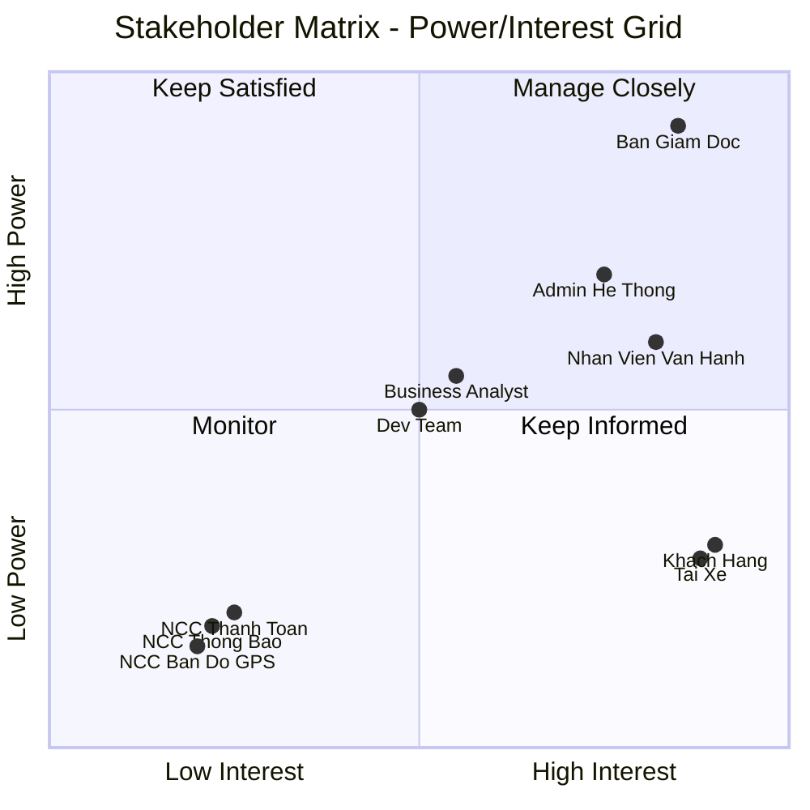
```mermaid
quadrantChart
    title Stakeholder Matrix - Power/Interest Grid
    x-axis Low Interest --> High Interest
    y-axis Low Power --> High Power
    quadrant-1 Manage Closely
    quadrant-2 Keep Satisfied
    quadrant-3 Monitor
    quadrant-4 Keep Informed
    Ban Giam Doc: [0.85, 0.92]
    Admin He Thong: [0.75, 0.70]
    Nhan Vien Van Hanh: [0.82, 0.60]
    Khach Hang: [0.90, 0.30]
    Tai Xe: [0.88, 0.28]
    Business Analyst: [0.55, 0.55]
    Dev Team: [0.50, 0.50]
    NCC Thanh Toan: [0.25, 0.20]
    NCC Ban Do GPS: [0.20, 0.15]
    NCC Thong Bao: [0.22, 0.18]
```

**Chiến lược giao tiếp theo ma trận:**

| Quadrant | Stakeholder | Chiến lược |
|----------|-----------|------------|
| **Manage Closely** (Power ↑ Interest ↑) | Ban giám đốc, Admin hệ thống, Nhân viên vận hành | Họp báo cáo tiến độ hàng tuần, tham gia review yêu cầu, phê duyệt thay đổi lớn |
| **Keep Satisfied** (Power ↑ Interest ↓) | Business Analyst, Dev Team | Cập nhật khi có thay đổi yêu cầu hoặc quyết định kỹ thuật quan trọng |
| **Keep Informed** (Power ↓ Interest ↑) | Khách hàng, Tài xế | Thu thập feedback qua khảo sát, thông báo tính năng mới, hỗ trợ sử dụng |
| **Monitor** (Power ↓ Interest ↓) | NCC Thanh toán, NCC Bản đồ/GPS, NCC Thông báo | Liên hệ khi cần tích hợp kỹ thuật, theo dõi SLA dịch vụ |

---

### 1.4 Business Goals (Mục tiêu nghiệp vụ)

Dựa trên phân tích Business Context và Business Problem, xác định các mục tiêu nghiệp vụ theo **4 cấp độ**.

#### 1.4.1 Mục tiêu chiến lược (Strategic Goals)

| ID | Mục tiêu | Mô tả chi tiết | Chỉ số đo lường (KPI) | Liên quan |
|----|----------|----------------|----------------------|-----------|
| **BG-01** | **Chuyển đổi số toàn bộ quy trình đặt xe** | Thay thế quy trình thủ công bằng nền tảng số tự động hóa. Khách hàng tự đặt xe qua ứng dụng, hệ thống tự tìm và phân công tài xế, tự tính cước và xử lý thanh toán. | • ≥ 90% chuyến đi được xử lý hoàn toàn qua hệ thống<br>• Giảm ≥ 70% cuộc gọi vào tổng đài | Vấn đề 1, 2 |
| **BG-02** | **Mở rộng quy mô phục vụ** | Xây dựng nền tảng có khả năng phục vụ số lượng lớn khách hàng và tài xế đồng thời. | • ≥ 1.000 chuyến/ngày<br>• ≥ 500 tài xế hoạt động đồng thời<br>• API response ≤ 2 giây dưới tải cao | Vấn đề 4 |
| **BG-03** | **Tăng doanh thu và kiểm soát tài chính** | Số hóa thanh toán để ghi nhận 100% giao dịch, loại bỏ thất thoát từ quy trình tiền mặt. | • 100% giao dịch được ghi nhận<br>• ≥ 30% khách hàng dùng thanh toán điện tử trong 3 tháng đầu<br>• Giảm ≥ 50% sai lệch đối soát | Vấn đề 3 |

#### 1.4.2 Mục tiêu vận hành (Operational Goals)

| ID | Mục tiêu | Mô tả chi tiết | Chỉ số đo lường (KPI) | Liên quan |
|----|----------|----------------|----------------------|-----------|
| **BG-04** | **Tự động hóa tìm và phân công tài xế** | Hệ thống tự động xác định tài xế phù hợp dựa trên vị trí, trạng thái, loại xe. Tự chuyển sang tài xế tiếp theo khi tài xế đầu từ chối/không phản hồi. | • Thời gian đặt xe → có tài xế ≤ 2 phút<br>• Tỷ lệ tìm được tài xế ≥ 85%<br>• 0% phân công thủ công | Vấn đề 1 |
| **BG-05** | **Minh bạch trạng thái chuyến đi cho khách hàng** | Khách hàng theo dõi được toàn bộ hành trình real-time. | • 100% chuyến đi có trạng thái real-time<br>• Cập nhật vị trí mỗi 5–10 giây<br>• Giảm ≥ 80% cuộc gọi hỏi "tài xế ở đâu" | Vấn đề 2 |
| **BG-06** | **Tính cước chính xác và tự động** | Hệ thống tự động tính cước dựa trên loại dịch vụ, khoảng cách, thời gian. Quy tắc cấu hình được không cần sửa code. | • 100% chuyến đi tính cước tự động<br>• Sai số cước ước tính ≤ 15%<br>• Thay đổi bảng giá ≤ 5 phút | Vấn đề 3 |
| **BG-07** | **Quản lý tài xế và phương tiện hiệu quả** | Quản lý đầy đủ thông tin tài xế, phương tiện. Tài xế tự quản lý trạng thái online/offline. | • 100% tài xế được quản lý hồ sơ<br>• 100% phương tiện được đăng ký và xác minh<br>• Duyệt hồ sơ tài xế mới ≤ 24 giờ | Vấn đề 1, 5 |
| **BG-08** | **Thông báo kịp thời cho tất cả các bên** | Khách hàng, tài xế nhận thông báo tại mỗi bước quan trọng. Kiến trúc Provider Pattern dễ bổ sung kênh mới. | • 100% sự kiện quan trọng có thông báo (≥ 8 loại)<br>• Gửi thông báo ≤ 3 giây sau sự kiện<br>• Bổ sung kênh mới ≤ 1 ngày phát triển | Vấn đề 2, 4 |

#### 1.4.3 Mục tiêu hỗ trợ quản lý (Management & Decision Support Goals)

| ID | Mục tiêu | Mô tả chi tiết | Chỉ số đo lường (KPI) | Liên quan |
|----|----------|----------------|----------------------|-----------|
| **BG-09** | **Cung cấp công cụ quản trị tập trung** | Dashboard quản lý khách hàng, tài xế, phương tiện, chuyến đi. Hỗ trợ xử lý sự cố. Phân quyền rõ ràng: Operator vs Admin. | • 100% thao tác quản lý qua hệ thống<br>• Xử lý sự cố chuyến đi ≤ 10 phút<br>• Phân quyền ít nhất 2 cấp | Vấn đề 5 |
| **BG-10** | **Báo cáo dữ liệu vận hành cho Ban lãnh đạo** | Báo cáo tổng hợp: số chuyến, doanh thu, tỷ lệ hoàn thành, tỷ lệ hủy, hiệu quả tài xế. | • Báo cáo tự động theo ngày/tuần/tháng<br>• ≥ 5 loại báo cáo<br>• Dữ liệu báo cáo trễ tối đa 1 giờ | Vấn đề 5 |

#### 1.4.4 Mục tiêu kỹ thuật và bảo mật (Technology & Security Goals)

| ID | Mục tiêu | Mô tả chi tiết | Chỉ số đo lường (KPI) | Liên quan |
|----|----------|----------------|----------------------|-----------|
| **BG-11** | **Kiến trúc linh hoạt, dễ mở rộng** | Modular, các thành phần tách biệt (đặt xe, thanh toán, thông báo) mở rộng độc lập. Lỗi một thành phần không làm sập toàn hệ thống. | • Lỗi module thanh toán/thông báo không ảnh hưởng module đặt xe<br>• Thêm loại dịch vụ xe mới ≤ 2 ngày<br>• Thêm phương thức thanh toán ≤ 3 ngày<br>• Uptime ≥ 99% | Vấn đề 4 |
| **BG-12** | **Bảo mật dữ liệu và kiểm soát truy cập** | Xác thực bắt buộc. Phân quyền RBAC. Bảo vệ dữ liệu cá nhân, vị trí, giao dịch. Không lưu thông tin thanh toán nhạy cảm. Audit log. | • 100% API yêu cầu xác thực<br>• 0 thông tin thẻ/tài khoản lưu trong DB<br>• 100% thao tác nhạy cảm được ghi audit log<br>• Mật khẩu hashed, token có thời hạn | Vấn đề 6 |
| **BG-13** | **Nâng cao trải nghiệm người dùng** | Giao diện trực quan, đặt xe tối đa 3 bước. Tài xế thao tác đơn giản. Responsive desktop và mobile. | • Đặt xe ≤ 3 bước (≤ 60 giây)<br>• Tài xế nhận/từ chối 1 chạm<br>• Giao diện responsive | Vấn đề 2 |

#### 1.4.5 Tổng hợp Business Goals – Bản đồ liên kết

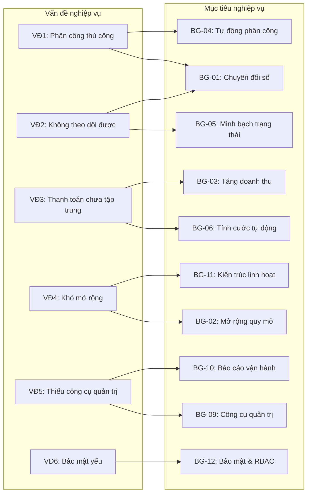
```mermaid
flowchart LR
    subgraph Problems["Vấn đề nghiệp vụ"]
        P1["VĐ1: Phân công thủ công"]
        P2["VĐ2: Không theo dõi được"]
        P3["VĐ3: Thanh toán chưa tập trung"]
        P4["VĐ4: Khó mở rộng"]
        P5["VĐ5: Thiếu công cụ quản trị"]
        P6["VĐ6: Bảo mật yếu"]
    end

    subgraph Goals["Mục tiêu nghiệp vụ"]
        BG01["BG-01: Chuyển đổi số"]
        BG04["BG-04: Tự động phân công"]
        BG05["BG-05: Minh bạch trạng thái"]
        BG06["BG-06: Tính cước tự động"]
        BG03["BG-03: Tăng doanh thu"]
        BG02["BG-02: Mở rộng quy mô"]
        BG09["BG-09: Công cụ quản trị"]
        BG10["BG-10: Báo cáo vận hành"]
        BG11["BG-11: Kiến trúc linh hoạt"]
        BG12["BG-12: Bảo mật & RBAC"]
    end

    P1 --> BG01
    P1 --> BG04
    P2 --> BG05
    P2 --> BG01
    P3 --> BG06
    P3 --> BG03
    P4 --> BG02
    P4 --> BG11
    P5 --> BG09
    P5 --> BG10
    P6 --> BG12
```

#### 1.4.6 Ưu tiên triển khai Business Goals (MoSCoW)

| Mức ưu tiên | Business Goals | Lý do |
|-------------|---------------|-------|
| **Must Have** | BG-01, BG-04, BG-05, BG-06, BG-07, BG-12 | Lõi nghiệp vụ: đặt xe → tìm tài xế → chạy chuyến → tính cước + bảo mật cơ bản |
| **Should Have** | BG-03, BG-08, BG-09, BG-13 | Quan trọng cho vận hành hàng ngày |
| **Could Have** | BG-02, BG-10, BG-11 | Mở rộng quy mô, báo cáo nâng cao – triển khai sau khi core ổn định |
| **Won't Have** | Surge pricing tự động, Ví nội bộ, Ride sharing, Chat in-app | Ngoài phạm vi MVP |

---

### 1.5 Phạm vi hệ thống (Scope)

#### 1.5.1 Trong phạm vi (In Scope) – MVP Phase 1

Hệ thống CAB MVP bao gồm **3 ứng dụng web**, **1 API Gateway** và các backend service độc lập, phục vụ quy trình cốt lõi: **Đặt xe → Tìm tài xế → Thực hiện chuyến → Tính cước → Thanh toán → Đánh giá**.

**A. Actors (Tác nhân tương tác với hệ thống):**

| # | Actor | Loại | Mô tả |
|---|-------|------|-------|
| 1 | **Khách hàng (Customer)** | Primary – External | Người đặt xe, sử dụng dịch vụ, thanh toán và đánh giá |
| 2 | **Tài xế (Driver)** | Primary – External | Người nhận và thực hiện chuyến đi |
| 3 | **Nhân viên vận hành (Operator)** | Primary – Internal | Quản lý vận hành hàng ngày (quyền hạn chế) |
| 4 | **Quản trị viên (Admin)** | Primary – Internal | Quản trị toàn bộ hệ thống (toàn quyền) |
| 5 | **Cổng thanh toán (Payment Gateway)** | Secondary – External System | Xử lý giao dịch thanh toán điện tử |
| 6 | **Dịch vụ bản đồ (Map Service)** | Secondary – External System | Cung cấp bản đồ, tính khoảng cách, geocoding |
| 7 | **Dịch vụ Email (Email Service)** | Secondary – External System | Gửi email thông báo |
| 8 | **Nhà cung cấp thông báo (Notification Provider)** | Secondary – External System | Gửi thông báo đa kênh (SMS, Push) |

**B. Chức năng chi tiết theo module:**

**Module 1: Quản lý tài khoản & Xác thực (Authentication & User Management)**

| # | Chức năng | Actor | Mức ưu tiên | Mô tả |
|---|----------|-------|-------------|-------|
| F-01 | Đăng ký tài khoản khách hàng | Customer | Must Have | Đăng ký bằng email, SĐT, mật khẩu. Xác thực email |
| F-02 | Đăng ký tài khoản tài xế | Driver | Must Have | Đăng ký kèm thông tin bằng lái, phương tiện. Chờ duyệt |
| F-03 | Đăng nhập / Đăng xuất | Customer, Driver, Operator, Admin | Must Have | Đăng nhập bằng email + mật khẩu, nhận JWT token |
| F-04 | Cập nhật thông tin cá nhân | Customer, Driver | Must Have | Sửa tên, SĐT, avatar, địa chỉ |
| F-05 | Đổi mật khẩu | Customer, Driver, Operator, Admin | Must Have | Đổi mật khẩu khi đang đăng nhập |
| F-06 | Quên mật khẩu / Reset | Customer, Driver | Should Have | Gửi link reset qua email |
| F-07 | Admin tạo tài khoản tài xế | Operator, Admin | Must Have | Tạo tài khoản cho tài xế từ phía vận hành |

**Module 2: Quản lý tài xế & Phương tiện (Driver & Vehicle Management)**

| # | Chức năng | Actor | Mức ưu tiên | Mô tả |
|---|----------|-------|-------------|-------|
| F-08 | Cập nhật hồ sơ tài xế | Driver | Must Have | Bằng lái, CMND/CCCD, ảnh đại diện |
| F-09 | Đăng ký / Cập nhật thông tin phương tiện | Driver | Must Have | Biển số, hãng xe, model, màu, loại xe, số ghế |
| F-10 | Chuyển trạng thái hoạt động | Driver | Must Have | Toggle: Offline ↔ Available. Khi đang chở khách tự chuyển sang Busy |
| F-11 | Cập nhật vị trí GPS | Driver | Must Have | Gửi tọa độ GPS liên tục qua Socket.IO khi ở trạng thái Available/Busy |
| F-12 | Duyệt hồ sơ tài xế | Operator, Admin | Must Have | Xem và phê duyệt/từ chối hồ sơ tài xế đăng ký mới |
| F-13 | Xem danh sách phương tiện | Operator, Admin | Should Have | Danh sách xe đã đăng ký, lọc theo loại, trạng thái |
| F-14 | Vô hiệu hóa tài xế / phương tiện | Admin | Should Have | Tạm khóa tài xế vi phạm hoặc xe hết hạn đăng kiểm |

**Module 3: Đặt xe & Quản lý chuyến đi (Ride Booking & Management) ⭐ Core**

| # | Chức năng | Actor | Mức ưu tiên | Mô tả |
|---|----------|-------|-------------|-------|
| F-15 | Nhập điểm đón và điểm đến | Customer | Must Have | Nhập địa chỉ hoặc chọn trên bản đồ, geocoding sang tọa độ |
| F-16 | Chọn loại xe | Customer | Must Have | Chọn loại xe (Sedan/SUV/Van), hiển thị giá ước tính tương ứng |
| F-17 | Xem cước phí ước tính | Customer | Must Have | Hiển thị giá ước tính trước khi xác nhận đặt xe |
| F-18 | Gửi yêu cầu đặt xe | Customer | Must Have | Xác nhận đặt xe, tạo ride với status = `requested` |
| F-19 | Theo dõi trạng thái chuyến đi | Customer | Must Have | Hiển thị trạng thái: Đang tìm tài xế → Tài xế nhận → Đang đến → Đã đón → Đang di chuyển → Hoàn thành |
| F-20 | Theo dõi vị trí tài xế trên bản đồ | Customer | Must Have | Hiển thị real-time vị trí tài xế trên bản đồ |
| F-21 | Xem thông tin tài xế được phân công | Customer | Must Have | Tên, SĐT, ảnh, biển số xe, loại xe, rating |
| F-22 | Hủy chuyến | Customer | Must Have | Hủy chuyến trước khi tài xế đến điểm đón (miễn phí cho MVP) |
| F-23 | Xem lịch sử chuyến đi | Customer, Driver | Must Have | Danh sách chuyến đã hoàn thành/hủy, chi tiết từng chuyến |
| F-24 | Xem chi tiết chuyến đi | Customer, Driver | Must Have | Điểm đón/trả, khoảng cách, thời gian, cước phí, trạng thái, tài xế |

**Module 4: Tìm & Phân công tài xế (Driver Matching) ⭐ Core**

| # | Chức năng | Actor | Mức ưu tiên | Mô tả |
|---|----------|-------|-------------|-------|
| F-25 | Tự động tìm tài xế phù hợp | System | Must Have | Tìm tài xế Available trong bán kính, đúng loại xe, sắp xếp theo khoảng cách gần nhất |
| F-26 | Gửi yêu cầu chuyến cho tài xế | System → Driver | Must Have | Gửi thông báo real-time qua Socket.IO cho tài xế được chọn |
| F-27 | Chấp nhận chuyến | Driver | Must Have | Tài xế nhấn chấp nhận, status chuyển sang `accepted` |
| F-28 | Từ chối chuyến | Driver | Must Have | Tài xế nhấn từ chối, hệ thống tự động tìm tài xế tiếp theo |
| F-29 | Tự động chuyển tài xế khi hết thời gian | System | Must Have | Nếu tài xế không phản hồi trong 30s, tự chuyển sang tài xế kế tiếp |
| F-30 | Thông báo không tìm được tài xế | System → Customer | Must Have | Sau khi thử hết (tối đa 5 tài xế), thông báo cho khách hàng |
| F-31 | Cập nhật trạng thái chuyến đi | Driver | Must Have | Driver cập nhật: `driver_arrived` → `in_progress` → `completed` |

**Module 5: Tính cước & Thanh toán (Fare & Payment)**

| # | Chức năng | Actor | Mức ưu tiên | Mô tả |
|---|----------|-------|-------------|-------|
| F-32 | Tính cước tự động | System | Must Have | Tính cước khi hoàn thành: `baseFare + (km × ratePerKm) + (phút × ratePerMin)` |
| F-33 | Cấu hình bảng giá theo loại xe | Admin | Must Have | Thiết lập giá cơ bản, đơn giá/km, đơn giá/phút cho từng loại xe |
| F-34 | Thanh toán tiền mặt | Customer | Must Have | Ghi nhận chuyến thanh toán bằng tiền mặt, tài xế xác nhận đã nhận tiền |
| F-35 | Thanh toán điện tử (Mock) | Customer | Should Have | Tích hợp cổng thanh toán giả lập, không lưu thông tin thẻ |
| F-36 | Xử lý thanh toán thất bại | System | Should Have | Thông báo khách hàng, cho phép thử lại hoặc chuyển sang tiền mặt |
| F-37 | Xem hóa đơn / chi tiết thanh toán | Customer | Should Have | Hiển thị chi tiết cước: giá cơ bản, phí km, phí thời gian, tổng cộng |

**Module 6: Thông báo (Notification)**

| # | Chức năng | Actor | Mức ưu tiên | Mô tả |
|---|----------|-------|-------------|-------|
| F-38 | Thông báo in-app (real-time) | Customer, Driver | Must Have | Thông báo qua Socket.IO: đặt xe thành công, có tài xế, trạng thái chuyến |
| F-39 | Thông báo email | Customer, Driver | Should Have | Email xác nhận đăng ký, hoàn thành chuyến, hóa đơn |
| F-40 | Danh sách thông báo | Customer, Driver | Should Have | Xem lịch sử thông báo, đánh dấu đã đọc |

**Danh sách sự kiện thông báo MVP:**

| Sự kiện | Customer nhận | Driver nhận | Kênh |
|---------|:---:|:---:|------|
| Yêu cầu đặt xe được tiếp nhận | ✅ | | In-app |
| Có chuyến mới cần nhận | | ✅ | In-app |
| Tài xế nhận chuyến | ✅ | | In-app |
| Tài xế đến điểm đón | ✅ | | In-app |
| Chuyến đi hoàn thành | ✅ | ✅ | In-app + Email |
| Kết quả thanh toán | ✅ | | In-app |
| Chuyến bị hủy | ✅ | ✅ | In-app |
| Không tìm được tài xế | ✅ | | In-app |

**Module 7: Đánh giá & Phản hồi (Rating & Review)**

| # | Chức năng | Actor | Mức ưu tiên | Mô tả |
|---|----------|-------|-------------|-------|
| F-41 | Đánh giá tài xế sau chuyến | Customer | Must Have | Chấm điểm 1–5 sao + nhận xét sau khi chuyến hoàn thành |
| F-42 | Xem rating trung bình | Customer, Driver | Should Have | Hiển thị rating trung bình của tài xế trên hồ sơ |
| F-43 | Xem danh sách đánh giá | Driver | Should Have | Tài xế xem các đánh giá khách hàng đã để lại |

**Module 8: Quản trị hệ thống (Admin Dashboard)**

| # | Chức năng | Actor | Mức ưu tiên | Mô tả |
|---|----------|-------|-------------|-------|
| F-44 | Dashboard tổng quan | Operator, Admin | Must Have | Số chuyến hôm nay, tài xế online, doanh thu hôm nay, chuyến đang diễn ra |
| F-45 | Quản lý khách hàng | Operator, Admin | Must Have | Xem danh sách, tìm kiếm, xem chi tiết, vô hiệu hóa tài khoản |
| F-46 | Quản lý tài xế | Operator, Admin | Must Have | Xem danh sách, duyệt hồ sơ, xem trạng thái, vô hiệu hóa |
| F-47 | Quản lý chuyến đi | Operator, Admin | Must Have | Xem chuyến đang diễn ra, chuyến lỗi, can thiệp xử lý |
| F-48 | Tra cứu lịch sử giao dịch | Operator, Admin | Should Have | Tìm kiếm giao dịch theo khách hàng, tài xế, thời gian, trạng thái |
| F-49 | Báo cáo số lượng chuyến | Admin | Should Have | Thống kê chuyến theo ngày/tuần/tháng, tỷ lệ hoàn thành/hủy |
| F-50 | Báo cáo doanh thu | Admin | Should Have | Tổng doanh thu, theo loại xe, theo phương thức thanh toán |
| F-51 | Báo cáo hiệu quả tài xế | Admin | Could Have | Số chuyến, rating, tỷ lệ từ chối, thu nhập của từng tài xế |
| F-52 | Phân quyền Operator / Admin | Admin | Must Have | Operator: chỉ xem + vận hành. Admin: toàn quyền |

**Module 9: Bảo mật & Hạ tầng (Security & Infrastructure)**

| # | Chức năng | Actor | Mức ưu tiên | Mô tả |
|---|----------|-------|-------------|-------|
| F-53 | Xác thực JWT | System | Must Have | Access token (15 phút) + Refresh token (7 ngày) |
| F-54 | Phân quyền RBAC | System | Must Have | 4 roles: Customer, Driver, Operator, Admin. Middleware kiểm tra quyền |
| F-55 | Mã hóa mật khẩu | System | Must Have | Hash mật khẩu bằng bcrypt trước khi lưu DB |
| F-56 | Audit Log | System | Should Have | Ghi log thao tác nhạy cảm |
| F-57 | Seed Data | System | Should Have | Dữ liệu mẫu: tài khoản test, tài xế, phương tiện, chuyến đi mẫu |

**C. Tổng hợp In Scope:**

| Thống kê | Số lượng |
|----------|---------|
| Tổng số chức năng | 57 |
| Must Have | 35 |
| Should Have | 18 |
| Could Have | 4 |
| Actors (Primary) | 4 |
| Actors (Secondary) | 4 |
| Modules | 9 |

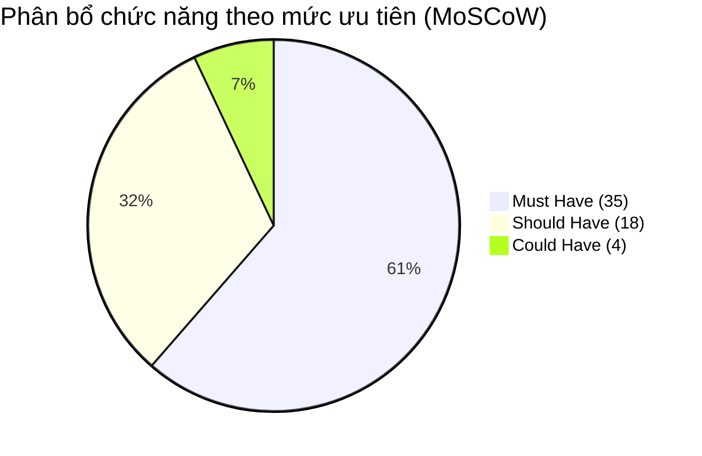
```mermaid
pie title Phân bổ chức năng theo mức ưu tiên (MoSCoW)
    "Must Have (35)" : 35
    "Should Have (18)" : 18
    "Could Have (4)" : 4
```

#### 1.5.2 Ngoài phạm vi (Out of Scope) – Giai đoạn MVP

| # | Tính năng | Lý do loại khỏi MVP | Phiên bản dự kiến |
|---|----------|---------------------|-------------------|
| OS-01 | Ứng dụng mobile native (iOS/Android) | Tốn thời gian phát triển, MVP dùng web responsive | v2.0 |
| OS-02 | Tích hợp tổng đài điện thoại (IVR) | Cần hạ tầng viễn thông, chi phí cao | v3.0 |
| OS-03 | Chia sẻ chuyến đi (Ride Sharing) | Logic phức tạp, cần core ổn định trước | v2.0 |
| OS-04 | Ví điện tử nội bộ (Internal Wallet) | Cần license tài chính | v2.0 |
| OS-05 | Surge pricing tự động | Cần dữ liệu lịch sử lớn và thuật toán phức tạp | v2.0 |
| OS-06 | Đa ngôn ngữ (i18n) | MVP chỉ hỗ trợ tiếng Việt | v2.0 |
| OS-07 | Chat in-app giữa Customer và Driver | Không thiết yếu cho MVP | v2.0 |
| OS-08 | Đặt xe hẹn giờ (Scheduled Ride) | Logic lên lịch phức tạp | v2.0 |
| OS-09 | Mã khuyến mãi / Voucher | Cần module quản lý campaign | v2.0 |
| OS-10 | Chương trình khách hàng thân thiết | Tích điểm, đổi thưởng – cần hệ thống riêng | v3.0 |
| OS-11 | Tích hợp cổng thanh toán thật (VNPay, MoMo) | MVP dùng Mock Gateway | v1.1 |
| OS-12 | Push Notification (Firebase/APNs) | MVP dùng Socket.IO in-app + Email | v2.0 |
| OS-13 | Notification qua SMS | Chi phí gửi SMS, cần tích hợp nhà cung cấp | v1.1 |
| OS-14 | Báo cáo nâng cao (BI Dashboard) | MVP chỉ báo cáo cơ bản | v2.0 |
| OS-15 | Quản lý khiếu nại / Dispute | Quy trình xử lý phức tạp | v2.0 |
| OS-16 | Định tuyến / Navigation cho tài xế | MVP hiển thị điểm đón/trả trên bản đồ | v2.0 |
| OS-17 | Đánh giá khách hàng bởi tài xế | Two-way rating phức tạp hơn | v1.1 |

#### 1.5.3 Ranh giới hệ thống (System Boundary)

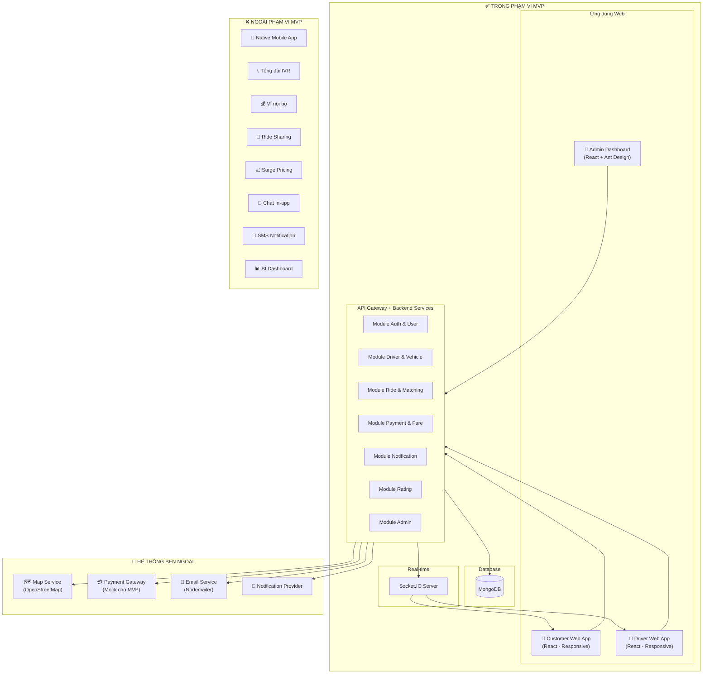
```mermaid
flowchart TB
    subgraph InScope["✅ TRONG PHẠM VI MVP"]
        subgraph Apps["Ứng dụng Web"]
            CApp["🧑 Customer Web App\n(React - Responsive)"]
            DApp["🚗 Driver Web App\n(React - Responsive)"]
            AApp["🔧 Admin Dashboard\n(React + Ant Design)"]
        end

        subgraph Backend["API Gateway + Backend Services"]
            Auth["Module Auth & User"]
            Driver["Module Driver & Vehicle"]
            Ride["Module Ride & Matching"]
            Pay["Module Payment & Fare"]
            Notif["Module Notification"]
            Rating["Module Rating"]
            Admin["Module Admin"]
        end

        subgraph Data["Database"]
            DB[(MongoDB)]
        end

        subgraph Realtime["Real-time"]
            Socket["Socket.IO Server"]
        end
    end

    subgraph OutScope["❌ NGOÀI PHẠM VI MVP"]
        Mobile["📱 Native Mobile App"]
        IVR["📞 Tổng đài IVR"]
        Wallet["💰 Ví nội bộ"]
        RideShare["🤝 Ride Sharing"]
        Surge["📈 Surge Pricing"]
        Chat["💬 Chat In-app"]
        SMS["📨 SMS Notification"]
        BI["📊 BI Dashboard"]
    end

    subgraph External["🔗 HỆ THỐNG BÊN NGOÀI"]
        MapAPI["🗺️ Map Service\n(OpenStreetMap)"]
        PayGW["💳 Payment Gateway\n(Mock cho MVP)"]
        EmailSvc["📧 Email Service\n(Nodemailer)"]
        NotifProv["📨 Notification Provider"]
    end

    CApp --> Backend
    DApp --> Backend
    AApp --> Backend
    Backend --> DB
    Backend --> Socket
    Backend --> MapAPI
    Backend --> PayGW
    Backend --> EmailSvc
    Backend --> NotifProv
    Socket --> CApp
    Socket --> DApp
```

---

### 1.6 Business Requirements (Yêu cầu nghiệp vụ)

Các yêu cầu nghiệp vụ được xác định từ mô tả yêu cầu khách hàng, phân nhóm theo lĩnh vực nghiệp vụ.

#### 1.6.1 Quản lý tài khoản & Xác thực

| Ký hiệu | Tên | Diễn giải |
|----------|-----|-----------|
| BR-001 | Đăng ký tài khoản khách hàng | Hệ thống phải cho phép khách hàng tự đăng ký tài khoản bằng thông tin cá nhân (họ tên, email, số điện thoại, mật khẩu). Tài khoản phải được xác thực trước khi sử dụng dịch vụ. |
| BR-002 | Đăng ký tài khoản tài xế | Hệ thống phải cho phép tài xế tự đăng ký tài khoản hoặc được nhân viên vận hành tạo tài khoản. Hồ sơ tài xế phải bao gồm thông tin bằng lái và phương tiện, và phải được duyệt trước khi hoạt động. |
| BR-003 | Đăng nhập hệ thống | Hệ thống phải xác thực người dùng trước khi cho phép truy cập các chức năng yêu cầu tài khoản. Mỗi nhóm người dùng chỉ được truy cập chức năng phù hợp với vai trò. |
| BR-004 | Cập nhật thông tin cá nhân | Khách hàng và tài xế phải có khả năng cập nhật thông tin cá nhân của mình bất kỳ lúc nào sau khi đăng nhập. |

#### 1.6.2 Đặt xe & Quản lý chuyến đi

| Ký hiệu | Tên | Diễn giải |
|----------|-----|-----------|
| BR-005 | Tạo yêu cầu đặt xe | Khách hàng phải có thể đặt xe bằng cách nhập điểm đón, điểm đến và lựa chọn loại xe mong muốn. Hệ thống phải hiển thị cước phí ước tính trước khi khách hàng xác nhận đặt xe. |
| BR-006 | Lựa chọn loại xe | Hệ thống phải hỗ trợ ít nhất 3 loại xe (Sedan 4 chỗ, SUV 7 chỗ, Van 16 chỗ) với mức giá khác nhau. |
| BR-007 | Theo dõi trạng thái chuyến đi | Sau khi đặt xe, khách hàng phải biết được hệ thống đang tìm tài xế, tài xế nào đã nhận chuyến, thời gian dự kiến tài xế đến, và trạng thái hiện tại của chuyến đi. |
| BR-008 | Theo dõi vị trí tài xế real-time | Khách hàng phải có thể xem vị trí tài xế trên bản đồ theo thời gian thực sau khi có tài xế nhận chuyến, bao gồm thời gian dự kiến tài xế đến điểm đón. |
| BR-009 | Xem thông tin tài xế | Khi có tài xế nhận chuyến, khách hàng phải xem được thông tin tài xế gồm: tên, số điện thoại, ảnh, biển số xe, loại xe và đánh giá trung bình. |
| BR-010 | Hủy chuyến đi | Khách hàng phải có khả năng hủy chuyến đi. Chính sách hủy chuyến phải được quy định rõ ràng (MVP: miễn phí trước khi tài xế đến điểm đón). |
| BR-011 | Xem lịch sử chuyến đi | Khách hàng phải có thể xem lịch sử tất cả chuyến đi đã thực hiện, bao gồm chi tiết từng chuyến. |
| BR-012 | Quy trình chuyến đi hoàn chỉnh | Hệ thống phải hỗ trợ đầy đủ quy trình chuyến đi: Khách đặt xe → Hệ thống tìm tài xế → Tài xế nhận chuyến → Tài xế đến điểm đón → Đón khách → Di chuyển đến điểm đến → Hoàn thành → Tính cước → Thanh toán → Đánh giá. |

#### 1.6.3 Quản lý tài xế & Phương tiện

| Ký hiệu | Tên | Diễn giải |
|----------|-----|-----------|
| BR-013 | Cập nhật hồ sơ tài xế | Tài xế phải có khả năng cập nhật hồ sơ cá nhân và thông tin phương tiện sau khi đăng nhập. |
| BR-014 | Quản lý trạng thái hoạt động | Tài xế phải có thể chuyển sang trạng thái sẵn sàng nhận chuyến khi đang làm việc và chuyển về trạng thái offline khi nghỉ. Hệ thống chỉ gửi yêu cầu chuyến đến tài xế đang ở trạng thái sẵn sàng. |
| BR-015 | Cập nhật vị trí tài xế | Hệ thống phải lưu thông tin vị trí GPS của tài xế khi đang ở trạng thái sẵn sàng hoặc đang thực hiện chuyến. |
| BR-016 | Duyệt hồ sơ tài xế | Nhân viên vận hành hoặc Admin phải duyệt hồ sơ tài xế mới đăng ký trước khi tài xế được phép hoạt động trên hệ thống. |
| BR-017 | Quản lý phương tiện | Mỗi tài xế phải đăng ký ít nhất một phương tiện. Thông tin phương tiện phải được xác minh. |

#### 1.6.4 Tìm & Phân công tài xế

| Ký hiệu | Tên | Diễn giải |
|----------|-----|-----------|
| BR-018 | Tự động tìm tài xế phù hợp | Khi khách hàng tạo chuyến đi, hệ thống phải tự động xác định các tài xế phù hợp dựa trên: vị trí hiện tại (trong bán kính cho phép), trạng thái sẵn sàng, loại xe phù hợp. |
| BR-019 | Ưu tiên tài xế gần nhất | Hệ thống phải ưu tiên gửi yêu cầu chuyến cho tài xế gần khách hàng nhất trước, sau đó xét thêm tiêu chí phụ (rating) nếu có nhiều tài xế cùng khoảng cách. |
| BR-020 | Cơ chế retry khi tài xế từ chối | Nếu tài xế được đề xuất không phản hồi hoặc từ chối chuyến, hệ thống phải tiếp tục tìm tài xế khác mà không yêu cầu khách hàng tạo lại yêu cầu. Tối đa thử 5 tài xế. |
| BR-021 | Giới hạn thời gian phản hồi | Tài xế phải phản hồi yêu cầu chuyến trong khoảng thời gian quy định (mặc định 30 giây). Hết thời gian mà không phản hồi được xem như từ chối. |
| BR-022 | Thông báo không tìm được tài xế | Trong trường hợp không tìm được tài xế nào sau khi đã thử hết danh sách, khách hàng phải được thông báo rõ ràng. |
| BR-023 | Cập nhật trạng thái bởi tài xế | Trong quá trình thực hiện chuyến, tài xế phải cập nhật trạng thái theo từng bước. Mỗi trạng thái được ghi nhận thời gian. |

#### 1.6.5 Tính cước & Thanh toán

| Ký hiệu | Tên | Diễn giải |
|----------|-----|-----------|
| BR-024 | Tính cước tự động | Sau khi chuyến đi hoàn thành, hệ thống phải tự động xác định số tiền khách hàng phải trả dựa trên loại dịch vụ, khoảng cách thực tế và thời gian di chuyển. |
| BR-025 | Cước phí ước tính | Hệ thống phải hiển thị cước phí ước tính cho khách hàng trước khi xác nhận đặt xe. |
| BR-026 | Cấu hình bảng giá | Bảng giá phải có thể cấu hình theo từng loại xe mà không cần sửa mã nguồn. |
| BR-027 | Hỗ trợ nhiều phương thức thanh toán | Khách hàng phải có thể thanh toán bằng tiền mặt hoặc phương thức thanh toán điện tử. Hệ thống phải có khả năng tích hợp thêm phương thức thanh toán mới. |
| BR-028 | Tích hợp cổng thanh toán bên ngoài | Doanh nghiệp muốn tích hợp với nhà cung cấp thanh toán bên ngoài cho thanh toán điện tử. Thông tin nhạy cảm của thẻ hoặc tài khoản thanh toán KHÔNG được lưu trực tiếp trong hệ thống CAB. |
| BR-029 | Xử lý thanh toán thất bại | Nếu giao dịch thanh toán điện tử thất bại, hệ thống phải thông báo cho khách hàng và cho phép xử lý lại. |
| BR-030 | Xem chi tiết thanh toán | Khách hàng phải xem được chi tiết cước phí sau chuyến. |

#### 1.6.6 Thông báo

| Ký hiệu | Tên | Diễn giải |
|----------|-----|-----------|
| BR-031 | Thông báo cho khách hàng | Khách hàng phải nhận được thông báo tại các thời điểm quan trọng: yêu cầu đặt xe được tiếp nhận, có tài xế nhận chuyến, tài xế đến điểm đón, chuyến hoàn thành, kết quả thanh toán, và khi không tìm được tài xế. |
| BR-032 | Thông báo cho tài xế | Tài xế phải nhận được thông báo khi có chuyến mới phù hợp, khi chuyến bị hủy bởi khách hàng. |
| BR-033 | Khả năng mở rộng kênh thông báo | Hệ thống thông báo phải được thiết kế linh hoạt để bổ sung thêm các kênh thông báo mới (SMS, Push Notification) trong tương lai. |

#### 1.6.7 Đánh giá & Phản hồi

| Ký hiệu | Tên | Diễn giải |
|----------|-----|-----------|
| BR-034 | Đánh giá tài xế sau chuyến | Khách hàng phải có khả năng đánh giá tài xế (1–5 sao) và viết nhận xét sau khi hoàn thành chuyến đi. Điểm đánh giá phải được tổng hợp thành rating trung bình. |
| BR-035 | Xem lịch sử đánh giá | Tài xế phải xem được các đánh giá mà khách hàng đã để lại. |

#### 1.6.8 Quản trị & Báo cáo

| Ký hiệu | Tên | Diễn giải |
|----------|-----|-----------|
| BR-036 | Giao diện quản trị tập trung | Doanh nghiệp phải có một giao diện quản trị để nhân viên vận hành và quản trị viên quản lý khách hàng, tài xế, phương tiện và chuyến đi từ một nơi duy nhất. |
| BR-037 | Giám sát chuyến đi | Nhân viên vận hành phải có thể xem các chuyến đang diễn ra, kiểm tra trạng thái tài xế, và hỗ trợ xử lý các trường hợp chuyến bị lỗi. |
| BR-038 | Tra cứu lịch sử giao dịch | Nhân viên vận hành phải có thể tra cứu lịch sử giao dịch thanh toán theo khách hàng, tài xế, khoảng thời gian hoặc trạng thái giao dịch. |
| BR-039 | Phân quyền quản trị | Một số chức năng quản trị phải được phân quyền: Operator không được thực hiện các thao tác nhạy cảm. Chỉ Admin mới có toàn quyền. |
| BR-040 | Báo cáo vận hành | Ban lãnh đạo phải có báo cáo về: số lượng chuyến, doanh thu, tỷ lệ chuyến hoàn thành, tỷ lệ hủy, và hiệu quả hoạt động của từng tài xế. |

#### 1.6.9 Bảo mật, Hiệu năng & Kiến trúc

| Ký hiệu | Tên | Diễn giải |
|----------|-----|-----------|
| BR-041 | Xác thực bắt buộc | Khách hàng và tài xế phải được xác thực trước khi sử dụng các chức năng yêu cầu tài khoản. Các thao tác quản trị phải được kiểm soát quyền truy cập theo vai trò. |
| BR-042 | Bảo vệ dữ liệu | Thông tin cá nhân, thông tin phương tiện, dữ liệu vị trí và dữ liệu giao dịch phải được bảo vệ. Mật khẩu phải được mã hóa. Thông tin thanh toán nhạy cảm không được lưu trong hệ thống. |
| BR-043 | Ghi log thao tác quan trọng | Doanh nghiệp cần lưu vết (audit log) các thao tác quan trọng để phục vụ kiểm tra khi có sự cố. |
| BR-044 | Hoạt động ổn định và cách ly lỗi | Hệ thống phải hoạt động ổn định vào các thời điểm nhu cầu tăng cao. Lỗi xảy ra ở chức năng thanh toán hoặc thông báo KHÔNG được làm toàn bộ hệ thống đặt xe ngừng hoạt động. |
| BR-045 | Kiến trúc linh hoạt và triển khai từng phần | Hệ thống phải có kiến trúc đủ linh hoạt để bổ sung loại dịch vụ mới, thêm phương thức thanh toán, thêm nhà cung cấp thông báo hoặc thay đổi thành phần kỹ thuật mà không phải xây dựng lại toàn bộ. |

#### 1.6.10 Tổng hợp Business Requirements

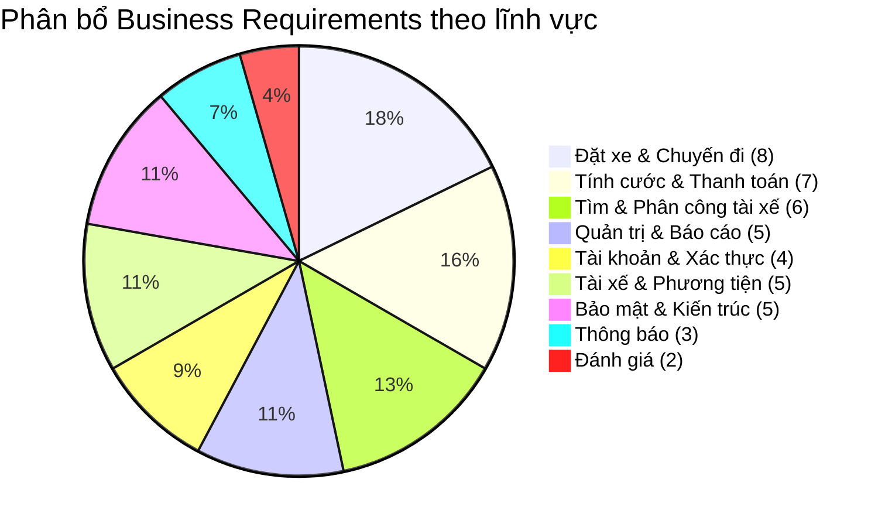
```mermaid
pie title Phân bổ Business Requirements theo lĩnh vực
    "Đặt xe & Chuyến đi (8)" : 8
    "Tính cước & Thanh toán (7)" : 7
    "Tìm & Phân công tài xế (6)" : 6
    "Quản trị & Báo cáo (5)" : 5
    "Tài khoản & Xác thực (4)" : 4
    "Tài xế & Phương tiện (5)" : 5
    "Bảo mật & Kiến trúc (5)" : 5
    "Thông báo (3)" : 3
    "Đánh giá (2)" : 2
```

**Ma trận truy xuất Business Requirements → Business Goals:**

| Business Requirement | Business Goal liên quan |
|---------------------|------------------------|
| BR-001 → BR-004 | BG-01, BG-12 |
| BR-005 → BR-012 | BG-01, BG-05, BG-13 |
| BR-013 → BR-017 | BG-07 |
| BR-018 → BR-023 | BG-04, BG-01 |
| BR-024 → BR-030 | BG-06, BG-03 |
| BR-031 → BR-033 | BG-08, BG-11 |
| BR-034 → BR-035 | BG-05, BG-13 |
| BR-036 → BR-040 | BG-09, BG-10 |
| BR-041 → BR-045 | BG-11, BG-12, BG-02 |

---

### 1.7 Business Processes (Quy trình nghiệp vụ)

#### 1.7.1 Sơ đồ Quy trình Tổng thể (End-to-End Business Flow)

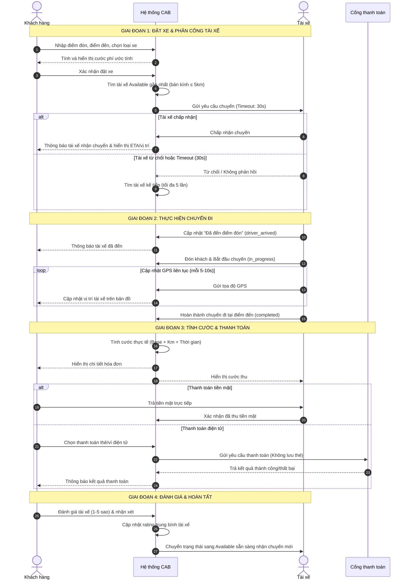
```mermaid
sequenceDiagram
    autonumber
    actor C as Khách hàng
    participant S as Hệ thống CAB
    actor D as Tài xế
    participant P as Cổng thanh toán

    Note over C,D: GIAI ĐOẠN 1: ĐẶT XE & PHÂN CÔNG TÀI XẾ
    C->>S: Nhập điểm đón, điểm đến, chọn loại xe
    S-->>C: Tính và hiển thị cước phí ước tính
    C->>S: Xác nhận đặt xe
    S->>S: Tìm tài xế Available gần nhất (bán kính ≤ 5km)
    S->>D: Gửi yêu cầu chuyến (Timeout: 30s)
    alt Tài xế chấp nhận
        D->>S: Chấp nhận chuyến
        S-->>C: Thông báo tài xế nhận chuyến & hiển thị ETA/vị trí
    else Tài xế từ chối hoặc Timeout (30s)
        D--xS: Từ chối / Không phản hồi
        S->>S: Tìm tài xế kế tiếp (tối đa 5 lần)
    end

    Note over C,D: GIAI ĐOẠN 2: THỰC HIỆN CHUYẾN ĐI
    D->>S: Cập nhật "Đã đến điểm đón" (driver_arrived)
    S-->>C: Thông báo tài xế đã đến
    D->>S: Đón khách & Bắt đầu chuyến (in_progress)
    loop Cập nhật GPS liên tục (mỗi 5-10s)
        D->>S: Gửi tọa độ GPS
        S-->>C: Cập nhật vị trí tài xế trên bản đồ
    end
    D->>S: Hoàn thành chuyến đi tại điểm đến (completed)

    Note over C,P: GIAI ĐOẠN 3: TÍNH CƯỚC & THANH TOÁN
    S->>S: Tính cước thực tế (Base + Km + Thời gian)
    S-->>C: Hiển thị chi tiết hóa đơn
    S-->>D: Hiển thị cước thu
    alt Thanh toán tiền mặt
        C->>D: Trả tiền mặt trực tiếp
        D->>S: Xác nhận đã thu tiền mặt
    else Thanh toán điện tử
        C->>S: Chọn thanh toán thẻ/ví điện tử
        S->>P: Gửi yêu cầu thanh toán (Không lưu thẻ)
        P-->>S: Trả kết quả thành công/thất bại
        S-->>C: Thông báo kết quả thanh toán
    end

    Note over C,D: GIAI ĐOẠN 4: ĐÁNH GIÁ & HOÀN TẤT
    C->>S: Đánh giá tài xế (1-5 sao) & nhận xét
    S->>S: Cập nhật rating trung bình tài xế
    S->>D: Chuyển trạng thái sang Available sẵn sàng nhận chuyến mới
```

#### 1.7.2 BP-01: Quy trình Đăng ký & Onboarding Tài khoản

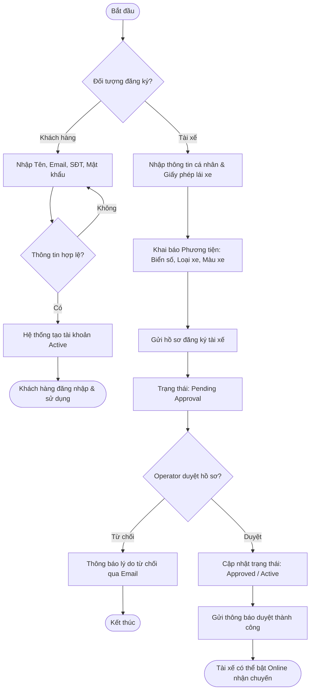
```mermaid
flowchart TD
    Start([Bắt đầu]) --> Choice{Đối tượng đăng ký?}
    
    Choice -- Khách hàng --> RegCust[Nhập Tên, Email, SĐT, Mật khẩu]
    RegCust --> ValidCust{Thông tin hợp lệ?}
    ValidCust -- Không --> RegCust
    ValidCust -- Có --> CreateCust[Hệ thống tạo tài khoản Active]
    CreateCust --> EndCust([Khách hàng đăng nhập & sử dụng])

    Choice -- Tài xế --> RegDrv[Nhập thông tin cá nhân & Giấy phép lái xe]
    RegDrv --> RegVeh[Khai báo Phương tiện: Biển số, Loại xe, Màu xe]
    RegVeh --> SubmitDrv[Gửi hồ sơ đăng ký tài xế]
    SubmitDrv --> Pending[Trạng thái: Pending Approval]
    
    Pending --> OpReview{Operator duyệt hồ sơ?}
    OpReview -- Từ chối --> RejectDrv[Thông báo lý do từ chối qua Email]
    RejectDrv --> EndReject([Kết thúc])
    
    OpReview -- Duyệt --> ApproveDrv[Cập nhật trạng thái: Approved / Active]
    ApproveDrv --> NotifyDrv[Gửi thông báo duyệt thành công]
    NotifyDrv --> EndDrv([Tài xế có thể bật Online nhận chuyến])
```

#### 1.7.3 BP-02: Quy trình Đặt xe, Tìm kiếm & Phân công Tài xế (Core Matching)

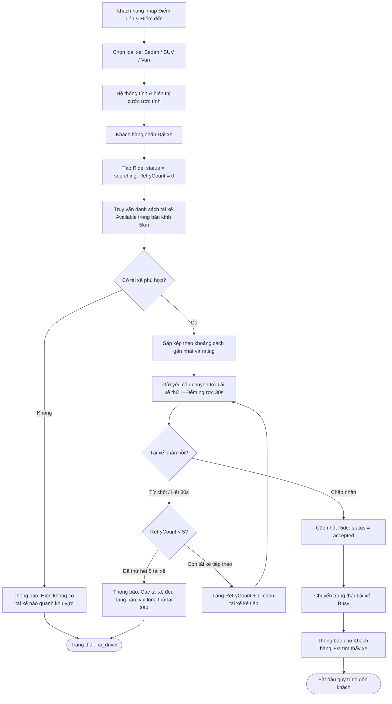
```mermaid
flowchart TD
    A[Khách hàng nhập Điểm đón & Điểm đến] --> B[Chọn loại xe: Sedan / SUV / Van]
    B --> C[Hệ thống tính & hiển thị cước ước tính]
    C --> D[Khách hàng nhấn Đặt xe]
    D --> E[Tạo Ride: status = searching, RetryCount = 0]
    
    E --> F[Truy vấn danh sách tài xế Available trong bán kính 5km]
    F --> G{Có tài xế phù hợp?}
    
    G -- Không --> NoDrv[Thông báo: Hiện không có tài xế nào quanh khu vực]
    NoDrv --> EndFail([Trạng thái: no_driver])
    
    G -- Có --> SortDrv[Sắp xếp theo khoảng cách gần nhất và rating]
    SortDrv --> SendReq[Gửi yêu cầu chuyến tới Tài xế thứ i - Đếm ngược 30s]
    
    SendReq --> WaitResp{Tài xế phản hồi?}
    
    WaitResp -- Chấp nhận --> Accept[Cập nhật Ride: status = accepted]
    Accept --> SetDrvBusy[Chuyển trạng thái Tài xế: Busy]
    SetDrvBusy --> NotifyMatched[Thông báo cho Khách hàng: Đã tìm thấy xe]
    NotifyMatched --> EndSuccess([Bắt đầu quy trình đón khách])
    
    WaitResp -- Từ chối / Hết 30s --> CheckRetry{RetryCount < 5?}
    CheckRetry -- Còn tài xế tiếp theo --> NextDrv[Tăng RetryCount + 1, chọn tài xế kế tiếp]
    NextDrv --> SendReq
    CheckRetry -- Đã thử hết 5 tài xế --> MaxFail[Thông báo: Các tài xế đều đang bận, vui lòng thử lại sau]
    MaxFail --> EndFail
```

#### 1.7.4 BP-03: Quy trình Thực hiện Chuyến đi & Giám sát Real-time

| Thuộc tính | Chi tiết |
|------------|----------|
| **Mục đích** | Đảm bảo tính minh bạch, hiển thị vị trí liên tục cho khách hàng và lưu vết lộ trình |
| **Actor** | Tài xế, Khách hàng, Hệ thống CAB (Socket Server) |
| **Tiền điều kiện** | Chuyến đi đang ở trạng thái `accepted` |
| **Hậu điều kiện** | Chuyến đi chuyển sang `completed`, sẵn sàng tính cước |

**Các bước thực hiện:**
1. **Di chuyển đến điểm đón**: Tài xế bấm "Bắt đầu di chuyển tới đón". Hệ thống phát socket tọa độ GPS cho Khách hàng.
2. **Đến điểm đón**: Tài xế bấm **"Đã đến điểm đón"** (`driver_arrived`). Khách hàng nhận thông báo.
3. **Đón khách & Bắt đầu hành trình**: Tài xế bấm **"Bắt đầu chuyến đi"** (`in_progress`). Ghi nhận `startedAt`.
4. **Hành trình di chuyển**: GPS phát liên tục mỗi 5-10s. Khách hàng theo dõi trực tiếp.
5. **Đến nơi & Hoàn thành**: Tài xế bấm **"Hoàn thành chuyến"** (`completed`). Ghi nhận `completedAt`.

#### 1.7.5 BP-04: Quy trình Tính cước & Thanh toán

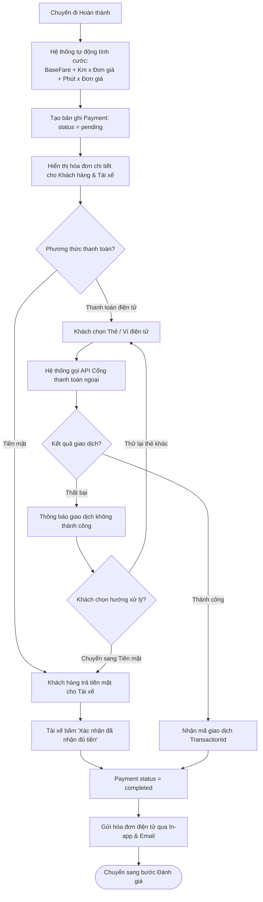
```mermaid
flowchart TD
    A[Chuyến đi Hoàn thành] --> B[Hệ thống tự động tính cước:<br/>BaseFare + Km x Đơn giá + Phút x Đơn giá]
    B --> C[Tạo bản ghi Payment: status = pending]
    C --> D[Hiển thị hóa đơn chi tiết cho Khách hàng & Tài xế]
    
    D --> E{Phương thức thanh toán?}
    
    E -- Tiền mặt --> Cash[Khách hàng trả tiền mặt cho Tài xế]
    Cash --> CashConfirm[Tài xế bấm 'Xác nhận đã nhận đủ tiền']
    CashConfirm --> PaySuccess[Payment status = completed]
    
    E -- Thanh toán điện tử --> OnlinePay[Khách chọn Thẻ / Ví điện tử]
    OnlinePay --> GatewayReq[Hệ thống gọi API Cổng thanh toán ngoại]
    GatewayReq --> GatewayProcess{Kết quả giao dịch?}
    
    GatewayProcess -- Thành công --> TokenRes[Nhận mã giao dịch TransactionId]
    TokenRes --> PaySuccess
    
    GatewayProcess -- Thất bại --> PayFail[Thông báo giao dịch không thành công]
    PayFail --> RetryChoice{Khách chọn hướng xử lý?}
    RetryChoice -- Thử lại thẻ khác --> OnlinePay
    RetryChoice -- Chuyển sang Tiền mặt --> Cash
    
    PaySuccess --> SendReceipt[Gửi hóa đơn điện tử qua In-app & Email]
    SendReceipt --> NextStep([Chuyển sang bước Đánh giá])
```

#### 1.7.6 BP-05: Quy trình Đánh giá & Phản hồi sau Chuyến đi

| Thuộc tính | Chi tiết |
|------------|----------|
| **Mục đích** | Thu thập đánh giá chất lượng phục vụ và cập nhật uy tín của tài xế |
| **Actor** | Khách hàng, Hệ thống CAB |
| **Tiền điều kiện** | Chuyến đi đã thanh toán thành công |
| **Hậu điều kiện** | Rating trung bình của tài xế được tính toán lại |

1. **Hiển thị Form đánh giá**: Sau khi thanh toán xong, màn hình tự động hiển thị giao diện chấm điểm (1-5 sao).
2. **Khách gửi đánh giá**: Khách chọn số sao và gửi phản hồi (hoặc bỏ qua).
3. **Tổng hợp Rating**: Hệ thống lưu đánh giá và tính lại điểm trung bình.
4. **Giải phóng trạng thái**: Tài xế về `Available` sẵn sàng nhận cuốc tiếp theo.

#### 1.7.7 BP-06: Quy trình Hủy chuyến (Cancellation Flow)

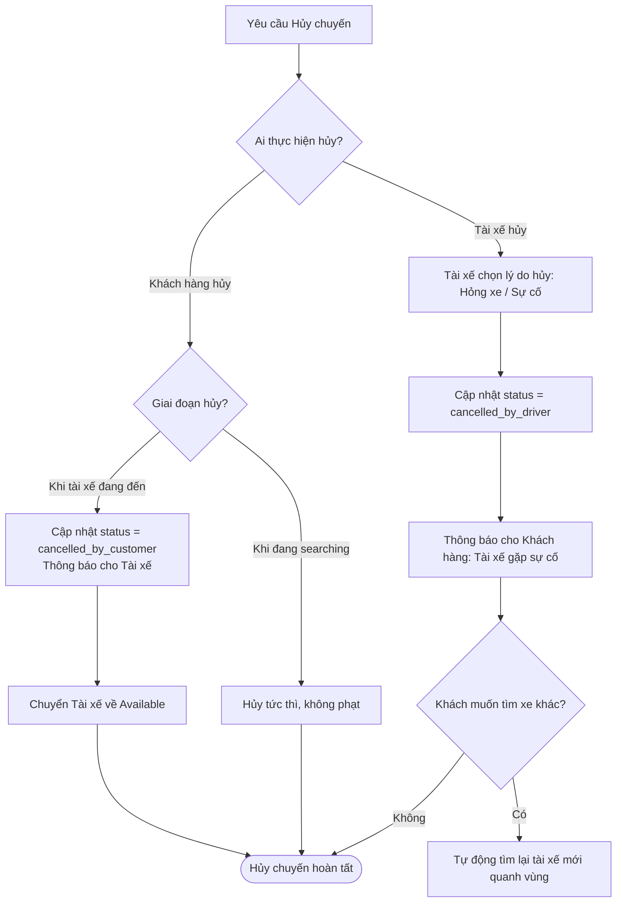
```mermaid
flowchart TD
    A[Yêu cầu Hủy chuyến] --> B{Ai thực hiện hủy?}
    
    B -- Khách hàng hủy --> CheckCustPhase{Giai đoạn hủy?}
    CheckCustPhase -- Khi đang searching --> CancelDirect1[Hủy tức thì, không phạt]
    CheckCustPhase -- Khi tài xế đang đến --> CancelMatched[Cập nhật status = cancelled_by_customer<br/>Thông báo cho Tài xế]
    CancelMatched --> FreeDriver1[Chuyển Tài xế về Available]
    
    B -- Tài xế hủy --> DriverCancel[Tài xế chọn lý do hủy: Hỏng xe / Sự cố]
    DriverCancel --> CheckDrvPhase[Cập nhật status = cancelled_by_driver]
    CheckDrvPhase --> NotifyCust[Thông báo cho Khách hàng: Tài xế gặp sự cố]
    NotifyCust --> AutoReMatch{Khách muốn tìm xe khác?}
    AutoReMatch -- Có --> ReSearch[Tự động tìm lại tài xế mới quanh vùng]
    AutoReMatch -- Không --> EndCancel([Hủy chuyến hoàn tất])
    
    CancelDirect1 --> EndCancel
    FreeDriver1 --> EndCancel
```

#### 1.7.8 BP-07: Quy trình Giám sát Vận hành & Xử lý Sự cố

| Thuộc tính | Chi tiết |
|------------|----------|
| **Mục đích** | Giám sát toàn bộ chuyến đi đang chạy, can thiệp sự cố và xem báo cáo kinh doanh |
| **Actor** | Nhân viên vận hành (Operator), Quản trị viên (Admin), Hệ thống CAB |

1. **Giám sát thời gian thực**: Nhân viên vận hành theo dõi bản đồ trực quan với các xe `Available` (xanh lá), `Busy` (vàng), `Cảnh báo sự cố` (đỏ).
2. **Can thiệp sự cố**: Khi có khiếu nại hoặc chuyến bị kẹt, Operator có thể xem chi tiết, liên hệ trực tiếp, hủy cưỡng chế hoặc điều phối lại.
3. **Báo cáo định kỳ**: Admin truy cập trang Báo cáo để xuất số liệu: tổng chuyến, doanh thu, tỷ lệ cuốc thành công/hủy, bảng xếp hạng tài xế.

---

### 1.8 Open Issues & Điểm chưa rõ cần xác nhận

Dựa trên mô tả yêu cầu, doanh nghiệp **chưa chốt** các vấn đề sau:

| # | Vấn đề | Câu hỏi cần xác nhận | Giả định tạm thời cho MVP |
|---|--------|----------------------|--------------------------|
| Q-01 / OI-01 | **Cách tính cước & thời gian phản hồi** | Công thức tính cước chi tiết? Có phụ thu giờ cao điểm/đêm? Response time tối đa? | `Cước = Giá cơ bản + (Km × Đơn giá/km) + (Phút × Đơn giá/phút)` theo loại xe. Chưa xác định response time cụ thể |
| Q-02 | **Tiêu chí ưu tiên tài xế** | Ngoài khoảng cách, có ưu tiên theo rating, số chuyến, thâm niên? | Ưu tiên khoảng cách gần nhất, sau đó rating |
| Q-03 / OI-06 | **Thời gian phản hồi tài xế** | Tài xế có bao lâu để chấp nhận/từ chối? | 30 giây |
| Q-04 | **Số lần thử tài xế** | Tìm tối đa bao nhiêu tài xế trước khi báo không tìm được? | Tối đa 5 tài xế |
| Q-05 | **Bán kính tìm kiếm** | Bán kính tìm tài xế tối đa bao nhiêu km? | 5 km |
| Q-06 | **Chính sách hủy chuyến** | Khách/tài xế hủy chuyến bị phạt không? | Hủy miễn phí trước khi tài xế đến điểm đón |
| Q-07 / OI-05 | **Xử lý mất kết nối** | Khi tài xế/khách mất mạng giữa chuyến xử lý thế nào? | Giữ trạng thái chuyến, chờ kết nối lại trong 5 phút |
| Q-08 / OI-07 | **Thời gian lưu trữ dữ liệu** | Dữ liệu chuyến đi, giao dịch lưu bao lâu? | Lưu vĩnh viễn (soft delete) |
| Q-09 | **Loại xe** | Doanh nghiệp có bao nhiêu loại xe? Tên gọi và mức giá? | 3 loại: Sedan (4 chỗ), SUV (7 chỗ), VAN (16 chỗ) |
| Q-10 | **Phương thức thanh toán điện tử** | Tích hợp cổng thanh toán nào? (VNPay, MoMo, ZaloPay?) | Mock gateway cho MVP |
| OI-01 | **Performance định lượng** | Thời gian phản hồi tối đa của các chức năng quan trọng? | Cần BA xác nhận, chưa đưa số cụ thể |
| OI-02 | **Concurrent Users** | Hệ thống cần hỗ trợ tối đa bao nhiêu khách hàng/tài xế đồng thời? | Cần BA xác nhận |
| OI-03 | **Throughput** | Số lượng yêu cầu đặt xe tối đa trong một giây/phút? | Cần BA xác nhận |
| OI-04 | **Availability/SLA** | Mức Availability/SLA doanh nghiệp mong muốn? | Cần BA xác nhận |
| OI-08 | **Backup & Recovery** | Chính sách backup và thời gian khôi phục dữ liệu? | Cần BA xác nhận |

---

## Giai đoạn 2 – Phân rã yêu cầu chức năng

### 2.1 Cây phân rã chức năng (Functional Decomposition Tree)


```mermaid
graph TD
    L0["<b>CAB System Platform (L0)</b>"]
    
    L0 --> M1["1.0 Quản lý Xác thực & Tài khoản"]
    L0 --> M2["2.0 Quản lý Tài xế & Phương tiện"]
    L0 --> M3["3.0 Đặt xe & Vòng đời Chuyến đi"]
    L0 --> M4["4.0 Phân công & Ghép nối Tài xế"]
    L0 --> M5["5.0 Tính cước & Thanh toán"]
    L0 --> M6["6.0 Định vị & Giám sát Real-time"]
    L0 --> M7["7.0 Trung tâm Thông báo Đa kênh"]
    L0 --> M8["8.0 Đánh giá & Phản hồi"]
    L0 --> M9["9.0 Quản trị Vận hành & Báo cáo"]
    L0 --> M10["10.0 Bảo mật, RBAC & Audit Log"]

    M1 --> M1_1["1.1 Đăng ký đa kênh"]
    M1 --> M1_2["1.2 Xác thực JWT & Phiên"]
    M1 --> M1_3["1.3 Quản lý Hồ sơ cá nhân"]

    M2 --> M2_1["2.1 Đăng ký hồ sơ lái xe"]
    M2 --> M2_2["2.2 Quản lý hồ sơ phương tiện"]
    M2 --> M2_3["2.3 Quản lý trạng thái Online/Offline"]
    M2 --> M2_4["2.4 Xét duyệt hồ sơ (Operator)"]

    M3 --> M3_1["3.1 Khởi tạo yêu cầu chuyến"]
    M3 --> M3_2["3.2 Lựa chọn hạng xe & Ước tính cước"]
    M3 --> M3_3["3.3 Quản lý trạng thái chuyến đi"]
    M3 --> M3_4["3.4 Xử lý hủy chuyến"]
    M3 --> M3_5["3.5 Tra cứu lịch sử chuyến đi"]

    M4 --> M4_1["4.1 Quét tài xế quanh vùng 5km"]
    M4 --> M4_2["4.2 Thuật toán xếp hạng ưu tiên"]
    M4 --> M4_3["4.3 Điều phối yêu cầu & Timeout 30s"]
    M4 --> M4_4["4.4 Cơ chế thử lại tự động (Retry Max 5)"]

    M5 --> M5_1["5.1 Tính cước tự động theo công thức"]
    M5 --> M5_2["5.2 Quản lý cấu hình biểu phí xe"]
    M5 --> M5_3["5.3 Xử lý thanh toán Tiền mặt"]
    M5 --> M5_4["5.4 Xử lý thanh toán Điện tử (Mock Gateway)"]
    M5 --> M5_5["5.5 Xử lý lỗi & Thử lại giao dịch"]

    M6 --> M6_1["6.1 Thu nhận GPS tài xế liên tục"]
    M6 --> M6_2["6.2 Phát sóng vị trí qua WebSocket"]
    M6 --> M6_3["6.3 Tính toán khoảng cách & ETA"]

    M7 --> M7_1["7.1 Thông báo Real-time In-App (Socket)"]
    M7 --> M7_2["7.2 Thông báo qua Email (Nodemailer)"]
    M7 --> M7_3["7.3 Trung tâm quản lý thông báo người dùng"]

    M8 --> M8_1["8.1 Gửi đánh giá sao & Nhận xét"]
    M8 --> M8_2["8.2 Cập nhật Rating trung bình"]

    M9 --> M9_1["9.1 Dashboard Giám sát Real-time"]
    M9 --> M9_2["9.2 Quản lý Khách hàng & Tài xế"]
    M9 --> M9_3["9.3 Can thiệp & Xử lý chuyến đi"]
    M9 --> M9_4["9.4 Báo cáo thống kê & Doanh thu"]

    M10 --> M10_1["10.1 Phân quyền vai trò RBAC"]
    M10 --> M10_2["10.2 Ghi nhật ký kiểm toán Audit Log"]
    M10 --> M10_3["10.3 Mã hóa dữ liệu nhạy cảm"]
```

### 2.2 Bảng phân rã chi tiết yêu cầu chức năng theo từng phân hệ

#### 2.2.1 Phân hệ 1.0: Quản lý Xác thực & Tài khoản

| Mã FR | Tên chức năng | User Story / Mô tả | Input | Xử lý & Quy tắc | Output | BR liên quan | Ưu tiên |
|---|---|---|---|---|---|---|---|
| **FR-AUTH-01** | Đăng ký tài khoản Khách hàng | Là khách hàng, tôi muốn tạo tài khoản bằng Email/SĐT để sử dụng dịch vụ. | Họ tên, Email, SĐT, Mật khẩu | Kiểm tra định dạng, trùng lặp, hash bcrypt | Tài khoản `Active`, gửi email chào mừng | BR-001 | Must Have |
| **FR-AUTH-02** | Đăng ký tài khoản Tài xế | Là tài xế, tôi muốn đăng ký tài khoản kèm giấy tờ để xin gia nhập hệ thống. | Họ tên, SĐT, Email, Mật khẩu, Số GPLX, Hạng bằng, Ảnh bằng lái | Kiểm tra hợp lệ, lưu `Pending_Approval` | Bản ghi tài xế chờ duyệt | BR-002 | Must Have |
| **FR-AUTH-03** | Đăng nhập hệ thống | Là người dùng, tôi muốn đăng nhập để truy cập chức năng. | Email/SĐT, Mật khẩu | So khớp DB, kiểm tra `isActive`, phát Access Token (15p) + Refresh Token (7 ngày) | Token + Role + Profile | BR-003, BR-041 | Must Have |
| **FR-AUTH-04** | Cập nhật hồ sơ cá nhân | Là người dùng, tôi muốn cập nhật thông tin cá nhân. | Tên, SĐT, Avatar | Xác thực token, cập nhật DB, không đổi email định danh | Hồ sơ cập nhật | BR-004 | Must Have |
| **FR-AUTH-05** | Đổi mật khẩu | Là người dùng, tôi muốn đổi mật khẩu mới để bảo mật. | Mật khẩu cũ, Mật khẩu mới | So khớp cũ, mật khẩu ≥ 6 ký tự, hash và lưu | Mật khẩu cập nhật, hủy token cũ | BR-042 | Must Have |
| **FR-AUTH-06** | Đăng xuất & Thu hồi phiên | Là người dùng, tôi muốn đăng xuất. | Refresh Token | Xóa refresh token khỏi DB/blacklist | Phiên kết thúc an toàn | BR-041 | Must Have |

#### 2.2.2 Phân hệ 2.0: Quản lý Tài xế & Phương tiện

| Mã FR | Tên chức năng | User Story / Mô tả | Input | Xử lý & Quy tắc | Output | BR liên quan | Ưu tiên |
|---|---|---|---|---|---|---|---|
| **FR-DRV-01** | Đăng ký thông tin phương tiện | Là tài xế, tôi muốn khai báo xe của mình. | Biển số, Hãng, Model, Màu, Loại xe, Số ghế | Biển số duy nhất, liên kết Driver ID | Bản ghi xe `Active` | BR-017 | Must Have |
| **FR-DRV-02** | Bật/Tắt Online/Offline | Là tài xế, tôi muốn bật chế độ sẵn sàng. | Trạng thái mong muốn | Chỉ cho phép `Available` nếu đã duyệt | Cập nhật DB, phát socket | BR-014 | Must Have |
| **FR-DRV-03** | Tự động chuyển Busy | Hệ thống tự động gán `Busy` khi đang chạy cuốc. | Sự kiện `accepted` | Chuyển sang `Busy`, ngưng nhận yêu cầu mới | Không xuất hiện trong tìm kiếm | BR-014, BR-023 | Must Have |
| **FR-DRV-04** | Duyệt hồ sơ tài xế | Là Operator, tôi muốn xét duyệt hồ sơ tài xế. | Driver ID, Quyết định, Lý do | Cập nhật `isApproved`, gửi email | Hồ sơ duyệt/từ chối | BR-016, BR-036 | Must Have |
| **FR-DRV-05** | Xem hồ sơ & hiệu suất | Là tài xế, tôi muốn xem tổng chuyến, thu nhập, rating. | Driver ID | Tổng hợp số cuốc, rating, tổng tiền | Dashboard tài xế | BR-013, BR-035 | Should Have |
| **FR-DRV-06** | Khóa tài xế vi phạm | Là Admin, tôi muốn khóa tài xế vi phạm. | Driver ID, Lý do | `isActive=false`, ngắt socket, thu hồi quyền | Tài xế bị đăng xuất | BR-036, BR-039 | Should Have |

#### 2.2.3 Phân hệ 3.0: Đặt xe & Vòng đời Chuyến đi

| Mã FR | Tên chức năng | User Story / Mô tả | Input | Xử lý & Quy tắc | Output | BR liên quan | Ưu tiên |
|---|---|---|---|---|---|---|---|
| **FR-RIDE-01** | Tìm kiếm & Nhập địa chỉ | Là khách hàng, tôi muốn tìm địa chỉ đón/trả trên bản đồ. | Tên địa chỉ hoặc tọa độ | Geocoding / Reverse Geocoding | Tọa độ chuẩn hóa + tên địa chỉ | BR-005 | Must Have |
| **FR-RIDE-02** | Hiển thị cước ước tính | Là khách hàng, tôi muốn xem trước số tiền ước tính. | Tọa độ đón, Tọa độ trả | Tính khoảng cách (Km), thời gian (Phút), áp dụng bảng giá | Bảng giá 3 hạng xe | BR-005, BR-006, BR-025 | Must Have |
| **FR-RIDE-03** | Khởi tạo yêu cầu đặt xe | Là khách hàng, tôi muốn gửi yêu cầu đặt xe. | Điểm đón, Điểm trả, Loại xe, PT thanh toán | Tạo Ride `searching`, kích hoạt matching | Ride ID, màn hình chờ | BR-005, BR-012 | Must Have |
| **FR-RIDE-04** | Cập nhật "Đã đến điểm đón" | Là tài xế, tôi muốn báo hiệu đã có mặt. | Ride ID, Driver ID | Kiểm tra `accepted`, đổi `driver_arrived`, ghi `arrivedAt` | Socket thông báo khách | BR-007, BR-023 | Must Have |
| **FR-RIDE-05** | Cập nhật "Bắt đầu chuyến đi" | Là tài xế, tôi muốn xác nhận khách đã lên xe. | Ride ID, Driver ID | Đổi `in_progress`, ghi `startedAt` | Màn hình theo dõi lộ trình | BR-007, BR-023 | Must Have |
| **FR-RIDE-06** | Cập nhật "Hoàn thành chuyến đi" | Là tài xế, tôi muốn bấm hoàn thành khi đến nơi. | Ride ID, Driver ID, Tọa độ kết thúc | Đổi `completed`, ghi `completedAt`, chuyển sang tính cước | Màn hình hóa đơn | BR-007, BR-023, BR-024 | Must Have |
| **FR-RIDE-07** | Khách hàng hủy chuyến | Là khách hàng, tôi muốn hủy cuốc khi có việc. | Ride ID, Lý do | Kiểm tra trạng thái, `cancelled_by_customer`, giải phóng tài xế | Chuyến kết thúc, thông báo tài xế | BR-010 | Must Have |
| **FR-RIDE-08** | Tài xế hủy chuyến do sự cố | Là tài xế, tôi muốn hủy khi xe gặp sự cố. | Ride ID, Lý do | `cancelled_by_driver`, kích hoạt tự động tìm xe mới | Thông báo cho khách | BR-010, BR-020 | Must Have |
| **FR-RIDE-09** | Tra cứu lịch sử & chi tiết | Là người dùng, tôi muốn xem lại các cuốc xe. | User ID, Bộ lọc | Truy vấn DB, sắp xếp mới nhất, phân trang | Danh sách chuyến đầy đủ | BR-011 | Must Have |

#### 2.2.4 Phân hệ 4.0: Phân công & Ghép nối Tài xế

| Mã FR | Tên chức năng | User Story / Mô tả | Input | Xử lý & Quy tắc | Output | BR liên quan | Ưu tiên |
|---|---|---|---|---|---|---|---|
| **FR-MATCH-01** | Quét tài xế quanh vùng | Hệ thống tự động quét tìm tài xế. | Tọa độ đón, Loại xe, Bán kính (5km) | Haversine/GeoNear, lọc `Available` + loại xe khớp | Danh sách tài xế theo khoảng cách tăng dần | BR-018, BR-019 | Must Have |
| **FR-MATCH-02** | Xếp hạng ưu tiên | Hệ thống chấm điểm ưu tiên tài xế. | Danh sách tài xế | Ưu tiên 1: khoảng cách gần nhất; Ưu tiên 2: rating cao | Tài xế ưu tiên #1 | BR-019 | Must Have |
| **FR-MATCH-03** | Gửi thông báo & 30s | Hệ thống gửi thông tin cuốc và đếm ngược. | Ride ID, Thông tin cuốc, Socket ID | Phát socket `ride:newRequest`, Timer 30s | Popup + đếm ngược | BR-020, BR-021 | Must Have |
| **FR-MATCH-04** | Xử lý chấp nhận | Là tài xế, tôi muốn bấm "Chấp nhận". | Ride ID, Driver ID | Kiểm tra chưa bị nhận, gán `driverId`, `accepted`, driver `Busy` | Khóa cuốc, hủy timer, thông báo khách | BR-007, BR-023 | Must Have |
| **FR-MATCH-05** | Xử lý từ chối/timeout | Hệ thống chuyển tài xế tiếp theo. | Sự kiện Từ chối/Timeout | Blacklist per Ride, `retryCount+1`, chọn kế tiếp nếu < 5 | Gửi sang tài xế tiếp theo | BR-020, BR-021 | Must Have |
| **FR-MATCH-06** | Không tìm thấy tài xế | Hệ thống kết thúc tìm kiếm. | `retryCount >= 5` hoặc DS trống | Ride → `no_driver` | Thông báo "không có tài xế" | BR-022 | Must Have |

#### 2.2.5 Phân hệ 5.0: Tính cước & Thanh toán

| Mã FR | Tên chức năng | User Story / Mô tả | Input | Xử lý & Quy tắc | Output | BR liên quan | Ưu tiên |
|---|---|---|---|---|---|---|---|
| **FR-PAY-01** | Tính cước thực tế | Hệ thống tự động tính tổng tiền. | Loại xe, Km, Phút | Công thức Base + Km×rate + Phút×rate | `actualFare` cập nhật vào Ride | BR-024, BR-026 | Must Have |
| **FR-PAY-02** | Cấu hình bảng giá | Là Admin, tôi muốn tùy chỉnh mức cước. | Loại xe, BaseFare, PricePerKm, PricePerMin | Lưu DB/Config, áp dụng ngay | Bảng giá mới | BR-026 | Must Have |
| **FR-PAY-03** | Thanh toán Tiền mặt | Là khách hàng, tôi muốn trả tiền mặt. | Ride ID, Lựa chọn `Cash` | Tạo Payment `PENDING` | Tài xế nhận yêu cầu thu tiền | BR-027, BR-034 | Must Have |
| **FR-PAY-04** | Tài xế xác nhận thu | Là tài xế, tôi muốn xác nhận đã nhận tiền. | Payment ID, Driver ID | Đổi `COMPLETED`, ghi `paidAt` | Hóa đơn hoàn tất, gửi biên lai | BR-027 | Must Have |
| **FR-PAY-05** | Thanh toán Điện tử Mock | Là khách hàng, tôi muốn thanh toán điện tử. | Payment ID, Phương thức, Token giả lập | Gọi Mock Gateway, nhận `transactionId`. Không lưu số thẻ/CVV | Payment `COMPLETED`, lưu `transactionId` | BR-028 | Should Have |
| **FR-PAY-06** | Xử lý thanh toán thất bại | Hệ thống xử lý khi cổng thanh toán lỗi. | Mã lỗi | Payment `FAILED`, thông báo lý do | Cho phép retry hoặc chuyển tiền mặt | BR-029 | Should Have |
| **FR-PAY-07** | Xuất hóa đơn | Là khách hàng, tôi muốn xem chi tiết hóa đơn. | Ride ID | Tổng hợp: giá cơ bản, phí Km, phí thời gian, PT thanh toán, mã GD | Màn hình hóa đơn + email | BR-030 | Should Have |

#### 2.2.6 Phân hệ 6.0: Định vị & Giám sát Real-time

| Mã FR | Tên chức năng | User Story / Mô tả | Input | Xử lý & Quy tắc | Output | BR liên quan | Ưu tiên |
|---|---|---|---|---|---|---|---|
| **FR-TRACK-01** | Thu nhận GPS tài xế | App tài xế tự động truyền GPS định kỳ. | Driver ID, lat, lng, bearing | Socket/HTTP mỗi 5-10s, cập nhật `currentLocation` | Tọa độ mới nhất ghi nhận | BR-015 | Must Have |
| **FR-TRACK-02** | Phát sóng vị trí cho khách | Khách xem xe di chuyển mượt trên bản đồ. | Ride ID, Socket Channel | Broadcast qua Room Socket của chuyến | Bản đồ cập nhật real-time | BR-008 | Must Have |
| **FR-TRACK-03** | Tính lại ETA | Hệ thống liên tục ước lượng số phút tới điểm đón. | Tọa độ tài xế, Tọa độ đón | Khoảng cách còn lại / tốc độ trung bình | "Tài xế đến trong X phút" | BR-007, BR-008 | Must Have |
| **FR-TRACK-04** | Hiển thị map cho Operator | Là Operator, tôi muốn xem map tổng thể. | Tọa độ trung tâm, Bán kính | Truy vấn tài xế `Available` + `Busy`, gắn icon màu | Bản đồ số xe trực quan | BR-037 | Should Have |

#### 2.2.7 Phân hệ 7.0: Trung tâm Thông báo Đa kênh

| Mã FR | Tên chức năng | User Story / Mô tả | Input | Xử lý & Quy tắc | Output | BR liên quan | Ưu tiên |
|---|---|---|---|---|---|---|---|
| **FR-NOTIF-01** | In-App Socket | Hệ thống phát popup trên màn hình người dùng. | User ID, Title, Message, Event Type | Định tuyến Socket, hiển thị toast/alert | Nhận tin tức thời không reload | BR-031, BR-032 | Must Have |
| **FR-NOTIF-02** | Gửi email tự động | Hệ thống gửi email xác nhận và hóa đơn. | Email, Template HTML, Data | Nodemailer/SMTP async, không chặn luồng chính | Email tới hộp thư ≤ 3s | BR-031, BR-033 | Should Have |
| **FR-NOTIF-03** | Hộp thư in-app | Là người dùng, tôi muốn xem lại thông báo cũ. | User ID, Phân trang | Lấy DS từ DB, sắp xếp mới nhất | DS thông báo + trạng thái đọc | BR-031 | Should Have |
| **FR-NOTIF-04** | Đánh dấu đã đọc | Là người dùng, tôi muốn đánh dấu đã đọc. | Notification ID hoặc "Đọc tất cả" | Cập nhật `isRead = true` | Số chưa đọc giảm về 0 | BR-031 | Should Have |
| **FR-NOTIF-05** | Provider Pattern | Kiến trúc hỗ trợ thêm adapter SMS/Push. | Interface `INotificationProvider` | Tách logic phát sinh và logic gửi kênh vật lý | Dễ cắm thêm module | BR-033, BR-045 | Must Have |

#### 2.2.8 Phân hệ 8.0: Đánh giá & Phản hồi

| Mã FR | Tên chức năng | User Story / Mô tả | Input | Xử lý & Quy tắc | Output | BR liên quan | Ưu tiên |
|---|---|---|---|---|---|---|---|
| **FR-RATE-01** | Gửi đánh giá | Là khách, tôi muốn chấm sao + nhận xét. | Ride ID, Số sao (1-5), Nhận xét | Kiểm tra `completed`, mỗi chuyến 1 lần, lưu Rating | Đánh giá lưu, hiển thị cảm ơn | BR-034 | Must Have |
| **FR-RATE-02** | Cập nhật Rating TB | Hệ thống cập nhật sao TB của tài xế. | Driver ID, Điểm mới | Tính lại AvgRating, cập nhật `DriverProfiles.rating` | Rating mới trên profile | BR-034 | Must Have |
| **FR-RATE-03** | Xem danh sách đánh giá | Là tài xế, tôi muốn xem phản hồi khách. | Driver ID | Truy vấn DS đánh giá (ẩn thông tin nhạy cảm) | Bảng nhận xét & sao | BR-035 | Should Have |

#### 2.2.9 Phân hệ 9.0: Quản trị Vận hành & Báo cáo

| Mã FR | Tên chức năng | User Story / Mô tả | Input | Xử lý & Quy tắc | Output | BR liên quan | Ưu tiên |
|---|---|---|---|---|---|---|---|
| **FR-ADM-01** | Dashboard tổng quan | Là Admin/Operator, tôi muốn xem chỉ số kinh doanh. | Ngày (mặc định hôm nay) | Đếm cuốc, doanh thu, tài xế online | Metric Cards + biểu đồ | BR-036, BR-040 | Must Have |
| **FR-ADM-02** | Quản lý Khách hàng | Là Operator, tôi muốn tra cứu thông tin KH. | Từ khóa, Bộ lọc | Tìm `role=customer`, phân trang | Bảng DS + nút xem/khóa | BR-036 | Must Have |
| **FR-ADM-03** | Quản lý Tài xế & Xe | Là Operator, tôi muốn quản lý tài xế và xe. | Bộ lọc trạng thái | Truy vấn DS kèm thông tin xe | Bảng quản trị + duyệt/khóa | BR-016, BR-036 | Must Have |
| **FR-ADM-04** | Giám sát & Can thiệp | Là Operator, tôi muốn xem chuyến đang chạy. | Bộ lọc trạng thái | Hiển thị real-time, nút "Hủy cưỡng chế" / "Gán lại tài xế" | Can thiệp kịp thời + log | BR-037, BR-043 | Must Have |
| **FR-ADM-05** | Tra cứu giao dịch | Là Operator, tôi muốn tra cứu lịch sử giao dịch. | Mã GD, Khoảng thời gian, PT thanh toán | Truy vấn Payment + Ride + Customer + Driver | Bảng dòng tiền | BR-038 | Should Have |
| **FR-ADM-06** | Báo cáo Doanh thu | Là Admin, tôi muốn xem biểu đồ doanh thu. | Khoảng thời gian, Tiêu chí gom | Aggregate Payment `COMPLETED`, group theo thời gian/loại xe | Biểu đồ + bảng xuất Excel/PDF | BR-040 | Should Have |
| **FR-ADM-07** | Báo cáo Tỷ lệ hoàn thành/hủy | Là Admin, tôi muốn theo dõi tỷ lệ cuốc. | Khoảng thời gian | Thống kê số `completed` / `cancelled_*` / `no_driver` | Biểu đồ tròn + DS lý do hủy | BR-040 | Should Have |
| **FR-ADM-08** | Báo cáo hiệu quả tài xế | Là Admin, tôi muốn xếp hạng tài xế. | Tháng, Tiêu chí xếp hạng | Group Driver ID, tổng cuốc, tổng tiền, rating, tỷ lệ từ chối | Bảng vinh danh + cảnh báo | BR-040 | Could Have |

#### 2.2.10 Phân hệ 10.0: Bảo mật, RBAC & Audit

| Mã FR | Tên chức năng | User Story / Mô tả | Input | Xử lý & Quy tắc | Output | BR liên quan | Ưu tiên |
|---|---|---|---|---|---|---|---|
| **FR-SEC-01** | Kiểm tra quyền RBAC | Hệ thống chặn thao tác trái thẩm quyền. | Token, Route/API | Middleware `authorize([...])`, không khớp → HTTP 403 | Ngăn truy cập trái phép | BR-039, BR-041 | Must Have |
| **FR-SEC-02** | Phân tách Operator vs Admin | Phân định rõ: Operator vận hành, Admin toàn quyền. | Vai trò | Cấm Operator API cấu hình giá, xóa user, phân quyền | Bảo vệ dữ liệu nhạy cảm | BR-039 | Must Have |
| **FR-SEC-03** | Audit Logging | Hệ thống ghi vết hành động quan trọng. | User ID, Action, Resource, IP, Timestamp | Middleware chèn `AuditLogs` khi thao tác nhạy cảm | DB nhật ký bất biến | BR-043 | Should Have |
| **FR-SEC-04** | Mã hóa mật khẩu | Bảo vệ mật khẩu người dùng. | Mật khẩu thô | bcrypt Salt Rounds ≥ 10 | Hash 1 chiều an toàn | BR-042 | Must Have |
| **FR-SEC-05** | Cách ly lỗi thành phần | Lỗi module phụ không làm chết hệ thống đặt xe. | Exception từ API bên thứ 3 | Try-catch, fallback, Async Worker / Message Queue | Module đặt xe vẫn hoạt động | BR-044, BR-045 | Must Have |

### 2.3 Ma trận liên kết chức năng và tác nhân (Function-Actor Matrix)

- **C** Create | **R** Read | **U** Update | **D** Delete/Deactivate | **E** Execute

| Phân hệ chức năng | Khách hàng | Tài xế | Operator | Admin | External |
|---|:---:|:---:|:---:|:---:|:---:|
| **1.0 Xác thực & Tài khoản** | C, R, U | C, R, U | R, U | C, R, U, D | - |
| **2.0 Tài xế & Phương tiện** | R | C, R, U | R, U (Duyệt) | C, R, U, D (Khóa) | - |
| **3.0 Đặt xe & Chuyến đi** | C, R, U (Hủy) | R, U (Cập nhật mốc) | R, U (Can thiệp) | R, U, D | - |
| **4.0 Phân công & Ghép nối** | E (Kích hoạt) | R, U (Nhận/Từ chối) | R (Giám sát) | R, U (Cấu hình) | - |
| **5.0 Tính cước & Thanh toán** | R, E (Thanh toán) | R, U (Xác nhận tiền mặt) | R (Tra cứu) | R, U (Sửa biểu giá) | E (Xử lý GD) |
| **6.0 Định vị & Giám sát** | R (Xem xe) | U, E (Bắn GPS) | R (Xem map) | R | E (Geocoding) |
| **7.0 Trung tâm Thông báo** | R | R | C, R | C, R | E (SMTP) |
| **8.0 Đánh giá & Phản hồi** | C, R | R | R | R, D | - |
| **9.0 Quản trị & Báo cáo** | - | - | R, U | C, R, U, D | - |
| **10.0 Bảo mật, RBAC & Audit** | - | - | R | C, R, U, D | - |

---

## Giai đoạn 3 – Quy tắc nghiệp vụ & Xử lý ngoại lệ

### 3.1 Danh mục Quy tắc nghiệp vụ (Business Rules Catalog)

#### BRULE-01: Quy tắc Cấu hình Định giá Cước

- **Mã quy tắc**: `BRULE-01`
- **Phân hệ áp dụng**: 5.0
- **Nội dung**:
  1. Công thức: $\text{Fare} = \max\left(\text{BaseFare}, \text{BaseFare} + (d \times \text{PricePerKm}) + (t \times \text{PricePerMin})\right)$
  2. Bảng giá mặc định MVP:

     | Hạng xe | Số chỗ | Giá mở cửa | Đơn giá / Km | Đơn giá / Phút |
     |---|:---:|:---:|:---:|:---:|
     | **Sedan** | 4 chỗ | 15.000 VNĐ | 12.000 VNĐ/km | 1.000 VNĐ/phút |
     | **SUV** | 7 chỗ | 20.000 VNĐ | 15.000 VNĐ/km | 1.500 VNĐ/phút |
     | **Van** | 16 chỗ | 35.000 VNĐ | 22.000 VNĐ/km | 2.500 VNĐ/phút |

#### BRULE-02: Quy tắc Quét & Ghép nối Tài xế

- **Mã quy tắc**: `BRULE-02`
- **Nội dung**:
  1. Điều kiện vào Candidate Pool: `isActive=true`, `isApproved=true`, `status='available'`, `VehicleType` khớp, GPS cách điểm đón ≤ 5.0 km.
  2. Ưu tiên: Khoảng cách gần nhất → Rating cao hơn (khi ± 200m).

#### BRULE-03: Quy tắc Thời gian Phản hồi & Thử lại

- **Mã**: `BRULE-03`
- **Nội dung**: 30s phản hồi; từ chối/timeout → loại + `RetryCount+1`; `MaxRetries=5` → `no_driver`.

#### BRULE-04: Quy tắc Chuyển đổi Trạng thái Tài xế

- **Mã**: `BRULE-04`

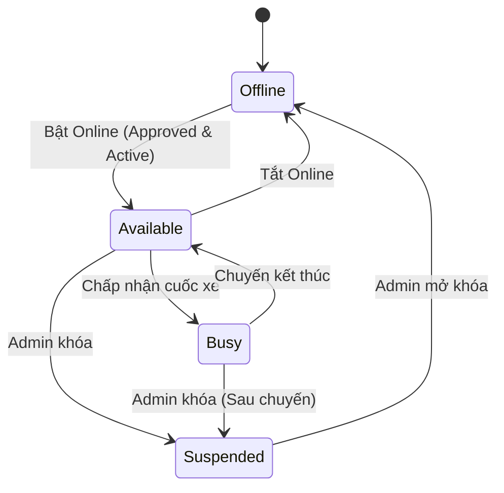
```mermaid
stateDiagram-v2
    [*] --> Offline
    Offline --> Available: Bật Online (Approved & Active)
    Available --> Offline: Tắt Online
    Available --> Busy: Chấp nhận cuốc xe
    Busy --> Available: Chuyến kết thúc
    Available --> Suspended: Admin khóa
    Busy --> Suspended: Admin khóa (Sau chuyến)
    Suspended --> Offline: Admin mở khóa
```

#### BRULE-05: Quy tắc Vòng đời Chuyến đi

- **Mã**: `BRULE-05`

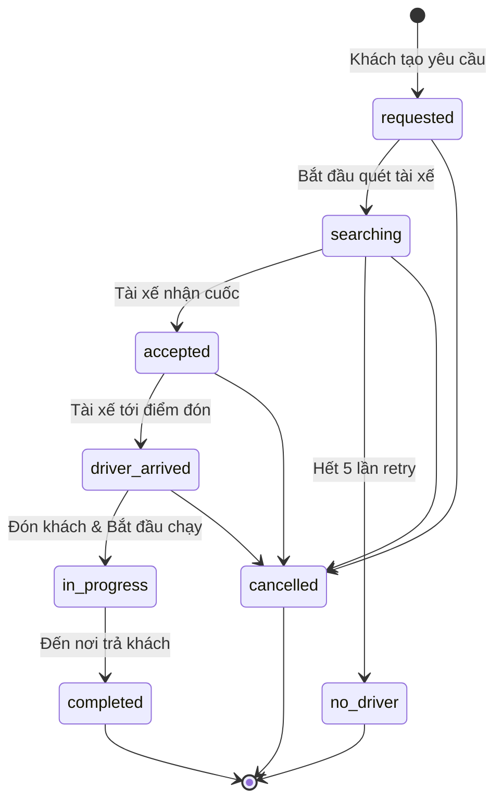
```mermaid
stateDiagram-v2
    [*] --> requested: Khách tạo yêu cầu
    requested --> searching: Bắt đầu quét tài xế
    searching --> accepted: Tài xế nhận cuốc
    searching --> no_driver: Hết 5 lần retry
    accepted --> driver_arrived: Tài xế tới điểm đón
    driver_arrived --> in_progress: Đón khách & Bắt đầu chạy
    in_progress --> completed: Đến nơi trả khách
    requested --> cancelled
    searching --> cancelled
    accepted --> cancelled
    driver_arrived --> cancelled
    completed --> [*]
    cancelled --> [*]
    no_driver --> [*]
```

#### BRULE-06: Quy tắc Chính sách Hủy Chuyến

- **Mã**: `BRULE-06`
- **Nội dung**:
  1. **Khách hủy**: `requested`/`searching` → miễn phí 100%. `accepted` → miễn phí (MVP). `in_progress` → KHÔNG cho phép hủy.
  2. **Tài xế hủy**: Chỉ khi `accepted`/`driver_arrived` + lý do. Ghi nhận tỷ lệ hủy.

#### BRULE-07: Quy tắc Thanh toán & Bảo mật Dữ liệu Tài chính

- **Mã**: `BRULE-07`
- **Nội dung**: Tiền mặt `PENDING` → `COMPLETED` khi tài xế xác nhận. Điện tử xử lý qua cổng, KHÔNG lưu số thẻ/CVV.

#### BRULE-08: Quy tắc Tính điểm Đánh giá Trung bình

- **Mã**: `BRULE-08`
- **Nội dung**: Chỉ đánh giá khi `completed` + `payment=COMPLETED`; mỗi chuyến 1 lần; $\bar{R} = \sum Stars / N$ (làm tròn 1 số lẻ).

#### BRULE-09: Quy tắc Phân quyền Vai trò Quản trị

- **Mã**: `BRULE-09`
- **Nội dung**: Operator không: sửa giá, xóa user, phân quyền. Admin: toàn quyền.

#### BRULE-10: Quy tắc Ghi vết Kiểm toán

- **Mã**: `BRULE-10`
- **Nội dung**: Mọi thao tác thay đổi dữ liệu trọng yếu phải ghi `AuditLog` (Append-Only).

### 3.2 Danh mục Trường hợp ngoại lệ & Cơ chế xử lý

| Mã | Tình huống | Giải pháp |
|---|---|---|
| **EX-01** | Không tìm được tài xế | Chuyển `no_driver`, thông báo khách, không trừ phí |
| **EX-02** | Tài xế Timeout 30s | Hủy popup, tăng RetryCount, chuyển tài xế kế |
| **EX-03** | Mất GPS / Mạng | Giữ trạng thái 5 phút, Client lưu đệm, sync back |
| **EX-04** | Khách hủy khi xe đang đến | `cancelled_by_customer`, giải phóng tài xế về `available` |
| **EX-05** | Khách không xuất hiện | Sau 5 phút, tài xế hủy `No-Show`, không phạt |
| **EX-06** | Xe hỏng / Tai nạn | `interrupted_by_incident`, tính cước đến thời điểm hỏng, tìm xe mới |
| **EX-07** | Thanh toán điện tử thất bại | `FAILED`, thông báo, cho phép retry/chuyển tiền mặt |
| **EX-08** | Tranh chấp nhận cuốc | Optimistic Locking, chỉ tài xế đầu tiên nhận |
| **EX-09** | Khóa tài khoản giữa cuốc | Chuyến tiếp tục hoàn thành, lệnh khóa áp dụng sau |
| **EX-10** | Cổng ngoại vi Outage | Circuit Breaker, Graceful Degradation |
| **EX-11** | Tài xế cập nhật chuyến không thuộc mình | Hệ thống từ chối |
| **EX-12** | Đánh giá chuyến chưa hoàn thành | Hệ thống từ chối đánh giá |

### 3.3 Ma trận liên kết Quy tắc & Ngoại lệ

| Business Rule | Exception | Cơ chế đảm bảo |
|---|---|---|
| BRULE-01 | EX-06, EX-10 | Fallback tính cước, Circuit Breaker |
| BRULE-02 | EX-01, EX-08 | Atomic query, bán kính 5km |
| BRULE-03 | EX-02, EX-01 | Distributed Timer, Blacklist per Ride |
| BRULE-04 | EX-04, EX-05, EX-09 | Tự động hoàn nguyên trạng thái |
| BRULE-05 | EX-03, EX-06 | FSM, đồng bộ bù GPS |
| BRULE-06 | EX-04, EX-05 | Kiểm tra trạng thái trước khi hủy |
| BRULE-07 | EX-07, EX-10 | Không lưu thẻ, Retry & Fallback |
| BRULE-08 | EX-06 | Chỉ kích hoạt form khi completed |
| BRULE-09 | EX-09 | Middleware JWT kiểm tra mỗi request |
| BRULE-10 | EX-06, EX-09 | Immutable Audit Log |

---

## Giai đoạn 4 – Mô hình hóa dữ liệu

### 4.1 Sơ đồ Thực thể Liên kết (ERD)

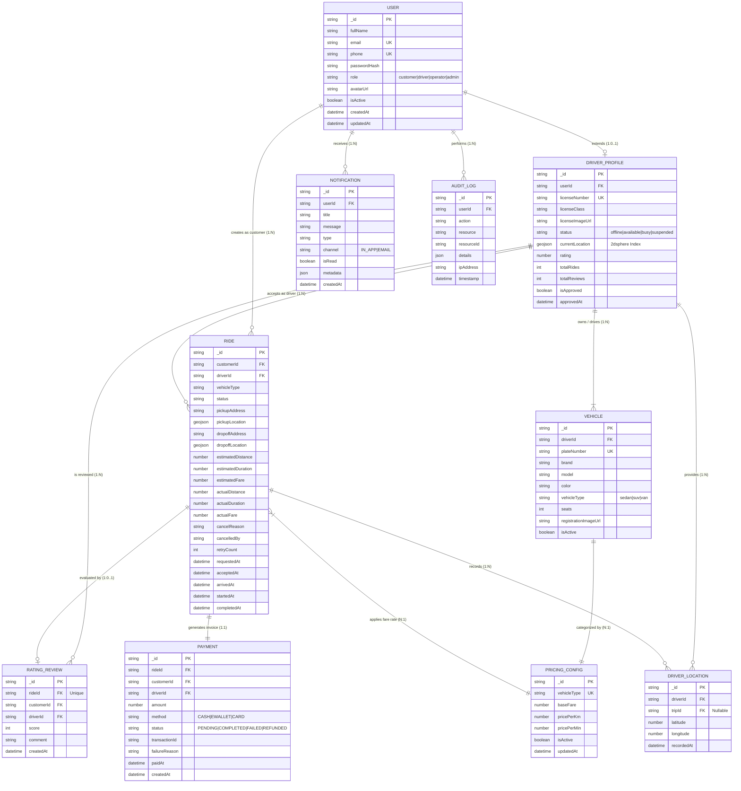
```mermaid
erDiagram
    USER ||--o| DRIVER_PROFILE : "extends (1:0..1)"
    USER ||--o{ RIDE : "creates as customer (1:N)"
    USER ||--o{ NOTIFICATION : "receives (1:N)"
    USER ||--o{ AUDIT_LOG : "performs (1:N)"
    
    DRIVER_PROFILE ||--|{ VEHICLE : "owns / drives (1:N)"
    DRIVER_PROFILE ||--o{ RIDE : "accepts as driver (1:N)"
    DRIVER_PROFILE ||--o{ RATING_REVIEW : "is reviewed (1:N)"
    DRIVER_PROFILE ||--o{ DRIVER_LOCATION : "provides (1:N)"
    
    VEHICLE ||--|| PRICING_CONFIG : "categorized by (N:1)"
    
    RIDE ||--|| PAYMENT : "generates invoice (1:1)"
    RIDE ||--o| RATING_REVIEW : "evaluated by (1:0..1)"
    RIDE ||--o{ DRIVER_LOCATION : "records (1:N)"
    RIDE }|--|| PRICING_CONFIG : "applies fare rate (N:1)"

    USER {
        string _id PK
        string fullName
        string email UK
        string phone UK
        string passwordHash
        string role "customer|driver|operator|admin"
        string avatarUrl
        boolean isActive
        datetime createdAt
        datetime updatedAt
    }

    DRIVER_PROFILE {
        string _id PK
        string userId FK
        string licenseNumber UK
        string licenseClass
        string licenseImageUrl
        string status "offline|available|busy|suspended"
        geojson currentLocation "2dsphere Index"
        number rating
        int totalRides
        int totalReviews
        boolean isApproved
        datetime approvedAt
    }

    VEHICLE {
        string _id PK
        string driverId FK
        string plateNumber UK
        string brand
        string model
        string color
        string vehicleType "sedan|suv|van"
        int seats
        string registrationImageUrl
        boolean isActive
    }

    PRICING_CONFIG {
        string _id PK
        string vehicleType UK
        number baseFare
        number pricePerKm
        number pricePerMin
        boolean isActive
        datetime updatedAt
    }

    RIDE {
        string _id PK
        string customerId FK
        string driverId FK
        string vehicleType
        string status
        string pickupAddress
        geojson pickupLocation
        string dropoffAddress
        geojson dropoffLocation
        number estimatedDistance
        number estimatedDuration
        number estimatedFare
        number actualDistance
        number actualDuration
        number actualFare
        string cancelReason
        string cancelledBy
        int retryCount
        datetime requestedAt
        datetime acceptedAt
        datetime arrivedAt
        datetime startedAt
        datetime completedAt
    }

    PAYMENT {
        string _id PK
        string rideId FK
        string customerId FK
        string driverId FK
        number amount
        string method "CASH|EWALLET|CARD"
        string status "PENDING|COMPLETED|FAILED|REFUNDED"
        string transactionId
        string failureReason
        datetime paidAt
        datetime createdAt
    }

    RATING_REVIEW {
        string _id PK
        string rideId FK "Unique"
        string customerId FK
        string driverId FK
        int score
        string comment
        datetime createdAt
    }

    NOTIFICATION {
        string _id PK
        string userId FK
        string title
        string message
        string type
        string channel "IN_APP|EMAIL"
        boolean isRead
        json metadata
        datetime createdAt
    }

    DRIVER_LOCATION {
        string _id PK
        string driverId FK
        string tripId FK "Nullable"
        number latitude
        number longitude
        datetime recordedAt
    }

    AUDIT_LOG {
        string _id PK
        string userId FK
        string action
        string resource
        string resourceId
        json details
        string ipAddress
        datetime timestamp
    }
```

### 4.2 Từ điển Dữ liệu Chi tiết

#### 4.2.1 Bảng `Users`

| Field | Type | Constraints | Default | Mô tả |
|---|---|---|---|---|
| `_id` | ObjectId/String | PK, Required | Auto | Mã định danh người dùng |
| `fullName` | String | Required, 2-100 | - | Họ tên đầy đủ |
| `email` | String | Required, Unique, Email | - | Email đăng nhập |
| `phone` | String | Required, Unique, Regex VN | - | SĐT di động VN |
| `passwordHash` | String | Required | - | Mật khẩu bcrypt |
| `role` | String(Enum) | Required, `customer|driver|operator|admin` | `customer` | Vai trò RBAC |
| `avatarUrl` | String | Optional, URL | `null` | Ảnh đại diện |
| `isActive` | Boolean | Required | `true` | Trạng thái tài khoản |
| `createdAt` | Date | Required | `now()` | Thời điểm tạo |
| `updatedAt` | Date | Required | `now()` | Thời điểm cập nhật |

#### 4.2.2 Bảng `DriverProfiles`

| Field | Type | Constraints | Default | Mô tả |
|---|---|---|---|---|
| `_id` | ObjectId/String | PK | Auto | Mã hồ sơ tài xế |
| `userId` | ObjectId/String | FK→Users, Unique, Required | - | Liên kết 1-1 User |
| `licenseNumber` | String | Required, Unique, 12 | - | Số GPLX |
| `licenseClass` | String | Required, Enum | `B2` | Hạng GPLX |
| `licenseImageUrl` | String | Required, URL | - | Ảnh bằng lái |
| `status` | String(Enum) | `offline|available|busy|suspended` | `offline` | Trạng thái sẵn sàng |
| `currentLocation` | GeoJSON Point | `[lng, lat]` | mặc định | GPS hiện tại (2dsphere Index) |
| `rating` | Number | 1.0-5.0 | `5.0` | Rating trung bình |
| `totalRides` | Number(Int) | ≥ 0 | `0` | Tổng chuyến hoàn thành |
| `totalReviews` | Number(Int) | ≥ 0 | `0` | Tổng lượt đánh giá |
| `isApproved` | Boolean | Required | `false` | Đã duyệt hồ sơ |
| `approvedAt` | Date | Optional | `null` | Thời điểm duyệt |

#### 4.2.3 Bảng `Vehicles`

| Field | Type | Constraints | Default | Mô tả |
|---|---|---|---|---|
| `_id` | ObjectId/String | PK | Auto | Mã phương tiện |
| `driverId` | ObjectId/String | FK→DriverProfiles, Required | - | Tài xế sở hữu |
| `plateNumber` | String | Required, Unique | - | Biển số xe |
| `brand` | String | Required | - | Hãng xe |
| `model` | String | Required | - | Dòng xe |
| `color` | String | Required | - | Màu sắc |
| `vehicleType` | String(Enum) | `sedan|suv|van` | `sedan` | Phân loại xe |
| `seats` | Number(Int) | 4-16 | `4` | Số chỗ |
| `registrationImageUrl` | String | Optional, URL | `null` | Ảnh đăng ký xe |
| `isActive` | Boolean | Required | `true` | Xe đang lưu hành |

#### 4.2.4 Bảng `PricingConfigs`

| Field | Type | Constraints | Default | Mô tả |
|---|---|---|---|---|
| `_id` | ObjectId/String | PK | Auto | Mã cấu hình giá |
| `vehicleType` | String(Enum) | Required, Unique | - | Loại xe áp dụng |
| `baseFare` | Number | Required, ≥ 0 | `15000` | Giá mở cửa |
| `pricePerKm` | Number | Required, ≥ 0 | `12000` | Đơn giá mỗi Km |
| `pricePerMin` | Number | Required, ≥ 0 | `1000` | Đơn giá mỗi Phút |
| `isActive` | Boolean | Required | `true` | Đang có hiệu lực |
| `updatedAt` | Date | Required | `now()` | Cập nhật gần nhất |

#### 4.2.5 Bảng `Rides`

| Field | Type | Constraints | Default | Mô tả |
|---|---|---|---|---|
| `_id` | ObjectId/String | PK | Auto | Mã cuốc xe |
| `customerId` | ObjectId/String | FK→Users, Required | - | Khách hàng |
| `driverId` | ObjectId/String | FK→DriverProfiles, Optional | `null` | Tài xế nhận cuốc |
| `vehicleType` | String(Enum) | `sedan|suv|van` | `sedan` | Hạng xe yêu cầu |
| `status` | String(Enum) | `requested|searching|accepted|driver_arrived|in_progress|completed|cancelled|no_driver` | `requested` | Trạng thái |
| `pickupAddress` | String | Required, 5-255 | - | Địa chỉ đón |
| `pickupLocation` | GeoJSON Point | Required `[lng, lat]` | - | Tọa độ đón |
| `dropoffAddress` | String | Required, 5-255 | - | Địa chỉ trả |
| `dropoffLocation` | GeoJSON Point | Required `[lng, lat]` | - | Tọa độ trả |
| `estimatedDistance` | Number | ≥ 0 | `0` | Km ước tính |
| `estimatedDuration` | Number | ≥ 0 | `0` | Phút ước tính |
| `estimatedFare` | Number | ≥ 0 | `0` | Cước ước tính (VNĐ) |
| `actualDistance` | Number | Optional | `null` | Km thực tế |
| `actualDuration` | Number | Optional | `null` | Phút thực tế |
| `actualFare` | Number | Optional | `null` | Cước thực tế |
| `cancelReason` | String | Optional | `null` | Lý do hủy |
| `cancelledBy` | String(Enum) | `customer|driver|operator` | `null` | Người hủy |
| `retryCount` | Number(Int) | 0-5 | `0` | Số lần thử tài xế |
| `requestedAt` | Date | Required | `now()` | Tạo yêu cầu |
| `acceptedAt` | Date | Optional | `null` | Tài xế nhận |
| `arrivedAt` | Date | Optional | `null` | Tới điểm đón |
| `startedAt` | Date | Optional | `null` | Bắt đầu chạy |
| `completedAt` | Date | Optional | `null` | Hoàn thành |

#### 4.2.6 Bảng `Payments`

| Field | Type | Constraints | Default | Mô tả |
|---|---|---|---|---|
| `_id` | ObjectId/String | PK | Auto | Mã thanh toán |
| `rideId` | ObjectId/String | FK→Rides, Unique, Required | - | Cuốc xe (1-1) |
| `customerId` | ObjectId/String | FK→Users, Required | - | Người thanh toán |
| `driverId` | ObjectId/String | FK→DriverProfiles, Optional | `null` | Tài xế nhận tiền |
| `amount` | Number | Required, ≥ 0 | `0` | Số tiền (VNĐ) |
| `method` | String(Enum) | `CASH|EWALLET|CARD` | `CASH` | PT thanh toán |
| `status` | String(Enum) | `PENDING|COMPLETED|FAILED|REFUNDED` | `PENDING` | Trạng thái |
| `transactionId` | String | Optional | `null` | Mã GD từ Gateway |
| `failureReason` | String | Optional | `null` | Lý do thất bại |
| `paidAt` | Date | Optional | `null` | Thời điểm thanh toán |
| `createdAt` | Date | Required | `now()` | Tạo hóa đơn |

#### 4.2.7 Bảng `RatingReviews`

| Field | Type | Constraints | Default | Mô tả |
|---|---|---|---|---|
| `_id` | ObjectId/String | PK | Auto | Mã đánh giá |
| `rideId` | ObjectId/String | FK→Rides, Unique, Required | - | 1 chuyến 1 đánh giá |
| `customerId` | ObjectId/String | FK→Users, Required | - | Người đánh giá |
| `driverId` | ObjectId/String | FK→DriverProfiles, Required | - | Tài xế được đánh giá |
| `score` | Number(Int) | 1-5 | `5` | Điểm sao |
| `comment` | String | Optional, 0-500 | `""` | Nhận xét |
| `createdAt` | Date | Required | `now()` | Thời điểm |

#### 4.2.8 Bảng `Notifications`

| Field | Type | Constraints | Default | Mô tả |
|---|---|---|---|---|
| `_id` | ObjectId/String | PK | Auto | Mã thông báo |
| `userId` | ObjectId/String | FK→Users, Required | - | Người nhận |
| `title` | String | Required, 2-100 | - | Tiêu đề |
| `message` | String | Required, 2-500 | - | Nội dung |
| `type` | String(Enum) | `RIDE|PAYMENT|ACCOUNT|SYSTEM` | `RIDE` | Phân loại |
| `channel` | String(Enum) | `IN_APP|EMAIL` | `IN_APP` | Kênh gửi |
| `isRead` | Boolean | Required | `false` | Đã đọc |
| `metadata` | Object(JSON) | Optional | `{}` | Ngữ cảnh |
| `createdAt` | Date | Required | `now()` | Thời điểm |

#### 4.2.9 Bảng `AuditLogs`

| Field | Type | Constraints | Default | Mô tả |
|---|---|---|---|---|
| `_id` | ObjectId/String | PK | Auto | Mã bản ghi |
| `userId` | ObjectId/String | FK→Users, Required | - | Tác nhân |
| `action` | String | Required | - | Mã hành động |
| `resource` | String | Required | - | Tài nguyên bị tác động |
| `resourceId` | String | Optional | `null` | Khóa chính đối tượng |
| `details` | Object(JSON) | Optional | `{}` | Chi tiết trước/sau |
| `ipAddress` | String | Optional | `null` | IP client |
| `timestamp` | Date | Required | `now()` | Thời điểm |

### 4.3 Chiến lược Chỉ mục & Tối ưu hóa Truy vấn Địa không gian

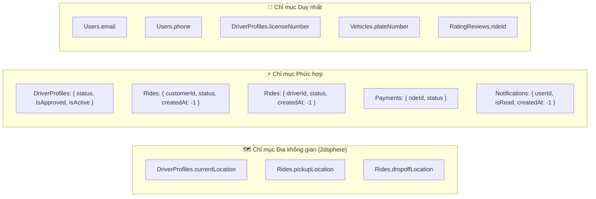
```mermaid
graph LR
    subgraph GeoIndexes["🗺️ Chỉ mục Địa không gian (2dsphere)"]
        G1["DriverProfiles.currentLocation"]
        G2["Rides.pickupLocation"]
        G3["Rides.dropoffLocation"]
    end

    subgraph CompoundIndexes["⚡ Chỉ mục Phức hợp"]
        C1["DriverProfiles: { status, isApproved, isActive }"]
        C2["Rides: { customerId, status, createdAt: -1 }"]
        C3["Rides: { driverId, status, createdAt: -1 }"]
        C4["Payments: { rideId, status }"]
        C5["Notifications: { userId, isRead, createdAt: -1 }"]
    end

    subgraph UniqueIndexes["🔑 Chỉ mục Duy nhất"]
        U1["Users.email"]
        U2["Users.phone"]
        U3["DriverProfiles.licenseNumber"]
        U4["Vehicles.plateNumber"]
        U5["RatingReviews.rideId"]
    end
```

| Collection | Index Fields | Type | Mục đích |
|---|---|---|---|
| `DriverProfiles` | `currentLocation: "2dsphere"` | 2dsphere | Tìm tài xế bán kính 5km |
| `DriverProfiles` | `{ status, isApproved }` | Compound | Lọc tài xế Available & Approved |
| `Rides` | `{ customerId, createdAt: -1 }` | Compound | Lịch sử chuyến khách |
| `Rides` | `{ driverId, createdAt: -1 }` | Compound | Lịch sử chuyến tài xế |
| `Rides` | `{ status, createdAt: -1 }` | Compound | Dashboard Operator |
| `Payments` | `{ rideId: 1 }` | Unique | Tra cứu hóa đơn 1-1 |
| `Notifications` | `{ userId, isRead, createdAt: -1 }` | Compound | Đếm thông báo chưa đọc |
| `AuditLogs` | `{ timestamp: -1, action: 1 }` | Compound | Tra cứu nhật ký |

---

## Giai đoạn 5 – Yêu cầu phi chức năng (NFRs)

### 5.1 Hiệu năng & Khả năng đáp ứng

| Mã NFR | Tiêu chí | Mô tả & KPI | Ưu tiên |
|---|---|---|---|
| NFR-PERF-01 | API Latency | 95% HTTP CRUD < 300ms; 99% HTTP phức tạp < 800ms | Must Have |
| NFR-PERF-02 | Real-time GPS Latency | Tọa độ GPS chuyển tiếp & hiển thị < 1.5s | Must Have |
| NFR-PERF-03 | Matching Execution | Quét 10.000 tài xế < 200ms | Must Have |
| NFR-PERF-04 | Concurrency Capacity | ≥ 1.000 users đồng thời; ≥ 500 tài xế GPS; ≥ 50 cuốc/phút | Must Have |
| NFR-PERF-05 | Payload Footprint | Gói GPS < 500 Bytes | Should Have |

### 5.2 Bảo mật & Quyền riêng tư

| Mã NFR | Tiêu chí | Mô tả | Ưu tiên |
|---|---|---|---|
| NFR-SEC-01 | Authentication | JWT HMAC-SHA256; Access 15 phút, Refresh 7 ngày | Must Have |
| NFR-SEC-02 | Password Hashing | bcrypt Salt Rounds ≥ 10 | Must Have |
| NFR-SEC-03 | TLS | HTTPS/WSS, TLS 1.3, SSL Labs A | Must Have |
| NFR-SEC-04 | PCI-DSS Zero Storage | KHÔNG lưu số thẻ, ngày hết hạn, CVV | Must Have |
| NFR-SEC-05 | Strict RBAC | 4 roles, chặn IDOR & leo thang đặc quyền | Must Have |
| NFR-SEC-06 | Rate Limiting | Login: 5 lần/phút/IP; Đặt xe: 10 lần/phút/User | Should Have |

### 5.3 Độ tin cậy, Sẵn sàng & Dung lỗi

| Mã NFR | Tiêu chí | Mô tả | Ưu tiên |
|---|---|---|---|
| NFR-REL-01 | Availability | ≥ 99.5% uptime | Must Have |
| NFR-REL-02 | Fault Isolation | Lỗi Payment/Notification không làm chết Ride Booking | Must Have |
| NFR-REL-03 | MTTR | Restart tự động < 15s | Must Have |
| NFR-REL-04 | Backup | Daily snapshot 02:00, lưu 30 ngày | Should Have |
| NFR-REL-05 | Grace Period | 5 phút mất mạng, Client sync back | Must Have |

### 5.4 Khả năng mở rộng & Kiến trúc

| Mã NFR | Tiêu chí | Mô tả | Ưu tiên |
|---|---|---|---|
| NFR-SCL-01 | Microservice qua API Gateway | Các service độc lập; client chỉ truy cập qua Gateway; mỗi service tổ chức Routes → Controller → Service → Model | Must Have |
| NFR-SCL-02 | Stateless Scaling | JWT, scale ngang qua Load Balancer | Should Have |
| NFR-SCL-03 | Provider Pattern | Thêm Payment/Notification Provider < 2 ngày | Must Have |

### 5.5 Khả năng sử dụng & UX

| Mã NFR | Tiêu chí | Mô tả | Ưu tiên |
|---|---|---|---|
| NFR-USE-01 | Responsive Web | Desktop, Tablet, Mobile ≥ 375px | Must Have |
| NFR-USE-02 | 3-Step Booking | Đặt xe ≤ 3 bước, ≤ 60s | Must Have |
| NFR-USE-03 | One-Touch Driver | Chấp nhận/từ chối 1 chạm | Must Have |
| NFR-USE-04 | Localization | 100% tiếng Việt, VNĐ, DD/MM/YYYY | Must Have |

### 5.6 Khả năng bảo trì & Giám sát

| Mã NFR | Tiêu chí | Mô tả | Ưu tiên |
|---|---|---|---|
| NFR-MNT-01 | Structured Logging | JSON qua winston/morgan | Must Have |
| NFR-MNT-02 | Immutable Audit Log | Append-Only cho thao tác quản trị | Must Have |
| NFR-MNT-03 | Health Check | `/api/health`, `/api/health/db` | Must Have |
| NFR-MNT-04 | API Documentation | Swagger/Postman Collection | Should Have |

### 5.7 Ma trận Truy xuất NFRs với Business Goals

| Nhóm NFR | Mã NFR | Business Goals |
|---|---|---|
| Performance | NFR-PERF-01 → 05 | BG-02, BG-04 |
| Security | NFR-SEC-01 → 06 | BG-12, BG-03 |
| Reliability | NFR-REL-01 → 05 | BG-01, BG-11 |
| Scalability | NFR-SCL-01 → 03 | BG-02, BG-11 |
| Usability | NFR-USE-01 → 04 | BG-05, BG-13 |
| Maintainability | NFR-MNT-01 → 04 | BG-03, BG-12 |

---

## Giai đoạn 6 – Mô hình hóa Use Case

### 6.1 Danh mục Tác nhân

| Actor ID | Actor | Phân loại | Vai trò |
|---|---|---|---|
| A01 | Khách hàng | Primary | Đặt xe, theo dõi, thanh toán, đánh giá |
| A02 | Tài xế | Primary | Nhận chuyến, cập nhật trạng thái, phát GPS |
| A03 | Nhân viên vận hành | Primary | Quản lý vận hành hàng ngày |
| A04 | Quản trị viên | Primary | Toàn quyền hệ thống |
| A05 | Payment Provider | Supporting | Xử lý thanh toán điện tử |
| A06 | Map Service | Supporting | Geocoding, bản đồ |
| A07 | Email Service | Supporting | Gửi email |
| A08 | Notification Provider | Supporting | Gửi thông báo đa kênh |

### 6.2 Sơ đồ Use Case Tổng thể

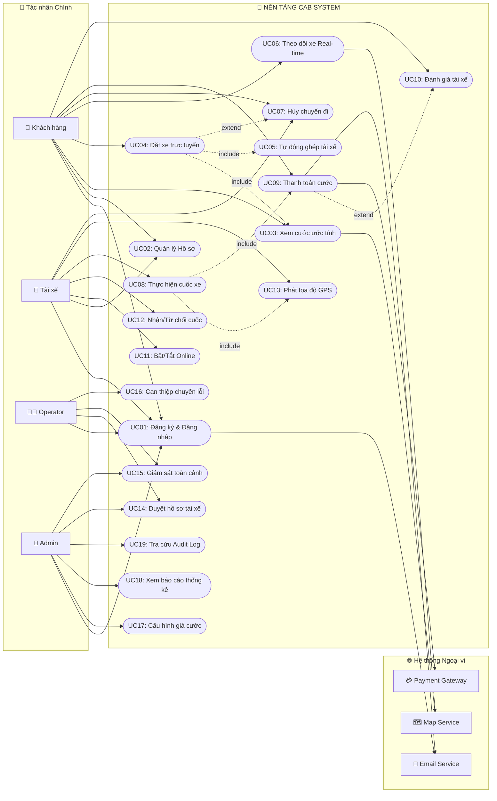
```mermaid
graph LR
    subgraph Primary_Actors["👥 Tác nhân Chính"]
        Cust["🧑 Khách hàng"]
        Drv["🚗 Tài xế"]
        Op["👨‍💼 Operator"]
        Adm["👑 Admin"]
    end

    subgraph External_Actors["🌐 Hệ thống Ngoại vi"]
        MapAPI["🗺️ Map Service"]
        PayGW["💳 Payment Gateway"]
        MailSvc["📧 Email Service"]
    end

    subgraph CAB_Platform["🚖 NỀN TẢNG CAB SYSTEM"]
        UC_Auth(["UC01: Đăng ký & Đăng nhập"])
        UC_Profile(["UC02: Quản lý Hồ sơ"])
        UC_Estimate(["UC03: Xem cước ước tính"])
        UC_Book(["UC04: Đặt xe trực tuyến"])
        UC_Match(["UC05: Tự động ghép tài xế"])
        UC_Track(["UC06: Theo dõi xe Real-time"])
        UC_Cancel(["UC07: Hủy chuyến đi"])
        UC_Execute(["UC08: Thực hiện cuốc xe"])
        UC_Pay(["UC09: Thanh toán cước"])
        UC_Review(["UC10: Đánh giá tài xế"])
        UC_Online(["UC11: Bật/Tắt Online"])
        UC_Accept(["UC12: Nhận/Từ chối cuốc"])
        UC_GPS(["UC13: Phát tọa độ GPS"])
        UC_ApproveDrv(["UC14: Duyệt hồ sơ tài xế"])
        UC_Monitor(["UC15: Giám sát toàn cảnh"])
        UC_Intervene(["UC16: Can thiệp chuyến lỗi"])
        UC_Pricing(["UC17: Cấu hình giá cước"])
        UC_Report(["UC18: Xem báo cáo thống kê"])
        UC_Audit(["UC19: Tra cứu Audit Log"])
    end

    Cust --> UC_Auth
    Cust --> UC_Profile
    Cust --> UC_Estimate
    Cust --> UC_Book
    Cust --> UC_Track
    Cust --> UC_Cancel
    Cust --> UC_Pay
    Cust --> UC_Review

    Drv --> UC_Auth
    Drv --> UC_Profile
    Drv --> UC_Online
    Drv --> UC_Accept
    Drv --> UC_Execute
    Drv --> UC_GPS
    Drv --> UC_Cancel

    Op --> UC_Auth
    Op --> UC_ApproveDrv
    Op --> UC_Monitor
    Op --> UC_Intervene

    Adm --> UC_Auth
    Adm --> UC_Pricing
    Adm --> UC_Report
    Adm --> UC_Audit
    Adm --> UC_ApproveDrv
    Adm --> UC_Monitor

    UC_Book -.->|include| UC_Estimate
    UC_Book -.->|include| UC_Match
    UC_Execute -.->|include| UC_GPS
    UC_Execute -.->|include| UC_Pay
    UC_Pay -.->|extend| UC_Review
    UC_Book -.->|extend| UC_Cancel

    UC_Estimate --> MapAPI
    UC_Track --> MapAPI
    UC_Pay --> PayGW
    UC_Auth --> MailSvc
    UC_Pay --> MailSvc
```

### 6.3 Danh sách Use Case

| UC ID | Tên | Actor chính | FR liên quan |
|---|---|---|---|
| UC-01 | Đặt xe trực tuyến & Tự động ghép nối tài xế | Khách hàng | FR-RIDE-01 → 03, FR-MATCH-01 → 06 |
| UC-02 | Thực hiện chuyến đi & Giám sát Real-time | Tài xế, Khách hàng | FR-RIDE-04 → 06, FR-TRACK-01 → 04 |
| UC-03 | Tính cước & Thanh toán Đa phương thức | Khách hàng, Tài xế | FR-PAY-01 → 07 |
| UC-04 | Xét duyệt Hồ sơ & Quản lý Tài xế | Operator, Admin | FR-DRV-01 → 06, FR-ADM-03 |
| UC-05 | Đăng ký & Xác thực Tài khoản | Tất cả | FR-AUTH-01 → 06 |
| UC-06 | Quản lý Trạng thái Online & Phát sóng GPS | Tài xế | FR-DRV-02 → 03, FR-TRACK-01 |
| UC-07 | Hủy Chuyến đi & Xử lý Chính sách Hủy | Customer, Driver | FR-RIDE-07, 08 |
| UC-08 | Đánh giá & Gửi Phản hồi | Khách hàng | FR-RATE-01 → 03 |
| UC-09 | Giám sát Bản đồ & Can thiệp Chuyến lỗi | Operator, Admin | FR-ADM-01 → 04, FR-TRACK-04 |
| UC-10 | Cấu hình Biểu phí Bảng giá Xe | Admin | FR-PAY-02 |
| UC-11 | Báo cáo Thống kê Doanh thu & Hiệu suất | Admin, Ban lãnh đạo | FR-ADM-05 → 08 |

### 6.4 Đặc tả Chi tiết các Use Case Cốt lõi

#### UC-01: Đặt xe trực tuyến & Tự động ghép nối tài xế

| Thuộc tính | Nội dung |
|---|---|
| **Mã Use Case** | `UC-01` |
| **Tên** | Đặt xe trực tuyến & Tự động ghép nối tài xế |
| **Actor chính** | Khách hàng |
| **Actor hỗ trợ** | Tài xế, Map Service, Hệ thống CAB |
| **Mô tả** | Khách hàng nhập địa chỉ đón, trả, chọn loại xe, xem giá ước tính và bấm đặt xe. Hệ thống tự động quét và điều phối tài xế trong 5km. |
| **Precondition** | 1. Khách đã đăng nhập. 2. Có Internet. |
| **Postcondition** | 1. Ride `accepted`. 2. Tài xế `Busy`. 3. Cả hai nhận thông báo ghép cuốc + ETA. |

**Main Success Scenario:**
1. Khách mở màn hình Đặt xe, nhập Điểm đón và Điểm đến.
2. Hệ thống gọi Map Service để định vị tọa độ và vẽ lộ trình mẫu.
3. Khách chọn hạng xe (Sedan/SUV/Van).
4. Hệ thống áp dụng `BRULE-01` tính cước và hiển thị cước + thời gian dự kiến.
5. Khách chọn PT thanh toán và bấm **"Xác nhận đặt xe"**.
6. Hệ thống tạo Ride `searching`.
7. Hệ thống thực hiện `BRULE-02` quét tài xế `Available` trong 5km, sắp xếp theo khoảng cách.
8. Hệ thống gửi thông báo mời cuốc + đếm ngược 30s đến Tài xế #1.
9. Tài xế bấm **"Chấp nhận"** trong 30s.
10. Hệ thống cập nhật Ride `accepted`, tài xế `Busy`.
11. Hệ thống phát socket thông báo ghép xe thành công cho Khách kèm tên, SĐT, biển số và GPS tài xế.

**Alternative Flows:**
- **A1: Tài xế đầu từ chối/timeout (`BRULE-03` / `EX-02`)** → Loại tài xế, `retryCount+1`, gửi tài xế tiếp theo. Lặp bước 8-9.

**Exception Flows:**
- **E1: Không có tài xế / Hết 5 lượt (`EX-01`)** → Ride `no_driver`, thông báo xin lỗi. Không trừ phí.
- **E2: Khách hủy khi đang tìm (`BRULE-06`)** → Ride `cancelled_by_customer`, hủy tiến trình quét.

#### UC-02: Thực hiện chuyến đi & Giám sát vị trí Real-time

| Thuộc tính | Nội dung |
|---|---|
| **Mã Use Case** | `UC-02` |
| **Tên** | Thực hiện chuyến đi & Giám sát vị trí Real-time |
| **Actor chính** | Tài xế, Khách hàng |
| **Actor hỗ trợ** | Hệ thống CAB (Socket Server, Geolocation Engine) |
| **Mô tả** | Quản lý toàn bộ tiến trình di chuyển, phát sóng GPS liên tục. |
| **Precondition** | Cuốc xe `accepted`. |
| **Postcondition** | Cuốc xe `completed`, sẵn sàng tính cước. |

**Main Success Scenario:**
1. Tài xế di chuyển tới điểm hẹn, app tự phát GPS định kỳ 5-10s (`NFR-PERF-02`).
2. Bản đồ khách hiển thị xe di chuyển mượt + ETA.
3. Tài xế bấm **"Đã đến điểm đón"**.
4. Hệ thống đổi `driver_arrived`, phát âm thanh thông báo cho khách.
5. Tài xế bấm **"Bắt đầu chuyến đi"**.
6. Hệ thống đổi `in_progress`, ghi `startedAt`.
7. GPS tiếp tục phát sóng.
8. Tài xế bấm **"Hoàn thành chuyến đi"**.
9. Hệ thống ghi `completedAt`, chuyển `completed`.

**Exception Flows:**
- **E1: Khách hủy trước khi tài xế đến (`EX-04`)** → `cancelled_by_customer`, tài xế về `Available`.
- **E2: Khách No-Show > 5 phút (`EX-05`)** → Tài xế hủy, `cancelled_by_driver (No-Show)`.
- **E3: Mất mạng/GPS (`EX-03`)** → App lưu đệm offline, sync back khi có mạng.

#### UC-03: Tính cước & Thanh toán Đa phương thức

| Thuộc tính | Nội dung |
|---|---|
| **Mã Use Case** | `UC-03` |
| **Tên** | Tính cước & Thanh toán Đa phương thức |
| **Actor chính** | Khách hàng, Tài xế |
| **Actor hỗ trợ** | Payment Gateway, Email Service |
| **Mô tả** | Hệ thống tính cước thực tế, xuất hóa đơn và thu tiền qua Tiền mặt hoặc Gateway. |
| **Precondition** | Cuốc xe `completed`. |
| **Postcondition** | Payment `COMPLETED`, hóa đơn gửi qua Email. |

**Main Success Scenario:**
1. Hệ thống áp dụng `BRULE-01` tính `actualFare`.
2. Tạo Payment `PENDING`, hiển thị chi tiết biểu phí.
3. Khách chọn PT thanh toán:
   - **Tiền mặt:** Khách trả tiền → Tài xế bấm "Xác nhận đã thu tiền".
   - **Điện tử:** Khách chọn Thẻ/Ví → Hệ thống gọi Gateway → Gateway trả `TransactionId`.
4. Hệ thống cập nhật Payment `COMPLETED`, ghi `paidAt`.
5. Hệ thống gửi biên lai qua Email.
6. Màn hình chuyển sang Đánh giá sao.

**Exception Flows:**
- **E1: GD thất bại (`EX-07`)** → Payment `FAILED`, thông báo, cho phép thử lại hoặc chuyển tiền mặt.

#### UC-04: Xét duyệt Hồ sơ & Quản lý Tài xế

| Thuộc tính | Nội dung |
|---|---|
| **Mã Use Case** | `UC-04` |
| **Tên** | Xét duyệt Hồ sơ & Quản lý Tài xế |
| **Actor chính** | Operator, Admin |
| **Actor hỗ trợ** | Email Service |
| **Mô tả** | Operator kiểm tra GPLX, thông tin xe và quyết định Phê duyệt/Từ chối. |
| **Precondition** | 1. Operator đã đăng nhập. 2. Có tài xế `Pending_Approval`. |
| **Postcondition** | Hồ sơ `Approved` hoặc `Rejected` + email lý do. |

**Main Success Scenario:**
1. Operator truy cập "Quản lý Tài xế" → Tab "Chờ duyệt".
2. Hệ thống hiển thị DS tài xế mới.
3. Operator xem chi tiết hồ sơ.
4. Operator bấm **"Phê duyệt hồ sơ"**.
5. Hệ thống đặt `isApproved=true`, ghi `approvedAt`.
6. Hệ thống ghi `AuditLogs` (`BRULE-10`).
7. Gửi email chúc mừng tới tài xế.

**Exception Flows:**
- **E1: Từ chối hồ sơ** → Operator nhập lý do, `isApproved=false`, gửi email hướng dẫn nộp lại.

#### UC-05: Đăng ký & Xác thực Tài khoản

| Thuộc tính | Nội dung |
|---|---|
| **Mã Use Case** | `UC-05` |
| **Tên** | Đăng ký & Xác thực Tài khoản |
| **Actor chính** | Customer, Driver, Operator, Admin |
| **Actor hỗ trợ** | Email Service, JWT Engine |
| **Mô tả** | Đăng ký tài khoản mới, đăng nhập an toàn với RBAC. |
| **Precondition** | Có mạng và thiết bị. |
| **Postcondition** | Cặp JWT (Access 15p, Refresh 7 ngày), vào giao diện vai trò. |

**Main Success Scenario:**
1. Mở trang Đăng ký/Đăng nhập.
2. **Đăng ký:** Nhập Họ tên, Email, SĐT, Mật khẩu. Kiểm tra trùng, bcrypt (`NFR-SEC-02`), tạo `Active`.
3. **Đăng nhập:** Nhập Email/SĐT + Mật khẩu.
4. So khớp bcrypt, kiểm tra `isActive==true`.
5. Sinh cặp Token (chứa `userId`, `role`).
6. Lưu Refresh Token vào DB, trả Access Token cho Client.
7. Chuyển hướng theo vai trò.

**Exception Flows:**
- **E1: Sai mật khẩu 5 lần (`NFR-SEC-06`)** → Rate Limiter chặn IP 15 phút.
- **E2: Tài khoản bị khóa** → HTTP 403 Forbidden.

#### UC-06: Quản lý Trạng thái Online & Phát sóng GPS

| Thuộc tính | Nội dung |
|---|---|
| **Mã Use Case** | `UC-06` |
| **Tên** | Quản lý Trạng thái Online & Phát sóng GPS |
| **Actor chính** | Tài xế |
| **Actor hỗ trợ** | Hệ thống CAB (Socket Server, DB) |
| **Mô tả** | Tài xế bật Online, thiết bị tự phát GPS định kỳ. |
| **Precondition** | 1. Đã đăng nhập. 2. `isApproved=true` + `isActive=true`. 3. Bật GPS permission. |
| **Postcondition** | 1. `status='available'`. 2. GPS cập nhật liên tục vào DB/Redis. |

**Main Success Scenario:**
1. Tài xế gạt **"Bật trực tuyến"**.
2. Hệ thống kiểm tra điều kiện, đặt `available` (`BRULE-04`).
3. App thiết lập WebSocket (Socket.IO).
4. Thiết bị gửi `{lat, lng, bearing, speed}` mỗi 5-10s.
5. Server cập nhật `currentLocation`, sẵn sàng matching.
6. Tắt ca → gạt **"Tắt trực tuyến"** → `offline`, ngắt GPS.

**Exception Flows:**
- **E1: Chưa duyệt cố bật Online** → Chặn, thông báo "Hồ sơ đang chờ xét duyệt".

#### UC-07: Hủy Chuyến đi & Xử lý Chính sách Hủy

| Thuộc tính | Nội dung |
|---|---|
| **Mã Use Case** | `UC-07` |
| **Tên** | Hủy Chuyến đi & Xử lý Chính sách Hủy |
| **Actor chính** | Customer, Driver, Operator |
| **Actor hỗ trợ** | Notification Hub |
| **Mô tả** | Hủy chuyến theo `BRULE-06`, tự động giải phóng phương tiện. |
| **Precondition** | Ride ở `requested`/`searching`/`accepted`/`driver_arrived`. |
| **Postcondition** | 1. Ride `cancelled`. 2. Tài xế `available`. 3. Thông báo lý do cho bên còn lại. |

**Main Success Scenario:**
1. Bấm **"Hủy chuyến đi"**.
2. Hệ thống hiện dialog xác nhận + lý do.
3. Chọn lý do, bấm **"Xác nhận hủy"**.
4. Kiểm tra `BRULE-06`: `searching` → hủy tức thì; `accepted`/`driver_arrived` → `cancelled_by_customer/driver`.
5. Giải phóng tài xế `available`.
6. Bắn thông báo Socket cho bên còn lại.
7. Cuốc kết thúc an toàn.

**Exception Flows:**
- **E1: Hủy khi `in_progress`** → Chặn, HTTP 400 "Không thể hủy khi đang di chuyển".

#### UC-08: Đánh giá & Gửi Phản hồi sau Chuyến đi

| Thuộc tính | Nội dung |
|---|---|
| **Mã Use Case** | `UC-08` |
| **Tên** | Đánh giá & Gửi Phản hồi sau Chuyến đi |
| **Actor chính** | Khách hàng |
| **Mô tả** | Sau khi thanh toán, khách chấm 1-5 sao và nhận xét. |
| **Precondition** | Ride `completed` + Payment `COMPLETED`. |
| **Postcondition** | `RatingReviews` tạo mới, `rating` tài xế cập nhật theo `BRULE-08`. |

**Main Success Scenario:**
1. Màn hình tự hiện popup đánh giá sau thanh toán.
2. Khách chọn 1-5 sao.
3. Khách nhập nhận xét (tuỳ chọn, ≤ 500 ký tự).
4. Khách bấm **"Gửi đánh giá"**.
5. Hệ thống kiểm tra `BRULE-08` (mỗi chuyến 1 lần).
6. Lưu `RatingReviews`.
7. Tính lại `avgRating` và cập nhật `DriverProfiles`.
8. Thông báo cảm ơn và đóng giao diện.

**Exception Flows:**
- **E1: Đánh giá trùng** → Unique Index `rideId`, từ chối, HTTP 409.

#### UC-09: Giám sát Bản đồ Trực tuyến & Can thiệp Chuyến lỗi

| Thuộc tính | Nội dung |
|---|---|
| **Mã Use Case** | `UC-09` |
| **Tên** | Giám sát Bản đồ Trực tuyến & Can thiệp Chuyến lỗi |
| **Actor chính** | Operator, Admin |
| **Actor hỗ trợ** | Map Service |
| **Mô tả** | Theo dõi map số thời gian thực, can thiệp hủy/chuyển cuốc. |
| **Precondition** | Đã đăng nhập Dashboard quản trị. |
| **Postcondition** | Sự cố khắc phục, thao tác ghi `AuditLogs`. |

**Main Success Scenario:**
1. Operator mở "Giám sát Bản đồ Thời gian thực".
2. Hệ thống tải map + xe màu: Xanh (`Available`), Vàng (`Busy`), Đỏ (`Cảnh báo`).
3. Operator lọc `in_progress` hoặc `searching > 2 phút`.
4. Operator nhấp xe để xem chi tiết.
5. Operator chọn **"Hủy cưỡng chế"** hoặc **"Điều phối lại tài xế"**.
6. Hệ thống gửi thông báo đẩy cho cả hai bên.
7. Ghi `AuditLogs` (`BRULE-10`).

#### UC-10: Cấu hình Biểu phí Bảng giá Xe

| Thuộc tính | Nội dung |
|---|---|
| **Mã Use Case** | `UC-10` |
| **Tên** | Cấu hình Biểu phí Bảng giá Xe |
| **Actor chính** | Admin |
| **Mô tả** | Admin điều chỉnh `baseFare`, `pricePerKm`, `pricePerMin` cho từng hạng xe. |
| **Precondition** | Role `admin` (Operator không có quyền - `BRULE-09`). |
| **Postcondition** | Bảng giá mới có hiệu lực ngay. |

**Main Success Scenario:**
1. Admin vào "Cài đặt" → "Cấu hình Biểu phí".
2. Hiển thị bảng giá hiện hành 3 hạng xe.
3. Admin chọn hạng xe cần sửa.
4. Sửa `baseFare`, `pricePerKm`, `pricePerMin`.
5. Bấm **"Lưu thay đổi biểu phí"**.
6. Kiểm tra dữ liệu hợp lệ (số dương > 0).
7. Cập nhật `PricingConfigs`, ghi `updatedAt`.
8. Chèn `AuditLogs` với old/new price (`BRULE-10`).
9. Hiển thị thông báo thành công.

**Exception Flows:**
- **E1: Giá ≤ 0** → Validation error, vô hiệu hóa nút Lưu.

#### UC-11: Báo cáo Thống kê Doanh thu & Hiệu suất Vận hành

| Thuộc tính | Nội dung |
|---|---|
| **Mã Use Case** | `UC-11` |
| **Tên** | Báo cáo Thống kê Doanh thu & Hiệu suất Vận hành |
| **Actor chính** | Admin, Ban giám đốc |
| **Actor hỗ trợ** | Aggregation Engine |
| **Mô tả** | Báo cáo trực quan về chuyến, doanh thu, tỷ lệ, xếp hạng tài xế. |
| **Precondition** | Role `admin`. |
| **Postcondition** | Báo cáo hiển thị + xuất Excel/CSV. |

**Main Success Scenario:**
1. Admin vào "Báo cáo & Thống kê".
2. Chọn khoảng thời gian (Hôm nay, 7 ngày, Tháng, Tuỳ chỉnh).
3. Chọn loại báo cáo:
   - **Doanh thu**: biểu đồ theo thời gian, loại xe, PT thanh toán.
   - **Vận hành**: tổng cuốc, tỷ lệ thành công/hủy.
   - **Hiệu suất tài xế**: Top doanh thu, rating, tỷ lệ từ chối.
4. Hệ thống chạy Aggregation Pipeline.
5. Hiển thị biểu đồ (Cột, Đường, Tròn) + bảng.
6. Admin bấm **"Xuất báo cáo (Excel/CSV)"**.

**Exception Flows:**
- **E1: Khoảng thời gian sai** → "Từ ngày" > "Đến ngày" → Cảnh báo.

---

## Giai đoạn 7 – Tiêu chí chấp nhận (Acceptance Criteria)

### 7.1 Nguyên tắc & Định dạng

- **Mã AC**: `AC-[MODULE]-[STT]`
- **Rule-based Constraints**
- **Given-When-Then Scenarios**

### 7.2 Bảng Tổng hợp Tiêu chí Chấp nhận theo Phân hệ

#### AC-01: Đăng ký, Đăng nhập & Xác thực

| Mã AC | Tính năng | Tiêu chí |
|---|---|---|
| AC-AUTH-01 | Đăng ký Khách hàng | Email RFC 5322, SĐT 10 số VN, mật khẩu ≥ 6, bcrypt. Thành công → HTTP 201, `isActive=true`, gửi email. Trùng Email/SĐT → HTTP 409 |
| AC-AUTH-02 | Đăng nhập & JWT | Access 15p, Refresh 7 ngày. Đúng → HTTP 200 + tokens. Sai 5 lần → HTTP 429 |

#### AC-02: Quản lý Phương tiện & Duyệt Hồ sơ Tài xế

| Mã AC | Tính năng | Tiêu chí |
|---|---|---|
| AC-DRV-01 | Đăng ký Phương tiện | Biển số duy nhất, GPLX 12 số, vehicleType enum. Nộp → `isApproved=false`, `status='offline'` |
| AC-DRV-02 | Duyệt Hồ sơ | Chỉ Operator/Admin. Approve → `isApproved=true`, AuditLog, email. Reject → giữ `false`, email lý do |

#### AC-03: Trạng thái Online & GPS

| Mã AC | Tính năng | Tiêu chí |
|---|---|---|
| AC-TRK-01 | Bật/Tắt Online | Phải `isApproved=true` + `isActive=true`. Bật → `available`, mở WebSocket. Chưa duyệt → HTTP 403 |
| AC-TRK-02 | Phát GPS | Tần suất 5-10s, GeoJSON `[lng, lat]`, độ trễ < 1.5s |

#### AC-04: Đặt xe

| Mã AC | Tính năng | Tiêu chí |
|---|---|---|
| AC-BOOK-01 | Ước tính cước | Sedan 10km/20p → 15.000 + 120.000 + 20.000 = 155.000 VNĐ |
| AC-BOOK-02 | Tạo yêu cầu | Không có cuốc đang chạy. Tạo → `status='searching'`, `retryCount=0` |

#### AC-05: Matching Engine

| Mã AC | Tính năng | Tiêu chí |
|---|---|---|
| AC-MCH-01 | Quét 5km & Ưu tiên | Loại > 5km, gửi A (1km, 4.8★) trước B (3km, 5.0★) |
| AC-MCH-02 | Chấp nhận | Atomic Update. Trong 30s → `accepted`, driver `busy`, socket < 1s |
| AC-MCH-03 | Timeout & Retry | 30s → retryCount + 1, chuyển B. Hết 5 lần → `no_driver` |

#### AC-06: Vòng đời Chuyến đi

| Mã AC | Tính năng | Tiêu chí |
|---|---|---|
| AC-RIDE-01 | Chuyển trạng thái tuần tự | `accepted` → `driver_arrived` → `in_progress` → `completed`. Bỏ qua → từ chối |

#### AC-07: Thanh toán

| Mã AC | Tính năng | Tiêu chí |
|---|---|---|
| AC-PAY-01 | Tiền mặt | `PENDING` → `COMPLETED` khi tài xế xác nhận |
| AC-PAY-02 | Điện tử | Thành công → lưu `transactionId`. Thất bại → `FAILED`, cho phép retry/chuyển tiền mặt |

#### AC-08: Hủy chuyến

| Mã AC | Tính năng | Tiêu chí |
|---|---|---|
| AC-CNC-01 | Khách hủy | `accepted` → `cancelled_by_customer`, giải phóng tài xế. `in_progress` → HTTP 400 |
| AC-CNC-02 | Tài xế hủy No-Show | Chờ ≥ 5 phút → `cancelled_by_driver (No-Show)`, không phạt |

#### AC-09: Đánh giá

| Mã AC | Tính năng | Tiêu chí |
|---|---|---|
| AC-RAT-01 | Gửi đánh giá | Chỉ khi `completed` + `COMPLETED`. 1-5 sao. Cập nhật `rating`, `totalReviews`. Trùng → HTTP 409 |

#### AC-10: Quản trị

| Mã AC | Tính năng | Tiêu chí |
|---|---|---|
| AC-ADM-01 | RBAC | Operator PUT pricing → HTTP 403 Forbidden |
| AC-ADM-02 | Cấu hình giá & Audit | Giá > 0. Ghi AuditLog với old/new price |
| AC-ADM-03 | Báo cáo | Response < 800ms, biểu đồ doanh thu, tỷ lệ hoàn thành/hủy |

### 7.3 Ma trận Đối soát AC với FR

| Nhóm FR | Dải FR | AC |
|---|---|---|
| 1.0 Xác thực & Tài khoản | FR-AUTH-01 → 06 | AC-AUTH-01, AC-AUTH-02 |
| 2.0 Tài xế & Phương tiện | FR-DRV-01 → 06 | AC-DRV-01, AC-DRV-02 |
| 3.0 Đặt xe & Chuyến đi | FR-RIDE-01 → 09 | AC-BOOK-01, AC-BOOK-02, AC-RIDE-01, AC-CNC-01 |
| 4.0 Phân công & Ghép nối | FR-MATCH-01 → 06 | AC-MCH-01, AC-MCH-02, AC-MCH-03 |
| 5.0 Tính cước & Thanh toán | FR-PAY-01 → 07 | AC-BOOK-01, AC-PAY-01, AC-PAY-02 |
| 6.0 Định vị & Giám sát | FR-TRACK-01 → 04 | AC-TRK-01, AC-TRK-02 |
| 7.0 Trung tâm Thông báo | FR-NOTIF-01 → 05 | AC-AUTH-01, AC-MCH-02, AC-RIDE-01, AC-PAY-02 |
| 8.0 Đánh giá & Phản hồi | FR-RATE-01 → 03 | AC-RAT-01 |
| 9.0 Quản trị & Báo cáo | FR-ADM-01 → 08 | AC-DRV-02, AC-ADM-01, AC-ADM-02, AC-ADM-03 |
| 10.0 Bảo mật & Audit | FR-SEC-01 → 05 | AC-AUTH-02, AC-ADM-01, AC-ADM-02 |

---

## Giai đoạn 8 – Ma trận Truy xuất Yêu cầu (RTM)

### 8.1 Cấu trúc RTM

$$\text{BG} \longrightarrow \text{BR} \longrightarrow \text{FR} \longrightarrow \text{UC} \longrightarrow \text{AC} \longrightarrow \text{Test Case}$$

### 8.2 Bảng RTM Toàn diện

| Mã BG | Mã BR | Mã FR | Tên Chức năng | UC | AC | TESTCASE |
|:---:|:---:|:---:|---|:---:|:---:|:---:|
| BG-01, BG-12 | BR-001 | FR-AUTH-01 | Đăng ký Khách hàng | UC-05 | AC-AUTH-01 | TC-REG-001..005 |
| BG-01, BG-07 | BR-002 | FR-AUTH-02 | Đăng ký Tài xế | UC-04, UC-05 | AC-DRV-01 | TC-REG-006, 007 |
| BG-12 | BR-003, BR-041 | FR-AUTH-03 | Đăng nhập JWT | UC-05 | AC-AUTH-02 | TC-AUTH-001..020 |
| BG-13 | BR-004 | FR-AUTH-04 | Cập nhật hồ sơ | UC-05 | AC-AUTH-01 | TC-ACC-001, 002 |
| BG-12 | BR-042 | FR-AUTH-05 | Đổi mật khẩu | UC-05 | AC-AUTH-02 | TC-ACC-003, 004 |
| BG-12 | BR-041 | FR-AUTH-06 | Đăng xuất | UC-05 | AC-AUTH-02 | TC-ACC-005 |
| BG-07 | BR-017 | FR-DRV-01 | Phương tiện | UC-04, UC-06 | AC-DRV-01 | TC-DRV-001, 002 |
| BG-04, BG-07 | BR-014 | FR-DRV-02 | Online/Offline | UC-06 | AC-TRK-01 | TC-DRV-003..005 |
| BG-04, BG-07 | BR-014, BR-023 | FR-DRV-03 | Auto Busy | UC-02, UC-06 | AC-MCH-02 | TC-DRV-006 |
| BG-07, BG-09 | BR-016, BR-036 | FR-DRV-04 | Duyệt hồ sơ | UC-04 | AC-DRV-02 | TC-APP-001..003 |
| BG-07, BG-13 | BR-013, BR-035 | FR-DRV-05 | Xem hiệu suất | UC-06 | AC-RAT-01 | TC-DRV-003, TC-ADM-001 |
| BG-09, BG-12 | BR-036, BR-039 | FR-DRV-06 | Khóa tài xế | UC-04, UC-09 | AC-ADM-01 | TC-AUTH-009, TC-APP-004 |
| BG-01, BG-13 | BR-005 | FR-RIDE-01 | Geocoding | UC-01 | AC-BOOK-01 | TC-EST-001, 004 |
| BG-01, BG-06 | BR-005, BR-025 | FR-RIDE-02 | Cước ước tính | UC-01 | AC-BOOK-01 | TC-EST-002, 003, 005 |
| BG-01, BG-04 | BR-005, BR-012 | FR-RIDE-03 | Khởi tạo đặt xe | UC-01 | AC-BOOK-02 | TC-BOOK-001..003 |
| BG-05, BG-08 | BR-007, BR-023 | FR-RIDE-04 | Đã đến điểm đón | UC-02 | AC-RIDE-01 | TC-RIDE-001 |
| BG-05, BG-08 | BR-007, BR-023 | FR-RIDE-05 | Bắt đầu chuyến | UC-02 | AC-RIDE-01 | TC-RIDE-002, 004 |
| BG-05, BG-06 | BR-007, BR-024 | FR-RIDE-06 | Hoàn thành | UC-02, UC-03 | AC-RIDE-01, AC-PAY-01 | TC-RIDE-003, 005 |
| BG-05, BG-13 | BR-010 | FR-RIDE-07 | Khách hủy | UC-07 | AC-CNC-01 | TC-CNC-001, 002, 005 |
| BG-05, BG-07 | BR-010, BR-020 | FR-RIDE-08 | Tài xế hủy | UC-07 | AC-CNC-02 | TC-CNC-003, 004 |
| BG-01, BG-13 | BR-011 | FR-RIDE-09 | Lịch sử chuyến | UC-01, UC-06 | AC-BOOK-02 | TC-ACC-001, TC-PAY-006 |
| BG-04 | BR-018, BR-019 | FR-MATCH-01 | Quét 5km | UC-01 | AC-MCH-01 | TC-MCH-001, 002 |
| BG-04 | BR-019 | FR-MATCH-02 | Xếp hạng ưu tiên | UC-01 | AC-MCH-01 | TC-MCH-001 |
| BG-04, BG-08 | BR-020, BR-021 | FR-MATCH-03 | Gửi & 30s | UC-01 | AC-MCH-01 | TC-MCH-003 |
| BG-04 | BR-007, BR-023 | FR-MATCH-04 | Chấp nhận (Atomic) | UC-01 | AC-MCH-02 | TC-MCH-003 |
| BG-04 | BR-020, BR-021 | FR-MATCH-05 | Xoay vòng | UC-01 | AC-MCH-03 | TC-MCH-004, 005 |
| BG-04, BG-08 | BR-022 | FR-MATCH-06 | Hết 5 retry | UC-01 | AC-MCH-03 | TC-BOOK-004, TC-MCH-006 |
| BG-06 | BR-024, BR-026 | FR-PAY-01 | Tính cước | UC-03 | AC-PAY-01, 02 | TC-PAY-001 |
| BG-06, BG-09 | BR-026 | FR-PAY-02 | Cấu hình giá | UC-10 | AC-ADM-02 | TC-EST-002, 003 |
| BG-03, BG-06 | BR-027, BR-034 | FR-PAY-03 | Tiền mặt | UC-03 | AC-PAY-01 | TC-PAY-002 |
| BG-03, BG-06 | BR-027 | FR-PAY-04 | Xác nhận thu | UC-03 | AC-PAY-01 | TC-PAY-002, 005 |
| BG-03, BG-12 | BR-028 | FR-PAY-05 | Điện tử Mock | UC-03 | AC-PAY-02 | TC-PAY-003 |
| BG-03, BG-11 | BR-029 | FR-PAY-06 | Xử lý thất bại | UC-03 | AC-PAY-02 | TC-PAY-004 |
| BG-03, BG-05 | BR-030 | FR-PAY-07 | Hóa đơn điện tử | UC-03 | AC-PAY-02 | TC-PAY-006 |
| BG-05, BG-07 | BR-015 | FR-TRACK-01 | Thu GPS | UC-06 | AC-TRK-02 | TC-TRK-001, 004 |
| BG-05, BG-13 | BR-008 | FR-TRACK-02 | Phát vị trí | UC-02 | AC-TRK-02 | TC-TRK-002 |
| BG-05, BG-13 | BR-007, BR-008 | FR-TRACK-03 | ETA | UC-01, UC-02 | AC-TRK-02 | TC-TRK-003 |
| BG-05, BG-09 | BR-037 | FR-TRACK-04 | Map Operator | UC-09 | AC-ADM-03 | TC-TRK-002, TC-ADM-001 |
| BG-08 | BR-031, BR-032 | FR-NOTIF-01 | In-App Socket | UC-01, UC-02 | AC-MCH-02, AC-RIDE-01 | TC-RIDE-001, TC-MCH-003 |
| BG-08 | BR-031, BR-033 | FR-NOTIF-02 | Email | UC-03, UC-04 | AC-AUTH-01, AC-PAY-02 | TC-REG-001, TC-PAY-003 |
| BG-08, BG-13 | BR-031 | FR-NOTIF-03 | Hộp thư | UC-01, UC-06 | AC-AUTH-01 | TC-ACC-001, TC-RIDE-001 |
| BG-08, BG-13 | BR-031 | FR-NOTIF-04 | Đánh dấu đã đọc | UC-01, UC-06 | AC-AUTH-01 | TC-ACC-001 |
| BG-11 | BR-033, BR-045 | FR-NOTIF-05 | Provider Pattern | UC-01, UC-03 | AC-AUTH-01 | TC-RIDE-001, TC-MCH-003 |
| BG-05, BG-13 | BR-034 | FR-RATE-01 | Gửi đánh giá | UC-08 | AC-RAT-01 | TC-RAT-001..003, 005 |
| BG-05, BG-07 | BR-034 | FR-RATE-02 | Tính Rating TB | UC-08 | AC-RAT-01 | TC-RAT-004 |
| BG-07, BG-13 | BR-035 | FR-RATE-03 | Xem đánh giá | UC-06, UC-08 | AC-RAT-01 | TC-RAT-001, 004 |
| BG-09, BG-10 | BR-036, BR-040 | FR-ADM-01 | Dashboard | UC-09, UC-11 | AC-ADM-03 | TC-ADM-001 |
| BG-09 | BR-036 | FR-ADM-02 | Quản lý Khách hàng | UC-09 | AC-ADM-01 | TC-ADM-002 |
| BG-07, BG-09 | BR-016, BR-036 | FR-ADM-03 | Quản lý Tài xế | UC-04, UC-09 | AC-DRV-02 | TC-APP-001, TC-DRV-001 |
| BG-09 | BR-037, BR-043 | FR-ADM-04 | Can thiệp chuyến lỗi | UC-09 | AC-ADM-01 | TC-ADM-005 |
| BG-03, BG-09 | BR-038 | FR-ADM-05 | Tra cứu giao dịch | UC-09, UC-11 | AC-ADM-03 | TC-PAY-003, TC-ADM-003 |
| BG-03, BG-10 | BR-040 | FR-ADM-06 | Báo cáo doanh thu | UC-11 | AC-ADM-03 | TC-ADM-003 |
| BG-02, BG-10 | BR-040 | FR-ADM-07 | Báo cáo hoàn thành | UC-11 | AC-ADM-03 | TC-ADM-001, TC-CNC-001 |
| BG-07, BG-10 | BR-040 | FR-ADM-08 | Báo cáo hiệu quả | UC-11 | AC-ADM-03 | TC-RAT-004, TC-ADM-001 |
| BG-12 | BR-039, BR-041 | FR-SEC-01 | RBAC | UC-05, UC-09 | AC-ADM-01 | TC-AUTH-015, TC-APP-004, TC-ADM-004 |
| BG-09, BG-12 | BR-039 | FR-SEC-02 | Operator vs Admin | UC-09, UC-10 | AC-ADM-01 | TC-APP-004, TC-ADM-004 |
| BG-12 | BR-043 | FR-SEC-03 | Audit Log | UC-04, UC-10 | AC-ADM-02 | TC-APP-002, TC-ADM-005 |
| BG-12 | BR-042 | FR-SEC-04 | bcrypt & nhạy cảm | UC-05 | AC-AUTH-01 | TC-AUTH-014, 020 |
| BG-11 | BR-044, BR-045 | FR-SEC-05 | Circuit Breaker | UC-01, UC-03 | AC-PAY-02 | TC-PAY-004, TC-MCH-006 |

### 8.3 Điều kiện nghiệm thu End-to-End

| AC ID | Điều kiện |
|---|---|
| AC-E2E-01 | Khách hàng tạo Booking hợp lệ |
| AC-E2E-02 | Booking chuyển sang tìm tài xế |
| AC-E2E-03 | Hệ thống gửi yêu cầu đến tài xế phù hợp |
| AC-E2E-04 | Chỉ 1 tài xế được xác nhận cho Booking |
| AC-E2E-05 | Trip được tạo sau khi tài xế chấp nhận |
| AC-E2E-06 | Tài xế cập nhật Trip đúng trình tự |
| AC-E2E-07 | Khách hàng theo dõi được trạng thái |
| AC-E2E-08 | Trip hoàn thành đúng vòng đời |
| AC-E2E-09 | Hệ thống xác định cước sau khi hoàn thành |
| AC-E2E-10 | Thanh toán tiền mặt hoặc điện tử |
| AC-E2E-11 | Ghi nhận chính xác kết quả thanh toán |
| AC-E2E-12 | Chỉ đánh giá sau khi hoàn thành |
| AC-E2E-13 | Lưu Trip, Payment, Rating để tra cứu |
| AC-E2E-14 | Thao tác quan trọng ghi Audit Log |
| AC-E2E-15 | Lỗi Payment/Notification không mất dữ liệu Booking/Trip |

### 8.4 Checklist Nghiệm thu Tổng thể

**1. Business Acceptance**
- [ ] Quy trình đặt xe số hóa từ Booking → Trip
- [ ] Hệ thống tìm và phân công tài xế tự động
- [ ] Quản lý vòng đời Trip
- [ ] Thanh toán tiền mặt và điện tử
- [ ] Đánh giá và lịch sử chuyến
- [ ] Nhân viên vận hành giám sát và xử lý sự cố
- [ ] Ban lãnh đạo xem báo cáo kinh doanh

**2. Functional Acceptance**
- [ ] Use Case chính hoạt động đúng Main Flow
- [ ] Alternative Flow xử lý đúng
- [ ] Exception quan trọng xử lý đúng
- [ ] Business Rule tuân thủ
- [ ] Trạng thái Booking/Trip cập nhật chính xác
- [ ] Dữ liệu lưu trữ và liên kết đúng

**3. Security Acceptance**
- [ ] Xác thực trước khi truy cập chức năng yêu cầu tài khoản
- [ ] RBAC kiểm soát quyền truy cập
- [ ] Không truy cập dữ liệu không thuộc quyền
- [ ] Dữ liệu cá nhân, vị trí, giao dịch được bảo vệ
- [ ] Audit Log cho thao tác quan trọng
- [ ] Không lưu dữ liệu thanh toán nhạy cảm

**4. Integration Acceptance**
- [ ] Payment Provider xử lý thành công/thất bại
- [ ] Xử lý Payment Provider không phản hồi
- [ ] Notification Provider nhận yêu cầu
- [ ] Lỗi Notification không dừng quy trình đặt xe

**5. Quality Acceptance**
- [ ] Performance đạt SLA đã xác nhận
- [ ] Scalability theo quy mô
- [ ] Consistency Booking/Trip/Payment
- [ ] Không tạo Trip trùng
- [ ] Maintainability & Extensibility
- [ ] SLA/Performance/Capacity được xác nhận


---

## Phụ lục A – Kiến trúc triển khai, API & kiểm chứng

> Phụ lục này bổ sung yêu cầu kỹ thuật để triển khai và chấm thực hành. Các giá trị cụ thể ở đây là baseline cho MVP; thay đổi kiến trúc phải cập nhật đồng bộ sơ đồ, API contract và Postman collection.

### A.1 Kiến trúc service và tổ chức source code

Hệ thống được triển khai theo kiến trúc microservice tối giản. Các service dùng database riêng theo quyền sở hữu dữ liệu; không đọc/ghi trực tiếp database của service khác. Client (Customer Web, Driver Web, Admin Dashboard và Postman) chỉ gọi API Gateway.

| Thành phần | Trách nhiệm / dữ liệu sở hữu |
|---|---|
| API Gateway | Điểm vào HTTP duy nhất; định tuyến, xác thực JWT, áp dụng rate limit, correlation ID và chuẩn hóa lỗi |
| Auth Service | Đăng ký/đăng nhập, OTP, user profile, refresh/revoke token, RBAC |
| Driver Service | Hồ sơ tài xế, phương tiện, duyệt, trạng thái online và vị trí gần nhất |
| Booking/Ride Service | Booking, matching/offer, vòng đời ride, trạng thái và lịch sử |
| Payment Service | Payment intent, callback, trạng thái giao dịch và idempotency |
| Review Service | Review, liên kết ride và thống kê rating |
| Notification Service | Thông báo in-app/email và gửi theo sự kiện |
| MongoDB | Persistence cho domain data; mỗi service có database/namespace riêng |
| RabbitMQ | Giao tiếp bất đồng bộ giữa service; message có event ID, version và correlation ID |

Đề xuất cấu trúc source code:

```text
cab-system/
  apps/ customer-web/ driver-web/ admin-web/
  services/ api-gateway/ auth-service/ driver-service/
            booking-service/ payment-service/ review-service/ notification-service/
  packages/ contracts/ shared-config/
  infra/ docker-compose.yml, gateway/, rabbitmq/
  postman/ CAB-System.postman_collection.json, local.postman_environment.json.example
  .env.example
```

Mỗi service tổ chức mã nguồn theo `src/routes`, `src/controllers`, `src/services`, `src/models`, `src/middlewares`, `src/config`. Cấu hình bí mật chỉ lấy từ environment/secret store; `.env` thật, credential, signing key và dữ liệu cá nhân không được commit. `.gitignore` phải loại trừ `.env`, `.env.*` (ngoại trừ `.env.example`), log, build output và thư mục dependency. CI/review phải kiểm tra secret trước khi push.

### A.2 Gateway và giao tiếp giữa service

Gateway phải xác thực chữ ký JWT và thời hạn token trước khi chuyển request; kiểm tra role/permission tại Gateway và tiếp tục kiểm tra ownership/authorization tại service đích. Gateway áp dụng giới hạn kích thước request, rate limit, correlation ID, timeout, TLS ở môi trường triển khai và không được trả stack trace/secret cho client. Request gọi thẳng service từ mạng client phải bị chặn; nội bộ chỉ expose service trên private network.

Giao tiếp đồng bộ nội bộ dùng HTTP/REST khi cần phản hồi tức thì. Giao tiếp bất đồng bộ dùng RabbitMQ cho các event như `BookingCreated`, `RideAssigned`, `RideStatusChanged`, `PaymentCompleted`, `ReviewCreated`. Publisher/consumer phải xử lý retry có giới hạn, dead-letter queue, duplicate delivery an toàn và log lỗi; không để lỗi Notification/Payment làm mất Booking/Ride. Không gửi dữ liệu thẻ, mật khẩu hoặc OTP dạng plaintext trong message.

### A.3 Docker Compose và container

Docker Compose local phải khởi chạy tối thiểu: `api-gateway`, `auth-service`, `driver-service`, `booking-service`, `payment-service`, `review-service`, `notification-service`, `mongodb` (hoặc MongoDB riêng theo service), và `rabbitmq`. Web apps có thể chạy thành container riêng hoặc profile tùy cấu hình bài thực hành. Container phải có healthcheck, restart policy phù hợp, dùng named volume cho dữ liệu cần giữ và chỉ publish port cần thiết. Chỉ Gateway publish API port ra host; MongoDB, RabbitMQ management và các service nội bộ không public ra mạng ngoài mặc định.

`docker compose up --build` phải đưa các dependency và service vào trạng thái healthy; `docker compose ps` là danh sách kiểm tra container. `.env.example` cung cấp tên biến và giá trị giả lập, không chứa secret dùng thật.

### A.4 Health/readiness endpoints

Các endpoint sau được phục vụ qua Gateway và không yêu cầu JWT trong môi trường local:

| Endpoint | Ý nghĩa | Thành công | Thất bại |
|---|---|---|---|
| `GET /health` | Liveness: process đang chạy | HTTP 200, `status: healthy` | HTTP 503 khi process không phục vụ |
| `GET /ready` | Readiness: service sẵn sàng nhận traffic, dependency bắt buộc đã kết nối | HTTP 200, `status: ready` | HTTP 503, kèm dependency lỗi không nhạy cảm |
| `GET /health/services` | Tình trạng Gateway và từng service/dependency | HTTP 200 khi tất cả thành phần bắt buộc healthy; payload liệt kê trạng thái từng thành phần | HTTP 503 nếu có thành phần bắt buộc unhealthy |

Health response không tiết lộ connection string, credential, stack trace hoặc dữ liệu người dùng. Các endpoint `/api/health` và `/api/health/db` trước đây được chuẩn hóa thành các endpoint trên; service nội bộ có thể giữ health endpoint riêng nhưng phải được Gateway tổng hợp.

### A.5 API contract và Postman smoke suite

API sử dụng JSON, bearer JWT, mã lỗi nhất quán; danh sách hỗ trợ `limit` (mặc định 20, tối đa 100), `page` (bắt đầu 1) và trả `items`, `page`, `limit`, `total`, `totalPages`. Các endpoint dưới đây là contract logic; prefix deployment là `/api/v1` sau Gateway.

| Luồng | Endpoint gợi ý | Quyền / kết quả chính |
|---|---|---|
| Health | `GET /health`, `/ready`, `/health/services` | Public; 200/503 theo trạng thái |
| Customer register/login | `POST /auth/customers`, `POST /auth/login` | Register 201; login 200 + access/refresh token |
| Read customer/driver | `GET /customers/{id}`, `GET /drivers/{id}` | Bearer token; owner hoặc role được phép; 401/403/404 đúng trường hợp |
| Driver nearby | `GET /drivers/nearby?lat=&lng=&radiusKm=1&page=&limit=` | Authenticated; lọc theo tọa độ/trạng thái, trả pagination |
| Customer bookings | `GET /customers/{id}/bookings?page=&limit=` | Owner/Admin; chỉ trả booking được phép xem |
| Create booking / offer | `POST /bookings` | Customer; 201, booking `searching`; phát offer tới driver phù hợp |
| Accept offer | `POST /rides/{rideId}/accept` | Driver được offer; gán duy nhất một driver, thông báo customer |
| Ride status/GPS | `PATCH /rides/{id}/status`, `PATCH /drivers/me/location` | Driver sở hữu ride; chỉ chuyển trạng thái hợp lệ |
| Cancel ride | `POST /rides/{id}/cancel` | Customer/Driver theo policy; trạng thái chuẩn `CANCELED`, lưu actor/reason và thông báo các bên |
| Payment | `POST /payments`, `POST /payments/{id}/callback` | Callback xác minh chữ ký provider; payment chuyển `COMPLETED` đúng một lần |
| Review | `POST /rides/{id}/reviews` | Customer của ride đã hoàn tất/đã thanh toán; 201, một review mỗi ride |
| Driver onboarding | `POST /drivers/otp/request`, `/drivers/otp/verify`, `POST /drivers/applications` | OTP có thời hạn, giới hạn resend/attempt; hồ sơ tạo `PENDING_APPROVAL` |
| Driver approval | `GET /admin/drivers/applications`, `GET /admin/drivers/{id}`, `PATCH /admin/drivers/{id}/decision` | Admin/Operator theo quyền; approve/reject ghi audit và thông báo tài xế |
| Driver availability | `PATCH /drivers/me/availability` | Driver đã duyệt; cập nhật `ONLINE`/`OFFLINE` (mapping domain: available/offline) |

Postman collection phải định nghĩa environment variables `baseUrl`, `customerToken`, `driverToken`, `adminToken`, `customerId`, `driverId`, `bookingId`, `rideId`, `paymentId`. Smoke flow phải lưu ID/token từ response để chạy chuỗi đăng ký → đăng nhập → đặt xe → nhận chuyến → hoàn thành → thanh toán/callback → review. Seed data phải có tối thiểu 5 driver ở nhiều trạng thái/vị trí và 5 booking để kiểm tra nearby, filter, limit và paging. Callback thanh toán phải có bộ dữ liệu mock thành công/thất bại và chữ ký giả lập được kiểm chứng.

### A.6 Bổ sung yêu cầu bảo mật có thể kiểm chứng

| Mã | Yêu cầu và tiêu chí nghiệm thu |
|---|---|
| NFR-SEC-07 | **Encryption at rest**: mật khẩu lưu bằng Argon2id hoặc bcrypt (hash một chiều); dữ liệu cá nhân/định danh nhạy cảm cần giải mã khi dùng phải mã hóa bằng authenticated encryption (ví dụ AES-256-GCM). Không lưu key cùng database. Key lấy từ secret manager/environment trong local, hỗ trợ xoay key và có `keyVersion`. Không mã hóa token thanh toán thay cho quy tắc không lưu PAN/CVV. |
| NFR-SEC-08 | **Injection defense**: mọi query phải dùng driver/ODM parameterization, allowlist field/sort, validate và giới hạn input; không nối chuỗi input vào query. Với MongoDB phải chặn operator injection; nếu adapter SQL được dùng phải dùng parameterized query. Payload `email: "' OR 1=1 --"` không đăng nhập được, không làm lộ dữ liệu; trả 400/401. |
| NFR-SEC-09 | **XSS defense**: validate input theo ngữ cảnh, encode output tại UI, không render HTML tùy ý; CSP tại web app. Gửi `<script>alert('hack')</script>` qua profile/review không được thực thi khi hiển thị; lưu/hiển thị an toàn theo chính sách nội dung. |
| NFR-SEC-10 | **JWT tampering**: chỉ chấp nhận thuật toán allowlist, xác minh signature, `iss`, `aud`, `exp` và role từ claim đã ký; token sửa `sub`/`role`, thiếu chữ ký hoặc hết hạn trả 401 và không truy cập API. |
| NFR-SEC-11 | **Authorization**: Customer gọi endpoint chỉ dành cho Driver/Admin trả 403 không có dữ liệu; mọi truy vấn theo ID phải kiểm tra ownership để chống IDOR. |
| NFR-SEC-12 | **Rate limiting**: ngoài login/booking limits ở NFR-SEC-06, Gateway giới hạn mặc định 100 request/giây/IP cho API thường và 10 booking/phút/customer; vượt giới hạn trả 429 cùng `Retry-After`. Ngưỡng có thể cấu hình theo môi trường. |
| NFR-SEC-13 | **Payment idempotency/replay**: yêu cầu tạo/thu payment bắt buộc có `Idempotency-Key`; khóa duy nhất theo customer + operation, lưu request hash và response. Cùng key/cùng payload trả response cũ; cùng key/khác payload trả 409. Callback phải xác minh signature, timestamp và provider transaction ID; callback/request lặp không tạo charge hoặc cập nhật payment lần hai. |

### A.7 Tiêu chí nghiệm thu bổ sung theo phiếu chấm

| AC ID | Given / When | Kết quả mong đợi |
|---|---|---|
| AC-INFRA-01 | Compose được khởi chạy | Tất cả container bắt buộc healthy; chỉ Gateway mở API ra host; service nội bộ kết nối được MongoDB/RabbitMQ |
| AC-INFRA-02 | Gọi health endpoints qua Gateway | `/health`, `/ready`, `/health/services` trả đúng 200/503 và trạng thái từng dependency |
| AC-INFRA-03 | Gọi trực tiếp port service từ host/client | Không truy cập được service nội bộ; gọi cùng API qua Gateway hoạt động |
| AC-INFRA-04 | Tạo booking | Booking Service phát event; driver phù hợp nhận offer; lỗi Notification không làm mất booking |
| AC-API-01 | Postman đăng ký rồi đăng nhập Customer | Tạo user 201, login 200 và collection lưu bearer token dùng được |
| AC-API-02 | Customer/Driver đọc profile theo ID | Người có quyền nhận dữ liệu; token thiếu/hỏng 401; sai role/ownership 403 |
| AC-API-03 | Có ≥5 driver và ≥5 booking seed | Nearby bán kính 1km lọc đúng, paging/limit không trùng/không bỏ bản ghi |
| AC-API-04 | Driver gửi OTP, xác minh và nộp hồ sơ | OTP sai/hết hạn bị từ chối; hồ sơ hợp lệ ở `PENDING_APPROVAL` |
| AC-API-05 | Admin duyệt hoặc từ chối hồ sơ | Quyết định được lưu, audit log được tạo, tài xế được thông báo |
| AC-API-06 | Ride lifecycle và cancellation | Chỉ cho phép chuyển tuần tự; hủy lưu lý do/actor, trạng thái API `CANCELED`, các bên được thông báo |
| AC-API-07 | Payment provider callback thành công | Chữ ký hợp lệ cập nhật `COMPLETED`; callback lặp không tạo xử lý thứ hai |
| AC-SEC-01 | Trực tiếp kiểm tra DB | Password không thể đọc dạng plaintext; dữ liệu được mã hóa có key version; key không nằm trong DB/repository |
| AC-SEC-02 | Gửi SQL/NoSQL injection và XSS payload | Không bypass auth, không lộ DB; nội dung script không thực thi; trả lỗi hợp lệ |
| AC-SEC-03 | Sửa payload JWT và gọi API | HTTP 401, không thay đổi danh tính/role |
| AC-SEC-04 | Customer gọi API Driver/Admin | HTTP 403, response không chứa dữ liệu bị cấm |
| AC-SEC-05 | Vượt ngưỡng rate limit | HTTP 429 và `Retry-After`; service tiếp tục healthy |
| AC-SEC-06 | Gửi lại payment request/callback | Không double charge; cùng idempotency key trả response đã lưu |

### A.8 Quy tắc chuẩn hóa thuật ngữ và trạng thái

Trong API public, trạng thái hủy được trả là `CANCELED` theo phiếu chấm; dữ liệu domain nội bộ có thể phân biệt `cancelled_by_customer` và `cancelled_by_driver`, nhưng phải ánh xạ thống nhất và giữ `cancelledBy`/`cancelReason`. Thuật ngữ Booking chỉ yêu cầu đặt xe; Ride/Trip là chuyến được thực hiện. Các API history phải nêu rõ loại tài nguyên trả về.
